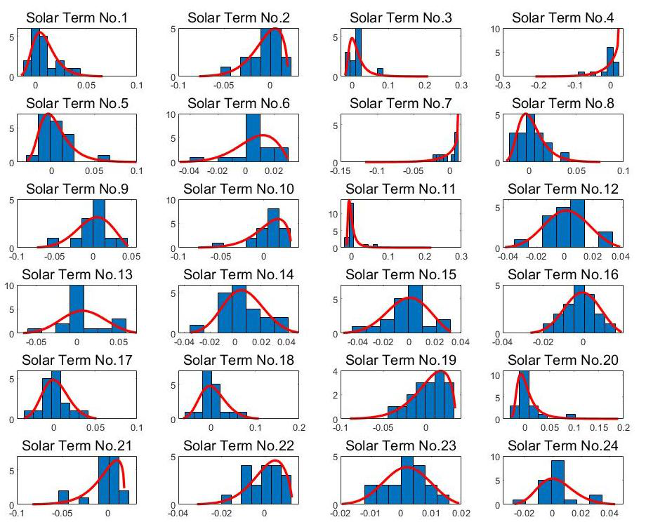
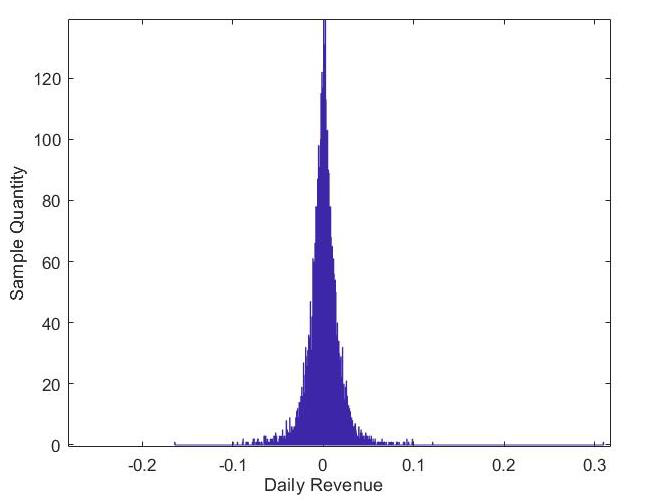

# 中国股市的节气异常：基于上证指数的证据

**作者：** 周天宝\textsuperscript{a,c}，李星昊\textsuperscript{b}，赵军光\textsuperscript{a,*}

**单位：**
- \textsuperscript{a} 北京林业大学理学院，100083，北京，中国
- \textsuperscript{b} 北京林业大学信息科学与技术学院，100083，北京，中国
- \textsuperscript{c} 北京航空航天大学经济管理学院，100191，北京，中国

**联系方式：** michaelzhou@bjfu.edu.cn, lixinghao@bjfu.edu.cn, zhaojg@bjfu.edu.cn

---

## 摘要

本文研究了中国股市中的节气效应（异常现象），作为对现有日历效应文献的补充。基于回归框架，本文从多个维度验证了上证指数中节气效应的存在性：节内分析、全样本均值水平和风险水平分析，以及节气转折效应。研究发现，多个节气对收益率产生了显著的正负影响，如节气1、3和4，并带来了高波动性，如节气8、11和14。该结果在极端边界分析（EBA）和IGARCH模型中不同误差分布假设下均具有可靠性和稳健性。这些发现为读者提供了一个新的视角，从中国传统文化影响的角度审视日历效应——即节气通过影响投资者情绪、预期和热情等方式影响市场——这为Chen和Chien（2011）提出的"文化红利假说"以及中国文化对其他亚洲市场的可能影响（Yuan和Gupta，2014）提供了有力证据。

**关键词：** 日历异常（效应）、极端边界分析、有效节气、节气转折效应

---

## 1. 引言

自Fama（1970）提出有效市场假说（EMH）以来，关于股票市场效率和规律的争论持续不断。Fama（1970）认为，所有信息都能充分、迅速地反映在股价中，投资者无法基于股票历史数据运用任何策略（如技术分析和基本面分析）获得超额收益。换言之，股票价格具有不可预测性，缺乏规律。然而，自20世纪80年代以来，行为金融经济学家和学者们发现了许多挑战EMH的股市异常现象，其中著名的一项就是**日历异常（日历效应）**。日历效应最早在股票收益率的研究中被发现，是指与日期相关的异常现象，即在特定时间收益率显著高于或低于平均水平，投资者可以通过对某一天的预判，基于历史规律获取收益。常见的日历效应包括周末效应、月份效应、节假日效应、月初效应等。Thaler（1987）和Schwert（2003）对早期大量异常现象研究进行了综述。可以看出，日历效应基于各种时间和日期的划分方式（如特定时点、特定时间段、季节等），该概念独立于传统金融和经济因素，为我们寻找股市规律提供了另一个视角。

近年来，中国股市的日历异常现象引起了广泛关注。许多研究基于中国农历（又称中国农历历法）发现了日历异常现象，如春节效应（Teng和Yang，2018）。这些发现在许多其他亚洲股市中也得到了研究验证（McGuinness和Harris，2011；Yang，2016）。鉴于中国传统二十四节气是对年度季节和气候的精细化划分，节气效应（异常现象）无疑是中国股市中一个值得关注的因素。事实上，中国二十四节气的纪年也基于农历，更适合用于研究具有中国传统特色的日期和时间。二十四节气的日期与Gann（2014）在其著作中提到的一些日期相吻合。\footnote{除甘氏轮、甘氏线等之外，Gann还指出了一系列股票容易发生变化的日期。这些日期大多来自将一年均分为4、6、8、12等份，这与二十四节气的起源方式完全相同。在他的著作中，Gann认为时间和日期可能是影响股票的独立因素，但他并未将其与中国二十四节气的划分联系起来。}

简而言之，在中国二十四节气下，一年有24个精细化季节，而不是我们今天国际上使用的四个季节（春、夏、秋、冬）。关于中国二十四节气的完整介绍，请参见附录A。中国二十四节气的日期（纪年）见表0。

### 表0. 中国二十四节气日期

| 节气序号 | 节气名称（拼音） | 节气日期 | 农历季节 | 节气序号 | 节气名称（拼音） | 节气日期 | 农历季节 |
|---|---|---|---|---|---|---|---|
| 1 | 小寒 | 1月5日–1月7日 | 冬 | 13 | 小暑 | 7月6日–7月8日 | 夏 |
| 2 | 大寒 | 1月20日–1月21日 | 冬 | 14 | 大暑 | 7月22日–7月24日 | 夏 |
| 3 | 立春 | 2月3日–2月5日 | 春 | 15 | 立秋 | 8月7日–8月9日 | 秋 |
| 4 | 雨水 | 2月18日–2月20日 | 春 | 16 | 处暑 | 8月22日–8月24日 | 秋 |
| 5 | 惊蛰 | 3月5日–3月7日 | 春 | 17 | 白露 | 9月7日–9月9日 | 秋 |
| 6 | 春分 | 3月20日–3月22日 | 春 | 18 | 秋分 | 9月22日–9月24日 | 秋 |
| 7 | 清明 | 4月4日–4月6日 | 春 | 19 | 寒露 | 10月8日–10月9日 | 秋 |
| 8 | 谷雨 | 4月19日–4月21日 | 春 | 20 | 霜降 | 10月23日–10月24日 | 秋 |
| 9 | 立夏 | 5月5日–5月7日 | 夏 | 21 | 立冬 | 11月7日–11月8日 | 冬 |
| 10 | 小满 | 5月20日–5月22日 | 夏 | 22 | 小雪 | 11月22日–11月23日 | 冬 |
| 11 | 芒种 | 6月5日–6月7日 | 夏 | 23 | 大雪 | 12月6日–12月8日 | 冬 |
| 12 | 夏至 | 6月21日–6月22日 | 夏 | 24 | 冬至 | 12月20日–12月21日 | 冬 |

*注：* 我们按国际公历顺序列出二十四节气。事实上，按照中国传统，节气3（立春）是第一个节气，因为春天被视为一年的开始。由于节气是根据农历制定的，其在公历中的日期并不固定。因此，表中第3列和第7列提供了节气可能出现的日期范围。每个节气根据其中文名称具有独特的含义，但为方便起见，我们在下文中仅用序号指代。特别地，中国农历新年（即春节）不会早于节气2（大寒），也不会晚于节气4（雨水）。

事实上，中国股市中节气效应的研究较为稀少，主要发表在一些中文平台上，研究空白仍然很大。Ni（2013）在早期探索了上证指数和深证成指中的节气效应，发现大寒在上证指数和深证成指中对收益率有正向效应，冬至在将显著性水平放宽至10%时也呈正向，确认了中国股市中节气效应的存在。他还得出结论，并非所有行业指数都表现出明显的节气效应，但在中国股市中占较大比例的行业在大寒时均呈现正向效应。他指出其研究的不足之处在于数据量有限，仅涵盖2000年至2012年。Wang（2017）使用更大规模的数据（1997–2016年）对沪深300指数进行了类似研究。她发现春分和立春有正向收益率，这与本文的发现高度一致。节气效应是否可以由假日效应和节日效应解释也在中国其他市场和国外市场得到了检验。另一方面，Zhang、Ou和Xu（2018）研究了节气效应与假日效应之间的关系，发现春节期间、清明和冬至期间有正向收益率。值得一提的是，我们团队（Zhou、Li和Wang，2021）开展了一项全新的研究，探讨了股票指数转折点（反转）与中国二十四节气之间的关系，发现总体而言，股票指数的趋势在节气前后更可能发生反转。

总体而言，当前节气研究存在局限，缺乏系统性地充分验证节气效应。本文基于回归框架，使用1995年至2022年的大跨度样本，研究了上证指数中的节气效应。本文对文献的主要贡献在于，我们从多个维度验证了节气效应：节内分析、全样本均值水平和全样本风险水平，以及多种稳健性检验。我们系统分析了大跨度样本中多种可能的节气效应类别，并进一步解释了现有日历效应、中国传统文化与节气效应之间的关系，努力揭示影响中国股市节气效应的潜在因素。

在节内分析中，除了使用纯虚拟变量回归模型外，我们还引入了**极端边界分析（EBA）**以进行更可靠的稳健性检验，因为该方法更为严格。我们发现年初的几个节气对收益率有显著的正负影响，如节气1、3和4。其中一些通过了EBA稳健性检验。在全样本分析中，我们使用AR(1)-IGARCH(1,1)模型分别在均值水平和风险水平上捕捉收益率特征。在涉及非节气日（以下简称"正常日"）和节气日的情况下，我们基于多种误差假设发现了若干节气具有显著价值和贡献，以验证每个节气的强度（或称有效性）。节气转折效应的结果同样值得关注。在节内分析和全样本分析中显著的节气高度一致（大多在年初，如节气1、2、3和4）。因此，在多维分析的所有情况下，现有节气效应被证实是稳健和稳定的。结果揭示了中国文化和投资者情绪的潜在影响，表现为一种"年初效应"，因为春节和春季节气恰好发生在那个时期。这一有趣的结果也支持了此前关于月份效应和一月效应的研究，因为前两个节气在一月份。它还验证了现有中国农历新年（春节）效应的影响，因为节气3（立春）总是在春节前后。这可以用Chen和Chien（2011）提出的"文化红利假说"来解释。节气效应是理解中国投资者在新年到来时获得更多希望和预期、以及气温上升和万物复苏带来的活跃交易和冲动行为这一影响的新视角，这是根植于中国人的深刻影响。

综上所述，本文回答了以下问题：1）在节内比较中哪些节气是显著的；2）在全样本中哪些节气在均值水平和风险（波动率）水平上是显著的；3）风险水平上的节气转折效应；4）节气效应在中国股市中形成的逻辑。本文其余部分安排如下：第2节介绍数据和方法论；第3节展示实证结果；第4节为结论；第5节为讨论。

---

## 2. 数据与方法论

本研究使用的数据是**上证指数**\footnote{上证指数（上海证券综合指数）是中国最早、最具影响力的股票指数。它是一个加权综合指数，涵盖了中国市场中蓝筹股和主导行业的大部分，如银行、证券保险、综合企业、国有企业、能源等。由于包含数千只股票，其走势相对其他科技指数更为平稳。通常，上证指数显著上涨时，整个市场也会上涨。上证指数被用作市场整体热度和情绪的风向标。因此，上证指数适合作为中国股市的代理变量。}（代码：000001）从1995年第一个交易日（1995年1月1日）到2022年最后一个交易日（2022年12月30日）的日收益率。共28个完整年度，数据集中共有 $24 \times 28 = 672$ 个节气（部分节气不在交易日，因此予以排除）。鉴于上证指数的日价格序列非平稳，本文全程研究其日收益率序列。数据可在大多数证券网站上免费获取。\footnote{数据可从https://www.eastmoney.com和http://data.10jqka.com.cn等证券网站免费下载，或从领先的数据平台https://www.gtarsc.com/以及中国的WIND数据库获取。}

检验日历效应的一种主要且合理的方法是应用带有若干虚拟变量的回归模型，对应于我们关注的日期。需要注意的是，节气效应（异常现象）的研究与周末效应或月份效应略有不同。周一到周五占据一周中的所有交易日，一月到十二月涵盖一年中的所有交易月份。然而，一个交易日不一定是某个节气的日子。节气遵循中国农历，因此在构建模型之前需要区分节气日和非节气日。

### 2.1. 节内分析

在本节中，我们仅从样本中选取节气日，纯粹研究二十四个节气之间的特征和比较。在此背景下，日收益率具有如下虚拟变量回归模型：

$$r_t = \mu + \sum_{i=1}^{24} \beta_i D_{i,t} + \varepsilon_t \tag{1}$$

其中 $r_t$ 表示日收益率，$D_{i,t}$ 表示第 $i$ 个节气的虚拟变量，当第 $i$ 个节气落在该日时 $D_{i,t} = 1$，否则 $D_{i,t} = 0$。

众所周知，方程（1）由于虚拟变量的完全共线性而无法估计，这被称为**虚拟变量陷阱**（即 $\sum_{i=1}^{24} D_{i,t} = 1$）。这意味着在带有截距的回归模型中，截距和24个虚拟变量是线性相关的。换言之，在为24个节气分别设定24个虚拟变量后，当所有虚拟变量等于零时，不存在第25个节气供截距解释。为解决此问题，需要对虚拟变量的设定施加某些限制。一种广泛使用的方法是删除一个虚拟变量。换言之，如果总共有 $n$ 种情况，则需要设定 $n-1$ 个虚拟变量。在本研究中，由于总共有24个节气，我们最终设定23个虚拟变量。未被选中的（删除的）一个称为**参考变量**（参考节气），作为回归中的常数项。因此，方程（1）修改为：

$$r_t = \mu + \sum_{\substack{i=1 \\ i \neq i^*}}^{24} \beta_i D_{i,t} + \varepsilon_t \tag{2}$$

其中 $st^*$ 为参考节气。$st^*$ 的特征反映在 $\mu$ 上：

$$E(r_t \mid D_{i,t} = 1) = \mu + \beta_i \quad (i \neq i^*) \tag{3}$$

$$E(r_t \mid D_{i^*,t} = 1) = \mu \tag{4}$$

$\beta_i$ 是相对于参考节气的收益率贡献，而 $\mu$ 是绝对收益率贡献。现在，另一个问题出现了：如何选择参考节气？理论上，选择参考节气是任意的，但我们根据节气的统计特征进行简化，使选择更高效，详见下文。

值得一提的是，在没有截距的回归模型中不会存在这种虚拟变量陷阱，如方程（1'）：

$$r_t = \sum_{i=1}^{24} \beta_i D_{i,t} + \varepsilon_t \tag{1'}$$

此时不需要从模型中排除任何虚拟变量，也不再需要选择参考节气。然而，主流回归模型通常都包含截距，因为没有截距的模型中R方估计和系数解释可能不可用，导致额外问题（参见Gerald，1977；Jobson，1982；Hawkins，1980）。许多统计软件包默认引入截距。

此外，另一种检验回归中估计系数稳健性的方法是**极端边界分析（EBA）**（Leamer，1983，1985）。EBA提出了一种新的方法来评估面板数据模型中系数的误差，因为异方差导致线性回归模型中的最小二乘估计一致但非有效。EBA可能使系数产生较大误差，当系数在EBA的上下界之间且不改变符号时，被视为在EBA下稳健；否则为脆弱的。EBA被认为是稳健性非常严格的标准（Salai-Martin，1997）。因此，在实际应用中，大多数（如果不是全部）候选回归变量被判定为脆弱。因此，如果一个变量在EBA下被认为是稳健的，那么它在使用其他方法处理模型不确定性时也很可能被归类为稳健的。

在传统回归模型 $y = X\beta + \varepsilon$ 中，EBA关注估计系数 $\beta$ 的协方差矩阵。最终，我们得到每个系数 $\hat{\beta}_i$ 的下界和上界，分别为 $\hat{\beta}_i - u_i\sigma_i$ 和 $\hat{\beta}_i + u_i\sigma_i$。

每个 $\sigma_i$ 从EBA协方差矩阵中计算得出。有一系列估计器可供选择，但最推荐的是**HC3估计器**（Winkelried和Iberico，2018）。关于其他估计器（如HC1和HC2）的详情，参见Francisco等（2006）和MacKinnon（1985）。Winkelried和Iberico（2018）将EBA方法应用于周末效应，将HC3估计器简化为更清晰简洁的形式，在我们的研究中与原始结果一致。Winkelried和Iberico（2018）采用的HC3协方差矩阵构造如下：

$$V_{HC3} = (X'X)^{-1} X' \text{diag}(e_j^2 / (1-h_j)^2) X (X'X)^{-1} \tag{5}$$

其中 $H = X(X'X)^{-1}X'$，$h_1, h_2, \ldots, h_n$ 为 $H$ 的对角元素。通过对 $V_{HC3}$ 对角元素取平方根，我们最终得到EBA下每个估计系数的标准误差：

$$\sigma_i = \sqrt{V_{HC3,ii}} \tag{6}$$

因此，EBA作为虚拟变量回归稳健性的补充检验。

### 2.2. 全样本分析

第2.1节的分析仅关注24个节气，未考虑其他非节气日（以下简称"正常日"）。本节将分析扩展到全样本范围。基于以往的研究，我们知道金融序列通常伴随自相关和异方差性。为解决上述问题，许多论文将时间序列框架与虚拟变量回归结合使用（如Halil和Berument，2003；Sabri等，2017）。因此，我们引入AR(1)过程来检验收益率（均值水平）中的节气异常。过程如下：

$$r_t = \mu + \sum_{i=1}^{24} \beta_i D_{i,t} + \rho r_{t-1} + \varepsilon_t \tag{7}$$

其中符号与第2.1节中相同，$r_{t-1}$ 表示上一个交易日的收益率，$\rho$ 为其系数。在方程（7）中，共有25种日期类型：24个节气日加上正常日。因此，设定全部24个节气不会导致虚拟变量陷阱。当所有虚拟变量等于零时，指代正常日。其优势在于使所有节气可以被平等解释，常数 $\mu$ 包含正常日的信息。收益率的滞后项也有助于提高模型的准确性。

此外，我们还希望检验节气异常在风险水平（即方差或波动率）上的表现。因此，我们通过引入捕捉风险的条件异方差方程，允许方程（7）中误差项的方差随时间变化。误差项现在均值为零，方差为 $h_t$ 且随时间变化。Engle（1982）首先提出了ARCH($q$)模型，允许误差平方受到其滞后项的影响。许多其他ARCH模型的衍生模型被学者和研究人员进一步发展（Baillie和DeGennaro，1990）。可以容易验证，上证指数的样本更可能满足**IGARCH(1,1)模型**\footnote{参数 $\alpha + \beta$ 非常接近1。可以合理地说该模型存在单位根，因此我们使用IGARCH(1,1)而非传统GARCH(1,1)。相关工作参见Thomas和Stărică（2004）；Ling（2007）。}的条件，而非传统GARCH(1,1)模型。我们构建方差模型如下：

$$h_t = \omega + \sum_{i=1}^{24} \gamma_i D_{i,t} + \alpha h_{t-1}^2 + \beta \varepsilon_{t-1}^2 \tag{8}$$

其中IGARCH(1,1)要求 $\alpha + \beta = 1$。需要注意的是，我们不知道误差项的实际分布，因此在多种分布假设下估计IGARCH方程，以检验节气的稳健性，因为金融序列中误差项的普通正态分布假设（即 $\varepsilon_t \sim N(0, h_t^2)$）可能过于宽松。因此，在估计中还考虑了两种额外的分布假设：**Student-t分布**和**广义误差分布（GED）**。\footnote{GED的密度函数为 $f(x) = \frac{v \exp(-\frac{1}{2}|x/\lambda|^v)}{\lambda 2^{(1+1/v)}\Gamma(1/v)}$，其中 $\Gamma(\cdot)$ 为伽马函数，$v > 0$，$\lambda$ 为常数。当 $v$ 等于2且 $\lambda$ 等于1时，退化为标准正态分布。详见Hamilton（1994）。} Nelson（1991）提出使用GED来捕捉金融时间序列分布中观察到的肥尾特征。Brooks和Persand（2001）以及Doyle和Chen（2009）分析了误差分布假设选择的敏感性。

---

## 3. 实证结果

### 3.1. 数据统计与节内分析结果

表1展示了所有节气日收益率的统计数据。

#### 表1. 节气日收益率统计

| 序号 | 均值 | 标准差 | 偏度（正态为0） | 峰度（正态为3） | Shapiro正态性检验（p值） |
|---|---|---|---|---|---|
| 1 | 0.0086*** | 0.0127 | 0.7613 | 3.1868 | 0.9376 (0.2167) |
| 2 | −0.0049 | 0.0165 | −1.2881 | 4.5201 | 0.8795** (0.0210) |
| 3 | 0.0124* | 0.0242 | 1.7493 | 6.0738 | 0.7901*** (0.0050) |
| 4 | −0.0083 | 0.0291 | −1.9032 | 5.7661 | 0.7332*** (0.0012) |
| 5 | 0.0043 | 0.0193 | 1.7045 | 6.9008 | 0.8475*** (0.0048) |
| 6 | 0.0057* | 0.0141 | −0.9759 | 5.0036 | 0.8895** (0.0315) |
| 7 | −0.0014 | 0.0120 | −0.6166 | 1.8963 | 0.9271 (0.1535) |
| 8 | 0.0020 | 0.0144 | 0.8935 | 3.4239 | 0.8771** (0.0652) |
| 9 | 0.0001 | 0.0215 | −0.9663 | 5.1959 | 0.8505*** (0.0054) |
| 10 | 0.0032 | 0.0195 | −1.6153 | 6.6511 | 0.6461*** (0.0000) |
| 11 | 0.0039 | 0.0174 | 2.4536 | 8.3173 | 0.9528 (0.4129) |
| 12 | 0.0010 | 0.0245 | 0.1039 | 3.8640 | 0.8955** (0.0340) |
| 13 | 0.0065 | 0.0152 | 0.2389 | 3.3244 | 0.9585 (0.5733) |
| 14 | 0.0058* | 0.0158 | −0.3204 | 3.1660 | 0.7246*** (0.0000) |
| 15 | −0.0020 | 0.0088 | −0.0565 | 2.5356 | 0.7819*** (0.0004) |
| 16 | −0.0002 | 0.0153 | 0.3173 | 3.3188 | 0.9444 (0.3162) |
| 17 | 0.0028 | 0.0288 | 0.8272 | 4.5370 | 0.9814 (0.9576) |
| 18 | 0.0033 | 0.0260 | −0.3708 | 2.2837 | 0.9267 (0.1510) |
| 19 | 0.0023 | 0.0172 | −1.6006 | 4.8712 | 0.9814 (0.9576) |
| 20 | 0.0048 | 0.0077 | −0.6819 | 3.1168 | 0.9444 (0.3162) |
| 21 | −0.0037 | 0.0072 | −0.0264 | 2.5273 | 0.9814 (0.9576) |
| 22 | 0.0005 | 0.5661 | 4.0925 | — | 0.9267 (0.1510) |
| 23 | 0.0017 | 0.0042 | 0.0123 | 0.5661 | — |
| 24 | 0.0029 | 0.0094 | — | — | — |

*注：* 均值检验：备择假设为真实均值不等于0；正态性检验：备择假设为分布不服从正态。* 表示10%显著性水平，** 表示5%显著性水平，*** 表示1%显著性水平。

根据表1和图1，大多数节气的均值非常接近零，峰度超过3（正态分布的峰度为3）。样本中收益率的分布呈现厚尾和高峰特征。同时，部分节气表现出较高的偏度，这是节气分析不对称性的有力证据。节气1、3、6和14在均值上显著，节气2和4为负且相对较高。节气2至6、8、10、11、13、18、20和21显著不服从正态分布。这些节气在全部24个节气中具有特殊特征，是进一步关注的潜在候选对象。然而，上述初步检验的不足之处在于它们基于正态分布假设，因此需要进一步仔细检验。鉴于此，重要的是认识到并非所有节气对收益率都有特殊且显著的影响，最终可能只有部分节气是有用的，我们称之为**有效节气**。其余节气主要伴随随机性且特征不明显，我们称之为**无效节气**。

我们随后实施了第2.1节中的虚拟变量回归方程（2），最终得到四组具有显著参考项的结果：节气1、3、4和13。表2展示了每组中系数的总体估计。在面板A和面板B中，我们发现节气1和3在5%水平上对日收益率（因变量）有显著的正贡献，而同组中其他节气自身没有显著的正收益率，但相对于节气1和3表现出相对负效应（如节气2、4、15等）。我们可以将它们视为对应的反向节气。在面板C和面板D中，节气4对总体收益率表现出显著的负效应，而节气2虽未通过显著性检验但接近显著水平。另一方面，其余节气相对于节气2和4表现出相对正效应。在面板E中，节气13为参考项，在10%水平上显著。很明显，无论讨论参考项还是其他项，表2中出现的那些节气总是反复出现。换言之，有效节气几乎在所有面板中都是固定的。此外，虚拟变量之间不存在线性关系，因为容忍度和VIF均证实每个面板中不存在多重共线性。\footnote{容忍度和VIF是衡量多重共线性程度的指标。VIF是容忍度的倒数。当VIF接近1时，表示不存在多重共线性。VIF=10通常被用作判断模型中是否存在多重共线性的阈值。}

#### 表2. 节内回归结果

**面板A**（参考：节气1）

| 节气 | 系数（标准误） | 下界（95%） | 上界（95%） | 容忍度 | VIF |
|---|---|---|---|---|---|
| 节气1（参考） | 0.0086** (0.0041) | — | — | — | — |
| 节气2 | −0.0136** (0.0058) | −0.0250 | −0.0021 | 0.5361 | 1.8650 |
| 节气4 | −0.0169*** (0.0065) | −0.0297 | −0.0042 | 0.6246 | 1.6008 |
| 节气15 | −0.0106* (0.0058) | −0.0220 | 0.0007 | 0.5361 | 1.8650 |
| 节气21 | −0.0123** (0.0057) | −0.0236 | −0.0011 | 0.5240 | 1.9082 |

**面板B**（参考：节气3）

| 节气 | 系数（标准误） | 下界（95%） | 上界（95%） | 容忍度 | VIF |
|---|---|---|---|---|---|
| 节气3（参考） | 0.0124** (0.0050) | 0.0025 | 0.0223 | — | — |
| 节气2 | −0.0174*** (0.0065) | −0.0302 | −0.0045 | 0.4247 | 2.3542 |
| 节气4 | −0.0208*** (0.0071) | −0.0347 | −0.0068 | 0.5153 | 1.9403 |
| 节气7 | −0.0138* (0.0079) | −0.0293 | 0.0016 | 0.6033 | 1.6573 |
| 节气9 | −0.0122* (0.0065) | −0.0262 | 0.0017 | 0.5153 | 1.9403 |
| 节气12 | −0.0114* (0.0065) | −0.0241 | 0.0012 | 0.4128 | 2.4220 |

**面板C**（参考：节气2）

| 节气 | 系数（标准误） | 下界（95%） | 上界（95%） | 容忍度 | VIF |
|---|---|---|---|---|---|
| 节气2（参考） | −0.0050 (0.0042) | −0.0131 | 0.0032 | — | — |
| 节气1 | 0.0136** (0.0085) | −0.0031 | 0.0302 | 0.4247 | 2.3542 |
| 节气3 | 0.0174*** (0.0065) | 0.0045 | 0.0302 | 0.4128 | 2.4220 |
| 节气6 | 0.0106* (0.0065) | −0.0022 | 0.0234 | 0.4128 | 2.4220 |
| 节气13 | 0.0115*** (0.0058) | 0.0000 | 0.0229 | 0.5106 | 1.9584 |
| 节气14 | 0.0108* (0.0058) | −0.0005 | 0.0222 | 0.5106 | 1.9584 |
| 节气20 | 0.0097* (0.0058) | −0.0016 | 0.0212 | 0.5106 | 1.9584 |

**面板D**（参考：节气4）

| 节气 | 系数（标准误） | 下界（95%） | 上界（95%） | 容忍度 | VIF |
|---|---|---|---|---|---|
| 节气4（参考） | −0.0083* (0.0050) | −0.0182 | 0.0015 | — | — |
| 节气1 | 0.0169*** (0.0065) | 0.0042 | 0.0297 | 0.4128 | 2.4220 |
| 节气3 | 0.0208*** (0.0071) | 0.0068 | 0.0347 | 0.5153 | 1.9403 |
| 节气5 | 0.0126* (0.0065) | −0.0000 | 0.0253 | 0.4128 | 2.4220 |
| 节气6 | 0.0140** (0.0065) | 0.0012 | 0.0269 | 0.4247 | 2.3542 |
| 节气10 | 0.0116* (0.0065) | −0.0010 | 0.0243 | 0.4128 | 2.4220 |
| 节气11 | 0.0122* (0.0065) | −0.0005 | 0.0251 | 0.4247 | 2.3542 |
| 节气13 | 0.0148** (0.0065) | 0.0021 | 0.0275 | 0.4128 | 2.4220 |
| 节气14 | 0.0142** (0.0065) | 0.0015 | 0.0269 | 0.4128 | 2.4220 |
| 节气17 | 0.0112* (0.0065) | −0.0016 | 0.0240 | 0.4247 | 2.3542 |
| 节气18 | 0.0117* (0.0065) | −0.0011 | 0.0245 | 0.4247 | 2.3542 |

**面板E**（参考：节气13）

| 节气 | 系数（标准误） | 下界（95%） | 上界（95%） | 容忍度 | VIF |
|---|---|---|---|---|---|
| 节气13（参考） | 0.0065* (0.0041) | −0.0015 | 0.0145 | — | — |
| 节气2 | −0.0115** (0.0058) | −0.0229 | −0.0001 | 0.5362 | 1.865 |
| 节气4 | −0.0149** (0.0065) | −0.0276 | −0.0022 | 0.6247 | 1.6008 |
| 节气21 | −0.0103* (0.0057) | −0.0216 | 0.001 | 0.524 | 1.9083 |

观测值 = 436

*注：* * 表示10%显著性水平，** 表示5%显著性水平，*** 表示1%显著性水平。

表3展示了EBA下各参考项的区间，因为参考项是日收益率的绝对贡献。在此方面，我们对其他相对项不感兴趣。我们发现节气1和3在EBA下分别在5%和10%水平上稳健，因为在两种情况下它们始终为正。节气2在90%水平上接近负向稳健，而节气4和13在EBA下为脆弱的。因此，我们将节气1和3视为某种程度的强正向节气。这些节气是节内分析中的重要发现。在以下章节中，我们将从结合正常日的时间序列角度对它们进行检验。事实上，我们在表2和表3中提到的那些节气在后续章节中也频繁出现。

#### 表3. 节内回归EBA结果

| 节气 | 估计系数（EBA误差） | EBA下界（95%） | EBA上界（95%） | EBA下界（90%） | EBA上界（90%） |
|---|---|---|---|---|---|
| 节气1（参考） | 0.0086** (0.0029) | 0.0029 | 0.0168 | 0.0038 | 0.0133 |
| 节气2（参考） | −0.0050 (0.0039) | −0.0126 | 0.0026 | −0.0114 | 0.0001 |
| 节气3（参考） | 0.0124* (0.0070) | −0.0013 | 0.02612 | 0.0009 | 0.0239 |
| 节气4（参考） | −0.0083 (0.0084) | −0.0247 | 0.0082 | −0.0221 | 0.0054 |
| 节气13（参考） | 0.0065 (0.0056) | −0.0044 | 0.0174 | −0.0027 | 0.0157 |

观测值 = 436

*注：* * 表示EBA稳健性下10%显著性水平，** 表示EBA稳健性下5%显著性水平。

### 3.2. 全样本实证结果

在本节中，我们从时间序列角度分析节气效应，并涉及正常日（非节气日）。可以合理地说，节气带来的日收益率效应（异常）可能是时变的，受当前时期收益率状况的影响，且某些节气与正常日相比是有效的，即使它们在节内框架中未表现出对收益率的显著贡献。因此，我们在模型中加入日收益率的滞后值和正常日的收益率，分别在均值水平（方程7）和风险水平（方程8）上分析节气效应。

表5展示了应用方程（7）的完整结果。常数项 $\mu$ 代表正常日的收益率，且不显著，这与中国上证指数的特征一致（表4和图2）。总体收益率几乎为零，带有微弱的正值，代表过去几十年的长期上涨趋势。上证指数的收益率也呈现高峰和厚尾特征，这与许多现有金融序列研究的结果一致（Corlu、Meterelliyoz和Tiniç，2016；Yan和Han，2019）。

#### 表4. 上证指数总体收益率统计

| 统计量 | 结果 |
|---|---|
| 均值 | 4.1490 × 10⁻⁴ |
| 标准差 | 0.0172 |
| 偏度 | 0.6840 |
| 峰度 | 25.1800 |

在所有节气中，节气1、3、4和13对指数收益率有显著影响。节气1、3和13为正向，节气4为负向，这与第3.1节的结果类似。这揭示了这四个节气在节内竞争以及与全样本中正常日的比较中都是稳定且突出的。我们再次仅涉及上述四个（加上正常日和滞后收益率）进行回归，以单独检验稳健性。结果放在表6中，成功确认了稳健性。因此，我们声称在均值水平上，节气1、3和13为正向有效，节气4为负向有效。投资者至少可以通过日内买卖以显著高的概率获利，或应用其他指数衍生品。需要注意的是，该策略仅考虑日内行为，结合其他技术和基本面技能，投资者可能更有信心持有更长时间。

#### 表5. 均值水平全样本结果（方程7）

| 系数 | 估计值 | 标准差 | t值 | p值 |
|---|---|---|---|---|
| $\mu$（正常日） | 0.0002 | 0.0002 | 1.1095 | 0.2673 |
| 节气1 | 0.0306 | 0.0122 | 2.5189 | 0.0118** |
| 节气2 | 0.0083 | 0.0038 | 2.2072 | 0.0273** |
| 节气3 | −0.0051 | 0.0039 | −1.3122 | 0.1895 |
| 节气4 | 0.0124 | 0.0047 | 2.651 | 0.0080*** |
| 节气5 | −0.0089 | 0.0047 | −1.9182 | 0.0551* |
| 节气6 | 0.0039 | 0.0038 | 1.038 | 0.2993 |
| 节气7 | 0.0052 | 0.0039 | 1.3502 | 0.1770 |
| 节气8 | −0.002 | 0.0056 | −0.3605 | 0.7185 |
| 节气9 | 0 | 0.0039 | 0.0088 | 0.9929 |
| 节气10 | 0.0031 | 0.0038 | 0.8253 | 0.4092 |
| 节气11 | 0.0038 | 0.0006 | 0.9835 | 0.3254 |
| 节气12 | 0.0063 | 0.0047 | 1.6863 | 0.0918* |
| 节气13 | 0.0054 | 0.0038 | 1.4487 | 0.1475 |
| 节气14 | −0.0021 | 0.0039 | −0.5399 | 0.5893 |
| 节气15 | −0.0004 | 0.0038 | −0.1034 | 0.9177 |
| 节气16 | 0.0024 | 0.0047 | 0.6199 | 0.5354 |
| 节气17 | 0.0032 | 0.0038 | 0.8295 | 0.4068 |
| 节气18 | 0.0019 | 0.0039 | 0.4672 | 0.6403 |
| 节气19 | 0.0046 | 0.0038 | 1.2169 | 0.2237 |
| 节气20 | −0.004 | 0.0038 | −1.0569 | 0.2906 |
| 节气21 | 0.0005 | 0.0040 | 0.1438 | 0.8856 |
| 节气22 | 0.0002 | 0.0038 | 0.0538 | 0.9572 |
| 节气23 | 0.0013 | 0.0038 | 0.3553 | 0.7224 |
| 节气24 | 0.0024 | 0.0038 | 0.6448 | 0.5191 |
| 观测值 | 6800 | | | |

*注：* * 表示10%显著性水平，** 表示5%显著性水平，*** 表示1%显著性水平。

#### 表6. 精选节气均值水平结果（方程7）

| 系数 | 估计值 | 标准差 | t值 | p值 |
|---|---|---|---|---|
| $\mu$（正常日） | 0.0003 | 0.0002 | 1.5233 | 0.1277 |
| 节气1 | 0.0318 | 0.0121 | 2.6215 | 0.0088*** |
| 节气3 | 0.0082 | 0.0038 | 2.1872 | 0.0288** |
| 节气4 | 0.0123 | 0.0047 | 2.6373 | 0.0084*** |
| 节气13 | −0.009 | 0.0047 | −1.9386 | 0.0526* |
| $\rho$（滞后） | 0.0063 | 0.0038 | 1.6676 | 0.0955* |
| 观测值 | 6800 | | | |

*注：* * 表示10%显著性水平，** 表示5%显著性水平，*** 表示1%显著性水平。

此外，本文还在风险水平（即波动率）上研究了节气效应，因为我们知道中国作为新兴经济体，其股市在近年来高度波动。ARCH效应在表7中得到了验证。

#### 表7. 残差序列ARCH检验结果

| 滞后阶数 | 卡方值 | p值 |
|---|---|---|
| 1 | 170.8*** | 0.00 |
| 2 | 207.8*** | 0.00 |
| 3 | 516.7*** | 0.00 |
| 4 | 522.6*** | 0.00 |
| 5 | 524.9*** | 0.00 |
| 10 | 535.2*** | 0.00 |
| 15 | 5442*** | 0.00 |

*** 表示1%显著性水平。输出结果由R程序FinTS中的ArchTest运行。原假设：不存在ARCH效应。结果显示所有滞后阶数检验均拒绝原假设，因此ARCH效应得到确认。

我们应用IGARCH(1,1)模型通过方程（8）捕捉日收益率的波动率。值得注意的是，误差分布假设对结果很敏感。因此，我们设定了三种假设：正态分布、Student-t分布和广义误差分布，严格程度依次递增。我们确认了日收益率中存在高波动性，两个IGARCH项在1%水平上显著。在正态分布下，节气1、2、3、4、5、7、8、14和19对收益率的高波动性显著，而在Student-t分布下，结果仅剩节气1、2、4、8、14和19。当采用最严格的假设——GED分布时，仅节气1、2、4和14显著。随着假设严格程度增加，显著节气数量减少。总之，节气1、2、4和14是最强的（即波动率水平上最有效的节气），其余则视情况而定。该结果对我们很有意义，因为我们可以根据对误差分布的严格程度要求，确定应关注哪些节气。无论如何，波动率水平上的节气异常在此方面得到了确认。投资者应采用期权波动率策略等在波动节气日获取利润，并根据对应节气的强度考虑策略的激进程度。

#### 表8. 精选节气波动率水平结果（方程8）

| 残差分布假设 | 系数 | 正态分布 | Student-t分布 | 广义误差分布 |
|---|---|---|---|---|
| | $\alpha$ | 0.051785*** (0.001745) [0.0000] | 0.060658*** (0.003789) [0.0000] | 0.059326*** (0.003542) [0.0000] |
| | $\beta$ | 0.948215*** (0.001745) [0.0000] | 0.93934*** (0.00378) [0.0000] | 0.940674*** (0.003542) [0.0000] |
| | $\omega$ | 0.0000752*** (0.0000134) [0.0000] | 0.000067*** (0.000024) [0.0071] | 0.000071*** (0.000025) [0.0061] |
| | 节气1 | 0.0000949*** (0.0000157) [0.0000] | 0.000050* (0.000029) [0.0869] | 0.000053* (0.000028) [0.0652] |
| | 节气2 | −0.0000849*** (0.0000156) [0.0000] | — | — |
| | 节气3 | 0.0000834*** (0.0000205) [0.0000] | — | — |
| | 节气4 | −0.0000521*** (0.0000115) [0.0000] | 0.000048** (0.000021) [0.0280] | 0.000051** (0.000022) [0.0192] |
| | 节气5 | 0.000172*** (0.0000354) [0.0000] | — | — |
| | 节气7 | 0.0000332*** (0.0000154) [0.0315] | — | — |
| | 节气8 | 0.0000423*** (0.0000088) [0.0000] | 0.000054** (0.000023) [0.0204] | 0.000054** (0.000023) [0.0204] |
| | 节气14 | 0.0000379*** (0.0000134) [0.0048] | 0.000070** (0.000027) [0.0110] | — |
| | 节气19 | 0.000069* (0.000041) [0.0986] | 0.000054 (0.000039) [0.1720] | — |
| | 分布参数 | — | 4.747905*** (0.215014) [0.0000] | 1.159934*** (0.015435) [0.0000] |
| | 观测值 | 6800 | 6800 | 6800 |

*注：* 标准误在圆括号中报告，p值在方括号中报告。* 表示10%显著性水平，** 表示5%显著性水平，*** 表示1%显著性水平。

### 3.3. 节气转折效应分析

在本节中，我们展示节气转折效应的结果，作为补充以完善我们对节气异常的研究。类似于周末转折效应，我们研究从节气前一天到后一天的日收益率序列特征。由于这是多天的时间段，关注期间波动率而非收益率本身更为合理。因此，我们对方程（8）做了轻微修改。在此情况下，$D_{i,t} = 1$ 指代节气 $i$ 的前一天、后一天或恰好是节气当天。我们排除了非交易日，因此某些年份的某些节气可能少于3个等于1的虚拟变量。

结果见表9。我们仍然在三种分布假设下进行回归，与上一节相同。在正态分布下：节气1、2、4、5、8、9、10、11和14对引发高波动性显著。在Student-t分布下，节气8、11和14显著，而在GED分布下，有节气2、8、11和14。上述这些节气被认为在其期间内具有高波动性，确认了我们预期的异常。在此情况下，节气8、11和14在所有情况下都是强有效的。类似地，我们设定每个节气前后2天的条件以扩展范围。结果见表10。在此情况下，节气8和11在引发高波动性方面是强有效的。最终，我们得出结论：节气8和11是最强和最稳健的，节气14次之。

#### 表9. IGARCH(1,1)节气转折效应回归结果（1天范围）

| 残差分布假设 | 系数 | 正态分布 | Student-t分布 | 广义误差分布 |
|---|---|---|---|---|
| | $\alpha$ | 0.061676*** (0.001928) [0.0000] | 0.064027*** (0.003939) [0.0000] | 0.065656*** (0.003962) [0.0000] |
| | $\beta$ | 0.938324*** (0.001928) [0.0000] | 0.935973*** (0.003939) [0.0000] | 0.934344*** (0.003962) [0.0000] |
| | 节气1 | 0.000021*** (0.000005) [0.0001] | — | — |
| | 节气2 | 0.000031*** (0.000005) [0.0000] | 0.000040*** (0.000011) [0.0003] | 0.000016* (0.00000) [0.0714] |
| | 节气4 | 0.000017*** (0.000007) [0.0179] | 0.000022*** (0.000008) [0.0083] | 0.000017** (0.00000) [0.0332] |
| | 节气5 | −0.000012** (0.000005) [0.0154] | — | — |
| | 节气8 | 0.000042*** (0.000007) [0.0000] | 0.000024** (0.000009) [0.0117] | 0.000014* (0.000008) [0.0784] |
| | 节气9 | 0.000015 (0.000009) [0.1351] | — | — |
| | 节气10 | −0.000015*** (0.000004) [0.0001] | — | — |
| | 节气11 | 0.000020*** (0.000005) [0.0000] | 0.000014* (0.000008) [0.0784] | 0.000017** (0.000008) [0.0272] |
| | 节气14 | 0.000016*** (0.000004) [0.0000] | 0.000017** (0.00000) [0.0332] | — |
| | 分布参数 | — | 5.015936*** (0.226108) [0.0000] | 1.157359*** (0.016016) [0.0000] |
| | 观测值 | 6800 | 6800 | 6800 |

*注：* 标准误在圆括号中报告，p值在方括号中报告。* 表示10%显著性水平，** 表示5%显著性水平，*** 表示1%显著性水平。

#### 表10. IGARCH(1,1)节气转折效应回归结果（2天范围）

| 残差分布假设 | 系数 | 正态分布 | Student-t分布 | 广义误差分布 |
|---|---|---|---|---|
| | $\alpha$ | 0.074649*** (0.006829) [0.0000] | 0.068789*** (0.003252) [0.0000] | 0.071584*** (0.006379) [0.0000] |
| | $\beta$ | 0.920064*** (0.006200) [0.0000] | 0.928482*** (0.002929) [0.0000] | 0.922156*** (0.005915) [0.0000] |
| | 节气1 | 0.000016* (0.000008) [0.0739] | — | — |
| | 节气2 | 0.000015* (0.000009) [0.1000] | 0.000012** (0.000004) [0.0138] | — |
| | 节气4 | 0.000016** (0.000008) [0.0419] | 0.000021*** (0.000004) [0.0000] | 0.000011** (0.000005) [0.0434] |
| | 节气5 | 0.000017** (0.000008) [0.0364] | −0.000014*** (0.000004) [0.0012] | — |
| | 节气8 | 0.000017*** (0.000005) [0.0000] | 0.000045*** (0.000006) [0.0000] | 0.000015*** (0.000004) [0.0000] |
| | 节气9 | −0.000019*** (0.000003) [0.0000] | — | — |
| | 节气10 | 0.000015*** (0.000004) [0.0000] | 0.000007** (0.000003) [0.0261] | — |
| | 节气11 | 0.000006* (0.000004) [0.0786] | — | — |
| | 节气14 | — | — | 0.000006* (0.000004) [0.0786] |
| | 节气17 | — | 0.000007** (0.000003) [0.0261] | — |
| | 分布参数 | — | 4.512373*** (0.261614) [0.0000] | 1.151561*** (0.017797) [0.0000] |
| | 观测值 | 6800 | 6800 | 6800 |

*注：* 标准误在圆括号中报告，p值在方括号中报告。* 表示10%显著性水平，** 表示5%显著性水平，*** 表示1%显著性水平。

---

## 4. 结论

本文基于1995年至2022年的上证指数，研究了中国股市中现有节气效应（异常现象）。通过应用回归框架和EBA方法，本文主要从三个维度验证了该效应：节内分析、全样本均值和风险水平分析（在多种误差分布假设下），以及节气转折效应。结果引人注目：并非所有节气都是有效的，但我们仍然发现若干节气在所有情况下都显著，确认了某些特定节气的稳健性和有效性。这为中国股市中的投资者提供了获取超额利润的线索和参考。

在节内分析中，24个节气中，节气1、3和13对日收益率显著为正（分别在5%、5%和10%水平），而节气4在10%水平上显著为负。节气2是另一个不常见的具有相对较高负向贡献的节气，但未通过稳健性检验。在EBA下，仅节气1和3分别在5%和10%水平上通过了稳健性检验。这表明并非所有节气都是有效的，且其效力不同。最终，节气1和3被证明是最强的有效节气，节气4有效但较弱，节气2在节内分析中无效，但在后续章节中是潜在候选对象。

在全样本分析中，我们使用AR(1)-IGARCH(1,1)模型扩展了研究，涉及节气日和非节气日（即正常日），以进一步验证节气效应的普遍性。在均值水平上，节气1、3、4和13对日收益率有显著贡献。节气1、3和13为正，节气4为负，与节内分析的发现完全一致。在风险水平（波动率）上，我们在三种不同的误差分布假设下运行IGARCH模型：正态分布、Student-t分布和广义误差分布。在正态分布下，节气1、2、3、4、5、7、8、14和19对收益率的高波动性显著，而在Student-t分布下，结果仅剩节气1、2、4、8、14和19。当采用最严格的假设——GED分布时，仅节气1、2、4和14显著。随着假设严格程度增加，显著节气数量减少。该结果与之前的分析略有不同，但仍然注意到一些熟悉的节气，如节气1、2、3和4。

我们还基于同一模型研究了风险水平上的节气转折效应。我们分别设定1天和2天的范围，最终验证了节气8和11是最强和最稳健的，节气14次之，在其期间内引发高波动性。

从多维度和多重检验中，我们确认了中国股市中节气效应（异常现象）的存在性、稳健性和可靠性。这有助于投资者在实际交易中获取超额利润，同时也是学术界理解投资者行为的良好补充。

---

## 5. 讨论

尽管节气效应（异常现象）是市场中的全新发现，我们仍然能够从本文的结果中找到节气效应与主流日历效应之间的潜在联系和合理逻辑。

首先，节气效应在多个维度（即节内和全样本）上是稳健和可靠的，这表明它是一种"金融独立"因子，无论是在节气之间相互比较还是与正常日比较。换言之，有效节气在大多数情况和水平上始终有效。上述大多数显著节气位于上半年（即序号较小），且特别集中在年初的几个节气上，在均值水平上表现尤为突出。在风险水平上，结果更加广泛。值得注意的是，中国农历新年（即春节）的假期为7天，通常恰好在节气3之前、之后或与之重叠。节气3（见附录A）与农历新年具有等同的含义，因为它们都代表新一年的开始和温暖日子的到来。在某些年份，节气3恰好是农历新年假期前（后）的最后（第一个）交易日，这为我们提供了线索——节气3的显著正向效应可以解释为中国农历新年（CLNY）效应或中国节假日效应的另一种形式，这与McGuinness和Harris（2011）的结论类似。此外，Yuan和Gupta（2014）在其他亚洲市场报告了这一现象，这意味着该效应可能不仅存在于中国，也存在于受中国传统文化深刻影响的其他亚洲国家。

如我们所总结的，前几个节气在均值水平和风险水平上都表现出显著效应，这也与Chen和Chien（2011）提出的**"文化红利假说"**一致。他们指出，在中国传统中，员工在农历新年之前会获得丰厚的奖金，通常在1月份发放，该时间段恰好与前几个节气重叠。他们指出，这类似于"赌场资金"的概念，增强了承担更高水平风险的倾向，进而刺激了对高风险证券的需求，特别是在一个主要由个人投资者主导的市场中，如台湾（受中国文化的影响甚至超过大陆）。这也有助于解释节气1的高波动性和正向效应，因为节气1恰好在国际新年假期之后。未来围绕节气1及其期间的研究可能有助于更好地揭示中国的一月效应。

在文化影响之后，节气效应也可以从投资者情绪的角度得到很好的解释。随着新年的到来（即国际新年后的节气1和2，以及农历新年后的节气3），人们对更好的一年充满希望和热情。本文的发现肯定了Teng和Yang（2018）的叙述，他们得出结论认为，使用文献中提供的情绪代理变量，投资者对节日的良好情绪有助于解释CLNY效应。虽然该效应长期保持强劲，但在A、B股市场开放后，CLNY效应逐渐减弱。由于外国投资者受CLNY影响较小，中国股市中外资参与度的增加可能有助于解释CLNY效应的减弱。此外，随着年初气温上升，投资者情绪变得活跃。在此方面，节气13和14处于一年中的三伏天，引起人的情绪波动。我们的推论与Kang等（2009）一致，他们发现天气效应对中国市场中A、B股收益率的波动性有强烈影响，而B股市场的开放解释了波动率的天气效应，表明市场对国内投资者的开放导致了天气效应。Liu（2013）也以类似方式验证了天气和气候对投资者情绪的影响。

另一个有趣的巧合是，Wang、Lin和Chen（2010）发现了月相周期效应。他们的结果暗示月亮影响个人情绪和思维，并导致股市变化。他们研究了新月和满月效应，发现某些时期有显著收益。新月通常在农历每月的第一天，是蛾眉月。满月是每个农历月的第15天，新月-满月-新月组成中国农历中的一个月份周期。这几乎与每月节气的对应日期相同。节气不一定在新月和满月的同一天，但误差在一天以内。节气与月亮一样具有15+15天的周期。

本文的节气效应是从中国传统文化影响角度审视日历效应的新视角。总的来说，特定时期和季节的节气影响投资者情绪和交易热情，进而形成异常现象，这与EMH相矛盾，使得通过价格、成交量和时间寻求股市规律的其他研究和努力成为可能（Sullivan、Timmermann和White，2001；Xiong等，2018）。

---

## 利益冲突声明

本文不存在利益冲突。所有工作和研究均得到通讯作者和所在机构的批准和支持。所有引用和理论在文中均被恰当引用。

## 致谢

我们感谢赵博士的指导与帮助，以及北京林业大学理学院的持续支持。

---

## 参考文献

1. Baillie, R.T., DeGennaro, R.P., 1990. Stock Returns and Volatility. *Journal of Financial and Quantitative Analysis* 25 (2), 203-214.

2. Brooks, C., Persand, G., 2001. Seasonality in Southeast Asian stock markets: some new evidence on day-of-the-week effects. *Applied Economics Letters* 8 (3), 155-158.

3. Corlu, C.G., Meterelliyoz, M., Tiniç, M., 2016. Empirical distributions of daily equity index returns: A comparison. *Expert Systems with Applications* 54, 170-192.

4. Chen, T., Chien, C., 2011. Size effect in January and cultural influences in an emerging stock market: The perspective of behavioral finance. *Pacific-Basin Finance Journal* 19, 208-229.

5. Chen, X., Liao, Y., Li, Y., 2023. Following the Rhythm of Nature: Wisdom in the 24 Solar Terms and the 12 Constellations. *Science Education and International Cross-Cultural Reciprocal Learning*. IRLCWE.

6. Doyle, J.R., Chen, C., 2009. The Wandering Weekend Effect in Major Stock Markets. *Journal of Banking & Finance* 33 (8), 1388-99.

7. Engle, R.F., 1982. Autoregressive conditional heteroscedasticity with estimates of the variance of United Kingdom inflation. *Econometrica* 50 (4), 987-1007.

8. Fama, E., 1970. Efficient Capital Markets: A Review of Theory and Empirical Work. *Journal of Finance* 25 (2), 383-417.

9. Francisco, C., Ferrari, S.L.P., Oliveira, W.A.S.C., 2005. Numerical evaluation of tests based on different heteroskedasticity-consistent covariance matrix estimators. *Journal of Statistical Computation and Simulation* 75 (8), 611-628.

10. Gann, W.D., 2014. *45 Years in Wall Street*. Wilder Publications: Saint Paul.

11. Gerald, J.H., 1977. Fitting Regression Models with No Intercept Term. *Journal of Quality Technology* 9 (2), 56-61.

12. Halil, K., Berument, H., 2003. The day of the week effect on stock market volatility and volume: International evidence. *Review of Financial Economics* 12 (4), 363-380.

13. Hamilton, J.D., 1994. *Time Series Analysis*. NJ: Princeton University Press.

14. Hawkins, D.M., 1980. A Note on Fitting a Regression without an Intercept Term. *The American Statistician* 34 (4), 233.

15. Jobson, J.D., 1982. Testing for Zero Intercept in Multivariate Normal Regression. *The American Statistician* 36 (4), 368-371.

16. Kang et al., 2009. Weather effects on the returns and volatility of the Shanghai stock market. *Physica A* 389 (1), 91-99.

17. Leamer, E.E., 1983. Let's take the con out of econometrics. *American Economic Review* 73 (1), 31-43.

18. Leamer, E.E., 1985. Sensitivity analyses would help. *American Economic Review* 75 (3), 308-313.

19. Liu, W., 2013. Lunar calendar effect: evidence of the Chinese Farmer's Calendar on the equity markets in East Asia. *Journal of the Asia Pacific Economy* 18 (4), 560-593.

20. Ling, S., 2007. Self-weighted and local quasi-maximum likelihood estimators for ARMA-GARCH/IGARCH models. *Journal of Econometrics* 140 (2), 849-873.

21. MacKinnon, J.G., White, H., 1985. Some heteroskedasticity-consistent covariance matrix estimators with improved finite sample properties. *Journal of Econometrics* 29 (3), 305-325.

22. McGuinness, P.B., Harris, R.D.F., 2011. Comparison of the "turn-of-the-month" and lunar new year return effects in three Chinese markets. *Applied Financial Economics* 21 (13), 917-929.

23. Nelson, D.B., 1991. Conditional Heteroskedasticity in Asset Returns: A new Approach. *Econometrica* 59 (2), 347-70.

24. Ni, J., 2013. An analysis of the calendar effect of China's stock market. 硕士论文，云南财经大学.

25. Qian, C., Yan, Z., Fu, C., 2012. Climatic changes in the Twenty-four Solar Terms during 1960-2008. *Chinese Science Bulletin* 57, 276-286.

26. Sabri, B. et al., 2017. On the robustness of week-day effect to error distributional assumption. *Journal of International Financial Markets, Institutions and Money* 47, 114-130.

27. Salai-Martin, X.X., 1997. I just ran two million regressions. *American Economic Review* 87 (2), 178-183.

28. Schwert, G.W., 2003. Anomalies and market efficiency. *Handbook of the Economics of Finance* 1 (B), 939-974.

29. Sullivan, R., Timmermann, A., White, W., 2001. Dangers of data mining: The case of calendar effects in stock returns. *Journal of Econometrics* 105 (1), 249-286.

30. Thaler, R.H., 1987. Anomalies: Weekend, Holiday, Turn of the Month, and Intraday Effects. *Journal of Economic Perspectives* 1 (2), 169-177.

31. Teng, C., Yang, J.J., 2018. Chinese Lunar New Year effect, investor sentiment, and market deregulation. *Finance Research Letters* 27, 175-184.

32. Thomas, M., Stărică, C., 2004. Nonstationarities in Financial Time Series, the Long-Range Dependence, and the IGARCH Effects. *The Review of Economics and Statistics* 86 (1), 378-390.

33. Wang, M., 2017. A Study on the Solar Term Effects of Stock Market. 硕士论文，东南大学.

34. Winkelried, D., Iberico, L.A., 2018. Calendar effects in Latin American stock markets. *Empirical Economics* 54, 1215-1235.

35. Wang, Y., Lin, C., Chen, W., 2010. Does lunar cycle effect exist? *African Journal of Business Management* 4 (18), 3892-3897.

36. Xiong et al., 2018. An empirical analysis of the Adaptive Market Hypothesis with calendar effects: Evidence from China. *Finance Research Letters* 31.

37. Yan, H., Han, L., 2019. Empirical distributions of stock returns: Mixed normal or kernel density. *Physica A* 514, 473-486.

38. Yang, A.S., 2016. Calendar trading of Taiwan stock market. *Emerging Markets Review* 28, 140-154.

39. Yuan, T., Gupta, R., 2014. Chinese Lunar New Year effect in Asian stock markets, 1999-2012. *The Quarterly Review of Economics and Finance* 54 (4), 529-537.

40. Zhang, R., Ou, J., Xu, A., 2018. Empirical Study on the Calendar Effect of Chinese Stock Market from the Perspective of Solar Terms Calendar. *Journal of Hunan University of Finance and Economics* 34 (5).

41. Zhou, T., Li, X., Wang, P., 2021. Statistics and Practice on the Trend's Reversal and Turning Points of Chinese Stock Indices Based on Gann's Time Theory and Solar Terms Effect. *Mathematics* 9 (15), 1713.

---

## 附录A：中国二十四节气简介

中国二十四节气（中文称"节气"）是中国古代文化的重要组成部分，至今仍是农业活动的重要指导（Chen、Li和Li，2023）。在中国传统文化中，一年约有360天，被均分为24个等时段，每个时段由一个节气引领，每个节气期间平均约15天。节气依次作为时间段出现，每个节气主导接下来的14天（即平均共15天）。每个节气有不同的名称和独特的含义，展示不同层次的季节变化和特征。今天的二十四节气基于太阳在黄道上的位置。太阳的年度运动轨迹被均分为24等份，每15°为一份，1°等于一天，一年等于360°。换言之，中国二十四节气可以被视为中国的24个季节，而不是我们今天国际上常用的四个季节（春、夏、秋、冬）。中国二十四节气是对气候变化和过渡的精妙总结和概括。它告诉农民何时播种、何时生长、何时收获。令人惊讶的是，气候总是在节气当天表现出显著波动（如温度明显升降、降雪、暴雨等）。这种气候变化通常在节气主导的剩余天数内持续，直到下一个节气到来。因此，温度和气候随每个节气的到来逐步变化，组成年度季节（Qian、Yan和Fu，2012）。此外，每个节气的15天时段进一步被分为三个5天时段，即中文中的三个"候"。气候和温度被认为在5天时段内变化更为具体。需要注意的是，节气并非均等，其中8个是强重要节气。节气3、9、15和21分别为各季节的开始。每个季节在节气6、12、18和24达到高峰。

如今，二十四节气主要用于中医（TCM）及其相关治疗如针灸等。节气对人体、健康和情绪有不可忽视的影响。因此，可以合理地说，节气可能通过影响特定日期的投资者情绪，间接影响股市。发现节气对股市的潜在影响将是节气价值的重要进步。

### 表A.1. 节气含义

| 节气序号 | 节气名称 | 节气日期 | 节气含义 |
|---|---|---|---|
| 1 | 小寒 | 1月5日–1月7日 | 新年后出现，温度显著下降。 |
| 2 | 大寒 | 1月20日–1月21日 | 春节前出现。温度降至谷底。最冷的日子。 |
| 3 | 立春 | 2月3日–2月5日 | 冬天结束，春天和农历新年开始。冰雪开始融化。 |
| 4 | 雨水 | 2月18日–2月20日 | 湿度显著增加，通常伴随春季的第一场雨。 |
| 5 | 惊蛰 | 3月5日–3月7日 | 冬眠结束，昆虫复苏。 |
| 8 | 谷雨 | 4月19日–4月21日 | 湿度稳步上升，适合初期农耕。 |
| 11 | 芒种 | 6月5日–6月7日 | 种植庄稼和谷物的繁忙最佳时期。初夏时节。 |
| 13 | 小暑 | 7月6日–7月8日 | 温度上升。三伏天将至。 |
| 14 | 大暑 | 7月22日–7月24日 | 一年中最热的日子，三伏天中段。高湿度。 |
| 19 | 寒露 | 10月8日–10月9日 | 国庆节后。温度开始逐日下降。 |
