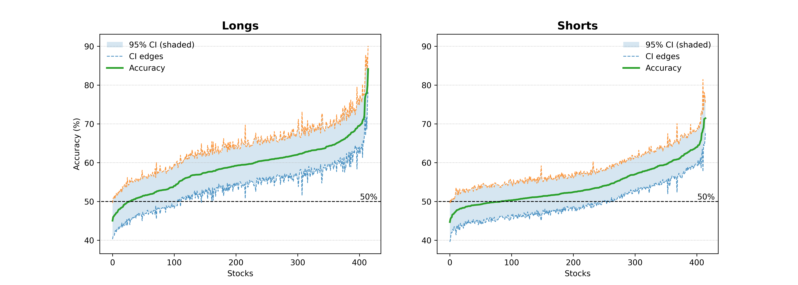
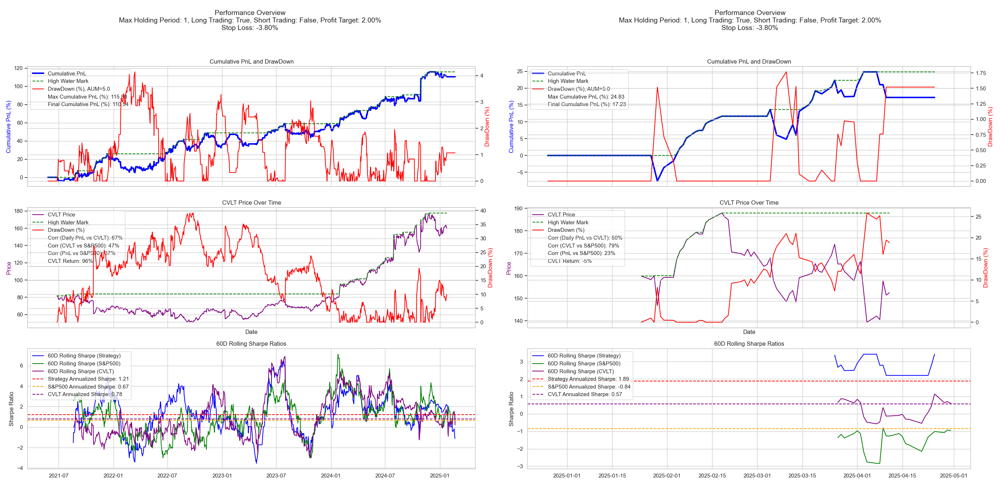
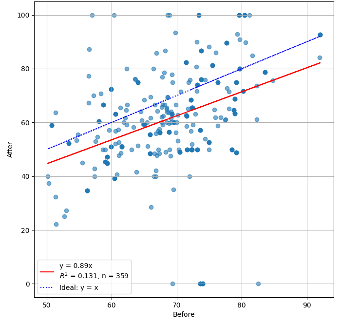
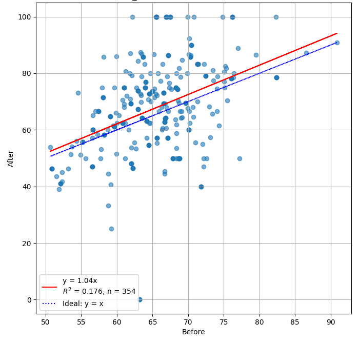
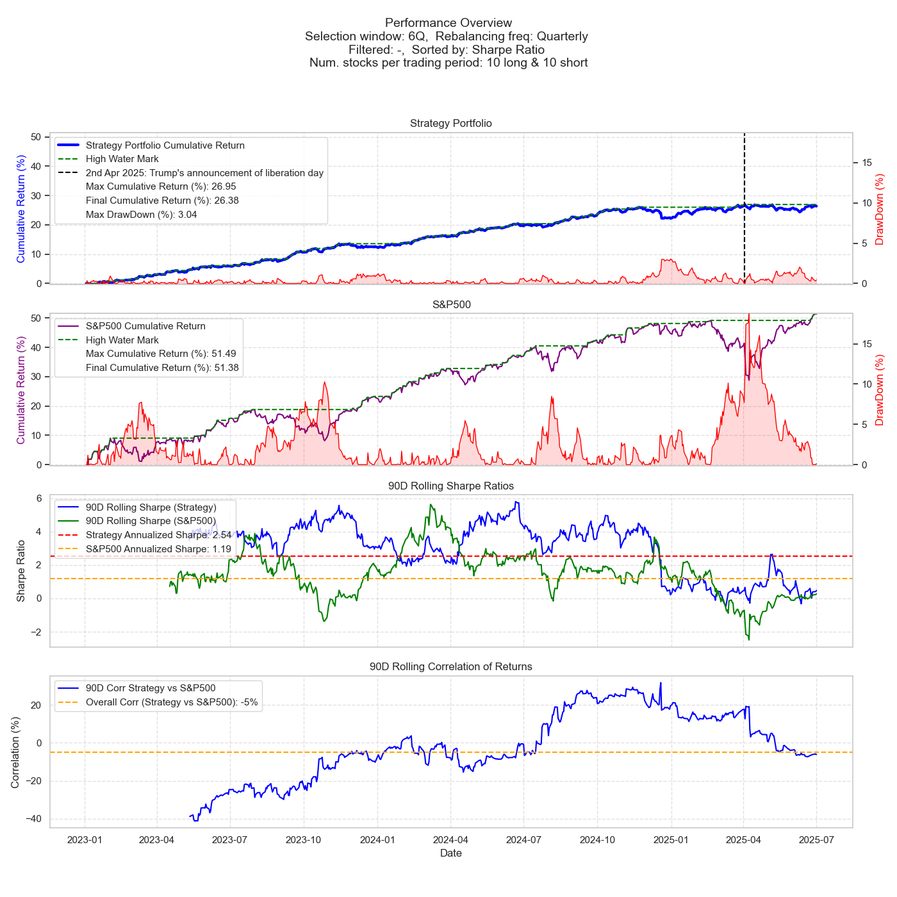
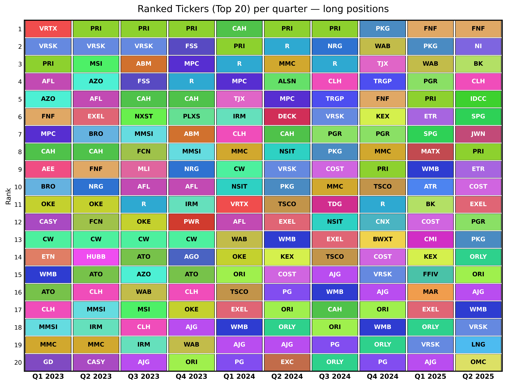
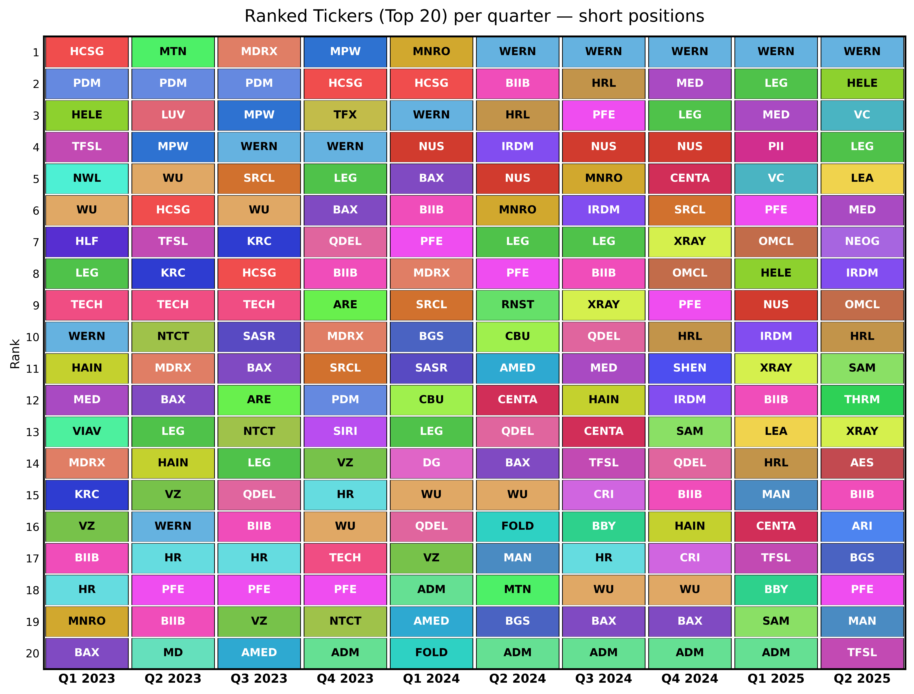
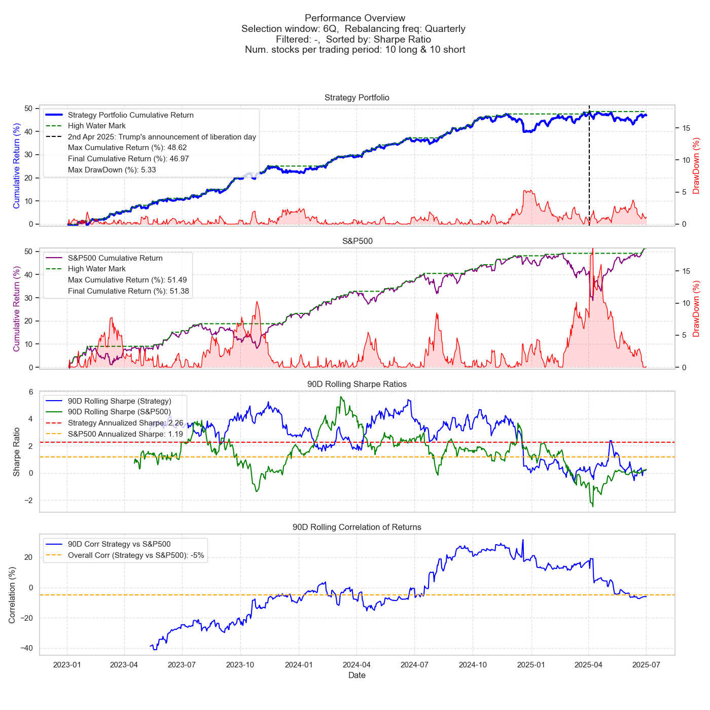

# Increase Alpha: Performance and Risk of an AI-Driven Trading Framework

**Authors**: Sid Ghatak¹, Arman Khaledian², Navid Parvini², Nariman Khaledian²

¹ Increase Alpha, LLC (s.ghatak@increasealpha.com)

² Zanista AI Ltd. (arman.khaledian@zanista.ai, nariman.khaledian@zanista.ai, navid.parvini@zanista.ai)

**Published**: 2025-09-20 | **Categories**: q-fin.PM, cs.LG

**arXiv**: [2509.16707v2](http://arxiv.org/abs/2509.16707v2) | **PDF**: [Download](https://arxiv.org/pdf/2509.16707v2)

---

## Abstract

There are inefficiencies in the financial market, leaving unexploited patterns embedded in price, volume, and cross-sectional relationships. While recent advances increasingly employ large-scale transformer architectures, we take a domain-focused route: classical feedforward and recurrent networks paired with expertly curated features to mine subtle regularities in noisy financial data. This smaller-footprint design is computationally lean and reliable under low signal-to-noise conditions—qualities that matter for daily production at scale. At Increase Alpha, we developed a deep-learning framework that maps a universe of over 800 U.S. equities into daily directional signals with minimal computational overhead.

The purpose of this paper is twofold. First, we outline the general overview of the predictive model without disclosing its core underlying concepts. Second, we evaluate its real-time performance through transparent, industry standard metrics. Forecast accuracy is benchmarked against both naive baselines and macro indicators. The performance outcomes are summarized via cumulative returns, annualized Sharpe ratio, and maximum drawdown. The best portfolio combination using our signals provides a low-risk, continuous stream of returns with a Sharpe ratio of more than 2.5, maximum drawdown of around 3%, and a near-zero correlation with the S&P 500 market benchmark. We also compare the model's performance through different market regimes, such as the recent volatile movements of the US equity market in the beginning of 2025. Our analysis showcases the robustness of the model and significantly stable performance during these volatile periods.

Collectively, these findings show that market inefficiencies can be systematically harvested with modest computational overhead if the right variables are considered. This report will emphasize the potential of traditional deep learning frameworks for generating an AI-driven edge in the financial market.

**Keywords**: Finance, Algorithmic Trading, Risk Management, Deep Learning, Portfolio Construction

---

## 1. Introduction

Financial markets are often portrayed as an example of informational efficiency, a view that traces its intellectual lineage to the early-twentieth-century exchange between Louis Bachelier and Henri Poincaré. While reviewing Bachelier's 1900 doctoral thesis, Poincaré remarked that if security prices truly followed an unrestricted random walk, the expectation of profit "could not rationally differ from zero." Many decades later, Eugene Fama stated that intuition into the Efficient Market Hypothesis (EMH), arguing that all available information is instantaneously and correctly realized into prices. Yet the empirical literature now documents persistent pockets of predictability based on momentum, reversal, seasonal effects, and cross-sectional valuation that careful observers can still exploit.

In recent years, artificial intelligence has emerged as a transformative force in quantitative finance, lowering barriers to entry and enabling independent researchers and small trading teams to harness advanced methodologies once exclusive to major institutions. By leveraging open-source libraries and cloud computing platforms, practitioners can now prototype, validate, and deploy AI-powered strategies across diverse market regimes with unprecedented ease. This democratization of technology has given rise to a rich ecosystem of algorithms that span reinforcement learning, deep learning, ensemble models, and evolutionary techniques, each offering unique avenues for extracting predictive signals from complex financial data. For example, high-frequency trading now represents over 70% of all executed trades [2], and modern HFT engines rely critically on machine-learning and deep-learning methods to scan multiple data streams, generate sub-second buy/sell signals, and execute vast numbers of orders [3,6]. Some implementations focus on drawdown control—e.g. a grid-trading DL system that adaptively reduces downside risk [8]—while others apply neural architectures to volatile assets such as Bitcoin, leveraging parallel processing and Bayesian regularization to forecast returns in noisy, high-frequency environments [4].

Reinforcement learning agents frame trading as a sequential decision-making problem, iteratively learning to select buy, hold, or sell actions that maximize cumulative reward under evolving market conditions. While these methods can uncover highly nonlinear policies that adapt to regime shifts, they require vast historical datasets and significant computational resources and carry a pronounced risk of overfitting unless subjected to rigorous backtesting and paper-trading validation [1]. Complementing this, Long Short-Term Memory (LSTM) networks excel at modeling temporal dependencies in price series, capturing both seasonality and momentum trends; however, they remain vulnerable to unanticipated "black swan" events and mandate careful feature engineering—integrating technical indicators alongside raw OHLCV data—and walk-forward validation to ensure robustness [11].

Supervised timing models—most notably tree-based ensembles such as Random Forests and XGBoost—classify market regimes by leveraging a curated set of features that may include momentum scores, volatility measures, and sentiment indices. Their interpretability via feature-importance metrics facilitates systematic refinement, yet they also demand prudent cross-validation protocols to avoid capitalizing on spurious historical patterns [10]. In parallel, Generative Adversarial Networks (GANs) offer a novel data-augmentation paradigm, synthesizing realistic time-series scenarios to fill gaps in rare or stressed-market conditions; despite their promise in mitigating overfitting, GANs introduce training instability and necessitate thorough statistical validation of the synthetic output against empirical distributions [12].

Natural-language processing pipelines extend the AI toolkit by quantifying sentiment from unstructured text sources—news articles, social-media posts, and corporate filings—thus capturing behavioral drivers that often precede price movements. Beginning with lexicon-based scoring and progressing to fine-tuned transformer architectures, these systems must contend with evolving language trends, sarcasm, and manipulation, calling for continuous retraining and robust noise-filtering mechanisms [7]. Similarly, multi-factor AI models synthesize fundamental, technical, and alternative datasets to rank and select assets; machine-learning algorithms optimize factor combinations and, through systematic rebalancing and transaction-cost modeling, seek to sustain persistent outperformance while managing factor decay.

Dynamic portfolio allocators harness Bayesian inference or reinforcement learning to adaptively balance risk and return, continuously updating asset weights in response to shifting volatility and correlation structures. By incorporating frictional cost simulations and liquidity constraints into backtests, these systems aim to enhance risk-adjusted performance while controlling turnover. Across all methodologies, the pathway to robust deployment consistently emphasizes thorough backtesting, staged paper trading, and ongoing out-of-sample monitoring, thereby laying the groundwork for sustainable, data-driven trading paradigms in the era of AI. AI-driven trading frameworks typically fuse three pillars of information:

- **Technical analysis**: historical price, volume, and order-book dynamics
- **Fundamental analysis**: the impact of corporate and macroeconomic news on asset valuations
- **Investor sentiment**: emotion and opinion signals mined from social media and news feeds

At Increase Alpha, we believe that market inefficiencies can be harvested systematically by using the information mentioned above mixed with classical feedforward and recurrent neural networks curated by domain experts. The use of transformers and large language models in Finance has gained popularity among the experts in the field in recent years [5,9,7]. However, in Increase Alpha, rather than pursuing massive transformer models on unstructured text, our minimalist design extracts only the variables that a seasoned fundamental analyst would consider economically meaningful, and then uses compact networks to uncover non-linear interactions at scale. The result is a daily, security-level directional signal for 814 U.S. equities—generated with negligible computational overhead and latency compatible with both discretionary and algorithmic execution.

Because the model and feature definitions are proprietary, we treat the architecture as a black box. In Section 2 we describe our data collection, signal generation, and execution infrastructure. In Section 3 we benchmark performance—using cumulative return, annualized Sharpe ratio, and maximum drawdown—against naive baselines and macroeconomic indicators, and examine behavior across different market regimes, including the turbulent U.S. equity markets of early 2025.

The remainder of the paper is organized as follows:

- **Chapter 2 — Methodology**: Describes the signal-generation pipeline, including multi-horizon forecasting, timestamp-tracked storage, and implementation mechanism. Explains how execution logic is calibrated using hyperparameter grid search for Profit-Taker, Stop-Loss, and Maximum Holding Period. Outlines the cloud-based deployment on Azure AKS and the associated scalability and cost-efficiency considerations.
- **Chapter 3 — Accuracy and Statistical Significance**: Measures signal performance across 814 tickers using multiple holding horizons and directional classifications (long, short). Applies statistical rigor, including z-tests and confidence intervals, to validate signal effectiveness against random baselines. Summarizes signal reliability by evaluating coverage, profitability, and sample-size-adjusted significance.
- **Chapter 4 — Risk and Return**: Translates signal outputs into cumulative return/PnL, drawdown, and Sharpe ratio metrics using the optimized execution configuration. Compares the strategy's performance against a buy-and-hold baseline and macro indices such as the S&P 500. Highlights robustness under stress through a regime-based analysis—contrasting pre- and post-January 2025 performance.
- **Chapter 5 — Portfolio Construction and Dynamic Rebalancing**: Converts signals into a real-world trading strategy using dynamic stock selection and quarterly rebalancing. Evaluates performance via P&L, Sharpe ratio, and drawdown. Showcases the adaptability of signals across regimes, confirming the real-world viability of the approach.
- **Chapter 6 — Conclusion**: Summarizes the predictive power, statistical rigor, and market resilience of the Increase Alpha system. Emphasizes that classical deep learning when paired with expert feature design and scalable infrastructure, offers a viable and interpretable alternative to more opaque architectures in financial signal generation.

---

## 2. Methodology

Our objective in this chapter is to discuss—without revealing proprietary intellectual property—the full life-cycle by which the Increase Alpha framework generates, stores, filters, and evaluates daily equity–level trading signals. We also describe the metrics we used to evaluate the performance of the generated signals. Every step is designed to eliminate look-ahead bias and information leakage, which are the main pitfalls in any trading strategies. This section is organized as follows:

1. Data-generation and signal specification (directional forecasts, storage, and tradable conventions)
2. Scenario analysis and cloud infrastructure (trading parameters search for profit-taker, stop-loss, and maximum holding period)
3. Evaluation framework (accuracy tests, economic metrics, and robustness checks)

### 2.1 Data-generation and signal specification

Since 28 June 2021, the production system has executed a daily inference cycle for a universe of 814 U.S. equities. Each trading day, shortly after the market close, the latest data—including official corporate actions, fundamental metrics, and price/volume features—are ingested and processed by our deep learning model.

The model generates ten distinct directional predictions per stock for the upcoming ten trading sessions (i.e., $t+1$ to $t+10$). Each signal forecasts the expected percentage price change for a specific future session, forming a sequence of forecasts from a single prediction date. For example, the prediction on 28 June 2021 includes 10 separate directional estimates for each of the trading sessions from 29 June to 13 July 2021.

Each forecast is stored along with two immutable timestamps, capturing the creation and final update moments of each signal. Every prediction is finalized only after the market close, using solely available data, and is time-stamped and committed before the opening of the target session. This rigorous tracking ensures a true *ex-ante* prediction record, immune to post-hoc adjustment or backtest contamination, and serves as a strong guardrail against look-ahead bias and information leakage. Each model run generates a rolling set of multi-horizon signals—ten predictions that span the next ten trading sessions—forming a comprehensive forward-looking view. This automated pipeline has been running uninterrupted since June 2021, producing a longitudinal dataset with consistent daily operations.

We source price data from www.eodhd.com, a comprehensive market data provider. We collected daily OHLC prices for all 814 U.S. equities from 28 June 2021 to 30 June 2025.

The automated system has incurred a consistent operational cost since inception. Between November 2024 and April 2025, daily AWS compute expenses averaged approximately \$95–\$100 USD, with occasional spikes on high-load processing days. When including all essential infrastructure services—such as EC2 instances, storage (S3), RDS databases, SageMaker for model hosting, and supporting utilities—the total infrastructure expenditure for the period amounted to approximately \$17,000 USD.

**Table 1. Example multi-horizon-ahead predictions with timestamp tracking**

| Current Date-time | Ticker | Target Date | Forecasted return | Horizon |
|---|---|---|---|---|
| 2021/06/28 - 21:30 | AAPL | 29/06/2021 | +0.5835 | 1 |
| 2021/06/28 - 21:30 | AAPL | 30/06/2021 | -3.5856 | 2 |
| 2021/06/28 - 21:30 | AAPL | 01/07/2021 | +1.1635 | 3 |
| 2021/06/28 - 21:30 | AAPL | 02/07/2021 | -1.2820 | 4 |
| 2021/06/28 - 21:30 | AAPL | 06/07/2021 | -0.5109 | 5 |
| 2021/06/28 - 21:30 | AAPL | 07/07/2021 | -0.5405 | 6 |
| 2021/06/28 - 21:30 | AAPL | 08/07/2021 | -0.2841 | 7 |
| 2021/06/28 - 21:30 | AAPL | 09/07/2021 | -0.3977 | 8 |
| 2021/06/28 - 21:30 | AAPL | 12/07/2021 | -0.4024 | 9 |
| 2021/06/28 - 21:30 | AAPL | 13/07/2021 | -0.2335 | 10 |

For each ticker the engine outputs a predicted return. We use the sign of these predicted returns as ternary direction code $s \in \{+1, 0, -1\}$:

- **+1 (Long)** — expected positive open-to-close return next session
- **−1 (Short)** — expected negative return
- **0 (Flat)** — neutral or low-confidence regime

### 2.2 Scenario Analysis and Trading Parameter Optimisation

To convert directional signals into economic value, we extract three parameters necessary for trade execution:

- **Profit-Taker (PT)** — positive return threshold for exit
- **Stop-Loss (SL)** — adverse move forcing liquidation
- **Maximum-Holding Period (MHP)** — maximum duration (days) a position may remain open

To obtain these values, we design a backtesting algorithm that simulates real-world trading on historical data. We then conduct a grid search as a scenario analysis. For each ticker, we store the performance of each item in the signal universe under different PT, SL, and MHP settings. For each ticker, we run the scenario analysis over:

- **Maximum Holding Period (MHP)**: ranges from 1 to 10
- **Profit-Taker (PT)**: ranges from 0.001 to 0.02 in increments of 0.0005
- **Stop-Loss (SL)**: ranges from −0.04 to −0.01 in increments of 0.005

In each scenario, we use the signal directions and the prices to compute the trade return $r$, Sharpe ratio (SR), and maximum drawdown (MDD). For day $t$ and ticker $i$:

$$r_{i,t} = \begin{cases} PT, & \text{if } H_{i,t:t+\text{MHP}} - O_{i,t} \geq PT \\ SL, & \text{if } L_{i,t:t+\text{MHP}} - O_{i,t} \leq SL \\ C_{i,t+\text{MHP}} - O_{i,t}, & \text{otherwise} \end{cases}$$

where $H_{i,t:t+\text{MHP}} = \max\{H_{i,t}, H_{i,t+1}, \ldots, H_{i,t+\text{MHP}}\}$, $L_{i,t:t+\text{MHP}} = \min\{L_{i,t}, L_{i,t+1}, \ldots, L_{i,t+\text{MHP}}\}$, and $O_t, H_t, L_t, C_t$ are the open, highest, lowest, and close price at day $t$.

In total, for each item in the trading universe we measure performance across 2,280 scenarios (MHP: 10; PT: 38; SL: 6). Given the large universe and the 10 different trading signals (horizon 1 through horizon 10 prediction signals), the computational load to extract the optimal execution values is substantial. Therefore, we use Microsoft Azure to containerize and run the computation in parallel.

To efficiently execute this large-scale scenario analysis, we leverage Microsoft Azure Kubernetes Service (AKS) for parallel computation. We containerize the jobs and distribute the workload across 20 pods. Each pod is provisioned with 1.6 CPU cores and 6 GiB of memory, and the average runtime per pod is approximately 8 days (192 hours). The underlying infrastructure uses Standard D4s v3 virtual machines, each offering 4 vCPUs and 16 GiB RAM. The AKS cluster is autoscaled to 20 nodes.

**Table 2. AKS configuration and cost.**

| Parameter | Value |
|---|---|
| Pods | 20 (approximately 20 tickers per pod) |
| Pod resources | 1.6 vCPU, 6 GiB RAM |
| Node type | Standard D4s v3 (4 vCPU, 16 GiB RAM) |
| Autoscale window | 1–20 nodes |
| Wall-clock runtime | ~8 days |
| Total VM-hours | 1,920 |
| Total VMs | 10 |
| Azure list price | $0.376 per hour |
| Total compute cost | **$722** |

*Fig. 1. Boxplot showing the distribution of Sharpe Ratio, cumulative return/PnL (%), and Drawdown for different cases in the scenario analysis.*

---

## 3. Accuracy and Statistical Significance

We evaluate the directional accuracy and performance of trading signals across our entire trading universe.

### 3.1 Accuracy

When a signal is positive, a long position is opened on the next available trading day. When a signal is negative, a short position is opened on the next available trading day. For each asset, the directional accuracy over a specific holding period $h$ is computed with respect to the sign of its return over that period. Consistent with the MHP search space in the previous section, we examine trade performance for 11 different holding periods (business days), labeled from 0 to 10.

The multi-horizon-ahead return for each ticker is calculated by comparing the close at holding period $h$, i.e., day $t+h$, with the open on day $t+1$. Since positions are opened one business day after the signal is generated, we assume the signal pertains to day $t+1$.

$$\text{Accuracy} = \frac{\text{Number of correctly predicted directions}}{\text{Total number of predictions}} \times 100\%$$

### 3.2 Statistical Significance and Reliability

Since the long/short signal distribution is inherently class-imbalanced, we apply robust statistical methods to ensure a fair comparison of signal accuracies. We consider:

- Using a binomial test or a z-test for proportions to assess whether measured accuracies deviate significantly from random chance (e.g., 50%)
- Constructing confidence intervals for each accuracy measure (e.g., a 95% confidence interval around the estimated accuracy)

The standard error is defined as:

$$SE_0 = \sqrt{\frac{p_0(1-p_0)}{n}}$$

with $p_0$ the baseline proportion (e.g., 0.5) and $n$ the number of observations. The observed accuracy $\hat{p}$ is then compared to the baseline $p_0$ using the z-score:

$$z = \frac{\hat{p} - p_0}{SE_0}$$

The 95% confidence interval is computed using the Wald interval:

$$CI = \hat{p} \pm z_{\alpha/2} \times SE_{\hat{p}}, \quad \text{where} \quad SE_{\hat{p}} = \sqrt{\frac{\hat{p}(1-\hat{p})}{n}}$$

**Table 3. CVLT signal accuracy summary.**

| Metric | Value |
|---|---|
| Ticker | CVLT |
| Name | CommVault Systems, Inc. |
| Strategy | Long Only |
| Period Signal | 3 |
| Pct_long | 64.2% |
| Long Accuracy | 67.76% |
| Short Accuracy | 59.62% |
| Sample_Size | 577 |
| p_value_vs_50% | 6.86E-20 |
| CI_95_lower_% | 63.95% |
| CI_95_upper_% | 71.57% |

**Table 4. P-value summary statistics.**

| Signal Type | Mean | Median | Std. Dev. | Min | Max | % p < 1% | % p < 5% | % p < 10% |
|---|---|---|---|---|---|---|---|---|
| Long | 0.0259 | 0.0002 | 0.0670 | 0.0000 | 0.5979 | 74.948 | 86.349 | 90.900 |
| Short | 0.0367 | 0.0005 | 0.0823 | 0.0000 | 0.5742 | 68.985 | 81.642 | 86.402 |
| Both | 0.0313 | 0.0003 | 0.0752 | 0.0000 | 0.5979 | 71.967 | 83.996 | 88.651 |

More than 74% of long-signal p-values fall below 1%, and over 86% fall below 5%. Even for short signals, 69% are below 1% and over 81% below 5%. When both directions are aggregated, nearly 84% of all signals achieve 5% significance.

*Fig. 2. Confidence interval plots for the period beginning from the first observation to the end of 2024. The stocks selected from the optimization process are ordered from lowest to highest accuracy on the horizontal axis. The solid green line shows the average accuracy for each ticker across the sample and the shaded areas shows the 95% confidence interval. The left plot shows long signals, while the right plot depicts short signals.*

*Fig. 3. Confidence interval plots for the period of the first two quarters of 2025. The stocks selected from the optimization process are ordered from lowest to highest accuracy on the horizontal axis.*

---

## 4. Risk and Return

While accuracy provides an initial indication of a trading signal's potential effectiveness, it is not the sole determinant of success in financial markets. Ultimately, the most critical factors are the strategy's returns and associated risks.

### 4.1 Extracting Return and Risk Metrics

We use outputs from the scenario analysis and optimization step in Section 2.2, which identified the optimal Maximum Holding Period (MHP), Profit-Taker (PT), and Stop-Loss (SL) settings.

- **Cumulative return/PnL**: Reflects the aggregated return of the strategy over time, computed as simple, non-compounded aggregation of returns.
- **Drawdown**: Measures the percentage decline from a historical peak in cumulative returns to a subsequent trough. Maximum drawdown (MDD) represents the largest observed drawdown over the evaluation period.
- **Annualized Sharpe Ratio**: Measures risk-adjusted performance by comparing the portfolio's excess return over the risk-free rate to the volatility of its returns.

### 4.2 Visualization of Risk-Return Characteristics

*Fig. 4. Visualization of the strategy's returns and risk, compared with the macro benchmark (S&P 500) and the stock's buy-and-hold.*

Key takeaways:
- The cumulative return/PnL of the strategy is significantly higher than the CVLT buy-and-hold return.
- The strategy's drawdown is approximately 10 times smaller than that of the CVLT buy-and-hold.
- The annualized Sharpe ratio of the strategy is greater than those of both CVLT and the S&P 500.

### 4.3 Stress Testing the Strategy

**Market Turbulence After January 2025**: Following accelerated interest rate hikes, geopolitical tensions, and tech sector corrections, global markets saw increased volatility. Major indices experienced drawdowns exceeding 20%, correlations across asset classes broke down, and liquidity became strained.

**Stress Test Methodology**: We segmented the data into "Before January 2025" and "After January 2025" periods.

*Fig. 5. Scatter plot showing the long accuracy of the trading signals, before and after January 2025.*

*Fig. 6. Scatter plot showing the short accuracy of the trading signals, before and after January 2025.*

Key findings:
- The regression lines are noticeably close to the ideal $y = x$ line, indicating stability in signal performance across regimes.
- The slope and $R^2$ values demonstrate consistency and predictive strength.
- The trading strategy is robust and largely uncorrelated with broader market movements.
- It continues to function effectively during historically adverse periods.
- The low correlation to CVLT and the S&P 500 implies diversification benefits.

---

## 5. Portfolio Construction and Dynamic Rebalancing

In the previous section, we evaluated the generated signals' ability to predict the price movement of individual stocks. In what follows, we translate these insights into a practical investment strategy with an example of systematic portfolio construction and dynamic rebalancing.

The portfolio construction follows a six-quarter rolling window with one-quarter steps. More specifically, we start by using model outputs between mid-2021 and the end of 2022, corresponding to six quarters, as a calibration window. During this period, we aggregate daily directional signals across 814 U.S. equities and compute performance metrics—including directional accuracy, annualized Sharpe ratio, maximum drawdown, etc.—for each stock. For the stock-selection process, we sort the stocks based on their performance in each rolling selection window and select the top-performing names.

The constructed portfolio is then traded over the subsequent quarter, using the latest daily predictions from the model. At the end of each quarter, the portfolio is rebalanced: the prior 18 months of trading signals are analyzed, and new top-performing stocks are selected to form the next quarter's portfolio. This rolling mechanism ensures that the portfolio adapts to evolving market conditions while maintaining a systematic, data-driven foundation.

Our framework is inherently robust to survivorship bias due to the way the trading universe and backtest design are structured. When a company was delisted or merged, signal generation for that ticker was automatically discontinued, and its historical signals remained archived. For performance evaluation, we restricted backtests to stocks with uninterrupted signal histories over the full study horizon.

### 5.1 Results

**Aggregate returns and risk-adjusted performance**: The strategy's final cumulative return is approximately +26.4% (peak cumulative return approximately 26.95%) with a maximum drawdown of approximately 3.0%. Although the passive S&P 500 over the same interval delivers larger nominal appreciation (final cumulative return approximately +51.4%), the MDDEW portfolio exhibits higher risk-adjusted performance. The strategy's annualized Sharpe ratio is approximately 2.54, compared with approximately 1.19 for the S&P 500.

*Fig. 7. Out-of-sample performance of the MDD-based, equally-weighted (MDDEW) portfolio, benchmarked against the passive S&P 500 buy-and-hold.*

**Correlation with market returns**: The overall correlation between the strategy's daily returns and S&P 500 returns is approximately −5%, indicating that the MDDEW portfolio is largely orthogonal to the benchmark over the full sample. This low average correlation implies that the MDDEW portfolio behaves like an idiosyncratic (alpha) sleeve that can complement passive equity exposure.

**Decomposed performance**:

**Table 5. Portfolio performance metrics decomposed into long and short legs.**

| Sleeve | Cum. Ret./PnL (%) | SR | MDD (%) | Mean realized holding period (days) | Max. realized holding period (days) | Win rate (%) | Num. transactions |
|---|---|---|---|---|---|---|---|
| Long | 15.75 | 1.872 | 3.988 | 1.080 | 6 | 57.9 | 4,336 |
| Short | 10.63 | 1.001 | 3.333 | 0.885 | 6 | 55.4 | 4,523 |
| **Combined** | **26.38** | **2.538** | **3.039** | **0.980** | **6** | **56.6** | **8,859** |

Both sides contribute—longs at approximately 15.75% (Sharpe approximately 1.87; MDD approximately 3.99%) and shorts at approximately 10.63% (Sharpe approximately 1.00; MDD approximately 3.33%)—highlighting persistent edge on each sleeve.

**Table 6. Summary of the other portfolio selection criteria and their performance.**

| Window | Filter | Ranked by | Top n | SR | MDD (%) | Corr | Final Cum. Ret. (%) |
|---|---|---|---|---|---|---|---|
| 6Q | - | SR | 10 | 1.98 | 6.23 | - | 30.72 |
| 6Q | - | DD | 10 | 2.20 | 3.14 | - | 27.31 |
| 6Q | - | Final Cum. Ret. | 10 | 1.75 | 6.81 | - | 30.74 |
| 6Q | - | Sortino | 10 | 1.60 | 7.36 | - | 24.34 |
| 6Q | - | Beta | 10 | 0.70 | 6.70 | - | 7.92 |
| 6Q | - | Downside Risk | 10 | -0.07 | 11.30 | - | -1.18 |
| 6Q | - | Beta > 1 | SR | 10 | 1.85 | 4.74 | - | 27.66 |
| 6Q | - | Beta > 1 | DD | 10 | 2.38 | 2.50 | - | 29.33 |
| 6Q | - | Beta > 1 | SR | 20 | 2.06 | 3.64 | - | 24.28 |
| 6Q | - | Beta > 1 & SR < 1 | DD | 10 | 1.77 | 4.53 | - | 24.58 |
| 6Q | - | Accuracy | 10 | -0.54 | 78.6 | - | -7.77 |

Risk-aware ranking rules—in particular realized Sharpe and low-drawdown ranking—produce higher risk-adjusted outcomes. The accuracy-ranked portfolio posts a negative final return (approximately −7.8%), a negative Sharpe (approximately −0.54) and a large drawdown, underscoring that directional accuracy alone does not reliably generate tradable, risk-adjusted alpha.

*Fig. 8. Color-coded quarter-by-quarter composition of the long-leg 20-stock trading book, displayed in a compact rank-ordered grid.*

*Fig. 9. Color-coded quarter-by-quarter composition of the short-leg 20-stock trading book, displayed in a compact rank-ordered grid.*

### 5.2 Further Discussion

**The Impact of Leverage**: With a 2x leverage factor, the MDDEW portfolio's cumulative return at the end of the sample is approximately +47%, with a peak gain near +49%. The leveraged portfolio maintains an annualized Sharpe ratio of 2.26, still exceeding the S&P 500 (1.19). The maximum drawdown increases to 5.33% from the non-leveraged version's 3.04%.

*Fig. 10. Out-of-sample performance of the MDD-based, equally-weighted (MDDEW) portfolio with 2x leverage and 4% cost of capital, benchmarked against a passive S&P 500 buy-and-hold.*

**Beyond US equity market**: The same methodology can be applied to mature exchanges such as the London Stock Exchange or the Tokyo Stock Exchange, as well as selected European and emerging markets. The feature definitions are rooted in economically interpretable variables rather than market-specific artifacts. A further line of extension is to fixed-income markets and derivative markets, including zero-day-to-expiry (0DTE) options.

**Updated results — Q3 2025 extension**: Extending the backtest through Q3 2025 confirms the continued stability of the MDDEW strategy. The non-leveraged portfolio maintains a final cumulative return of approximately 29% and a maximum drawdown of approximately 1.8%. The strategy's annualized Sharpe ratio remains strong at approximately 2.55, roughly twice that of the benchmark (approximately 1.28). The overall correlation to the S&P 500 stays mildly negative (approximately −6%).

For the leveraged configuration (2x exposure, 4% cost of capital), the cumulative return rises to approximately 52%, with a maximum drawdown of approximately 3.3% and an annualized Sharpe ratio of approximately 2.27.

---

## 6. Conclusion

In this paper, we presented an end-to-end evaluation of an AI-driven trading framework developed at Increase Alpha. The model utilizes deep learning architectures—primarily feed-forward and recurrent networks—combined with expert-selected financial features to generate directional trading signals for 814 U.S. equities. The system's architecture emphasizes operational efficiency, avoiding large-scale transformer models in favor of a leaner, interpretable design that delivers consistent performance with minimal computational overhead.

We demonstrated the predictive strength and economic viability of the model across multiple axes. Our accuracy analysis revealed that both long and short signals significantly outperform random baselines, as evidenced by statistical tests including p-values and confidence intervals. Furthermore, the signal's effectiveness persisted across various holding periods and market regimes, including the volatile period following January 2025.

To translate these predictions into actionable trades, we conducted an extensive grid search across profit-taking, stop-loss, and holding-period parameters using Azure's scalable cloud infrastructure. The resulting configuration enabled a robust simulation framework that quantified the strategy's profitability and risk metrics. Notably, the framework achieved superior cumulative returns and Sharpe ratios compared to both buy-and-hold strategies and macro benchmarks like the S&P 500, while maintaining significantly lower drawdowns.

Stress testing confirmed that the model remains stable and adapts under adverse market conditions. By modulating activity in low-confidence regimes, the framework avoids overtrading and limits exposure to high-risk periods without explicit correlation inputs.

Ultimately, our findings suggest that local inefficiencies in financial markets can be systematically harvested using targeted deep learning tools grounded in domain expertise. The Increase Alpha platform exemplifies how rigorous engineering, paired with scalable infrastructure and disciplined evaluation, can produce a reliable and uncorrelated source of alpha. We believe this work opens the door to further applications of interpretable and computationally efficient AI in modern asset management.

---

## References

[1] Bai, Y., Gao, Y., Wan, R., Zhang, S., Song, R.: A review of reinforcement learning in financial applications. *Annual Review of Statistics and Its Application* 12(1), 209–232 (2025)

[2] Cohen, G.: Algorithmic trading and financial forecasting using advanced artificial intelligence methodologies. *Mathematics* 10(18), 3302 (2022)

[3] Huang, B., Huan, Y., Xu, L.D., Zheng, L., Zou, Z.: Automated trading systems statistical and machine learning methods and hardware implementation: a survey. *Enterprise Information Systems* 13(1), 132–144 (2019)

[4] Lahmiri, S., Bekiros, S.: Intelligent forecasting with machine learning trading systems in chaotic intraday bitcoin market. *Chaos, Solitons & Fractals* 133, 109641 (2020)

[5] Lopez-Lira, A., Tang, Y.: Can chatgpt forecast stock price movements? return predictability and large language models. arXiv preprint arXiv:2304.07619 (2023)

[6] McGroarty, F., Booth, A., Gerding, E., Chinthalapati, V.R.: High frequency trading strategies, market fragility and price spikes: an agent based model perspective. *Annals of Operations Research* 282(1), 217–244 (2019)

[7] Rahimikia, E., Drinkall, F.: Re(visiting) large language models in finance. Available at SSRN (2024)

[8] Rundo, F., Trenta, F., di Stallo, A.L., Battiato, S.: Grid trading system robot (gtsbot): A novel mathematical algorithm for trading fx market. *Applied Sciences* 9(9), 1796 (2019)

[9] Sarkar, S.K., Vafa, K.: Lookahead bias in pretrained language models. Available at SSRN (2024)

[10] Simsek, A.I.: Improving the performance of stock price prediction: A comparative study of random forest, xgboost, and stacked generalization approaches. In: *Revolutionizing the Global Stock Market: Harnessing Blockchain for Enhanced Adaptability*, pp. 83–99. IGI Global (2024)

[11] Song, J., Cheng, Q., Bai, X., Jiang, W., Su, G.: LSTM-based deep learning model for financial market stock price prediction. *Journal of Economic Theory and Business Management* 1(2), 43–50 (2024)

[12] Vuletić, M., Prenzel, F., Cucuringu, M.: Fin-gan: Forecasting and classifying financial time series via generative adversarial networks. *Quantitative Finance* 24(2), 175–199 (2024)
