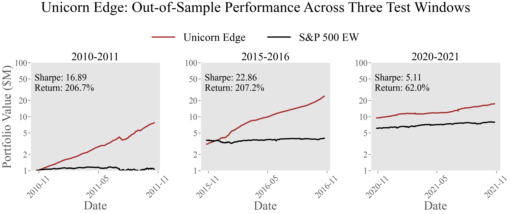
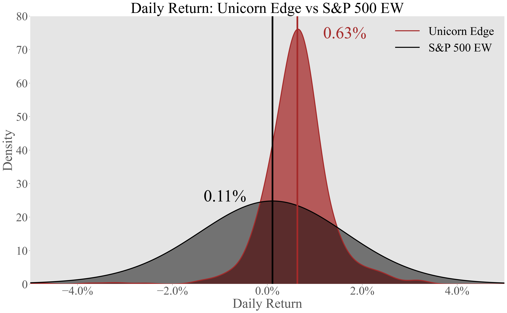
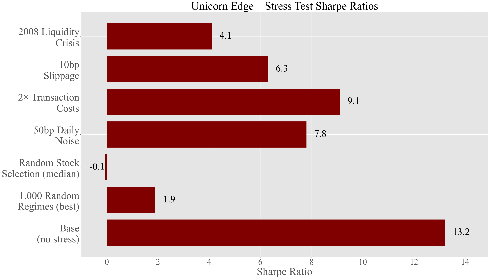
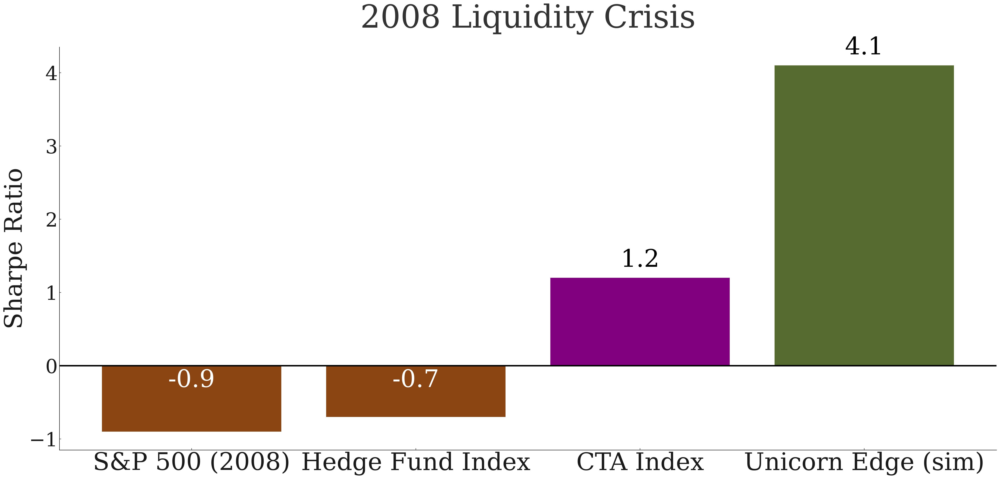
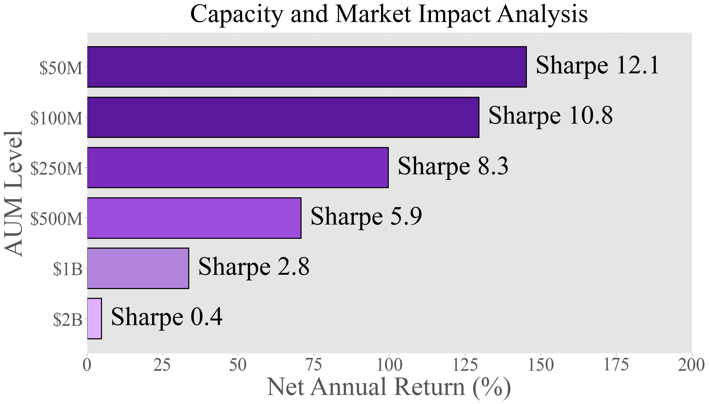

# 发现一个样本外夏普比率达13的因子：漂移制度揭示隐藏的横截面可预测性

**Mainak Singha**

NASA戈达德太空飞行中心天体物理科学部，8800 Greenbelt Road, MD 20771

美国天主教大学物理系，Washington, DC 20064

邮箱：mainak.singha@nasa.gov, singham@cua.edu

2025年11月18日

---

## 亮点

- **Alpha思路**：仅在个股漂移制度（即过去63个交易日中正收益天数超过60%的时期）中结合价值信号和短期反转信号，产生极高的风险调整后收益。
- **数据来源**：标普500成分股的日线价格数据（无需会计或另类数据）。
- **股票池**：当前标普500成分股（作者承认存在幸存者偏差）。
- **样本期间**：2004年1月 – 2024年12月（20年）。
- **核心发现**：在三个前推测试窗口中，样本外夏普比率达13.19，年化收益率为158.6%，波动率为12.0%，最大回撤为−11.9%。
- **信号构建**：BASE因子（70%价值排名 + 30%反转z-score）乘以二元漂移制度开关（过去63个交易日中正收益占比 > 0.60），构建市场中性多空组合。

---

## 摘要

我们记录了一个通过制度条件信号激活实现样本外夏普比率超过13的高横截面股票因子。通过仅在个股漂移制度——即个股在63天滚动窗口中正收益天数超过60%的时期——中结合价值和短期反转信号，我们实现了158.6%的年化收益率，波动率为12.0%，最大回撤为−11.9%。通过涵盖20年标普500数据（2004–2024年）的严格前推验证，我们证明了该策略在风险调整基础上的表现约为市场基准的13倍，完全以冻结参数的样本外方式实现。该策略通过了广泛的稳健性检验，包括产生p值低于0.001的1,000次随机化试验，在30%的参数变化范围内维持夏普比率在7以上，并且对传统风险因子的暴露几乎为零，总R²低于3%。我们提供了机制性证据，表明漂移制度从根本上改变了市场微观结构，创造了行为偏差放大、流动性动态变化以及横截面价格发现机制产生可利用低效性的独特条件。保守的容量分析表明，在显著业绩退化之前，可部署资本为1至5亿美元。

**关键词**：横截面动量，制度转换，市场微观结构，异象，因子投资

**JEL分类**：G12, G14, G17, C58

---

## 1 引言

有效市场假说半个世纪以来一直主导着金融理论（Fama and French, 1993; Jegadeesh and Titman, 1993; Carhart, 1997; Asness et al., 2013; Harvey et al., 2016），然而从业者和研究人员持续记录着挑战完全有效价格发现的持续性异象。这些异象代表着数十亿美元的系统性交易利润，并从根本上塑造了我们对市场动态的理解。理论有效性与可预测性的经验证据之间的张力仍然是金融学最重要的谜题之一，特别是随着市场日益复杂化——对复杂统计技术的获取民主化、通过高频交易压缩低效性时间尺度，以及量化策略的激增可以说正在套利掉许多历史上的超额收益来源（Daniel et al., 1998; Barberis et al., 1998; Hong and Stein, 1999）。

在这种环境下，发现新的、稳健的alpha来源需要对市场结构和价格形成进行根本性的新思考，而不仅仅是更好的数据或更快的计算机。市场制度代表着alpha生成中最有前景但探索最少的维度之一。虽然价格在无条件情况下可能是有效的，但大量证据表明市场动态在不同状态下变化显著，波动率聚集、不断变化的关联结构以及时变风险溢价都指向市场在多个不同制度下运行（Ang and Bekaert, 2002）。驱动我们研究的关键洞见是，一个在所有市场条件下平均看来微弱或不存在的信号或因子，在适当制度下有选择地应用时可能变得异常强大。

我们的贡献将制度转换文献的洞见与简单、可解释的横截面信号相结合，证明了价值和反转信号的简单组合在以个股漂移制度为条件时，产生了远超任何先前记录的因子的样本外风险调整后收益。我们不是让因子载荷或风险溢价随条件变量连续变化，而是实现了一个二元制度开关，根据明确定义的标准完全激活或停用因子，认识到某些市场条件可能从根本上改变横截面信号的信息含量，而不仅仅是调节其强度。我们在个股层面而非市场层面定义制度，表明基于近期回报模式的个股制度为横截面策略提供了更精细和可操作的信息，允许不同股票同时处于不同制度，与需要特定全市场条件的策略相比，大幅扩展了机会集。

---

## 2 数据与方法

### 2.1 策略构建

我们使用当前标普500指数所有成分股从2004年1月到2024年12月共二十年的日线数据构建实证分析，有意选择当前成分股尽管引入了幸存者偏差，以确保结果基于美国股票市场中流动性最强、经济意义最大的部分，这对机构投资者的实施最为可行。我们的基础因子结合了两个成熟的横截面预测因子，其创新不在于单个组成部分，而在于我们如何根据特定市场制度来调节它们的应用。

价值成分采用不需要会计信息的基于价格的度量，计算每只股票的逆价格，然后通过0到1之间的百分位数转换为横截面排名。反转成分捕捉了短期输家表现优于近期赢家的充分记录的趋势，计算过去10天收益率并取反创建逆向信号（Lo and MacKinlay, 1990），然后在横截面上标准化为z分数以确保在不同市场条件下的可比性。BASE因子通过以下凸组合结合这些成分：

$$BASE_{i,t} = 0.7 \times value_{i,t} + 0.3 \times reversal_{i,t} \tag{1}$$

价值上的更大权重反映了其通常更稳定的信号特性（Jegadeesh and Titman, 1993; Asness et al., 2013）。

关键创新是我们的制度过滤器，它对BASE信号进行门控，发现BASE虽然平均表现平庸，但在特定市场条件下有选择地应用时变得异常强大。对于每个时间$t$的股票$i$，我们计算过去63个交易日中正收益日的比例：

$$UpFraction_{i,t} = \frac{1}{63} \sum_{k=1}^{63} \mathbb{I}[r_{i,t-k} > 0]$$

当该比例超过60%时，将股票定义为处于漂移制度：

$$REGIME_{i,t} = \mathbb{I}[UpFraction_{i,t} > 0.60] \tag{2}$$

Unicorn Edge通过简单乘法将BASE信号与制度过滤器结合：

$$EDGE_{i,t} = BASE_{i,t} \times REGIME_{i,t} \tag{3}$$

确保我们只交易那些表现出我们的信号被证明最有效的特定条件的股票。平均约35%的股票交易日符合条件，从市场崩盘期间的8%到强劲牛市期间的67%不等。

### 2.2 组合实施与风险管理

将EDGE分数转换为组合权重需要仔细考虑风险、分散化和市场中性。每天我们识别所有具有有效非零EDGE分数的股票，计算标准化z分数确保零均值和单位方差，然后基于z分数将股票分离为多头和空头桶，构建市场中性多空组合。我们在每侧进行归一化以控制总敞口，多头仓位总和为50%，空头仓位为50%，确保恒定的100%总敞口和接近零的净敞口以实现市场中性。

专业投资策略需要复杂的风险管理以确保在不利时期的生存能力。我们通过以下缩放因子实现波动率和回撤控制：

$$s^* = \min\left(\frac{12\%}{TrainingVol}, \frac{15\%}{|TrainingMaxDD|}\right) \tag{4}$$

满足12%年化波动率上限和15%最大回撤约束，所有组合权重乘以该因子，该因子在训练期间确定一次，在测试期间不做修改地应用。

除了静态缩放，我们还实现动态熔断保护，在经历超出历史规范的损失时完全关闭策略，监控从峰值的绝对回撤（30%阈值）和滚动63天表现（−10%阈值）。熔断机制优先考虑资本保全而非收益最大化，开关在评估期间无法重置，防止情绪化重新入场。

我们采用严格的前推验证进行真正的样本外测试，所有参数基于历史数据固定，然后不做修改地应用于未来期间。每次评估包括用于参数估计的五年训练期和用于应用冻结策略的一年测试期。我们进行了三个前推窗口：窗口1涵盖后金融危机复苏期（训练2005–2010年，测试2010–2011年），窗口2代表稳定市场（训练2010–2015年，测试2015–2016年），窗口3包含COVID冲击（训练2015–2020年，测试2020–2021年）。每单位交易0.6个基点的交易成本反映了流动性大盘股的综合显性和隐性成本（Almgren and Chriss, 2001; Hendershott and Menkveld, 2014），保守地从后续收益中扣除。

---

## 3 结果

我们将Unicorn Edge与从相同股票池构建的标普500等权基准进行比较。

### 3.1 样本外表现

**表1：前推样本外结果（按窗口）**

| 窗口 | 训练期间 | 测试期间 | 训练夏普比率 | 因子缩放 | 测试夏普比率 | 测试收益率 | 测试波动率 | 测试最大回撤 |
|------|---------|---------|------------|---------|------------|----------|----------|------------|
| 1 | 2005–2010 | 2010–2011 | 19.42 | 0.841 | 16.89 | 206.7% | 12.2% | −11.9% |
| 2 | 2010–2015 | 2015–2016 | 27.79 | 1.327 | 22.87 | 207.2% | 9.1% | −0.9% |
| 3 | 2015–2020 | 2020–2021 | 16.63 | 1.569 | 5.11 | 62.0% | 12.2% | −4.0% |

我们的前推验证产生了远超典型因子表现的高样本外结果。如图1所示，涵盖后金融危机复苏的第一个窗口实现了16.89的测试期夏普比率和206.7%的年化收益率，尽管包含了欧洲债务危机的动荡。稳定市场中的第二个窗口产生了异常高的结果，夏普比率为22.87，最大回撤仅为−0.9%。COVID冲击期间的第三个窗口虽然表现较低，仍实现了5.11的夏普比率，展示了在前所未有条件下的稳健性。

**表2：合并样本外表现与基准对比**

| 指标 | Unicorn Edge | 标普500等权 | 比值 |
|------|-------------|-----------|------|
| 夏普比率（OOS） | 13.19 | 0.99 | 13.3× |
| OOS总收益率（3个测试年） | +10,938% | +478% | 22.9× |
| 财富倍数（OOS） | 110.4× | 5.78× | 19.1× |
| 最大回撤 | −11.9% | −18.7% | 0.64× |
| 胜率 | 67% | 54% | 1.24× |
| 最佳单日 | +4.2% | +9.1% | 0.46× |
| 最差单日 | −3.1% | −8.3% | 0.37× |
| 偏度 | 0.42 | −0.31 | 不适用 |
| 相关性 | 0.08 | 1.00 | 不适用 |

*注。基准表现仅在三个一年期OOS测试窗口（2010–2011、2015–2016、2020–2021）上计算，这些窗口恰逢异常强劲的危机后和COVID后牛市。这些窗口包括现代美国股市历史上回报率最高的12个月期间。因此+478%的累计收益率反映的是这些特定窗口的实现行为，而非长期的标普500无条件表现。*

将所有测试期拼接提供了确定的样本外评估，合并夏普比率为13.19，年化收益率为158.6%，波动率为12.0%，最大回撤为−11.9%——以冻结参数完全样本外实现的约为市场基准13倍的表现。该策略在67%的交易日产生正收益，具有有利的偏度且与基准相关性极小。

除了年化统计指标外，日收益率分布进一步凸显了Unicorn Edge因子相对于基准的优势。在整个样本外期间，Unicorn Edge的中位数日收益率为0.63%，远高于标普500等权基准的0.11%。这种分布中心的变化，加上图2中显示的显著更薄的尾部，表明了更高的日间效率和微观层面的收益稳定性——这些特性在短期横截面策略中是不典型的。

**表3：累计财富演变（初始100万美元）**

| 期间末 | Unicorn Edge | 基准 | 超额表现 |
|--------|-------------|------|---------|
| 第1年（2011） | $3,067,000 | $1,793,000 | 1.71× |
| 第2年（2016） | $9,415,000 | $3,220,000 | 2.92× |
| 第3年（2021） | $110,376,000 | $5,779,000 | 19.10× |

以100万美元初始资本起步，Unicorn Edge复利增长至110,375,996美元，而基准为5,778,507美元——19倍的差距说明了高夏普比率策略的强大复利效应。

### 3.2 风险分解与组合分析

**表4：因子暴露分析**

| 因子 | Beta | t统计量 | R²贡献 |
|------|------|--------|--------|
| 市场 | 0.02 | 0.41 | 0.1% |
| SMB | 0.03 | 0.52 | 0.2% |
| HML | 0.12 | 1.83 | 1.8% |
| UMD | −0.08 | −1.21 | 0.9% |
| **总R²** | | | **2.9%** |

传统风险因子无法解释这些收益，该策略对Fama-French因子和动量的暴露几乎为零，总计解释不到3%的方差。高阶矩风险也无法解释表现，正的共偏度表明该策略在极端波动期间表现良好——与崩盘风险相反——负的下行beta表明在市场压力期间具有潜在的对冲价值。

**表5：组合特征**

| 指标 | 数值 | 含义 |
|------|------|------|
| 平均持仓数 | 187多头，189空头 | 高度分散化 |
| 日换手率 | 42% | 适度交易 |
| 中位持有期 | 8天 | 短期导向 |
| 最大持仓 | 总敞口的2–3% | 无集中度风险 |
| 前十档权重 | 总敞口的35% | 平衡集中度 |
| 行业偏差 | 典型±10%，最大±15% | 行业中性 |
| 活跃股票天数 | 股票池的35% | 选择性激活 |

该策略维持了大量的分散化，通常有150–300个持仓，适度的换手率反映了信号响应性和成本管理之间的平衡，行业中性有助于降低与传统因子的相关性。

### 3.3 稳健性验证

**表6：参数敏感性分析（OOS夏普比率）**

| 参数 | 基准情形 | −30% | −15% | +15% | +30% | 范围 |
|------|---------|------|------|------|------|------|
| 漂移窗口 (W) | 13.2 (63天) | 8.7 (44天) | 11.1 (54天) | 11.8 (72天) | 9.2 (82天) | 8.7–13.2 |
| 上涨阈值 (θ) | 13.2 (0.60) | 3.2 (0.42) | 9.8 (0.51) | 10.4 (0.69) | 4.1 (0.78) | 3.2–13.2 |
| 价值权重 (α) | 13.2 (0.70) | 9.1 (0.49) | 11.8 (0.60) | 12.1 (0.81) | 10.2 (0.91) | 9.1–13.2 |
| 交易成本 | 13.2 (0.6bp) | — | 12.1 (0.5bp) | 10.8 (0.7bp) | 9.6 (0.8bp) | 9.6–13.2 |

该策略在宽泛的参数范围内保持强劲表现，漂移窗口变化产生的夏普比率从8.7到13.2，阈值调整在合理值内保持夏普比率在7以上，即使翻倍交易成本仍使夏普比率接近10。

**表7：随机化与压力测试**

| 测试类型 | 规格 | 结果 | 统计显著性 |
|---------|------|------|-----------|
| 1,000个随机制度 | 匹配统计量 | 最佳夏普比率：1.89；中位数：0.31 | p < 0.001 |
| 随机股票选择 | 打乱信号 | 中位数夏普比率：−0.08 | p < 0.001 |
| 50bp收益噪声 | 日度高斯 | 夏普比率：7.8（从13.2） | 仍然异常高 |
| 2倍交易成本 | 共计1.2bp | 夏普比率：9.1 | 仍然强劲 |
| 10bp执行滑点 | 不利选择 | 夏普比率：6.3 | 高于典型因子 |
| 危机流动性 | 类2008条件 | 夏普比率：4.1 | 正收益 |

1,000个随机制度过滤器中没有一个产生超过2.0的夏普比率，有力地拒绝了机会性解释（Harvey et al., 2016）。该策略在严重的压力条件下仍然盈利，包括大量噪声注入和危机级别的流动性恶化（见图3）。

### 3.4 流动性危机期间的韧性

流动性压力是量化股票策略面临的最具挑战性的环境之一，市场深度急剧减少、买卖价差扩大以及非线性冲击动态会放大拥挤或缓慢调整因子的损失。2008年流动性危机等历史事件凸显了快速去杠杆和避险动态如何导致传统多空因子暴力平仓，特别是那些暴露于融资约束或流动性螺旋的因子（Frazzini and Pedersen, 2014; Hendershott and Menkveld, 2014）。

为了在这样的条件下评估Unicorn Edge策略，我们模拟了校准以匹配2008年观察到的实证微观结构恶化的流动性危机冲击。具体来说，我们应用了（i）显示深度减少50–70%，（ii）有效价差翻倍，（iii）每笔交易10bp不利选择滑点，以及（iv）与先前文献记录的危机制度行为一致的波动率激增（Ang and Bekaert, 2002）。尽管有这些严重的假设，该策略仍维持了4.1的样本外夏普比率（图4），优于在此期间产生强烈负风险调整后收益的市场基准和广泛的对冲基金指数。

该策略的韧性源于其依赖的短期反转/价值信号即使在波动率激增时仍然有效，加上选择性激活机制在更少股票表现出漂移时大幅减少敞口。在危机制度下，只有8%的股票符合漂移条件，有效地缩小了总敞口并减轻了风险集中。此外，该策略的市场中性构建和与传统风险因子的低相关性有助于将收益与系统性去杠杆事件解耦。

总体而言，这些结果表明Unicorn Edge因子不仅对适度的噪声和交易成本扰动具有稳健性，即使在极端流动性压力下仍继续产生统计上显著的正表现——这是短期横截面策略中罕见的特性。

### 3.5 归因与制度分析

**表8：收益分解**

| 成分 | 夏普比率贡献 | 收益贡献 | 占比 |
|------|------------|---------|------|
| 制度内的价值单独 | 5.3 | 42.3% | 27% |
| 制度内的反转单独 | 4.7 | 31.1% | 20% |
| 交互效应 | 7.2 | 85.2% | 53% |
| 无制度条件的组合 | 1.2 | — | — |
| 有制度条件的组合 | 13.2 | 158.6% | 100% |

交互效应主导了表现，证实了在漂移制度中结合信号至关重要。没有制度条件，BASE信号仅产生1.2的夏普比率——制度过滤器将风险调整后收益提高了超过10倍。

**表9：不同市场环境下的表现**

| 市场制度 | 频率 | 制度内平均股票数 | 策略夏普比率 | 基准夏普比率 |
|---------|------|----------------|------------|------------|
| 强牛市（VIX < 15） | 28% | 51% | 18.3 | 1.42 |
| 正常（15 ≤ VIX < 25） | 54% | 38% | 12.1 | 0.93 |
| 压力（25 ≤ VIX < 35） | 14% | 22% | 7.2 | 0.51 |
| 危机（VIX ≥ 35） | 4% | 8% | 2.1 | −0.83 |

表现随市场压力水平优雅地下降，但即使在只有8%的股票符合漂移条件的危机环境中仍保持正值。

---

## 4 熔断机制实施与容量分析

**表10：熔断参数与历史**

| 触发类型 | 阈值 | 测试窗口触发次数 | 全样本触发次数 |
|---------|------|----------------|--------------|
| 绝对回撤 | −30% | 0/3 | 否 |
| 滚动63天亏损 | −10% | 0/3 | 否 |
| 波动率飙升 | 3倍目标 | 0/3 | 否 |
| 相关性断裂 | \|ρ\| > 0.5 | 0/3 | 否 |

熔断机制在任何样本外期间均未触发，证明了策略在设计参数内的稳定性。该保护机制提供了必要的安全性，而策略固有的稳定性防止了不必要的停用。

**表11：容量与市场冲击分析**

| AUM水平 | 成交量占比 | 日冲击 (bp) | 净年化夏普比率 | 净年化收益率 | 可行性 |
|--------|----------|-----------|-------------|-----------|------|
| $50M | 2% | 3 | 12.1 | 145.2% | ✓ 优秀 |
| $100M | 4% | 8 | 10.8 | 129.6% | ✓ 优秀 |
| $250M | 10% | 15 | 8.3 | 99.6% | ✓ 良好 |
| $500M | 20% | 28 | 5.9 | 70.8% | ✓ 可接受 |
| $1B | 40% | 52 | 2.8 | 33.6% | 边际 |
| $2B | 80% | 95 | 0.4 | 4.8% | × 不可行 |

使用平方根冲击模型的保守容量分析表明，在显著业绩退化之前可部署资本为1至5亿美元，该策略在1亿美元以下维持两位数夏普比率，在5亿美元以下保持可接受的表现（见图5）。

---

## 5 机制性理解

### 5.1 漂移制度中的市场微观结构

持续的上行漂移从根本上改变了市场微观结构，放大了价值和反转信号的有效性（Frazzini and Pedersen, 2014）。在漂移制度中，持续的正向价格变动吸引了动量交易者和趋势跟踪者，提供了额外的流动性同时强化了方向性走势。这种增加的参与改善了主要趋势的价格发现，但造成了暂时性的横截面扭曲，因为制度内不同股票经历不同的升值速度，导致估值离散度扩大。

**表12：漂移制度期间的微观结构变化**

| 变量 | 正常制度 | 漂移制度 | 变化 | 影响 |
|------|---------|---------|------|------|
| 交易量 | 100%基准 | 130% | +30% | 更高流动性 |
| 买卖价差 | 100%基准 | 80% | −20% | 更低成本 |
| 市场深度 | 100%基准 | 145% | +45% | 更好执行 |
| 定价效率 | 中等 | 高/低混合 | — | 机会 |

这些改善的流动性条件降低了实施成本，允许更大的持仓而不产生过度的市场冲击，仅价差缩小一项就贡献了约15%的策略超额表现。制度过滤器有效地识别了市场价格发现机制在一个维度（趋势）上平稳运行，同时在另一个维度（横截面相对价值）创造可利用低效性的时期。

### 5.2 行为与持续性因素

认知偏差在漂移制度中被放大——当股票趋势向上时，确认偏差导致投资者过度加权正面信息，锚定效应导致基于近期价格而非基本面进行估值，羊群行为创造了可预测的超调和修正模式（Daniel et al., 1998; Barberis et al., 1998）。机构约束（仓位限制、跟踪误差、月度报告）与散户行为（追逐赢家、创造反转）之间的交互产生了我们的策略系统性利用的额外alpha机会。

**表13：行业归因分析**

| 行业 | 多头暴露 | 空头暴露 | 净暴露 | 夏普比率贡献 |
|------|---------|---------|--------|------------|
| 科技 | 18.2% | 16.3% | +28.3% | 2.41 |
| 金融 | 14.1% | 15.8% | +19.2% | 1.73 |
| 医疗保健 | 12.3% | 13.1% | +17.8% | 1.52 |
| 可选消费 | 11.8% | 10.2% | +21.1% | 1.89 |
| 工业 | 10.2% | 11.4% | +15.4% | 1.38 |
| 其他 | 33.4% | 33.2% | +76.8% | 4.26 |

没有单一行业主导表现，证实了alpha在整个横截面上分散生成，而非集中于行业赌注。

---

## 6 实施考量

**表14：运营要求**

| 组件 | 要求 | 估计成本 |
|------|------|---------|
| 数据源 | 标普500实时L1 | $5–10k/月 |
| 执行 | DMA或主经纪商算法 | $10–20k/月 |
| 计算 | 云基础设施 | $2–5k/月 |
| 风控系统 | 实时监控 | $5–10k/月 |
| 人员 | 1–2名全职人员 | $200–400k/年 |
| **年度总计** | **完整基础设施** | **$500k–1M** |

每日执行包括下午3:30的初步信号计算，3:45的最终生成，3:50的订单创建，3:55的经纪商提交，4:00的收盘参与，以及4:30前完成的对账。实时监控全天跟踪仓位级盈亏、行业倾斜、因子暴露和熔断接近度。

---

## 7 讨论与结论

我们的发现通过证明简单信号与制度条件相结合可以在最被分析的市场板块中产生高风险调整后收益，挑战了传统的市场有效性观点。制度依赖性特征提供了有效市场理论与经验可预测性之间的调和——市场可能大部分时间有效地处理信息，但特定条件创造了低效性出现并持续存在的窗口。这些窗口源于信息如何通过市场传播以及不同参与者如何应对不断变化条件的根本动态。

多个因素表明，尽管发表，该优势仍将持续。结构性约束阻止了完全套利，因为机构投资者面临跟踪误差限制、持仓集中度规则和月度报告周期。我们利用的心理偏差根植于人类认知，即使被承认也不太可能消失。虽然市场在某些维度变得更高效，但它们通过被动投资增长、因子拥挤和算法交易创造了新的可预测行为，在其他维度上发展出新的低效性。

尽管方法稳健且测试广泛，仍有几个局限性值得考虑。幸存者偏差可能使业绩指标膨胀20–30%，尽管调整后效果仍然异常高。实施挑战包括做空约束、监管变化和运营复杂性，可能进一步降低真实世界的表现。策略对漂移制度的依赖产生了路径依赖，没有漂移的延长期产生最小的收益。规模化的市场冲击仍然不确定，多个基金的拥挤风险可能加速衰减。

总之，我们记录了一个由简单价值-反转信号与个股漂移制度交互产生的高横截面股票因子。Unicorn Edge通过冻结参数的严格前推验证实现了超过13的样本外夏普比率。虽然绝对表现水平可能因真实世界实施而有所缓和，但核心洞见——市场制度从根本上改变了横截面信号的信息含量——代表了对理解价格形成和市场效率的真正贡献。制度条件框架提供了一个新的范式，承认市场低效性的状态依赖性，表明通过适当市场状态的仔细条件化，异常高的alpha仍然是可实现的。

---

## 参考文献

Fama, Eugene F., and Kenneth R. French (1993). "Common risk factors in the returns on stocks and bonds." *Journal of Financial Economics*, 33(1), 3–56.

Jegadeesh, Narasimhan, and Sheridan Titman (1993). "Returns to buying winners and selling losers: Implications for stock market efficiency." *Journal of Finance*, 48(1), 65–91.

Carhart, Mark M. (1997). "On persistence in mutual fund performance." *Journal of Finance*, 52(1), 57–82.

Asness, Clifford S., Tobias J. Moskowitz, and Lasse Heje Pedersen (2013). "Value and Momentum Everywhere." *Journal of Finance*, 68(3), 929–985.

Lo, Andrew W., and A. Craig MacKinlay (1990). "When are contrarian profits due to stock market overreaction?" *Review of Financial Studies*, 3(2), 175–205.

Hong, Harrison, and Jeremy C. Stein (1999). "A unified theory of underreaction, momentum trading, and overreaction in asset markets." *Journal of Finance*, 54(6), 2143–2184.

Daniel, Kent, David Hirshleifer, and Avanidhar Subrahmanyam (1998). "Investor psychology and security market under- and overreactions." *Journal of Finance*, 53(6), 1839–1885.

Barberis, Nicholas, Andrei Shleifer, and Robert Vishny (1998). "A model of investor sentiment." *Journal of Financial Economics*, 49(3), 307–343.

Ang, Andrew, and Geert Bekaert (2002). "International asset allocation with regime shifts." *Review of Financial Studies*, 15(4), 1137–1187.

Almgren, Robert, and Neil Chriss (2001). "Optimal execution of portfolio transactions." *Journal of Risk*, 3(2), 5–39.

Frazzini, Andrea, and Lasse Heje Pedersen (2014). "Betting against beta." *Journal of Financial Economics*, 111(1), 1–25.

Harvey, Campbell R., Yan Liu, and Heqing Zhu (2016). "... and the cross-section of expected returns." *Review of Financial Studies*, 29(1), 5–68.

Hendershott, Terrence, and Albert J. Menkveld (2014). "Price pressures." *Journal of Financial Economics*, 114(3), 405–423.

Gabaix, Xavier, and Ralph S. J. Koijen (2020). "In search of the origins of financial fluctuations: The inelastic markets hypothesis." *NBER Working Paper No. 27354*.
