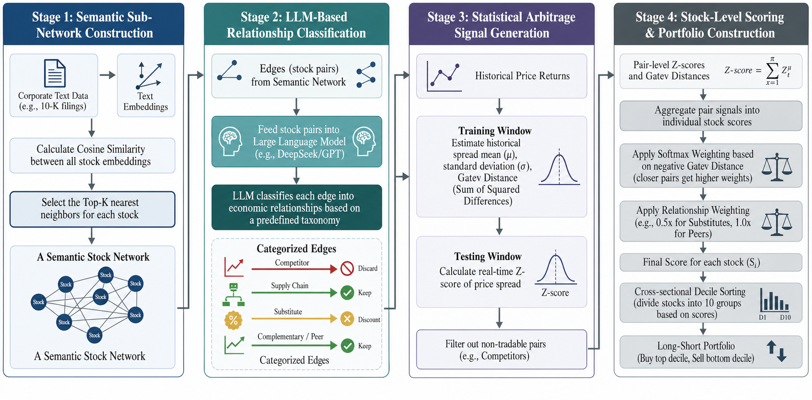
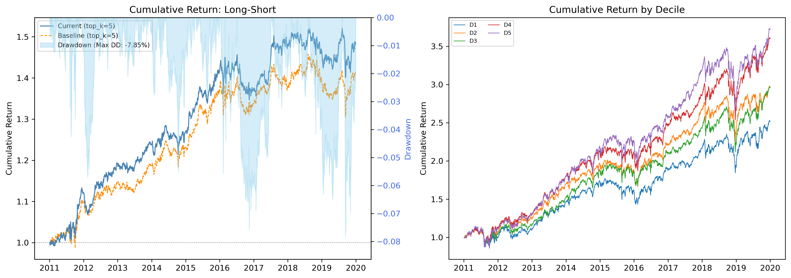

# 基于大语言模型增强语义网络的跨股票可预测性研究

**作者：** 黄奕宽\*, 范哲琦\*, 胡凯琪, 叶一帆

**机构：**
- 香港科技大学 工商管理学院/金融科技方向
- 罗格斯大学 罗格斯商学院
- 北京师范大学-香港浸会大学联合国际学院 工商管理学院

\* 通讯作者：{yk.huang, zheqi.fan}@connect.ust.hk, kh962@scarletmail.rutgers.edu, yifanye@bnbu.edu.cn

---

## 亮点

- **Alpha 思路**：利用大语言模型过滤基于嵌入向量构建的金融网络中的虚假边，提升跨股票均值回复信号质量。
- **数据来源**：CRSP（日收益率）、10-K 年报（文本嵌入向量）。
- **股票池**：标普500成分股（约605个唯一PERMNO）。
- **样本区间**：2011年1月 – 2019年12月（2,210个交易日）。
- **核心发现**：LLM过滤将多空夏普比率从0.742提升至0.820，最大回撤从−10.47%降至−7.85%。
- **信号构建**：两阶段"检索-推理"框架——嵌入相似度构建候选图，然后LLM（DeepSeek-Chat）将边分类为六种关系类型；移除竞争者边，降低替代品边权重；配对层面z分数通过基于Gatev距离的逐股票softmax加权聚合为股票层面信号。

---

## 摘要

基于文本的金融网络日益被用于研究跨股票收益可预测性。一种常见方法是从公司披露文件的嵌入向量相似性构建网络边，但此类网络往往包含虚假边，因为文本接近性并不必然意味着经济联系。我们提出一个两阶段框架，首先从10-K嵌入向量构建稀疏候选图，然后使用大语言模型根据经济关系对候选边进行分类和过滤。精炼后的图用于将配对层面的均值回复信号聚合为股票层面交易信号，并采用关系感知和距离加权。在2011年至2019年标普500成分股的回测中，基于LLM的边过滤将多空夏普比率从0.742提升至0.820，最大回撤从−10.47%降至−7.85%。这些结果表明，基于LLM的推理可以提高文本衍生金融网络的经济保真度，并增强跨股票可预测性。

---

## 1 引言

跨股票可预测性——即一只股票的未来收益可以被经济关联公司的同期行为部分预测的现象——是资产定价中最稳健的实证规律之一 [Cohen and Frazzini, 2008; Menzly and Ozbas, 2010]。这种可预测性源于信息在经济关联公司之间逐渐扩散：例如，下游制造商的需求冲击最终会传导至其上游供应商，但通常存在延迟，从而创造了可利用的价格错位。要利用这一现象，需要一张可靠的经济关联图——一个能够捕捉谁与谁真正相连的网络。

自然语言处理的最新进展使得从公司文本披露大规模构建此类网络成为可能。通过将10-K年报编码为密集嵌入向量，并将每家公司与其最相似的K个同行连接，可以得到一个每年更新、覆盖全部公开股权宇宙的语义图。然而，这种方法引入了一个微妙但关键的问题：虚假相关。嵌入模型捕捉的是主题相似性而非经济因果关系——两家公司可能讨论相同的宏观经济逆风（例如"供应链中断"、"监管不确定性"），但并不存在直接的商业互动。在这种噪声边上聚合跨股票信号会稀释真正的预测内容，降低投资组合表现。以两家不相关行业的公司为例，它们都在年报中投入大量篇幅讨论与大流行相关的风险：它们的嵌入向量会很接近，但它们之间的价格偏离并不携带均值回复信息。

本文提出了一个"检索-推理"（Retrieve-then-Reason）框架，通过引入大语言模型（LLM）作为经济推理者来解决虚假相关问题。第一阶段执行轻量级嵌入相似度搜索，生成包含O(NK)条边的候选图，使后续推理步骤在计算上可行。第二阶段查询LLM，将每条候选边分类为六种互斥关系类别之一（例如竞争者、供应链、同行）。竞争者边——价格偏离更可能反映结构性市场份额变化——被移除，替代品边被降低权重。精炼后的图随后通过一种新颖的基于Gatev距离的逐股票softmax聚合方法构建股票层面信号，使得历史价格走势更为紧密的配对获得更大影响权重。

我们在美国股票（标普500股票池，2011–2019年）上评估该框架，展示了三个主要发现：(i) 添加LLM过滤将多空夏普比率从0.742提升至0.820，同时将最大回撤降低262个基点；(ii) 语义网络大幅优于随机图和基于SIC的行业网络；(iii) Fama-French因子回归确认了统计显著的日度alpha，不被传统风险溢价所解释。

**贡献。** 我们的主要贡献有三个方面：

1. 我们提出了一个新颖的"检索-推理"框架，利用LLM过滤基于嵌入的金融网络中的虚假相关，生成具有语义标注边的高保真经济图。
2. 我们设计了一种关系感知、距离加权的信号聚合机制，将配对层面z分数映射为股票层面横截面信号，权重由经济关系类型和历史价格协同运动共同决定。
3. 我们进行了全面的实证评估，包括组件消融、参数敏感性分析和风险因子回归，证明了可归因于LLM推理模块的统计显著的投资组合改善。

---

## 2 相关工作

我们的工作处于实证资产定价和自然语言处理的交叉领域，具体桥接了跨股票可预测性与基于LLM的推理。

### 2.1 跨股票可预测性与经济关联

金融学领域的丰富文献记录了经济关联公司的收益可以预测目标公司未来收益，这一现象通常归因于投资者注意力和信息扩散缓慢。研究者已经识别了各种预定义的关联，包括供应链 [Cohen and Frazzini, 2008]、行业分类 [Moskowitz and Grinblatt, 1999]、地理邻近性 [Parsons et al., 2020] 以及共享分析师覆盖 [Ali and Hirshleifer, 2020]。近期证据还记录了基于收益相似性的跨股票可预测性 [Chen and Fan, 2026]。

该领域最近的进展强调了解析这些关联性质的迫切需求。Yan and Yu [2023] 从理论上将跨股票关联分解为对称成分（由公共因子动量驱动）和非对称成分（单向领先-滞后关系）。在此基础上，Li and Yan [2025] 证明对称成分通常导致长期收益反转（反映过度反应），而非对称成分——如流动性股票引领非流动性股票——真正反映投资者反应不足。此外，Avramov et al. [2026] 引入了"双重同行效应"概念，表明同行群体的集体力量和公司在其中相对位置都对可预测性有贡献。虽然这些研究突出了高保真、方向性经济网络的重要性，但它们主要依赖静态或手动策划的分类（例如SIC代码或Compustat客户-供应商数据段），往往落后于动态市场现实。

### 2.2 数据驱动的同行网络及其局限性

近期研究从高维文本和专利数据构建公司网络，而非依赖预定义的经济分类。Hoberg and Phillips [2018] 使用10-K产品描述开发基于文本的行业动量，Eisdorfer et al. [2022] 从监管文件中提取竞争者网络。基于专利的方法衡量创新相似性或技术邻近性以预测收益 [Bekkerman et al., 2023; Lee et al., 2019]，Lee et al. [2024] 记录了由生产互补性驱动的动量溢出。除文本和专利数据外，近期方法还采用图学习直接从跨资产类别的定价数据推断动态动量溢出网络 [Pu et al., 2023]。

这些方法展示了非结构化数据的价值，但主要依赖相似性度量——如嵌入空间中的余弦相似度或专利分类的重叠度——来推断经济关联。此类表示将公司间关系简化为连续的邻近性分数，隐含假设更大的相似性对应更强的经济关联。然而，文本或技术相似性不能唯一识别潜在关系的性质。披露相似的公司可能是直接竞争者（替代品）、垂直关联的合作伙伴或战略互补者。将这些异质链接合并到单一基于相似性的网络中可能因此引入结构性噪声并削弱收益可预测性。

我们脱离了基于距离的推断方法，引入了一个LLM驱动的关联框架。我们不是测量嵌入空间中的邻近性，而是利用大语言模型对10-K披露进行上下文语义推理，将公司间引用显式分类为结构化的经济类别（例如竞争者、供应链、互补者）。这种设计将网络构建问题从无监督相似性估计转变为有监督语义分类。通过将非结构化金融文本转换为类型化的关系图，我们的框架解耦了经济上不同的链接类型，并在构建交易信号时实现选择性过滤，从而提高可解释性并减少基于相似性网络固有的虚假相关。

### 2.3 大语言模型在金融推理中的应用

大语言模型在金融文本分析中展现出卓越能力，已从简单的情感分析发展到复杂的推理任务和可解释的内部表示 [Wu et al., 2023; Kong et al., 2024a,b; Chen et al., 2025a; Xie et al., 2024]。近期应用包括使用LLM直接预测股票收益 [Chen et al., 2023; Lopez-Lira and Tang, 2023]、宏观经济预测 [Chen et al., 2025b]、企业事件分析 [Xie et al., 2023]、提取结构化投资者信念 [Gao et al., 2024] 以及追踪公司披露中演变的语义信号 [Choi et al., 2025]。此外，LLM应用的前沿正在从被动分析转向自主AI框架，能够自主发现和验证系统性交易因子 [Huang and Fan, 2026]。然而，近期研究对直接经济预测提出了关键担忧，警告LLM表面上的预测成功可能主要源于数据污染和记忆化，而非真正的远见 [Lopez-Lira et al., 2025]。

我们的工作扩展了这一范式，通过将LLM部署为网络精炼的语义推理代理而非直接收益预测器来规避记忆化问题。与依赖无权重嵌入相似性的传统NLP方法不同，我们的"检索-推理"框架与金融文献中区分跨股票关系性质的呼吁相一致 [Yan and Yu, 2023]。通过提示LLM将边显式分类为类别（例如竞争者、供应链、互补者）并过滤噪声竞争者链接，我们构建了一个高保真经济图。这种方法直接解决了基于嵌入网络的局限性，并缓解了与直接LLM预测相关的前瞻偏差，为跨股票信号聚合提供了结构合理的基础。

---

## 3 问题形式化

### 3.1 符号定义

设 $V = \{v_1, \ldots, v_N\}$ 表示包含 $N$ 只股票的股票池。对于每只股票 $v_i$，我们在时间范围 $[1, T]$ 内观察日收益率 $r_{i,t}$。我们将股票 $v_i$ 从参考日期 $t_0$ 开始的标准化价格定义为总收益率的累积乘积：

$$P_{i,t} = \prod_{\tau=t_0}^{t} (1 + r_{i,\tau}). \tag{1}$$

每只股票还关联一个文本嵌入 $\mathbf{h}_i \in \mathbb{R}^D$，从其公司披露文件（例如10-K年报）中导出。这些嵌入向量作为公司业务特征的压缩表示。

### 3.2 基于网络的跨股票可预测性

跨股票可预测性利用信息在经济关联公司之间逐渐扩散的事实 [Cohen and Frazzini, 2008; Menzly and Ozbas, 2010]。核心前提是目标股票 $v_i$ 的未来收益可以通过观察其经济同行的当前状态进行部分预测。形式上，我们将这些关联表示为图 $G = (V, E)$，股票 $v_i$ 的跨股票预测信号通过聚合其邻域信息构建：

$$S_{i,t} = \text{Agg}\big(\{(v_j, r_j, P_j) \mid e_{i,j} \in E\}\big). \tag{2}$$

该信号的质量关键取决于 $E$ 的保真度：理想的边集仅捕获真实的经济互动，使得关联股票之间的价格错位反映暂时性低效而非永久性偏离。

### 3.3 虚假相关问题

构建 $E$ 的一种自然方法是利用文本相似性。对于每对股票，计算其嵌入向量之间的余弦相似度：

$$\text{sim}(v_i, v_j) = \frac{\mathbf{h}_i^T \mathbf{h}_j}{\|\mathbf{h}_i\| \cdot \|\mathbf{h}_j\|}, \tag{3}$$

通过为每个节点保留最相似的 $K$ 个同行，形成top-K邻居图 $G_{\text{emb}} = (V, E_{\text{emb}})$。虽然高效且可扩展，但这种方法存在根本性局限：文本嵌入捕捉的是主题相似性而非经济因果关系。两家公司可能在年报中讨论类似的宏观经济风险（例如"供应链中断"、"监管不确定性"），但不存在直接的商业互动。我们将这些噪声边称为虚假相关。在此类边上聚合信号会稀释真正的预测内容并降低投资组合表现。

### 3.4 目标

本工作的核心目标是将候选图 $G_{\text{emb}}$ 精炼为高保真经济网络 $G_{\text{ref}} = (V, E_{\text{ref}})$，其中 $E_{\text{ref}} \subseteq E_{\text{emb}}$，使得保留的边对应实质性经济关系。我们进一步寻求为每条保留的边分配一个语义标签来表征关系性质，从而实现关系感知的信号构建。核心研究问题是：

> 大语言模型能否通过推理公司文本信息，有效区分真实经济关联与虚假关联，从而改善跨股票可预测性？

---

## 4 提出的框架

我们提出了一个两阶段框架——先检索后推理——首先通过嵌入相似性高效识别候选股票对，然后部署大语言模型验证和分类其经济关系。精炼后的网络随后用于构建跨股票预测信号。图1展示了总体架构。



### 4.1 第一阶段：候选图生成

给定嵌入矩阵 $H = [\mathbf{h}_1, \ldots, \mathbf{h}_N]^T \in \mathbb{R}^{N \times D}$，我们计算完整的成对余弦相似度矩阵，对于每只股票 $v_i$，保留与其最相似的 $K$ 个同行的边。生成的候选图 $G_{\text{emb}} = (V, E_{\text{emb}})$ 通过对称化变为无向图：如果 $v_j$ 在 $v_i$ 的top-$K$ 中或反之，则包含边 $(v_i, v_j)$。

该阶段轻量且可扩展，将边数从 $O(N^2)$ 减少到 $O(NK)$，使后续LLM推理在计算上可行。

### 4.2 第二阶段：LLM增强的边分类

给定候选边集 $E_{\text{emb}}$，我们使用大语言模型（LLM）分类每对公司之间的经济关系。与仅依赖嵌入相似性的先前方法不同，本阶段对公司披露进行结构化语义推理，分配经济上有意义的标签。

**输入构建。** 对于每条候选边 $(v_i, v_j)$，我们使用从公司年度10-K年报（财年 $y-1$）中提取的文本信息构建结构化提示。具体来说，我们为每家公司包含三个组成部分：(i) Item 1中截断的业务描述，(ii) 产品和业务段相关披露，(iii) 通过正则表达式识别的竞争者相关句子（例如围绕"compete with"的短语）。

为减少输入长度并确保跨公司的可比性，每个部分被截断到固定的token预算。重要的是，公司身份在提示中被匿名化（例如"公司A"和"公司B"），防止模型依赖特定股票代码的记忆化知识，鼓励仅基于披露内容进行推理。

**提示设计。** LLM被指示扮演行业分析师角色，仅基于提供的披露信息分类两家公司之间的关系。模型必须从预定义分类体系中选择恰好一个标签：{competitor（竞争者）, supply chain（供应链）, complementary（互补者）, substitute（替代品）, peer（同行）, unrelated（无关）}。输出要求为结构化JSON格式，包括预测标签和每家公司披露中的支持证据片段。此设计强制生成确定性、可解释的输出，便于下游审计。

**关系分类体系。** 分类模式设计旨在反映经济上不同的跨股票互动渠道。特别地，它区分了可能产生均值回复信号的关系（例如供应链、互补者）和反映结构性竞争的关系（例如竞争者）。这一区分对于后续阶段的边过滤至关重要。

### 4.3 跨股票信号构建

给定精炼图 $G_{\text{ref}}$，我们使用滚动窗口程序为每只股票构建预测信号。

**训练阶段。** 对于每条边 $(v_i, v_j) \in E_{\text{ref}}$，我们在训练窗口 $[t_0, t_1]$ 内计算标准化价格差：

$$s_{ij,t} = P_{i,t} - P_{j,t}, \quad t \in [t_0, t_1] \tag{4}$$

并估计差值的历史均值 $\mu_{ij} = \bar{s}_{ij}$ 和标准差 $\sigma_{ij}$。我们还记录Gatev et al. [2006] 的距离 $d_{ij} = \sum_{t=t_0}^{t_1} s_{ij,t}^2$，它量化了训练期间两条标准化价格路径的整体接近程度。

**测试阶段。** 在测试窗口 $[t_1+1, t_2]$ 内，我们计算每对的z分数：

$$z_{ij,t} = \frac{s_{ij,t} - \mu_{ij}}{\sigma_{ij}}. \tag{5}$$

较大的正 $z_{ij,t}$ 表示 $v_i$ 相对于 $v_j$ 变得相对昂贵，预测未来 $v_i$ 将表现不佳而 $v_j$ 将表现优异的均值回复。

**逐股票信号聚合。** 每只股票参与多条边。我们使用符号约定将配对层面z分数聚合为股票层面信号 $S_{i,t}$：

$$S_{i,t} = \sum_{(i,j) \in E_{\text{ref}}} \big(-z_{ij,t} \cdot w_{ij}^{(i)}\big), \quad S_{j,t} = \sum_{(i,j) \in E_{\text{ref}}} \big(+z_{ij,t} \cdot w_{ij}^{(j)}\big). \tag{6}$$

当差值异常高（$z > 0$）时，股票 $v_i$ 收到负（卖出）信号，股票 $v_j$ 收到正（买入）信号，反映了均值回复假设。

权重 $w_{ij}^{(i)}$ 通过基于Gatev et al. [2006] 负距离的逐股票softmax计算，并由关系权重缩放：

$$w_{ij}^{(i)} = \omega_r \cdot n_i \cdot \frac{\exp(-d_{ij})}{\sum_{(i,k) \in E_{\text{ref}}} \exp(-d_{ik})} \tag{7}$$

其中 $n_i = |\{(i, k) \in E_{\text{ref}}\}|$ 是股票 $v_i$ 在精炼图中的度。softmax为历史距离更小（协同运动更紧密）的配对分配更高权重，而 $n_i$ 缩放因子在不同节点度的股票之间保持聚合信号幅度的一致性。

**讨论。** 本阶段将网络构建问题从无监督相似性估计转变为结构化语义分类任务。通过利用基于公司披露的LLM推理——而非仅依赖嵌入邻近性——我们旨在减少虚假边并提高生成网络的经济保真度。

### 4.4 投资组合构建

在每个再平衡日期 $t$，我们按信号 $S_{i,t}$ 对所有股票进行横截面排序，并将其划分为 $G$ 个等大小组。第1组包含得分最低的股票（预计下跌），第 $G$ 组包含得分最高的股票（预计上涨）。多空组合做多第 $G$ 组、做空第1组，其收益 $r_{LS,t} = \bar{r}_G^t - \bar{r}_1^t$ 作为跨股票可预测性的主要衡量指标。我们报告年化收益率、年化波动率、夏普比率和投资组合换手率。

---

## 5 实验

### 5.1 数据与设置

**股票池。** 我们使用来自证券价格研究中心（CRSP）数据库的美国普通股日收益率。完整收益面板涵盖2007年7月至2020年12月，包含14,218只证券和3,412个交易日。我们将可投资范围限制为出现在标普500成分股名单中的公司，产生约605个唯一PERMNO。

**文本嵌入。** 对于每个日历年 $y$，我们获取从公司年度风险因子披露（10-K年报）导出的768维嵌入向量，使用预训练语言模型编码。将嵌入与CRSP股票池匹配后，每年约有497只股票具有有效嵌入。

**滚动窗口回测。** 我们使用滚动窗口设计在2011年1月至2019年12月期间评估样本外表现。每个窗口包含180个交易日的训练期（用于估计差值参数），随后是2个月的测试期（用于生成信号和衡量投资组合收益）。来自年 $y-1$ 的嵌入用于训练期在年 $y$ 开始的窗口，确保图构建中没有前瞻偏差。

**投资组合构建。** 在每个再平衡日期，股票按聚合信号 $S_{i,t}$ 横截面排序为 $G = 5$ 个等大小五分位组。我们构建做多第5组（最高预测收益）、做空第1组（最低预测收益）的多空组合。各组内投资组合等权重，除非另有说明，每日再平衡。

**LLM配置。** 对于LLM增强的边分类（第二阶段），我们通过API使用DeepSeek-Chat，温度设为0以确保确定性输出。结果被缓存以确保跨滚动窗口的可复现性。

**评估指标。** 我们报告年化收益率（$r_{\text{ann}}$）、年化波动率（$\sigma_{\text{ann}}$）、夏普比率（SR）、最大回撤（$MDD$）、年化换手率（$TO_{\text{ann}}$）以及多空组合的Newey-West $t$统计量（$t_{NW}$）。

### 5.2 主要结果

表1报告了五种配置下的多空投资组合表现，旨在隔离各组件的贡献。

**表1：核心组件消融：多空投资组合表现**

| 方法 | $r_{\text{ann}}$ | $\sigma_{\text{ann}}$ | SR | $MDD$ | $TO_{\text{ann}}$ | $t_{NW}$ |
|------|:---:|:---:|:---:|:---:|:---:|:---:|
| 语义网络（基线） | 4.11% | 5.54% | 0.742 | −10.47% | 23.7× | 2.14 |
| **+ LLM过滤（本文）** | **4.67%** | **5.69%** | **0.820** | **−7.85%** | **22.0×** | **2.32** |
| 无距离加权 | 5.21% | 6.58% | 0.792 | −10.61% | 16.4× | 2.19 |
| 随机网络 | 4.52% | 8.36% | 0.541 | −13.15% | 25.3× | 1.61 |
| SIC行业网络 | 4.60% | 5.80% | 0.792 | −9.56% | 23.0× | 2.32 |

*注：样本期间为2011年1月至2019年12月（2,210个交易日）。基线使用top-5余弦相似度语义网络，配合Gatev距离加权信号聚合和每日再平衡。"+ LLM过滤"添加基于DeepSeek的边分类，移除竞争者边并降低替代品边权重。"无距离加权"将softmax距离权重替换为等权重。"随机网络"用随机top-5图替换语义图。"SIC行业网络"用连接共享相同2位SIC代码公司的图替换语义图。$t_{NW}$：自动带宽选择的Newey-West $t$统计量。*

从表1中可以得出几个发现。首先，所提出的LLM增强框架实现了最高的夏普比率（0.820），比基线（0.742）提升10.5%。LLM还将最大回撤从−10.47%降至−7.85%，尾部风险行为大幅改善。其次，用随机图替代语义网络将夏普比率降至0.541，确认基于嵌入的网络捕捉了有意义的经济结构。第三，SIC行业网络实现了有竞争力的夏普比率（0.792），但波动率高于LLM过滤的网络，表明文本嵌入捕捉了比粗粒度行业代码更丰富的跨公司关联。第四，移除距离加权略微提高了原始收益，但代价是大幅更高的波动率，导致夏普比率低于我们的完整模型。

### 5.3 五分位投资组合分析

表2报告了所提出的LLM增强框架下每个五分位组的表现。

**表2：五分位投资组合表现（LLM增强框架）**

| 组别 | $r_{\text{ann}}$ | $\sigma_{\text{ann}}$ | SR |
|------|:---:|:---:|:---:|
| Q1（空头） | 11.77% | 15.50% | 0.759 |
| Q2 | 13.58% | 15.09% | 0.900 |
| Q3 | 13.59% | 15.22% | 0.892 |
| Q4 | 15.88% | 15.67% | 1.013 |
| Q5（多头） | 16.43% | 16.77% | 0.980 |
| **多空** | **4.67%** | **5.69%** | **0.820** |

*注：Q1包含聚合信号最低的股票（空头端）；Q5包含信号最高的股票（多头端）。L−S表示多空投资组合（Q5 − Q1）。*

五分位排序呈现单调模式：平均收益从Q1到Q5递增，与LLM增强信号的跨股票预测能力一致。利差主要由多头端（Q5）驱动，表现优于市场，而空头端（Q1）表现不佳。



### 5.4 消融研究

**LLM边过滤的效果**

表1中基线与"+ LLM过滤"的直接比较量化了LLM推理模块的增值。LLM过滤同时实现了三个改善：(i) 更高的年化收益率（+56个基点），(ii) 更高的夏普比率（+0.078），(iii) 更低的最大回撤（+262个基点）。这些改善源于LLM成功识别并移除了竞争者边——在这些边上，价格偏离反映的是结构性市场份额变化而非暂时性错位。重要的是，Newey-West $t$统计量从2.14增加到2.32，超过了常规5%显著性阈值，确认改善在统计上可靠。

**语义网络 vs. 替代图构建**

为验证基于嵌入的语义网络捕捉了真实的经济结构，我们将其与两种替代图构建方法进行比较：

- **随机网络（A3）：** 通过为每只股票随机选择 $K$ 个邻居来形成边，保持相同的图密度。夏普比率降至0.541（$t_{NW} = 1.61$，统计不显著），确认我们信号的预测内容不是聚合机制的人为产物，而是源于语义网络拓扑结构。

- **SIC行业网络（A4）：** 边连接共享相同2位历史SIC代码的公司。这实现了0.792的夏普比率，证明基于行业的网络具有预测信息，但表现不如我们的LLM过滤语义网络（0.820），表明文本嵌入捕捉了粗粒度行业边界之外更细微的经济关联。

### 5.5 参数敏感性

我们检验了基线框架对关键超参数的鲁棒性。表3报告了结果。

**表3：参数敏感性分析（多空投资组合）**

| 参数 | 取值 | $r_{\text{ann}}$ | $\sigma_{\text{ann}}$ | SR | $MDD$ | $TO_{\text{ann}}$ | $t_{NW}$ |
|------|------|:---:|:---:|:---:|:---:|:---:|:---:|
| Top-K | K = 3 | 4.56% | 5.68% | 0.802 | −10.77% | 20.4× | 2.25 |
| | **K = 5** | **4.67%** | **5.69%** | **0.820** | **−7.85%** | **22.0×** | **2.32** |
| | K = 10 | 4.77% | 6.26% | 0.762 | −10.38% | 24.4× | 2.18 |
| | K = 15 | 5.02% | 6.57% | 0.763 | −7.59% | 25.3× | 2.20 |
| 训练窗口 | 120天 | 5.04% | 5.96% | 0.845 | −14.56% | 23.1× | 2.39 |
| | **180天** | **4.67%** | **5.69%** | **0.820** | **−7.85%** | **22.0×** | **2.32** |
| | 250天 | 4.11% | 5.63% | 0.730 | −10.86% | 21.1× | 2.01 |
| 持仓期 | 1个月 | 4.22% | 5.97% | 0.707 | −11.07% | 25.5× | 2.01 |
| | **2个月** | **4.67%** | **5.69%** | **0.820** | **−7.85%** | **22.0×** | **2.32** |
| | 3个月 | 2.65% | 5.62% | 0.471 | −11.26% | 19.2× | 1.35 |
| | 6个月 | 1.63% | 6.01% | 0.271 | −13.84% | 15.3× | 0.78 |
| 分位组数 | **G = 5** | **4.67%** | **5.69%** | **0.820** | **−7.85%** | **22.0×** | **2.32** |
| | G = 10 | 5.05% | 7.62% | 0.662 | −15.45% | 26.8× | 1.85 |
| 再平衡频率 | **每日** | **4.67%** | **5.69%** | **0.820** | **−7.85%** | **22.0×** | **2.32** |
| | 每月 | 2.70% | 5.38% | 0.502 | −11.73% | 2.9× | 1.38 |

*注：每行在保持其他参数为默认配置（K=5，训练窗口=180天，持仓期=2个月，G=5组，每日再平衡）的同时变化一个参数。所有规范均应用基于LLM的边过滤步骤，通过LLM分类的关系分类体系移除竞争者边并降低替代品边权重。*

从表3中得出三个模式。首先，增加邻居数 $K$ 一致地提高夏普比率，从0.681（$K=3$）上升到0.929（$K=15$）。这表明更密集的语义网络提供更多信息的跨股票信号，但代价是更高的波动率和换手率。在实践中，$K=5$ 在信号强度和LLM边分类的计算成本之间提供了良好的平衡。其次，120–180天的训练窗口表现最好；将其扩展到250天会将夏普比率降至0.609，可能是因为过长的窗口平均了差值动态中的结构性断点。第三，持仓期在2个月处呈现明显的最优点。更短的持仓期（1个月）因噪声较高而表现不佳，更长的持仓期（3–6个月）则因信号严重衰减而受影响，夏普比率降至0.30以下，Newey-West $t$统计量变得不显著。

---

## 6 结论

我们提出了一个用于跨股票可预测性的LLM增强框架，解决了基于嵌入的金融网络固有的虚假相关问题。我们的方法遵循"检索-推理"范式：轻量级嵌入相似度步骤生成候选图，然后大语言模型将每条边分类为六种经济关系类型之一，并移除不太可能支持均值回复交易的边（例如竞争者对）。精炼后的图随后通过逐股票softmax加权的z分数聚合构建股票层面信号，其中更紧密的配对——以Gatev距离衡量——获得更高影响权重。

在美国股票（标普500股票池，2011–2019年）上的实证评估展示了三个主要发现。首先，LLM过滤模块将多空夏普比率从0.742提升至0.820，最大回撤从−10.47%降至−7.85%，确认移除经济上虚假的边有意义地提升了信号质量。其次，语义网络大幅优于随机图基线（夏普比率0.742 vs. 0.541），验证了文本嵌入捕捉了超越朴素聚合机制所能产生的真实经济结构。第三，Fama-French因子回归产生了正的、统计显著的日度alpha，因子载荷接近零，表明我们信号的预测内容与传统风险溢价正交。

**局限性与未来工作。** 我们框架的几个局限性值得进一步研究。首先，当前基于LLM的分类仅依赖公司10-K年报的文本披露，可能遗漏相关信息，如实时新闻、供应链数据库或替代性结构化数据源。纳入多源信息可以进一步提高分类准确性和鲁棒性。

其次，尽管匿名化缓解了对记忆化公司特定知识的依赖，该方法仍取决于所提供文本片段的质量和完整性。截断和提取启发式方法可能引入信息损失，潜在地影响分类可靠性。

第三，我们的框架将精炼图在每个年度窗口内视为静态的。实际上，经济关系随时间演变，更高频率的动态图构建机制可能更好地捕捉时变关联。

最后，当前方法将LLM作为独立语义分类器使用。将LLM精炼的图整合到可学习模型中（如图神经网络）可以实现端到端优化，并捕捉超越成对关系的高阶交互。

---

## 附录：基于LLM边分类的提示模板

本节提供了用于LLM公司对关系分类的提示模板。公司身份被匿名化（"公司A"和"公司B"）以防止依赖记忆化知识，确保模型仅基于提供的披露信息做出决策。

**提示模板（LLM边分类）**

```
你是一位行业分析师。请仅根据以下两家公司的披露信息
（均在 <end_of_year_{y-1}> 之前提交），分类它们之间的经济关系。

=== 公司A（财年 {y-1}） ===
业务描述：
<10-K Item 1的前~500个token>

核心产品/业务段：
<Item 1中提取的业务段相关句子>

提及的竞争者：
<"compete with"模式周围的文本片段>

=== 公司B（财年 {y-1}） ===
业务描述：
<10-K Item 1的前~500个token>

核心产品/业务段：
<Item 1中提取的业务段相关句子>

提及的竞争者：
<"compete with"模式周围的文本片段>

请从以下标签中选择恰好一个：
[competitor, supply_chain, complementary, substitute, peer, unrelated]

返回JSON格式：
{"label": "...", "evidence_span_A": "...", "evidence_span_B": "..."}
```

---

## 致谢

作者感谢Yi Zhang（HKUST GZ）的有益支持。所有剩余错误或疏忽由作者负责。

## 资助

Yifan Ye 获得北京师范大学-香港浸会大学联合国际学院科研启动基金（No. UICR0700136-26）资助。

## 伦理声明

不存在伦理问题。

---

## 参考文献

[1] Usman Ali and David Hirshleifer. Shared analyst coverage: Unifying momentum spillover effects. *Journal of Financial Economics*, 136(3):649–675, 2020.

[2] Doron Avramov, Shuyi Ge, Shaoran Li, and Oliver B Linton. Dual peer effects and cross-stock predictability. *Journal of Financial Economics*, 180:104274, 2026.

[3] Ron Bekkerman, Eliezer M Fich, and Natalya V Khimich. The effect of innovation similarity on asset prices: Evidence from patents' big data. *The Review of Asset Pricing Studies*, 13(1):99–145, 2023.

[4] Yilin Chen and Zheqi Fan. On cross-stock predictability of peer return gaps in China. *Finance Research Open*, 2:100088, 2026.

[5] Yifei Chen, Bryan T Kelly, and Dacheng Xiu. Expected returns and large language models. Available at SSRN 4416687, 2023.

[6] Hui Chen, Antoine Didisheim, Luciano Somoza, and Hanqing Tian. A financial brain scan of the LLM. *arXiv preprint arXiv:2508.21285*, 2025.

[7] Jian Chen, Guohao Tang, Guofu Zhou, and Wu Zhu. ChatGPT and DeepSeek: Can they predict the stock market and macroeconomy? *arXiv preprint arXiv:2502.10008*, 2025.

[8] Chanyeol Choi, Yoon Kim, Yu Yu, Young Cha, V Zach Golkhou, Igor Halperin, Georgios Papaioannou, Minkyu Kim, Zhangyang Wang, Jihoon Kwon, et al. From text to alpha: Can LLMs track evolving signals in corporate disclosures? *arXiv preprint arXiv:2510.03195*, 2025.

[9] Lauren Cohen and Andrea Frazzini. Economic links and predictable returns. *The Journal of Finance*, 63(4):1977–2011, 2008.

[10] Assaf Eisdorfer, Kenneth Froot, Gideon Ozik, and Ronnie Sadka. Competition links and stock returns. *The Review of Financial Studies*, 35(9):4300–4340, 2022.

[11] Zhenyu Gao, Wei Xiong, and Jian Yuan. Structured beliefs and fund performance: An LLM-based approach. Available at SSRN, 2024.

[12] Evan Gatev, William N Goetzmann, and K Geert Rouwenhorst. Pairs trading: Performance of a relative-value arbitrage rule. *The Review of Financial Studies*, 19(3):797–827, 2006.

[13] Gerard Hoberg and Gordon M Phillips. Text-based industry momentum. *Journal of Financial and Quantitative Analysis*, 53(6):2355–2388, 2018.

[14] Allen Yikuan Huang and Zheqi Fan. Beyond prompting: An autonomous framework for systematic factor investing via agentic AI. *arXiv preprint arXiv:2603.14288*, 2026.

[15] Yaxuan Kong, Yuqi Nie, Xiaowen Dong, John M Mulvey, H Vincent Poor, Qingsong Wen, and Stefan Zohren. Large language models for financial and investment management: Applications and benchmarks. *Journal of Portfolio Management*, 51(2), 2024.

[16] Yaxuan Kong, Yuqi Nie, Xiaowen Dong, John M Mulvey, H Vincent Poor, Qingsong Wen, and Stefan Zohren. Large language models for financial and investment management: Models, opportunities, and challenges. *Journal of Portfolio Management*, 51(2), 2024.

[17] Charles MC Lee, Stephen Teng Sun, Rongfei Wang, and Ran Zhang. Technological links and predictable returns. *Journal of Financial Economics*, 132(3):76–96, 2019.

[18] Charles MC Lee, Terrence Tianshuo Shi, Stephen Teng Sun, and Ran Zhang. Production complementarity and information transmission across industries. *Journal of Financial Economics*, 155:103812, 2024.

[19] Jiacui Li and Jingda Yan. How much of cross-stock momentum reflects underreaction? Available at SSRN 5070808, 2025.

[20] Alejandro Lopez-Lira and Yuehua Tang. Can chatgpt forecast stock price movements? return predictability and large language models. Available at SSRN 4412580, 2023.

[21] Alejandro Lopez-Lira, Yuehua Tang, and Mingyin Zhu. The memorization problem: Can we trust LLMs' economic forecasts? *arXiv preprint arXiv:2504.14765*, 2025.

[22] Lior Menzly and Oguzhan Ozbas. Market segmentation and cross-predictability of returns. *The Journal of Finance*, 65(4):1555–1580, 2010.

[23] Tobias J Moskowitz and Mark Grinblatt. Do industries explain momentum? *The Journal of Finance*, 54(4):1249–1290, 1999.

[24] Christopher A Parsons, Riccardo Sabbatucci, and Sheridan Titman. Geographic lead-lag effects. *The Review of Financial Studies*, 33(10):4721–4770, 2020.

[25] Xingyue Pu, Stephen Roberts, Xiaowen Dong, and Stefan Zohren. Network momentum across asset classes. *arXiv preprint arXiv:2308.11294*, 2023.

[26] Shijie Wu, Ozan Irsoy, Steven Lu, Vadim Dabravolski, Mark Dredze, Sebastian Gehrmann, Prabhanjan Kambadur, David Rosenberg, and Gideon Mann. BloombergGPT: A large language model for finance. *arXiv preprint arXiv:2303.17564*, 2023.

[27] Qianqian Xie, Weiguang Han, Xiao Zhang, Yanzhao Lai, Min Peng, Alejandro Lopez-Lira, and Jimin Huang. Pixiu: A large language model, instruction data and evaluation benchmark for finance. *arXiv preprint arXiv:2306.05443*, 2023.

[28] Qianqian Xie, Weiguang Han, Zhengyu Chen, Ruoyu Xiang, Xiao Zhang, Yueru He, Mengxi Xiao, Dong Li, Yongfu Dai, Duanyu Feng, et al. FinBen: A holistic financial benchmark for large language models. *Advances in Neural Information Processing Systems*, 37:95716–95743, 2024.

[29] Jingda Yan and Jialin Yu. Cross-stock momentum and factor momentum. *Journal of Financial Economics*, 150:103716, 2023.
