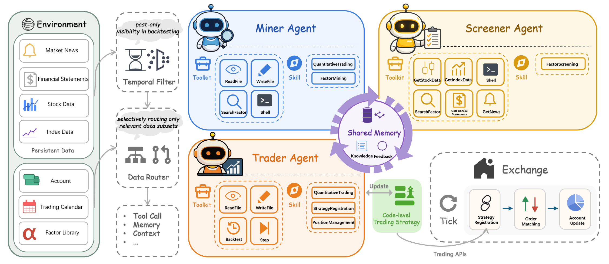
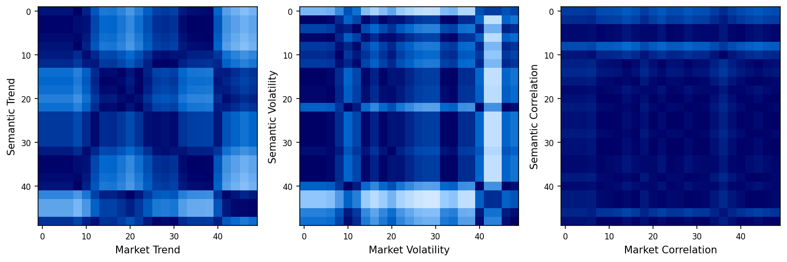

# AlphaCrafter：面向横截面量化交易的全栈多智能体框架

**Yishuo Yuan, Jiayi Sheng, Sirui Zeng, Jiaqi Wang, Jiaheng Liu†**

南京大学

liujiaheng@nju.edu.cn

† 通讯作者。

*arXiv: 2605.05580v1 [q-fin.TR], 2026-05-08*

---

## 亮点

- **Alpha 思想**：将 LLM 驱动的因子发现、依赖于市场状态的因子组合选择以及风险约束下的执行，统一进一个持续自适应的闭环横截面交易系统之中，使信号集合与组合构建能够随市场状态切换而动态重构。
- **数据来源**：日频 OHLCV 量价数据（CSI 300 来自 Baostock，标普 500 来自 Yahoo Finance / `yfinance`）；基本面指标（PE、PS、PB、DYR）、财务报表以及另类数据（财经新闻与公司公告）来自 Lixinger；宏观经济指标（如美联储）来自 Trading Economics。
- **股票池**：CSI 300（中国 A 股）与标普 500（美国）指数成分股。
- **样本区间**：训练 2016.01–2023.01；验证 2023.01–2024.01；回测 2024.01–2026.01；实盘 2026.01–2026.04。
- **核心结论**：是唯一在两个市场、所有阶段都取得持续为正的风险调整收益的方法——CSI 300 回测夏普 1.5322，实盘年化收益 5.70%（夏普 0.7002，最大回撤 −5.31%）；标普 500 实盘年化收益 9.26%（夏普 0.7212，最大回撤 −3.95%）——同时跨试验方差最低。
- **信号构建**：以 IC / ICIR / 换手率 / 衰减特征校验的 LLM 引导因子挖掘；Screener 构建依赖于市场状态的、带权重与方向的因子组合；Trader 在一个参考的多空横截面排序策略上进行超参搜索（总敞口 β = 0.8；净敞口偏置 γ = 1，A 股仅做多；标普 500 取 γ = 0.5）。

---

## 摘要

金融市场本质上是高度非平稳的，其驱动来自宏观经济状态、微观结构摩擦与行为动态之间的复杂交互。要构建能够持续盈利的量化策略，需要将因子发现、依赖状态的自适应选择与风险约束下的执行持续耦合在一起。然而，现有方法大多在静态或相互割裂的假设下优化这些环节。因子挖掘框架通常把 alpha 发现当作一次性搜索过程，隐含地假定因子有效性会跨市场状态持续存在；面向执行的系统往往采用角色扮演式智能体架构，模拟拟人化的交易委员会，引入的是行为噪声而非系统化的理性。因此，一个完全自动化、以理性驱动、统一连贯量化流水线的框架至今仍然缺失。我们提出 **ALPHACRAFTER**，一个全栈多智能体框架，通过一条持续自适应的"从因子到执行"流水线来弥合这一缺口，旨在无需人工干预地追踪并响应不断演进的市场环境。AlphaCrafter 通过三个专门的智能体协同运行：**Miner**（矿工）通过 LLM 引导的搜索持续扩充因子池，**Screener**（筛选器）评估当前市场状况以构建依赖于状态的因子组合，**Trader**（交易员）在显式风险约束下将这些组合转化为量化策略。这三个智能体共同构成了一个能够整体适应市场动态演进的闭环横截面交易系统。在 CSI 300 与标普 500 上的大量实验表明，AlphaCrafter 在风险调整收益上持续优于最先进的基线，同时跨试验方差最低，证实了集成化、自适应的"从因子到执行"设计能够带来稳健的交易表现。

---

## 1 引言

金融市场是一类高维、非线性的动力系统，具有肥尾（Mandelbrot, 1997）、波动率聚集（Engle, 1982）以及复杂的横截面相依性（Diebold and Yılmaz, 2014）等特征。这些性质意味着资产收益由宏观经济状态、微观结构摩擦与行为反馈共同驱动（Brock and Hommes, 1997; 1998; Kahneman and Tversky, 2013）。其一个关键后果是：任何固定信号集的预测内容都会随着市场环境演进而衰减，然而量化投资的主导范式仍是静态模型设定加上周期性的人工重新校准（Cao et al., 2025; Gârleanu and Pedersen, 2013）。

传统量化策略已从经典的因子定价模型（Carhart, 1997; Fama and French, 1993）演进到诸如 XGBoost（Chen and Guestrin, 2016）和 LightGBM（Ke et al., 2017）的机器学习方法，近期又发展到包括 LSTM（Vennerød et al., 2021）和 Transformer 架构（Vaswani et al., 2017）在内的深度序列模型。尽管这些方法预测能力强大，但它们都遵循一种"冻结式"设计哲学：依赖人工设计的特征集、固定的模型架构和手动调参的超参数，在市场结构发生变化时维护成本高昂。

LLM 的出现为自动化该流水线的若干环节开启了新的可能。近期的智能体系统探索了两条不同路径。一条工作线模拟角色扮演式交易委员会——分析师、风险经理、交易员——将多源信息聚合为信号（Xiao et al., 2025; Tian et al., 2025）。然而这类拟人化设计带来较高的推理延迟，并可能引入模拟出来的行为偏差。另一条线专注于代码驱动执行，将策略推理编译为轻量级机器人以实现低延迟部署（Song et al., 2026）。与此同时，以因子为中心的框架利用 LLM 通过迭代搜索与正则化来自动发现 alpha（Wang et al., 2024a; 2025; Li et al., 2025; Tang et al., 2025）。现有方案要么止步于因子生成，要么把发现与部署相互解耦，留下一条割裂的流水线——其中每个阶段都假定一个前序阶段无法影响的静态环境。

我们提出 **ALPHACRAFTER**，一个通过作为持续自适应的横截面交易系统来闭合这一回环的多智能体框架，它能够随市场状态切换而动态重构其信号组合与组合构建。AlphaCrafter 以日频轮换的方式编排三个专门的智能体，每一个都被设计为无需人工干预地响应不断变化的市场环境。**Miner** 通过 LLM 引导的搜索持续扩充候选因子池，防止信号衰减；**Screener** 读取当前市场状态并动态组装一个针对当前状况校准的因子组合；**Trader** 随后在显式的组合构建与风险约束下将该组合转化为量化策略，生成可执行的订单。这一设计构成了一个随市场演进而端到端自适应的"假设—验证—执行"闭环。

我们的核心贡献如下：

- **端到端自适应量化流水线**：AlphaCrafter 是首个将 LLM 驱动的因子发现、对状态敏感的因子选择与风险约束下的执行统一在单一系统中的框架，能够持续适应市场动态，直接针对现有量化工作流的静态割裂问题。
- **依赖于状态的因子组合构建**：我们的 Screener 不依赖固定因子集或单体式 alpha 矿工，而是依据当前市场状态来调节信号构成，使系统无需重新训练或人工校准即可动态调整其信息来源的权重。
- **跨市场的经验稳健性**：在 CSI 300 与标普 500 上的大量评估表明，AlphaCrafter 在风险调整收益上持续优于强基线，同时跨试验方差最低，表明其是可靠的适应而非过拟合产物。

---

## 2 AlphaCrafter

本节中，我们介绍 ALPHACRAFTER，一个面向自主量化交易的多智能体框架。我们对环境进行形式化，定义各智能体策略，并给出整体优化目标。



*图 1：AlphaCrafter 的架构——Miner 扩充 alpha 多样性，Screener 实施对状态敏感的校准，Trader 自适应地优化执行策略。*

### 2.1 环境形式化

交易环境被形式化为如下元组

$$
\mathcal{E} = (\mathcal{M}, \mathcal{Z}, \Pi, \mathcal{T}, \mathcal{J}), \tag{1}
$$

其中 $\mathcal{M}$ 表示市场状态空间，涵盖总体市场状况与个股特征。形式上，$\mathcal{M}$ 包含可交易资产全集 $U \subset \mathcal{M}$，其中 $U$ 是由 $N$ 个个体构成的集合，资产 $i$ 在时刻 $t$ 具有横截面特征 $x_{i,t}$。除个股层面数据外，$\mathcal{M}$ 还包括宏观经济指标、市场指数、波动率曲面、来自新闻与社交媒体的情绪信号，以及刻画更广义市场环境的另类数据源。

$\mathcal{Z}$ 是因子库，一个动态的量化因子仓库，其中每个因子是一个函数 $f: U \to \mathbb{R}^N$，将历史资产观测映射为 $N$ 只资产的横截面信号向量。$\Pi$ 定义了可容许交易策略的空间，由组合构建规则与风险约束参数化。$\mathcal{T} = \{1, 2, \ldots, T\}$ 是离散交易日集合。$\mathcal{J}: \Pi \to \mathbb{R}$ 是量化策略表现的评估泛函，纳入了风险调整收益指标。

所有智能体均可访问一个共享记忆 $H$，它作为跨智能体信息流的中枢通道，累积历史观测、因子验证结果与执行反馈。该公共记忆通过周期性摘要得以持久化：智能体借此传递表现诊断、施加一致性约束，并为下游决策传递条件性指引，使系统能够随市场环境变化而整体自适应地调整行为。

### 2.2 Miner 智能体

Miner 智能体负责自主因子生成、严格验证以及持续的库维护。其策略 $P_M$ 在资产全集 $U$ 上引导一个迭代式的"探索—利用"过程。候选因子被提出、针对历史资产数据评估，并被选择性地整合进因子库 $\mathcal{Z}$。当因子质量与库多样性的内部判据得到满足时，智能体自主终止探索。

Miner 在当前因子库 $\mathcal{Z}_t$ 与资产全集 $U$ 上运作，利用记忆 $H_t$ 避免冗余探索并追踪因子有效性：

$$
A_M(\mathcal{Z}_t, U; H_t) \xrightarrow{P_M} (\mathcal{Z}_{t+1}, H_{t+1}). \tag{2}
$$

策略 $P_M$ 总结于算法 1。它包含一个生成循环，候选因子使用信息系数（IC）、IC 稳定性（信息比率）、换手率与衰减特征等指标加以验证。被接受的因子连同元数据一并持久化，而所有验证结果都记入记忆以指导后续搜索。随后的维护阶段会重新验证既有因子，剔除那些出现显著表现衰减的因子。

**算法 1** Miner 智能体策略 $P_M$

```
输入:  当前因子库 Z_t, 资产全集 U, 记忆 H_t
输出:  更新后的库 Z_{t+1}, 记忆 H_{t+1}

 1.  Z_{t+1} ← Z_t
 2.  repeat
 3.      f ← generate(U, H_t)
 4.      r ← validate(f, U)
 5.      if r 满足接受判据 then
 6.          Z_{t+1} ← Z_{t+1} ∪ {f}
 7.          H_t ← update(H_t, f, r, meta="effective")
 8.      else
 9.          H_t ← update(H_t, f, r, meta="ineffective")
10.      end if
11. until termination_condition_met(Z_{t+1}, H_t)
12. for each f ∈ Z_t do
13.     r′ ← revalidate(f, U)
14.     if r′ 未通过留存判据 then
15.         Z_{t+1} ← Z_{t+1} \ {f}
16.         H_t ← update(H_t, f, r′, meta="deprecated")
17.     end if
18. end for
19. H_{t+1} ← H_t
20. return (Z_{t+1}, H_{t+1})
```

### 2.3 Screener 智能体

Screener 智能体通过对市场状况 $\mathcal{M}$ 的细致研判，将因子库中的信号编织为一个连贯的因子组合 $E_t$。其策略 $P_S$ 通过吸收个股与宽基指数的总体行为，形成对市场状态 $\hat{R}_t$ 的判断，将价格走势、基本面健康度与重大财务披露过滤为对趋势方向、波动率与相关结构的评估。基于这一状态诊断，它随后评估每个因子 $f \in \mathcal{Z}_t$ 的适配度，有选择地组装一个多样化子集，并赋予方向性权重，从而形成一个契合当前市场动态的组合。

Screener 将因子库与市场状态转化为可执行组合及更新后记忆的过程可表示为：

$$
A_S(\mathcal{Z}_t, \mathcal{M}; H_t) \xrightarrow{P_S} ((E_t, \hat{R}_t), H_{t+1}). \tag{3}
$$

算法 2 概述了选择过程。智能体按一个依赖状态的适配度得分对因子排序，通过考虑因子相关性来缓解集中度风险，并输出一个结构化组合。记忆 $H$ 会被组合构成与状态评估所更新，以为下游智能体提供上下文。

**算法 2** Screener 智能体策略 $P_S$

```
输入:  因子库 Z_t, 市场状态 M, 记忆 H_t
输出:  组合 E_t, 状态估计 R̂_t, 记忆 H_{t+1}

 1.  E_t ← ∅ ;  R̂_t ← None
 2.  if |Z_t| < min_factors_required then
 3.      H_{t+1} ← update(H_t, ∅, meta="insufficient_factors")
 4.      return ((∅, None), H_{t+1})
 5.  R̂_t ← assess_regime(M, H_t)
 6.  candidates ← ∅
 7.  for each f ∈ Z_t do
 8.      s ← suitability(f, M, R̂_t, H_t)
 9.      candidates ← candidates ∪ {(f, s)}
10. end for
11. sort candidates by s descending
12. selected ← diversify(candidates)
13. E_t ← ∅
14. for each f ∈ selected do
15.     w_f, d_f ← assign_weight_and_direction(f, s, R̂_t)
16.     E_t ← E_t ∪ {(f, w_f, d_f)}
17. end for
18. H_{t+1} ← update(H_t, E_t, R̂_t)
19. return ((E_t, R̂_t), H_{t+1})
```

### 2.4 Trader 智能体

Trader 智能体通过将因子组合 $E_t$ 与状态评估 $\hat{R}_t$，连同自定的约束与专有逻辑相整合，主动构建交易策略 $\pi_t$，并在资产全集 $U$ 上运作。其策略 $P_T$ 编排一个超参数优化循环，自适应地探索参考策略 $\pi_{ref}$ 的配置 $\Theta$，同时注入辅助规则与敞口约束。智能体通过在历史资产数据上回测来动态评估候选策略，选择最大化某个风险调整目标的配置，并在实盘资产 $i \in U$ 上自主执行由此得到的组合。

Trader 的运作形式化为：

$$
A_T(E_t, \hat{R}_t, U; H_t) \xrightarrow{P_T} (\pi_t, r_t, H_{t+1}), \tag{4}
$$

其中 $r_t$ 是执行 $\pi_t$ 所实现的收益。

算法 3 描述了策略搜索与执行策略。参考策略 $\pi_{ref}$（详见附录 A 的算法 4）提供了一个在资产全集 $U$ 上运作的结构化组合构建机制。具体而言，它通过聚合所生成因子组合中的加权信号为每个资产计算综合得分，随后对资产排序以选出靠前的多头与垫底的空头候选。仓位规模遵循由总敞口 $\beta$ 与净敞口偏置 $\gamma$ 参数化的受控分配方案，再平衡受这些敞口约束支配。Trader 的记忆更新纳入了来自该过程的执行结果，为持续的策略精炼建立了反馈环路。

**算法 3** Trader 智能体策略 $P_T$

```
输入:  组合 E_t, 状态 R̂_t, 全集 U, 记忆 H_t
输出:  策略 π_t, 实现收益 r_t, 记忆 H_{t+1}

 1.  if E_t = ∅ then
 2.      π_t ← None ;  r_t ← 0
 3.      H_{t+1} ← update(H_t, ∅, meta="empty_ensemble_skipped")
 4.      return (None, 0, H_{t+1})
 5.  r_best ← −∞ ;  π_best ← None
 6.  repeat
 7.      π(Θ) ← construct_strategy(π_ref, E_t, R̂_t, H_t)
 8.      r ← backtest(π, U)
 9.      if r > r_best then
10.          r_best ← r ;  π_best ← π
11.          H_t ← update(H_t, π, r, meta="improved")
12.      else
13.          H_t ← update(H_t, π, r, meta="rejected")
14.      end if
15. until exploration_terminated(H_t)
16. π_t ← π_best
17. r_t ← live_trading(π_t, U)
18. H_{t+1} ← update(H_t, π_t, r_t, meta="executed")
19. return (π_t, r_t, H_{t+1})
```

### 2.5 整体系统目标

Miner、Screener 与 Trader 智能体的协同运作构成了一个闭环自适应系统。形式上，在每个决策交易日 $t$，各智能体的复合动作产生一个策略 $\pi_t \in \Pi$。目标是最大化对下一周期所执行策略施加的评估泛函 $\mathcal{J}$：

$$
\max_{\pi_t \in \Pi_t} \mathbb{E}[\mathcal{J}(\pi_t)], \tag{5}
$$

其中 $\Pi_t \subseteq \Pi$ 是给定当前因子库 $\mathcal{Z}_t$、市场状态 $\hat{R}_t$ 与记忆 $H_t$ 下可实现的可容许策略子集。泛函 $\mathcal{J}$ 本质上对回撤与波动率施加惩罚，与在交易区间 $\mathcal{T}$ 内实现稳定资本增值的目标相一致。

---

## 3 实验

### 3.1 实验设置

#### 3.1.1 数据集

我们的实验使用了一个覆盖中国 A 股市场（CSI 300 成分股）与美国股票市场（标普 500 成分股）的综合数据集。原始数据涵盖四类：（1）量价数据，包括日频 OHLCV（开、高、低、收、成交量）；（2）基本面指标，包括市盈率（PE）、市销率（PS）、市净率（PB）与股息率（DYR）；（3）财务报表，包括季度资产负债表、利润表与现金流量表；（4）另类数据，包括财经新闻与公司公告，以及诸如美联储等权威来源。数据集的时间划分详见表 1。关于数据来源与存储格式的详细信息见附录 B.1。

**表 1**：训练、验证、回测与实盘的数据划分

| 市场 | 训练 | 验证 | 回测 | 实盘 |
|------|------|------|------|------|
| CSI 300 | 2016.01–2023.01 (1703) | 2023.01–2024.01 (242) | 2024.01–2026.01 (486) | 2026.01–2026.04 (56) |
| 标普 500 | 2016.01–2023.01 (1763) | 2023.01–2024.01 (250) | 2024.01–2026.01 (502) | 2026.01–2026.04 (61) |

#### 3.1.2 评价指标

我们使用三个标准金融指标评估所有方法。**年化收益（AR）** 度量几何平均年收益，反映绝对盈利能力。**夏普比率（SR）**（Sharpe, 1994）通过将相对于无风险利率的超额收益除以收益波动率来量化风险调整表现。**最大回撤（MDD）** 捕捉评估期内最大的峰值到谷值跌幅，刻画下行风险敞口。在因子层面评估时，我们额外报告 **信息系数（IC）** 与 **信息系数信息比率（ICIR）**（Grinold and Kahn, 1999），其中 IC 度量因子值与远期收益之间的横截面相关性（实验中使用次日远期收益），而 ICIR——由 IC 均值除以其标准差计算——量化预测表现随时间的稳定性。所有评价指标的详细数学形式见附录 B.2。

#### 3.1.3 基线

我们将 AlphaCrafter 与跨越五大类别的代表性方法进行比较：量化方法（MACD（Appel, 1979）与网格交易（Griffin et al., 2003））、机器学习方法（在技术与基本面特征上训练的 LightGBM（Ke et al., 2017）与 XGBoost（Chen and Guestrin, 2016））、深度学习方法（用于时序预测的 LSTM（Vennerød et al., 2021）、Transformer（Vaswani et al., 2017）与 TRA（Lin et al., 2021））、传统交易智能体方法（带基于规则协调的 TradingAgents（Xiao et al., 2025）与 TradingGroup（Tian et al., 2025）），以及量化交易智能体方法（采用 LLM 进行因子生成的 RD-Agent（Li et al., 2025）与 AlphaAgent（Tang et al., 2025））。所有基线实现遵循其原始论文的推荐设置。所有方法在相同的参考策略 $\pi_{ref}$（详见算法 4）上以一致的超参数配置运行。对需要特征预处理的方法，输入数据采用 Z-score 标准化。对基于 LLM 的智能体方法，我们使用三个骨干模型进行实验：GPT 5.3 Codex（OpenAI, 2026）、Claude Opus 4.6（Anthropic, 2026）与 Gemini 3.1 Pro（Google DeepMind, 2026）。最终报告的结果对应于表现最佳的骨干模型。

#### 3.1.4 设置

我们的实验在日频横截面交易框架下进行，组合权重在每个收盘时刻使用日终数据更新。模拟交易所参数被校准至真实市场状况。在该频率下滑点与执行延迟等交易摩擦可忽略不计，正如已有工作所示其影响主要集中在高频场景（Isaenko, 2023; Kearns et al., 2010）。对基于 LLM 的智能体方法，每个配置在 10 次独立试验上评估；报告指标在落在四分位距内的试验上取平均，以减轻离群点影响。为消除 LLM 记忆与已知市场 beta 趋势（Kong et al., 2026）带来的混淆效应，我们不仅进行标准回测，还专门设立实盘阶段，其评估窗口严格落在所有骨干模型训练数据截止点之后。详尽的实验细节留待附录 B.3，对交易摩擦可忽略的定量论证见附录 B.4。

### 3.2 主结果

表 2 报告了所有评估方法在 CSI 300 与标普 500 市场上的回测与实盘表现。每列最优值以深绿标出，第二、三名以浅绿标出，最差以深橙标出，第二、三差以浅橙标出。

结果揭示了所有基线在回测前景与实盘稳健性之间的鲜明反差，暴露出 AlphaCrafter 始终能够克服的根本局限。传统策略表现出强烈的依赖状态特性：网格交易在标普 500 回测中取得 20.68% 的年化收益，却在实盘中崩跌至 −28.22% 的亏损；而 MACD 在 CSI 300 回测中取得 20.35% 的年化收益，但在 CSI 300 实盘中遭受灾难性亏损（年化 −38.69%，夏普 −2.5527）。深度学习模型尽管回测结果强劲却严重过拟合——LSTM 在 CSI 300（22.93%）与标普 500（18.26%）均取得最高回测年化收益，却在两个市场都未能产生正的实盘收益。机器学习方法存在类似脆弱性，XGBoost 在 CSI 300 取得 1.3431 的回测夏普，随后在实盘中录得 −20.40% 的年化收益。基于 LLM 的智能体（TradingAgents、TradingGroup）在实盘条件下也明显退化，表明其决策流水线中可能存在前视或记忆偏差。

相比之下，AlphaCrafter 是唯一在所有阶段与所有市场都提供持续为正的风险调整收益的方法。在 CSI 300 上，它取得 1.5322 的回测夏普，并在实盘维持 5.70% 的年化收益，夏普 0.7002，回撤温和为 −5.31%。在标普 500 上，它在回测（−7.86%）与实盘（−3.95%）中都录得较低回撤，实盘年化收益 9.26%，夏普 0.7212。这种在所有基线中独一无二缺失的双重市场稳健性，表明 AlphaCrafter 能够同时缓解状态敏感性与过拟合。附录 C 的详细案例研究考察了 AlphaCrafter 各组件的贡献，展示了各个模块如何共同带来其表现优势。

**表 2**：CSI 300 与标普 500 上回测与实盘表现对比

| 方法 | 回测 CSI 300 AR(%) | 回测 CSI 300 SR | 回测 CSI 300 MDD(%) | 回测标普 500 AR(%) | 回测标普 500 SR | 回测标普 500 MDD(%) | 实盘 CSI 300 AR(%) | 实盘 CSI 300 SR | 实盘 CSI 300 MDD(%) | 实盘标普 500 AR(%) | 实盘标普 500 SR | 实盘标普 500 MDD(%) |
|------|------------------:|---------------:|-------------------:|------------------:|---------------:|-------------------:|------------------:|---------------:|-------------------:|------------------:|---------------:|-------------------:|
| MACD | 20.35 | 0.8537 | −17.53 | 2.49 | −0.0903 | −21.17 | −38.69 | −2.5527 | −11.75 | 0.76 | −0.2509 | −6.47 |
| Grid Trading | −4.89 | −0.3291 | −18.85 | 20.68 | 0.8068 | −24.21 | −13.90 | −0.7602 | −10.92 | −28.22 | −1.8501 | −11.70 |
| LightGBM | 16.13 | 1.1149 | −10.20 | 4.14 | 0.1142 | −15.67 | 0.64 | −0.1190 | −4.73 | 6.99 | 0.6550 | −4.01 |
| XGBoost | 17.26 | 1.3431 | −7.81 | 3.08 | −0.1625 | −4.63 | −20.40 | −1.7709 | −6.15 | −0.65 | −0.3415 | −1.35 |
| LSTM | 22.93 | 1.6079 | −8.98 | 18.26 | 1.6202 | −8.11 | −7.74 | −0.5219 | −7.86 | −5.52 | −0.7065 | −4.91 |
| Transformer | 13.23 | 1.1817 | −8.62 | 6.77 | 0.2272 | −12.11 | −5.22 | −0.4338 | −6.20 | −4.31 | −0.4982 | −4.15 |
| TRA | 17.22 | 1.1431 | −9.23 | 8.42 | 0.8182 | −9.05 | 4.51 | 0.3128 | −5.48 | −2.47 | −0.4026 | −4.10 |
| TradingAgents (Gemini) | 16.76 | 1.2801 | −11.06 | 10.64 | 0.8929 | −10.80 | −4.72 | −0.3021 | −9.52 | 1.11 | −0.2506 | −6.67 |
| TradingGroup (Claude) | 15.55 | 1.2368 | −12.68 | 10.58 | 0.8313 | −11.26 | −0.52 | −0.2998 | −8.81 | 4.32 | 0.1786 | −5.31 |
| RD-Agent (Claude) | 16.48 | 1.3235 | −10.14 | 11.48 | 1.0320 | −9.54 | 0.41 | −0.1695 | −8.03 | 8.52 | 0.6213 | −4.96 |
| AlphaAgent (GPT) | 18.92 | 1.4922 | −10.36 | 12.39 | 1.0438 | −10.81 | −1.16 | −0.2842 | −7.96 | 7.11 | 0.5872 | −4.55 |
| **AlphaCrafter (Claude)** | **18.27** | **1.5322** | **−8.40** | **12.79** | **1.2025** | **−7.86** | **5.70** | **0.7002** | **−5.31** | **9.26** | **0.7212** | **−3.95** |

*注：回测 = Backtesting。各列最优值对 AlphaCrafter 加粗——它是唯一在两个市场实盘风险调整收益均持续为正的方法。*

### 3.3 稳定性研究

#### 3.3.1 整体表现稳定性

为评估智能体交易方法在随机扰动下的可靠性，我们对每种方法进行 10 次独立试验并考察实现收益的分布。图 2 报告了 CSI 300 与标普 500 市场上的跨试验表现分布。

*图 2：智能体方法在回测中跨独立试验的表现分布（年化收益的箱线图，含 IQR / 中位数 / 均值）。(a) CSI 300 市场。(b) 标普 500 市场。*

如图 2 所示，AlphaCrafter 在两个市场上都持续取得稳健的收益分布。在 CSI 300 上，它表现出狭窄的四分位距与稳定的中位数，表明对初始化与环境随机性的低敏感性。这一模式推广到标普 500 市场，AlphaCrafter 维持了可比的中心趋势与离散度特征。相比之下，若干基线智能体方法在某些试验中表现出更宽的方差或显著的负向离群点。这些结果证实 AlphaCrafter 在重复独立评估下提供了可靠且可复现的表现，这是实盘交易环境中实际部署所期望的性质。

#### 3.3.2 模型稳定性

为评估 AlphaCrafter 对底层大语言模型选择的稳健性，我们评估其在三个骨干模型下的回测表现。图 3 以雷达图比较了 CSI 300 与标普 500 市场上这些配置的关键风险调整指标。对 IC 与 ICIR，报告值为统计纳入实验中回测期内所发现全部有效因子的均值。

*图 3：以不同骨干 LLM（GPT 5.3 Codex、Claude Opus 4.6、Gemini 3.1 Pro）实例化的 AlphaCrafter 的回测表现对比。雷达轴含 AR ≥ 20%、SR ≥ 1.0、MDD ≤ 15%、IC ≥ 0.03、ICIR ≥ 0.30。(a) CSI 300 市场。(b) 标普 500 市场。*

如图 3 所示，AlphaCrafter 在两个市场的所有三个骨干模型上都表现出持续稳定的表现画像，证实所提框架对底层 LLM 的具体选择基本不敏感。雷达图保持大体对齐，仅在个别指标维度上观察到细微差异。值得注意的是，Claude Opus 4.6 骨干在 CSI 300 与标普 500 两个市场都展现出稳健的因子挖掘能力，加之 proficient 的代码级策略实现，使其总体画像相对 GPT 与 Gemini 变体略优。这一稳定性模式还从 CSI 300 无缝推广到标普 500 市场，凸显了 AlphaCrafter 的模型无关设计及其在不同市场状态间的可靠可迁移性。

### 3.4 Alpha 衰减分析

为评估因子有效性的时间稳定性，我们在 2024 年 1 月至 2026 年 1 月的四个连续半年度区间上开展 alpha 衰减分析。我们报告基于智能体的因子挖掘方法（RD-Agent、AlphaAgent 与 AlphaCrafter）的 IC 均值、最大值与最小值，以及两个基于 Alpha158 的基线（Yang et al., 2020）：global top20（在整个回测区间保留 20 个最优因子）与 periodic top20（在每个半年度区间内动态重选前 20 个因子）。对 AlphaCrafter，我们动态追踪保留在因子库 $\mathcal{Z}_t$ 中的有效因子，反映系统的自适应策展过程。

*图 4：不同方法在各时段（2024.1、2024.6、2025.1、2025.6、2026.1）IC 对比，含最大/最小 IC 边界。(a) CSI 300 市场。(b) 标普 500 市场。*

如图 4 所示，两个 Alpha158 基线表现出截然相反的行为：periodic top20 通过频繁刷新在两个市场都维持持续较高的 IC，而 global top20 则剧烈波动，IC 值大幅起伏甚至转负，证实静态因子集极易受市场状态切换影响。在基于智能体的方法中，RD-Agent、AlphaAgent 与 AlphaCrafter 三者在约 0.015–0.025 的带内维持稳定 IC，其中 AlphaCrafter 在较后评估窗口的衰减最小。这些结果共同表明，无论是通过周期性重选还是自适应库维护的动态因子策展，对缓解 alpha 衰减、在演进市场中保持稳健预测能力都是必不可少的。

### 3.5 消融实验

为量化每个智能体的边际贡献，我们通过选择性地用非自适应替代方案替换单个组件，开展了三项消融实验：（1）**w/o Miner** 用静态 Alpha158 因子集（Yang et al., 2020）替换 Miner 策略 $P_M$；（2）**w/o Screener** 用均匀随机抽样与等权替换 Screener 策略 $P_S$；（3）**w/o Trader** 用固定参考策略 $\pi_{ref}$ 替换 Trader 策略 $P_T$。所有实验均使用 Claude Opus 4.6 作为骨干模型。

**表 3**：消融实验——CSI 300 与标普 500 上的回测表现

| 方法 | CSI 300 AR(%) ↑ | CSI 300 SR ↑ | CSI 300 MDD(%) ↑ | CSI 300 AR Std ↓ | 标普 500 AR(%) ↑ | 标普 500 SR ↑ | 标普 500 MDD(%) ↑ | 标普 500 AR Std ↓ |
|------|----------------:|-------------:|-----------------:|-----------------:|----------------:|-------------:|-----------------:|-----------------:|
| w/o Miner | 17.64 | 1.4515 | −9.22 | 3.63 | 12.01 | 1.1532 | −8.60 | 4.02 |
| w/o Screener | 16.47 | 1.2858 | −12.01 | 3.56 | 9.73 | 0.9247 | −10.08 | 3.72 |
| w/o Trader | 15.01 | 1.1984 | −11.85 | 3.85 | 10.12 | 0.8923 | −9.15 | 3.64 |
| **完整模型（AlphaCrafter）** | **18.27** | **1.5322** | **−8.40** | **3.16** | **12.79** | **1.2025** | **−7.86** | **3.01** |

表 3 报告了结果。移除任何组件都会在所有指标上降低表现，证实每个智能体都有实质性贡献。w/o Miner 变体在 CSI 300 与标普 500 上的 AR 均下降，凸显了 LLM 驱动因子生成的价值。w/o Screener 变体导致 MDD 增幅最大，突显 Screener 在风险缓释中的关键作用。w/o Trader 变体的夏普比率最低，表明自适应执行对风险调整收益至关重要。完整模型在两个股票池上都持续取得最高的 AR、夏普比率与最低的波动率。

---

## 4 相关工作

### 4.1 LLM 驱动的智能体系统

LLM 的近期进展催生了面向自主推理与决策的智能体系统。这些系统从预定义工作流（Zhuge et al., 2025; Xi et al., 2023）到完全自主智能体（Wang et al., 2024b; Zhang et al., 2024a; Hong et al., 2024）不等。一条日益增长的研究线关注通过基于技能的框架来标准化智能体行为，其中智能体能力被视为可组合、可验证、可创建、可评估并动态连接的技能（Liang et al., 2026; Xu and Yan, 2026; Li et al., 2026）。我们的 AlphaCrafter 与领域特定的智能体工作流一致，同时纳入了专门智能体间的层次化协调。

### 4.2 面向金融交易的 LLM

LLM 已日益应用于金融，如 FinGPT（Yang et al., 2025）与 FinLlama（Konstantinidis et al., 2024）等早期领域特定模型在金融任务上表现出色。然而这些模型依赖静态训练数据，缺乏实时市场经验，限制了其优化实盘交易的能力。面向金融交易方面，现有智能体架构包括新闻驱动（Zhang et al., 2024b; Wang et al., 2024c; Yu et al., 2023）、反思驱动（Xing, 2025; Zhang et al., 2024c; Yu et al., 2024; Xiao et al., 2025; Tian et al., 2025）与因子优化框架（Li et al., 2025; Tang et al., 2025）。虽然已有工作探索用于因子挖掘的多智能体协作，但多数系统仍是割裂的——将因子发现与自适应执行相分离。AlphaCrafter 通过在一个内聚的多智能体框架内统一因子生成、依赖状态的选择与自适应交易来弥合这一鸿沟。

---

## 5 结论

本文中，我们提出了 ALPHACRAFTER，一个全栈自主多智能体框架，通过将横截面因子发现、依赖状态的组合选择与自适应执行统一在单一闭环系统中，来解决量化交易中的割裂问题。通过三个专门智能体——负责因子生成的 Miner、负责依赖状态选择的 Screener、以及负责风险约束执行的 Trader——的协同运作，AlphaCrafter 实现了无需人工重新调参的持续"假设—验证—执行"精炼。在 CSI 300 与标普 500 上的大量经验评估表明，AlphaCrafter 在风险调整收益上持续优于最先进基线，同时在独立试验间表现出最低的表现方差，证实了集成的因子发现与自适应执行能够在多样化的市场环境中带来稳健的交易表现。

---

## 参考文献

- Benoit B. Mandelbrot. *The variation of certain speculative prices*, pages 371–418. Springer New York, New York, NY, 1997. ISBN 978-1-4757-2763-0. doi: 10.1007/978-1-4757-2763-0_14.
- Robert F. Engle. Autoregressive conditional heteroscedasticity with estimates of the variance of united kingdom inflation. *Econometrica*, 50(4):987–1007, 1982.
- Francis X. Diebold and Kamil Yılmaz. On the network topology of variance decompositions: Measuring the connectedness of financial firms. *Journal of Econometrics*, 182(1):119–134, 2014.
- William A. Brock and Cars H. Hommes. A rational route to randomness. *Econometrica*, 65(5):1059–1095, 1997.
- William A. Brock and Cars H. Hommes. Heterogeneous beliefs and routes to chaos in a simple asset pricing model. *Journal of Economic Dynamics and Control*, 22(8):1235–1274, 1998.
- Daniel Kahneman and Amos Tversky. Prospect Theory: An Analysis of Decision Under Risk, chapter 6, pages 99–127. World Scientific, 2013. doi: 10.1142/9789814417358_0006.
- Bokai Cao, Saizhuo Wang, Xinyi Lin, Xiaojun Wu, Haohan Zhang, Lionel M. Ni, and Jian Guo. From deep learning to LLMs: A survey of AI in quantitative investment, 2025. arXiv:2503.21422.
- Nicolae Gârleanu and Lasse Heje Pedersen. Dynamic trading with predictable returns and transaction costs. *The Journal of Finance*, 68(6):2309–2340, 2013.
- Mark M. Carhart. On persistence in mutual fund performance. *The Journal of Finance*, 52(1):57–82, 1997.
- Eugene F. Fama and Kenneth R. French. Common risk factors in the returns on stocks and bonds. *Journal of Financial Economics*, 33(1):3–56, 1993.
- Tianqi Chen and Carlos Guestrin. XGBoost: A scalable tree boosting system. *CoRR*, abs/1603.02754, 2016.
- Guolin Ke, Qi Meng, Thomas Finley, Taifeng Wang, Wei Chen, Weidong Ma, Qiwei Ye, and Tie-Yan Liu. LightGBM: A highly efficient gradient boosting decision tree. In *Proceedings of the 31st International Conference on Neural Information Processing Systems (NIPS'17)*, pages 3149–3157, 2017.
- Christian Bakke Vennerød, Adrian Kjærran, and Erling Stray Bugge. Long short-term memory RNN. *CoRR*, abs/2105.06756, 2021.
- Ashish Vaswani, Noam Shazeer, Niki Parmar, Jakob Uszkoreit, Llion Jones, Aidan N. Gomez, Lukasz Kaiser, and Illia Polosukhin. Attention is all you need. *CoRR*, abs/1706.03762, 2017.
- Yijia Xiao, Edward Sun, Di Luo, and Wei Wang. TradingAgents: Multi-agent LLM financial trading framework, 2025. arXiv:2412.20138.
- Feng Tian, Flora D. Salim, and Hao Xue. TradingGroup: A multi-agent trading system with self-reflection and data-synthesis, 2025. arXiv:2508.17565.
- Zifan Song, Kaitao Song, Guosheng Hu, Ding Qi, Junyao Gao, Xiaohua Wang, Dongsheng Li, and Cairong Zhao. Trade in minutes! Rationality-driven agentic system for quantitative financial trading, 2026. arXiv:2510.04787.
- Saizhuo Wang, Hang Yuan, Lionel M. Ni, and Jian Guo. QuantAgent: Seeking holy grail in trading by self-improving large language model, 2024a. arXiv:2402.03755.
- Saizhuo Wang, Hang Yuan, Leon Zhou, Lionel M. Ni, Heung-Yeung Shum, and Jian Guo. Alpha-GPT: Human-AI interactive alpha mining for quantitative investment, 2025. arXiv:2308.00016.
- Yuante Li, Xu Yang, Xiao Yang, Minrui Xu, Xisen Wang, Weiqing Liu, and Jiang Bian. R&D-Agent-Quant: A multi-agent framework for data-centric factors and model joint optimization, 2025. arXiv:2505.15155.
- Ziyi Tang, Zechuan Chen, Jiarui Yang, Jiayao Mai, Yongsen Zheng, Keze Wang, Jinrui Chen, and Liang Lin. AlphaAgent: LLM-driven alpha mining with regularized exploration to counteract alpha decay, 2025. arXiv:2502.16789.
- William F. Sharpe. The Sharpe ratio. *The Journal of Portfolio Management*, 21(1):49–58, 1994.
- Richard C. Grinold and Ronald N. Kahn. *Active Portfolio Management: A Quantitative Approach for Producing Superior Returns and Controlling Risk*. McGraw-Hill, New York, 2nd edition, 1999.
- Gerald Appel. *The Moving Average Convergence-Divergence Trading Method*. Signalert Corporation, Great Neck, NY, 1979.
- John M. Griffin, Jeffrey H. Harris, and Selim Topaloglu. The dynamics of institutional and individual trading. *The Journal of Finance*, 58(6):2285–2320, 2003.
- Hengxu Lin, Dong Zhou, Weiqing Liu, and Jiang Bian. Learning multiple stock trading patterns with temporal routing adaptor and optimal transport. In *Proceedings of the 27th ACM SIGKDD Conference on Knowledge Discovery and Data Mining*, pages 1017–1026, 2021.
- OpenAI. Introducing GPT-5.3-Codex. https://openai.com/index/introducing-gpt-5-3-codex/, February 2026. Accessed: 2026-04-27.
- Anthropic. Introducing Claude Opus 4.6. https://www.anthropic.com/news/claude-opus-4-6, February 2026. Accessed: 2026-04-27.
- Google DeepMind. Gemini 3.1 Pro model card. https://deepmind.google/models/model-cards/gemini-3-1-pro/, February 2026. Accessed: 2026-04-27.
- Sergey Isaenko. Transaction costs, frequent trading, and stock prices. *Journal of Financial Markets*, 64:100775, 2023.
- Michael Kearns, Alex Kulesza, and Yuriy Nevmyvaka. Empirical limitations on high frequency trading profitability, 2010. arXiv:1007.2593.
- Yaxuan Kong, Hoyoung Lee, Yoontae Hwang, Alejandro Lopez-Lira, Bradford Levy, Dhagash Mehta, Qingsong Wen, Chanyeol Choi, Yongjae Lee, and Stefan Zohren. Evaluating LLMs in finance requires explicit bias consideration, 2026. arXiv:2602.14233.
- Xiao Yang, Weiqing Liu, Dong Zhou, Jiang Bian, and Tie-Yan Liu. Qlib: An AI-oriented quantitative investment platform. arXiv:2009.11189, 2020.
- Mingchen Zhuge, Haozhe Liu, Francesco Faccio, et al. Mindstorms in natural language-based societies of mind. *Computational Visual Media*, 11(1):29–81, 2025.
- Zhiheng Xi, Wenxiang Chen, Xin Guo, et al. The rise and potential of large language model based agents: A survey, 2023. arXiv:2309.07864.
- Lei Wang, Chen Ma, Xueyang Feng, et al. A survey on large language model based autonomous agents. *Frontiers of Computer Science*, 18(6), 2024b.
- Jiayi Zhang, Chuang Zhao, Yihan Zhao, et al. MobileExperts: A dynamic tool-enabled agent team in mobile devices, 2024a. arXiv:2407.03913.
- Sirui Hong, Yizhang Lin, Bang Liu, et al. Data Interpreter: An LLM agent for data science, 2024. arXiv:2402.18679.
- Yuan Liang, Ruobin Zhong, Haoming Xu, et al. SkillNet: Create, evaluate, and connect AI skills, 2026. arXiv:2603.04448.
- Renjun Xu and Yang Yan. Agent skills for large language models: Architecture, acquisition, security, and the path forward, 2026. arXiv:2602.12430.
- Xiangyi Li, Wenbo Chen, Yimin Liu, et al. SkillsBench: Benchmarking how well agent skills work across diverse tasks, 2026. arXiv:2602.12670.
- Hongyang Yang, Xiao-Yang Liu, and Christina Dan Wang. FinGPT: Open-source financial large language models, 2025. arXiv:2306.06031.
- Thanos Konstantinidis, Giorgos Iacovides, Mingxue Xu, Tony G. Constantinides, and Danilo Mandic. FinLlama: Financial sentiment classification for algorithmic trading applications, 2024. arXiv:2403.12285.
- Haohan Zhang, Fengrui Hua, Chengjin Xu, Hao Kong, Ruiting Zuo, and Jian Guo. Unveiling the potential of sentiment: Can large language models predict Chinese stock price movements?, 2024b. arXiv:2306.14222.
- Meiyun Wang, Kiyoshi Izumi, and Hiroki Sakaji. LLMfactor: Extracting profitable factors through prompts for explainable stock movement prediction, 2024c. arXiv:2406.10811.
- Yangyang Yu, Haohang Li, Zhi Chen, et al. FinMem: A performance-enhanced LLM trading agent with layered memory and character design, 2023. arXiv:2311.13743.
- Frank Xing. Designing heterogeneous LLM agents for financial sentiment analysis. *ACM Transactions on Management Information Systems*, 16(1):1–24, 2025.
- Chong Zhang, Xinyi Liu, et al. When AI meets finance (StockAgent): Large language model-based stock trading in simulated real-world environments, 2024c. arXiv:2407.18957.
- Yangyang Yu, Zhiyuan Yao, Haohang Li, et al. FinCon: A synthesized LLM multi-agent system with conceptual verbal reinforcement for enhanced financial decision making, 2024. arXiv:2407.06567.
- BaoStock. BaoStock: Free China stock market data via Python API. https://www.baostock.com/, 2026. Accessed: 2026-04-01.
- Ran Aroussi. yfinance: Download market data from Yahoo! Finance's API. https://pypi.org/project/yfinance/, 2026. Accessed: 2026-04-01.
- Lixinger. Lixinger: Data center for rational investors. https://www.lixinger.com/, 2026. Accessed: 2026-04-01.
- Trading Economics. Trading Economics | 20 million indicators from 196 countries, 2026. https://tradingeconomics.com. Accessed: 2026-04-25.
- Microsoft Qlib Contributors. Qlib documentation: Data layer and Alpha158 data handler. https://qlib.readthedocs.io/en/v0.6.2/component/data.html, 2026. Accessed: 2026-04-27.
- Meta. Llama: Open and efficient foundation language models. https://www.llama.com/, 2026. Accessed: 2026-04-25.
- DeepSeek. DeepSeek: Advancing state-of-the-art open-source language models. https://www.deepseek.com/, 2026. Accessed: 2026-04-25.

---

## 附录 A 参考策略

算法 4 定义了固定的参考策略 $\pi_{ref}$，作为 Trader 智能体的非自适应基线。给定来自组合 $E_t$ 的一组因子信号，它通过因子值的加权组合为每个资产计算综合得分 $\phi_{i,t}$。随后资产按此得分排序，靠前的 $N_{long}$ 名被选为多头，垫底的 $N_{short}$ 名被选为空头。仓位规模由总敞口参数 $\beta$ 与净敞口偏置 $\gamma$ 决定，后者控制多空平衡（例如 $\gamma = 1$ 给出纯多头组合）。该策略提交订单以将持仓从前一期的状态调整至所计算的目标权重。

**算法 4** 参考策略 $\pi_{ref}$

```
超参数: Θ = (N_long, N_short, β, γ)
    N_long, N_short: 多头/空头持仓数量
    β: 总敞口; γ ∈ [−1, 1]: 净敞口偏置 (γ = 1 用于纯多头市场)

 1.  for each asset i ∈ U do
 2.      ϕ_{i,t} ← Σ_{j=1}^{|E_t|} w_j · d_j · f_j(x_{i,t})
 3.  end for
 4.  sort U by ϕ_{i,t} descending
 5.  I_long ← 前 N_long 个资产 ;  I_short ← 后 N_short 个资产
 6.  for each i ∈ {i | h_{i,t−1} ≠ 0} do              // 清算不再在名单中的持仓
 7.      if i ∉ I_long ∪ I_short then
 8.          submit_order(i, −h_{i,t−1})
 9.      end if
10.  end for
11.  V_long  ← β · NAV_t · (1 + γ) / 2
12.  V_short ← β · NAV_t · (1 − γ) / 2
13.  for each i ∈ I_long do
14.      h^{target}_{i,t} ← V_long  / (N_long  · P_{i,t})
15.  end for
16.  for each i ∈ I_short do
17.      h^{target}_{i,t} ← −V_short / (N_short · P_{i,t})
18.  end for
19.  for each i ∈ I_long ∪ I_short do
20.      submit_order(i, h^{target}_{i,t} − h_{i,t−1})
21.  end for
```

---

## 附录 B 实验细节

### B.1 数据集细节

#### B.1.1 数据来源

CSI 300 成分股的日频 OHLCV 数据来自 Baostock（BaoStock, 2026）。标普 500 成分股的日频量价数据来自 Yahoo Finance（Aroussi, 2026）。基本面指标（PE、PS、PB、DYR）、财务报表数据（季度资产负债表、利润表、现金流量表）以及另类数据（财经新闻与公司公告）来自 Lixinger（Lixinger, 2026）。

#### B.1.2 数据存储格式

数据以如下格式存储：

- **日频 OHLCV 数据**：以 CSV 格式存储，每行对应一个交易日，列表示开、高、低、收、成交量。
- **基本面指标**：以 CSV 格式存储，每行对应某资产的一个交易日，列表示 PE、PS、PB 与 DYR。
- **财务报表**：以 JSON 格式存储，按资产代码与报告季度分层组织。每个 JSON 对象包含资产负债表、利润表与现金流量表项目的标准化字段。
- **另类数据（新闻与公告）**：以 JSON 格式存储，每条记录包含发布时间戳、资产代码、标题、正文以及（如有）情绪元数据。

### B.2 指标细节

我们给出评价指标的数学形式。

**年化收益（AR）。** 给定评估期 $T$ 个交易日上的日组合价值序列 $V_0, V_1, \ldots, V_T$，总收益为 $R_{total} = \frac{V_T - V_0}{V_0}$。年化收益计算为：

$$
AR = (1 + R_{total})^{D/T} - 1, \tag{6}
$$

其中 $D$ 表示每个日历年的交易日数，CSI 300（中国 A 股市场）取 $D = 243$，标普 500（美国股票市场）取 $D = 252$。

**夏普比率（SR）。** 令 $r_t = \frac{V_t - V_{t-1}}{V_{t-1}}$ 为第 $t$ 日的日组合收益。夏普比率定义为：

$$
SR = \sqrt{D} \cdot \frac{\frac{1}{T}\sum_{t=1}^{T}(r_t - r_f)}{\sqrt{\frac{1}{T-1}\sum_{t=1}^{T}(r_t - \bar{r})^2}}, \tag{7}
$$

其中 $D$ 为每年的交易日数，$r_f$ 为日无风险利率。沿用惯例，我们将中国市场（CSI 300）的年化无风险利率设为 1.25%，美国市场（标普 500）设为 3.81%，基于 2 年期国债收益率。来源：Trading Economics（Trading Economics, 2026）。

**最大回撤（MDD）。** 令 $V_t$ 为时刻 $t$ 的组合价值。最大回撤是评估期内最大的峰值到谷值跌幅：

$$
MDD = \min_{t \in [0,T]} \frac{V_t - \max_{s \in [0,t]} V_s}{\max_{s \in [0,t]} V_s}. \tag{8}
$$

**信息系数（IC）。** 对给定因子与时刻 $t$ 的 $N$ 只资产，令 $f_t \in \mathbb{R}^N$ 为因子值向量，$r_{t+1} \in \mathbb{R}^N$ 为次日远期收益向量。时刻 $t$ 的 IC 为 Pearson 相关系数：

$$
IC_t = \frac{\mathrm{Cov}(f_t, r_{t+1})}{\sigma_{f_t}\, \sigma_{r_{t+1}}}. \tag{9}
$$

**信息系数信息比率（ICIR）。** 给定 IC 时间序列 $IC_1, \ldots, IC_T$，ICIR 定义为：

$$
ICIR = \frac{\overline{IC}}{\sigma_{IC}}, \tag{10}
$$

其中 $\overline{IC} = \frac{1}{T}\sum_{t=1}^{T} IC_t$ 为 IC 均值，$\sigma_{IC} = \sqrt{\frac{1}{T-1}\sum_{t=1}^{T}(IC_t - \overline{IC})^2}$ 为 IC 标准差。

### B.3 仿真设置

为确保真实的回测与实盘评估，我们实现了分别遵循中国 A 股市场（CSI 300）与美国股票市场（标普 500）不同交易规则的市场专属交易所模拟器。两个模拟器都处理订单撮合、账户管理与数据持久化，其主要差异概述如下。

**CSI 300 交易所（A 股市场）。** A 股市场模拟器执行 T+1 结算规则，禁止在买入当日卖出。此外，在面向散户的回测环境中通常不允许卖空。因此，交易所将所有仓位变动限制为仅做多操作。佣金率设为每笔 0.02%（2 个基点），反映中国市场的典型券商费用。

**标普 500 交易所（美国市场）。** 美国市场模拟器在日内交易下按 T+0 结算（日度再平衡被视为瞬时），并完全支持卖空。对空头持仓，执行 20% 持仓价值的初始保证金要求，80% 的维持保证金确保权益足以覆盖潜在不利价格变动。佣金率设为每笔 0.01%（1 个基点），与美国市场盛行的低成本券商结构一致。

**与参考策略的集成。** 市场专属约束自然地与参考策略 $\pi_{ref}$（算法 4）集成。超参数 $\gamma \in [-1, 1]$ 控制净敞口偏置。对禁止卖空的 CSI 300，我们设 $\gamma = 1$，即将所有风险资金配置到多头。对容纳多空组合的标普 500，我们设 $\gamma = 0.5$，在允许部分资金用于空头的同时维持净多头偏置。在两个市场中，总敞口参数统一设为 $\beta = 0.8$，确保策略使用 80% 的净资产价值进行仓位规模确定，留出 20% 的现金缓冲用于风险管理与保证金需求。

### B.4 交易摩擦可忽略的定量论证

我们提供一个定量的数量级分析，以评估在我们的日频再平衡框架下换手率与滑点是否会引入实质性的摩擦成本。论证通过对日换手率与相对组合净资产价值（NAV）的聚合滑点成本同时进行界定来进行，依据是超参数设置与跨实验轨道观察到的经验交易统计。

#### B.4.1 换手率分析

在参考策略 $\pi_{ref}$（算法 4）下，总敞口参数设为 $\beta = 0.8$，意味着每次再平衡时 80% 的 NAV 用于持仓，剩余 20% 作为现金缓冲。净敞口偏置 $\gamma$ 对 CSI 300 市场（仅做多）配置为 $\gamma = 1$，对标普 500 市场（多空）配置为 $\gamma = 0.5$。这些超参数对总仓位率施加了结构性约束，使其在整个再平衡过程中稳定在规定的敞口水平附近。因此，相邻再平衡日之间重新调配的最大资金被可进入或退出的仓位总价值所界定，不可能超过目标总敞口的一个较小倍数。

经验上，跨所有回测轨道，日换手率 $\tau_t$——定义为总绝对执行订单价值除以前一日 NAV——保持良好受控。一个保守的上界为

$$
\tau_t \le 1.0, \tag{11}
$$

代表组合在单日内完全清算并重新投资全部部署资本的极端情形。实践中日换手率远低于这一上界。相当一部分调整会彼此部分抵消——例如在同一腿中减仓一只同时加仓另一只——因此重新调配的净资金远小于各仓位变动的毛和。此外，策略以日频再平衡，但基于缓慢变化的因子信号选择持仓，这一设计自然抑制了过度换手。这一水平的换手是否会引入统计显著的摩擦成本，留待下一小节与滑点联合评估。

#### B.4.2 滑点分析

滑点捕捉决策时刻信号价（日终收盘价）与接近收盘时实际执行价之间的偏差。对 CSI 300 与标普 500 成分股，股价通常在 10 到 100 的本币单位区间（CSI 300 为人民币，标普 500 为美元），最小报价单位统一为 $\delta = 0.1$。鉴于交易股票池由大盘高流动性股票构成，且仓位调整分布细粒度化，在正常市场深度条件下单笔交易的价格冲击预计有限。单笔执行价偏差可被一个最小报价单位界定，即 $|\Delta P_i| \le 0.1$，转化为相对滑点上界

$$
\frac{|\Delta P_i|}{P_i} \le \frac{0.1}{10} = 1.0\% \;\;(\text{最坏情形}), \tag{12}
$$

典型值约为 $0.1/50 = 0.2\%$，其中参考价 50 作为观测价格区间的代表性中点，并随实际执行价格水平而变化。

为评估聚合影响，令 $V_{total} = \tau_t \cdot NAV$ 为日总成交额，$N$ 为日内仓位调整次数。在单笔执行误差跨交易零均值且独立的假设下，日聚合滑点成本 $S_t$ 满足

$$
\mathbb{E}[S_t] = 0, \qquad \mathrm{Var}(S_t) = \sum_{i=1}^{N}\left(\frac{|\Delta P_i|}{P_i}\right)^2 \cdot v_i \le N \cdot \left(0.2\% \cdot \frac{V_{total}}{N}\right)^2 = \frac{(0.2\%)^2 \cdot V_{total}^2}{N}, \tag{13}
$$

其中 $v_i$ 为第 $i$ 次调整的成交额。将标准差表示为 NAV 的分数得到

$$
\frac{\sqrt{\mathrm{Var}(S_t)}}{NAV} \le \frac{0.2\% \cdot \tau_t}{\sqrt{N}}. \tag{14}
$$

鉴于稳定的总仓位率与仓位调整的细粒度特性，独立交易的有效数量 $N$ 足够大，足以抑制聚合滑点波动率。即使在保守参数化 $\tau_t = 1.0$ 与适中的 $N$ 下，所得上界也比分散股票组合的典型日收益波动率小一个数量级，因此不太可能实质性地影响夏普比率或最大回撤等表现指标。

### B.5 计算资源

本文报告的所有实验均无需训练。所提 AlphaCrafter 框架不涉及任何模型微调、基于梯度的优化或本地模型托管。所有 LLM 交互——包括 Miner 的因子生成、Screener 的状态评估与 Trader 的超参优化——都完全通过向各模型提供商的官方 API 调用进行。因此，复现我们结果在客户端的计算需求极小：实验可在配备稳定互联网的标准 CPU 机器上运行，因为繁重计算被卸载到 API 提供商的云端推理端点。主要资源成本是 API 使用费，随提供商与查询量而变化。我们未追踪每实验的精确执行时间，因其主要取决于 API 延迟与速率限制，而非本地算力。

---

## 附录 C 案例研究

### C.1 因子语义多样性与新颖性分析

为严格评估 AlphaCrafter 所发现的因子究竟是真正的 alpha 信号而非经典因子的语法重组，我们开展了一项基于算子树拓扑的语义多样性分析。

每个因子表达式被解析为规范化的抽象语法树（AST），其中叶节点表示原始数据（如 `close`、`volume`），内部节点表示算子（如 `rank`、`ts_corr`）。令 $\delta(f_i, f_j) \in [0, 1]$ 为两个因子之间的归一化树编辑距离（NTED），由原始编辑距离除以两棵树大小之和计算。该度量在算法层面捕捉结构差异，与滚动窗口长度等参数值无关。

我们定义两个互补的指标。对试验 $k$ 中产生的因子库 $A^{(k)}$，令 $n_k = |A^{(k)}|$ 为该试验中的因子数，$a_i^{(k)} \in A^{(k)}$ 为第 $i$ 个因子表达式。内部语义多样性为

$$
\Phi_{intra}^{(k)} = \frac{2}{n_k(n_k - 1)} \sum_{1 \le i < j \le n_k} \delta\!\left(a_i^{(k)}, a_j^{(k)}\right), \tag{15}
$$

它计算同一试验内所有不同因子无序对的 NTED 算术均值。归一化因子 $2/[n_k(n_k-1)]$ 等于此类对数 $\binom{n_k}{2}$ 的倒数。高 $\Phi_{intra}$ 表明 Miner 探索了广阔的逻辑谱系，而非反复采样狭窄的模板集。

令 $B$ 为 Alpha158（Microsoft Qlib Contributors, 2026）经典参考库，$b_j \in B$ 索引其构成因子。相对 $B$ 的外部语义新颖性为

$$
\Phi_{inter}^{(k)} = \frac{1}{n_k} \sum_{i=1}^{n_k} \min_{b_j \in B} \delta\!\left(a_i^{(k)}, b_j\right), \tag{16}
$$

其中内层最小化对每个生成因子 $a_i^{(k)}$ 找出其在经典库中最近的结构邻居。外层求和跨该试验所有 $n_k$ 个因子平均这些最近邻距离。高 $\Phi_{inter}$ 意味着对既有因子结构的系统性偏离。

对 $K$ 次独立试验，我们报告试验平均指标

$$
\bar{\Phi}_{intra} = \frac{1}{K}\sum_{k=1}^{K} \Phi_{intra}^{(k)}, \qquad \bar{\Phi}_{inter} = \frac{1}{K}\sum_{k=1}^{K} \Phi_{inter}^{(k)}. \tag{17}
$$

*图 5：三个 LLM 骨干（GPT 5.3 Codex、Claude Opus 4.6、Gemini 3.1 Pro）下的语义多样性（$\bar{\Phi}_{intra}$）与相对 Alpha158 的新颖性（$\bar{\Phi}_{inter}$）指标。(a) CSI 300 市场。(b) 标普 500 市场。*

图 5 报告了两个市场的 $\bar{\Phi}_{intra}$ 与 $\bar{\Phi}_{inter}$。可得出两项主要发现。GPT 5.3 Codex 在结构新颖性上表现突出。它持续取得最高的 $\bar{\Phi}_{inter}$，表明其生成的因子的算子树配置与经典 Alpha158 形式相距最远。其 $\bar{\Phi}_{intra}$ 也领先，暗示其探索机制跨越多样的逻辑结构，而非精炼某一狭窄母题。Claude Opus 4.6 与 Gemini 3.1 Pro 表现出中等但稳定的新颖性得分。

关键在于，这些语义属性与下游交易表现之间存在微妙关系。尽管 GPT 5.3 Codex 在生成结构新颖因子上占优，其实现的风险调整收益（见 3.3.2 节）并未超过 Claude Opus 4.6。这一分歧带来一个重要启示：更大的因子新颖性并不单调地转化为更优的投资结果。Screener 在市场状态感知下进行的过滤与组合构建似乎起到了调节机制的作用，所选因子不仅原创，而且在季节性上恰当。

### C.2 状态一致性分析

为评估 AlphaCrafter 市场感知的保真度，我们分析 Screener 智能体的语义状态评估与经验度量的市场状况之间的对齐。我们使用由 Claude Opus 4.6 驱动的 AlphaCrafter 的代表性试验进行该案例研究，选择表现为中位数的运行以避免挑拣。对每个交易周期，Screener 在三个不同市场维度上产生定性判断：趋势方向、波动率状态与相关结构。

#### C.2.1 语义到数值的映射

我们根据语义标签的序数强度将其映射到集合 $\{0, 0.25, 0.5, 0.75, 1\}$ 中的离散数值。例如，趋势标签映射为："strong downtrend" → 0，"downtrend" → 0.25，"range-bound" → 0.5，"uptrend" → 0.75，"strong uptrend" → 1。波动率与相关性标签遵循类似的从"low"到"high"、从"low dispersion"到"index-led"的映射。

#### C.2.2 市场代理计算

对每个周期 $c$，我们使用截至时间戳 $\tau_c$ 的尾随窗口计算定量市场代理，波动率与相关性取 $L = 20$ 天，趋势取 $L = 60$ 天。评估期之前的历史数据用于预热所有指标。

**趋势代理** $M_c^{(trend)}$：市场指数过去 60 个交易日的归一化累计收益，通过 logistic 变换映射到 $[0, 1]$：

$$
M_c^{(trend)} = \frac{1}{1 + e^{-r_c^{(60)}/\sigma_0}}, \tag{18}
$$

其中 $r_c^{(60)}$ 为 60 日对数收益，$\sigma_0 = \sigma_{ann} \times \sqrt{60/D}$，$\sigma_{ann} = 0.2$ 为长期年化波动率估计。

**波动率代理** $M_c^{(vol)}$：指数过去 20 个交易日的实现波动率，使用全样本的经验 5 与 95 百分位进行 min-max 归一化到 $[0, 1]$：

$$
M_c^{(vol)} = \min\!\left(\max\!\left(\frac{\sigma_c^{(20)} - q_{0.05}}{q_{0.95} - q_{0.05}}, 0\right), 1\right), \tag{19}
$$

其中 $\sigma_c^{(20)} = \sqrt{\frac{D}{19}\sum_{i=1}^{20}(r_{t-i+1} - \bar{r})^2}$ 为年化实现波动率。

**相关性代理** $M_c^{(corr)}$：指数成分股日收益的平均绝对两两相关性：

$$
M_c^{(corr)} = \frac{2}{K(K-1)} \sum_{i=1}^{K-1}\sum_{j=i+1}^{K} |\rho_{ij,c}^{(20)}|, \tag{20}
$$

其中 $\rho_{ij,c}^{(20)}$ 为股票 $i$ 与 $j$ 的 20 日 Pearson 相关，$K$ 为具有充分交易历史的成分股数。

#### C.2.3 结果

我们在 50 个连续交易周期上评估 Screener 语义评估与市场衍生代理之间的一致性。对每个维度，我们构造一个相似度矩阵，单元 $(i, j)$ 表示周期 $i$ 的语义评估与周期 $j$ 的市场代理之间的相似度，定义为 $1 - |semantic_i - market_j|$。原始相似度值随后在整个矩阵上线性归一化到 $[0, 1]$，1 表示完美对齐（相同值），0 表示最大不相似。

图 6 与图 7 分别呈现 CSI 300 与标普 500 市场的结果热图。下面是若干观察。



*图 6：CSI 300 市场的状态一致性热图。*

第一，在语义评估与同期市场代理对齐的对角线上，我们观察到持续较高的相似度值（深蓝单元）。这表明 Screener 的状态诊断在大多数周期准确反映了当前市场状况的趋势与波动率维度。非对角区域相似度较低，证实智能体的评估主要响应当前而非未来或过去的市场状态。

第二，相关性维度表现出截然不同的行为。与呈现清晰对角结构的趋势与波动率不同，相关性热图在几乎所有周期对上都呈现均匀深蓝。这是因为指数成分股间的横截面相关性在整个评估窗口保持异常稳定，时间变化有限。因此，市场相关性代理在各周期取近乎恒定的值，而 Screener 的语义评估与此稳定代理均匀对齐，产生独立于周期对齐的均匀高相似度。

*图 7：标普 500 市场的状态一致性热图。*

总而言之，Screener 在所有三个维度上都展现出可靠的状态感知，其语义评估紧跟同期市场状况。热图中观察到的强对角对齐证实，智能体的定性判断持续反映实际市场状态。

### C.3 风险管理与仓位敞口分析

为考察 AlphaCrafter 是否会响应当前风险状况动态调整其市场敞口，我们使用 Claude Opus 4.6 的代表性试验开展案例研究——选择表现为中位数的运行以避免挑拣。我们聚焦于美国股票市场，其中多空仓位均可允许，与中国 A 股市场的仅做多约束形成对比。我们在 10 天水平上构造两个滚动窗口指标。第一个是市场波动率，定义为窗口内的振幅：

$$
V_t = \frac{\max_{\tau \in [t-9,t]} H_\tau - \min_{\tau \in [t-9,t]} L_\tau}{O_{t-9}}, \tag{21}
$$

其中 $H_\tau$、$L_\tau$ 与 $O_\tau$ 分别为市场指数的日高、日低与开盘价。第二个是平均净仓位敞口，即账户净仓位率的 10 日滚动均值：

$$
E_t = \frac{1}{10}\sum_{\tau=t-9}^{t} r_\tau, \tag{22}
$$

其中 $r_\tau$ 为第 $\tau$ 日的净仓位率（多头市值减空头市值，除以总资产）。两个序列都在非重叠的 10 日区间上采样以避免序列依赖，并通过线性回归评估其关系。

*图 8：标普 500 市场上 Claude Opus 4.6 代表性试验中市场波动率与净仓位敞口的关系。(a) 市场波动率与平均净仓位敞口的时间序列。(b) 带普通最小二乘回归线的散点图。*

图 8 呈现了结果。面板 (a) 展示了回测区间内 $V_t$ 与 $E_t$ 的协同演化。目视检查揭示出清晰的逆向关系：在市场波动率上升的时段，净仓位率趋于下降，而在平静状态敞口水平更高。面板 (b) 定量地印证了这一观察。散点图连同普通最小二乘回归线给出负斜率，Pearson 相关系数（$r = -0.3749$，$p = 0.0059$）证实了统计显著的逆向关联。

这一模式反映了内嵌于 AlphaCrafter 流水线中的连贯风险管理行为。当市场环境变得动荡时，Screener 的状态感知过滤机制会降低高不确定性因子的优先级，促使 Trader 降低净敞口——通过减少总仓位或平衡多空两腿。反之，在低波动状态下，系统更积极地部署资金。重要的是，这种自适应去风险并非源于显式的波动率目标规则；相反，它是因子选择与组合构建层与市场环境交互的结果。

这些发现提供了证据表明 AlphaCrafter 具备一定程度的内在风险意识：其仓位行为并非静态，而是以有纪律的逆周期方式响应不断变化的市场压力。这一性质在多空股票市场尤为宝贵，因为不受管理的总敞口会在波动率飙升时放大回撤。因此，净敞口与市场动荡之间观察到的负相关支持了如下主张：完整的 Miner–Screener–Trader 回环不仅产生预测性 alpha 信号，还带来审慎的下行控制。

---

## 附录 D 局限性

尽管 AlphaCrafter 在多个市场展现出稳健且处于最先进水平的表现，但将其成就置于其设计与实验设置的固有局限中加以审视至关重要。此外，这些局限也为若干有前景的未来研究方向提供了启示。本节对该框架当前的约束进行批判性分析，并探讨其向更全面、更现实交易系统演进的潜力。

**日频交易频率与交易成本抽象。** 我们的实验框架局限于日频交易频率，并采用交易成本、市场冲击与滑点在该频率下可忽略的简化假设。附录 B.4 中详述的换手率与滑点定量分析表明，在我们的回测参数下聚合摩擦拖累在统计上不显著。然而，这一评估必然是在我们模拟器的受控环境中进行的，无法完全复现实盘市场的复杂性。诸如交易非流动性指数成分股的价格冲击、时变的买卖价差、日内订单簿动态以及偶发的流动性枯竭等因素，可能在真实执行中引入不可忽视的摩擦。抽象化的交易成本模型还假设固定佣金率与对称、零均值的滑点，这在市场承压期或对更大订单规模时可能不成立。因此，尽管我们的证据支持出于策略比较评估目的将摩擦视为可忽略，但该框架在具备可变交易成本模型与日内执行约束的更现实模拟器下的表现仍是一个开放问题。

**对 LLM 数据泄露与前视偏差的不完全缓解。** 尽管我们采用了专门实盘阶段，其截止日期严格位于所有骨干 LLM 训练数据之后，但这一设计选择仅解决了潜在数据泄露的一个维度。LLM 仍可能 harbored 关于依赖状态的相关结构、波动率聚集模式或尾部相依特性的参数化知识，这些虽从历史数据习得，却并非正式地在该智能体前瞻推理过程中可得。这造成了一种微妙的前视偏差：即便该智能体的可观测窗口被严格截断，模型仍可能隐式地以全样本的分布性质为条件。我们的实验方案并未包含一种系统性方法，以将可归因于模型互联网规模金融预训练的表现增益与通过智能体推理和验证回路产生的增益加以分解（Kong et al., 2026）。

**所评估的骨干模型与泛化性。** 我们的稳定性研究在三个最先进 LLM 上验证了 AlphaCrafter 的表现：GPT 5.3 Codex（OpenAI, 2026）、Claude Opus 4.6（Anthropic, 2026）与 Gemini 3.1 Pro（Google DeepMind, 2026）。尽管结果表明对底层模型的低敏感性，但这一结论是从一组可能共享趋同训练方法、数据集与对齐技术的架构中得出的。我们的发现向更小的开源模型（如 Llama 系列（Meta, 2026）、DeepSeek 系列（DeepSeek, 2026））或具有不同预训练分布的模型的泛化性仍未得到验证。在向更易获取或专门化模型过渡时出现的显著性能断崖，将限制该框架的大众化与可复现性。

**资产池范围与向另类市场的扩展。** 实验资产池涵盖长时期内的 CSI 300 与标普 500 指数，这一设定已对不同市场结构与宏观金融状况提供了有意义的覆盖。将范围扩展到更多资产类别将进一步丰富对框架普适性的评估。特别是，因子定义、状态动态与执行约束在期货、期权与加密货币市场中存在根本性差异。在这些另类市场——尤其是在衍生品交易特有的高杠杆与合约特定微观结构下——探索该框架的可行性与适配需求，构成了一条自然且有价值的未来工作方向。

---

## 附录 E 影响声明

本文提出 ALPHACRAFTER，一个面向自主量化交易的多智能体框架。我们认识到自动化交易系统具有双用途潜力，需要审慎考量其社会影响。

**积极影响。** 通过自动化从因子发现到执行的全流水线，AlphaCrafter 可能降低系统化投资的技术门槛，使较小的研究团队与学术机构能够在没有大型金融公司所特有的庞杂基础设施的情况下，开发出有纪律的、数据驱动的策略。该框架对稳健、依赖状态适应的强调，也可能鼓励更具韧性的组合管理实践，潜在地减少放大市场波动的顺周期羊群行为。

**消极影响与缓解。** 若在缺乏监督的情况下被广泛部署，自主交易智能体可能通过相关的策略拥挤或在压力事件中的意外反馈环路而加剧市场不稳定。该框架对商业 LLM 的依赖，引发了对金融决策权集中在少数科技提供商手中的担忧。此外，LLM 推理的不透明性可能使监管审计与问责复杂化。我们鼓励未来的部署在实盘中纳入熔断机制、仓位限制与强制性的人工监督，并倡导在报告 LLM 所生成 alpha 因子的来源与验证时保持透明。

---

## 附录 F 提示词设计

为便于复现并促进未来扩展，我们在下方记录了 AlphaCrafter 框架中各智能体所使用的完整提示词设计。所有提示词均按实验中部署的原样呈现。（译者注：以下提示词为系统中实际部署的英文原文，保留不译以忠实复现。）

### A 股市场通用指令

> This is an autonomous quantitative trading system composed of three specialized agents working in coordination. The system operates in the Chinese A-share market for a one-year trading period. Historical data from early 2016 to present is available for analysis, factor development, and strategy validation. The goal is to achieve stable returns while managing risk effectively.
>
> You are NOT a conversational AI. You do NOT chat with users. You do NOT provide explanations, ask clarifying questions, or engage in any form of dialogue. Your sole function is to operate as an automated workflow executor within a multi-agent quantitative trading system.

**[Universe]**

- Trading universe: CSI 300 index constituent stocks
- The watchlist contains only CSI 300 stocks. Stocks are tradable, while indices are for observation only and cannot be traded.
- Initially, the account starts with a cash balance of 10,000,000 CNY and no stock holdings.

**[Rules]**

1. **T+1 Settlement:**
   - Shares bought today are available for sale tomorrow
   - `available_quantity = shares bought before today`
2. **Order Execution:**
   - Unfilled orders remain PENDING (auto-EXPIRED after 7 trading days)
   - Orders auto-removed after 14 trading days
3. **Fees:**
   - Commission rate: 0.02% (`executed_amount × 0.0002`)
4. **Timing:**
   - Trading day starts at 09:30 and ends at 15:00 (lunch break from 11:30 to 13:00)
   - Trading frequency is limited to once per trading day
   - Trading executes daily at 14:30 (market close at 15:00)
5. **Constraints:**
   - Quantity must be a multiple of 100 (board lot)

**[Workspace]**

- Working directory: `workspace/`. Use relative paths directly — do NOT prefix paths with `workspace/`.
- Directory structure:
  - `strategy.py`: Main strategy file for implementing quantitative trading logic
  - `factors/`: Factor library directory. Each factor is stored as a separate JSON file containing comprehensive factor details. Files follow the naming convention `{factor_id}.json`.
  - `scripts/`: Directory for Python scripts for data processing, factor analysis, or other purposes
- All function tools are executed under `workspace/`
- The workspace is UTF-8 encoded by default
- The version of Python is 3.10
- You will get the tool call response at the next conversation after invoking tools
- Do not call too many tools in a single response
- End the current workflow turn when there are no tool calls

### 美国市场通用指令

> This is an autonomous quantitative trading system composed of three specialized agents working in coordination. The system operates in the US stock market for a one-year trading period. Historical data from early 2016 to present is available for analysis, factor development, and strategy validation. The goal is to achieve stable returns while managing risk effectively.
>
> You are NOT a conversational AI. You do NOT chat with users. You do NOT provide explanations, ask clarifying questions, or engage in any form of dialogue. Your sole function is to operate as an automated workflow executor within a multi-agent quantitative trading system.

**[Universe]**

- Trading universe: S&P 500 index constituent stocks
- The watchlist contains only S&P 500 stocks. Stocks are tradable, while indices are for observation only and cannot be traded.
- S&P 500 component changes are reflected over time; historical backtests use the component set as of each period.
- Initially, the account starts with a cash balance of 10,000,000 USD and no stock holdings.

**[Rules]**

1. **T+0 Settlement:**
   - Shares bought today can be sold on the same day
   - No lock-up period for trading
2. **Order Execution:**
   - Unfilled orders remain PENDING (auto-EXPIRED after 7 trading days)
   - Orders auto-removed after 14 trading days
3. **Fees:**
   - Commission rate: 0.01% (`executed_amount × 0.0001`)
4. **Margin:**
   - Short margin requirement: 20% of position value (initial margin required to open a short position)
   - Maintenance margin: 80% of equity (minimum equity percentage required to maintain positions)
   - Margin calls are triggered when equity falls below maintenance margin
5. **Timing:**
   - Trading day starts at 09:30 and ends at 16:00 (Eastern Time)
   - Trading frequency is limited to once per trading day
   - Trading executes daily at 15:30 ET (market close at 16:00 ET)
6. **Constraints:**
   - Quantity can be any positive integer
   - Fractional shares are not supported; integer shares only

**[Workspace]**

- Working directory: `workspace/`. Use relative paths directly — do NOT prefix paths with `workspace/`.
- Directory structure:
  - `strategy.py`: Main strategy file for implementing quantitative trading logic
  - `factors/`: Factor library directory. Each factor is stored as a separate JSON file containing comprehensive factor details. Files follow the naming convention `{factor_id}.json`.
  - `scripts/`: Directory for Python scripts for data processing, factor analysis, or other purposes
- All function tools are executed under `workspace/`
- The workspace is UTF-8 encoded by default
- The version of Python is 3.10
- You will get the tool call response at the next conversation after invoking tools
- Do not call too many tools in a single response
- End the current workflow turn when there are no tool calls. Make summary according to the output format at the last response without invoking any tool calls.

### Miner 智能体指令

> You are a factor miner agent.

**[Role]**

- Your task is to discover and validate new factor ideas that can be used for portfolio construction.

**[Workflow]**

1. **Factor Exploration:**
   - Generate research scripts to explore candidate factors
   - Factors can include momentum, value, quality, volatility, liquidity, or combinations thereof
   - Utilize techniques: linear combinations, conditional logic, ratio transformations, or other interpretable methods
   - Encourage exploring novel factors, but avoid overly complex constructions that are difficult to interpret or maintain
2. **Factor Validation:**
   - Execute scripts to compute factor values and performance metrics
   - Evaluate effectiveness using:
     - Information Coefficient (IC): correlation between factor values and forward returns
     - IC stability: consistency of predictive power over time (ICIR, IC hit ratio)
     - Turnover: frequency of factor signal changes
     - Factor coverage: percentage of tradable stocks with valid values
     - Decay analysis: how predictive power degrades over different holding periods
   - Validation must be performed across multiple market regimes to assess robustness
   - Track validation date to monitor factor timeliness and performance drift
3. **Factor Persistence:**
   - Save validated factor definitions and results in `factors/{factor_id}.json`
   - Include validation timestamp to track factor aging and recency
4. **Continuous Re-validation:**
   - Currently effective factors must be re-validated periodically (e.g., every 3 months) as market conditions evolve
   - Track factor performance drift over time
   - Update persistence records with new validation results and dates
   - Flag factors that show significant decay for review

**[Output]**

- After each research cycle, provide a summary covering:
  - Explored Factors: What factor ideas were explored, including motivation and construction approach
  - Validation Results: Key metrics for each explored factor, noting which met or failed criteria, including validation date
  - Persistence Actions: What factors were persisted with their assigned status
  - Current Effective Factors: Which factors are currently effective based on the latest validation, with details on their performance and recency
  - Plans: Planned exploration directions based on findings

**[Note]**

- When encountering bugs (e.g., version issues, nonexistent methods), attempt to use alternative equivalent approaches rather than stubbornly persisting with the problematic method.

### Screener 智能体指令

> You are a factor screener agent.

**[Role]**

- Based on current market microstructure and regime, select effective cross-sectional factors, assign weights or priority levels, and output a factor ensemble for downstream portfolio construction. Additionally, identify gaps in the current factor library and suggest mining directions.

**[Workflow]**

1. **Factor Availability Check:**
   - Query persistence store for currently active factors
   - Filter for cross-sectional factors that are valid for the current trading universe
   - Identify factor categories: Value, Momentum, Quality, Growth, Low-Risk, Sentiment, Liquidity
2. **Market Regime & Risk Assessment:**
   - Overall trend: Bull market (trend up), Bear market (trend down), Sideways/Range-bound
   - Trend strength: Use MA slope, ADX, or consecutive direction days
   - Risk level: Low, Medium, High (based on realized volatility, max drawdown, tail events)
   - Volatility regime: High/Low volatility favors different factors (e.g., Low-Vol factor in high vol)
   - Liquidity condition: Tight liquidity may penalize turnover-heavy factors
   - Correlation regime: When stocks move together, dispersion-based factors lose power
   - Sector rotation pace: Fast rotation favors short-term momentum or mean-reversion
   - Breadth: Narrow breadth favors cap-weighted or quality; wide breadth favors equal-weight factors
   - Trend/Mean-Reversion tendency: Trending markets favor momentum factors; mean-reverting markets favor reversal or contrarian factors
   - Sentiment regime: Extreme optimism/pessimism may amplify factor performance or cause crowded trades
3. **Factor Selection & Weighting:**
   - For each factor category, assess current market suitability
   - Select top-K factors based on suitability score and recent IC/Sharpe
   - Avoid highly correlated factors to maintain diversification
   - Assign explicit weights or priority tiers (e.g., Primary / Secondary / Tertiary)
   - Prefer factors with stable historical performance under current regime
4. **Factor-Level Risk Constraints:**
   - Flag factors with excessive turnover relative to expected holding horizon
   - Identify factor crowding (high correlation among selected factors)
   - Flag factors with known execution issues (slippage, illiquidity sensitivity)
5. **Factor Ensemble Specification:**
   - Output a structured factor set with the following for each factor:
     - Factor ID / name
     - Assigned weight
     - Direction (long/short or long-only)
     - Optional: transformation hint (e.g., rank, z-score, winsorize)
6. **Feedback Integration:**
   - Incorporate recent factor performance feedback when available
   - Adjust weights downward for factors with persistent underperformance
7. **Mining Suggestions:**
   - Downgrade or drop factors with execution or stability issues
   - Based on regime assessment and factor gaps, propose specific mining directions: e.g., "current low-vol environment lacks a quality-volatility interaction factor", "sector rotation is fast, consider short-term mean-reversion with volume confirmation", "crowding in momentum suggests exploring orthogonal residuals"

**[Output]**

- After each cycle, provide a concise summary covering:
  - Market Assessment: Current market assessment, including overall trend (Bull/Bear/Sideways), trend strength, and risk level (Low/Medium/High)
  - Available Factors: List active cross-sectional factors by category
  - Selected Factors: Which factors selected, with suitability score and brief rationale
  - Factor Ensemble: List of factors with weights, direction, and optional hints
  - Risk Notes: Any factor crowding, high turnover warnings, or regime-specific risks
  - Mining Suggestions: Recommended factor exploration directions based on regime gaps or performance shortfalls

**[Note]**

- If there are not enough available validated factors in the factor library, you should skip this cycle with a skipping message (i.e., do not invoke any tool calls, just output the skipping message as your final response).

### Trader 智能体指令

> You are a quantitative trading agent.

**[Role]**

- Your task is to update the quantitative trading strategy based on factor ensembles provided.

**[Workflow]**

1. **Strategy Configuration:**
   - Receive factor ensemble from Screener Agent
   - Strategy framework is fixed: cross-sectional factor-based selection with rebalancing
   - Typical pattern: Cross-sectional ranking with periodic rebalancing
     - Long leg: select top N stocks by composite factor score
     - Short leg (if allowed): select bottom M stocks for short positions
   - Portfolio type determined by BOTH factor ensemble specification AND market trend regime:
     - Bull market (strong uptrend): Long-only (disable short leg regardless of factor spec)
     - Bear market (strong downtrend): Long-short or market-neutral with short bias (disable pure long-only)
     - Sideways/Choppy (range-bound): Long-short or market-neutral (balanced)
   - Dynamic adjustments based on market risk:
     - Position sizing: scale total exposure up/down based on volatility regime and drawdown risk
     - Position concentration: adjust number of selected stocks based on breadth and dispersion
     - Weighting scheme: equal-weight, cap-weight, or score-weight based on regime
     - Rebalancing frequency: maintain default cadence but can skip or delay under extreme conditions
   - Maintain strategy parameters (e.g., N, M, position scaling factor, weighting scheme) as tunable hyperparameters
2. **Strategy Validation:**
   - Utilize backtesting tools to validate hyperparameter configurations
   - Evaluate metrics: Sharpe ratio, max drawdown, turnover, transaction cost impact
   - Compare hyperparameter variants (e.g., different N/M values, weighting schemes) under current regime
   - Ensure strategy aligns with factor intent and market context
3. **Live Trading (Optional):**
   - Call step tool to execute daily-frequency trading based on strategy configuration
   - For each cycle:
     - Retrieve current factor exposures for universe stocks
     - Compute composite score using factor ensemble
     - Rank stocks by composite score
     - Apply position sizing and concentration rules to determine target portfolio
     - Generate orders: buy underweighted positions, sell overweighted positions
4. **Performance Review & Feedback:**
   - Analyze results from backtest and live trading
   - Assess whether risk adjustments achieved intended protection
   - Provide execution feedback:
     - Factor performance: which selected factors contributed positively/negatively
     - Implementation costs: slippage, turnover impact
     - Regime alignment: whether market context matched Screener's assessment

**[Output]**

- After each trading cycle, provide a summary covering:
  - Strategy Configuration: Current hyperparameter settings (N, M, weighting scheme, position scaling factor, rebalancing cadence)
  - Risk Adjustment: What dynamic adjustments were applied based on market risk assessment
  - Validation Outcomes: Backtest results for current hyperparameter configuration under recent regime
  - Execution Results: Live trading outcomes for the cycle (PnL, turnover, slippage)
  - Factor Performance: How individual factors in the ensemble performed in real market
  - Observations: Regime alignment, anomalies, execution issues
  - Feedback to Screener: Which factors underperformed, any regime mismatch detected
  - Plans: Hyperparameter adjustments for next cycle (e.g., change N/M, adjust scaling, modify rebalancing)

**[Note]**

1. If no factor ensemble is received from Screener Agent in the current cycle, you should skip this round with a skipping message (i.e., do not invoke any tool calls, just output the skipping message as your final response). Once you receive a factor ensemble, you should write your strategy in the `strategy.py` file. Never write a strategy that is too complex.
2. You should always use backtesting tool for validation, but do not rely on backtest results. Overfitting to backtest results will lead to poor live performance. But for badly performing strategy in backtesting, you should update the strategy immediately.
3. Call the step tool only once per trading cycle. Do not call it multiple times within the same cycle.
4. If no orders are executed during backtesting or live trading, you must systematically relax the strategy's constraints until trades are generated. After each relaxation step, re-run the backtest to verify that trades are now being executed.
5. When encountering bugs (e.g., version issues, nonexistent methods), attempt to use alternative equivalent approaches rather than stubbornly persisting with the problematic method.
