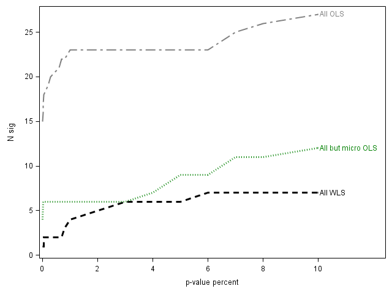

# The Characteristics that Provide Independent Information about Average U.S. Monthly Stock Returns

**Jeremiah Green**
Penn State University — jrg28@psu.edu

**John R. M. Hand\***
UNC Chapel Hill — hand@unc.edu

**X. Frank Zhang**
Yale University — frank.zhang@yale.edu

*This version: October 14, 2016*

\* Corresponding author: John R. M. Hand, Kenan-Flagler Business School, UNC Chapel Hill, Chapel Hill, NC 27599, tel. 919-962-3173. Our paper has benefitted greatly from the comments of Andrew Karolyi, two anonymous referees, Jeff Abarbanell, Sanjeev Bhojraj, Matt Bloomfield, John Cochrane, Oleg Grudin, Bruce Jacobs, Bryan Kelly, Juhani Linnainmaa, Ed Maydew, Scott Richardson, Jacob Sagi, Eric Yeung, and workshop participants at the University of Chicago, Cornell University, UNC–Chapel Hill, the Fall 2013 Conference of the Society of Quantitative Analysts, the Fall 2013 Chicago Quantitative Alliance Conference, and the 2014 Jacobs Levy Quantitative Financial Research Conference. Our SAS programs are online at https://sites.google.com/site/jeremiahrgreenacctg/home.

---

## Highlight

- **Alpha idea:** Among the "veritable zoo" of hundreds of anomaly characteristics, only a small subset carries *independent* information about average monthly U.S. stock returns — and that subset has shrunk dramatically over time. The paper identifies which characteristics survive once all 94 are included simultaneously.
- **Data sources:** CRSP (returns, prices, volume), Compustat (annual and quarterly accounting), and I/B/E/S (analyst forecasts).
- **Universe:** All common stocks on the NYSE, AMEX, and NASDAQ, with explicit separation of **non-microcap** stocks (market cap above the NYSE 20th percentile) from **microcap** stocks.
- **Sample period:** January 1980 – December 2014 (35 years); out-of-sample hedge-portfolio tests run January 1990 – December 2014.
- **Key finding:** Only **12 of 94** characteristics are reliable *independent* determinants of non-microcap returns over 1980–2014. After a sharp structural break in **2003**, only **2** characteristics remain independent in non-microcaps, and the hedged return to exploiting characteristic-based predictability becomes statistically indistinguishable from zero.
- **Signal construction:** Fama–MacBeth cross-sectional regressions with all 94 standardized characteristics entered simultaneously; two estimators are pooled — value-weighted least squares (VWLS) on all stocks, and OLS on all-but-microcaps — with significance judged by **dependency-adjusted false discovery rate (DFDR)** p-values (Benjamini–Yekutieli) and by |t| ≥ 3.0 (Harvey–Liu–Zhu).
- **Headline numbers:** Mean monthly raw hedge return on non-microcaps falls from **2.8% (t = 5.7)** pre-2003 to **0.1% (t = 0.2)** post-2003; the number of independent non-microcap characteristics falls from **12** to **2**.

---

## Abstract

We take up Cochrane's (2011) challenge to identify the firm characteristics that provide independent information about average U.S. monthly stock returns by simultaneously including 94 characteristics in Fama-MacBeth regressions that avoid overweighting microcaps and adjust for data snooping bias. We find that while 12 characteristics are reliably independent determinants in non-microcap stocks during 1980-2014 as a whole, return predictability fell sharply in 2003 such that just two characteristics have been independent determinants since then. Outside of microcaps, the hedge returns to exploiting characteristics-based predictability have also been insignificantly different from zero since 2003.

---

## 1. Introduction

In his 2011 American Finance Association Presidential address, Cochrane (2011, p.1060) challenges researchers to identify the firm characteristics that provide independent information about average U.S. stock returns. Cochrane issues his challenge because of the "veritable zoo" of hundreds of characteristics that have been presented as statistically significant predictors of the cross-section of returns in the anomalies literature since 1970 (Green, Hand and Zhang, 2013; Hou, Xue and Zhang, 2016). The goal of our study is to begin to answer Cochrane's call using 94 characteristics from CRSP, Compustat and I/B/E/S; one-month ahead U.S. returns during 1980-2014; and empirical methods that avoid overweighting microcap stocks (Fama and French, 2008; Hou, Xue and Zhang, 2016) and adjust for data snooping biases (Benjamini and Yekateuli, 2001; Harvey, Liu and Zhu, 2016).

Our general approach follows that of Fama and French (1992) and others in that we estimate a series of Fama-MacBeth regressions. However, we diverge from the anomalies literature in four ways. First and foremost, we focus on simultaneously including as explanatory variables all 94 of the large set of firm characteristics that we study. This enables us to identify those characteristics that provide independent, non-redundant information. Our method of simultaneously evaluating all 94 firm characteristics is feasible because the mean absolute correlation across characteristics is small (0.07), and because we retain all firm-month observations by setting missing characteristic values to the standardized mean of that month's non-missing values.

Second, because microcap stocks — those with a market cap below the NYSE 20th percentile — make up only 3% of the value of the U.S. stock market, we focus on the cross-section of stocks in a manner that avoids overweighting microcaps (Hou, Xue and Zhang, 2015). We estimate regressions based on two combinations of sample and method: market-value-weighted least squares (VWLS) on all stocks, and OLS on all-but-microcaps. The former approach places most weight on large cap stocks, while the latter approach puts more emphasis on small but not microcap stocks. We pool results across these two approaches as a way of arriving at inferences about the broad cross-section of non-microcap stocks. To demonstrate the influence of micro caps and to allow comparisons with prior research, we also provide results using OLS on all stocks.

Third, mindful of the data snooping concerns that arise from estimating regressions with a large number of regressors and from using characteristics already identified by prior studies, we evaluate whether a characteristic is statistically significant using two-tailed p-values on Fama-MacBeth estimated slope coefficients that are adjusted for false detection rates that take into account dependency across hypothesis tests, in our case regression coefficient p-values (Benjamini and Yekateuli, 2001). Our inferences are largely similar if we adopt the recommendation made by Harvey, Liu and Zhu (2016) that the absolute value of a Fama-MacBeth t-statistic be 3.0 or more to be significant.

Lastly, we assess the stability of the return generating process over calendar time in light of the substantial changes in technology, information, trading volume, and the types and capacity of long/short investment vehicles that have occurred in U.S. capital markets since 1980, the start of our data window. We find a marked shift in characteristics-based predictability in 2003, with the hedge portfolio returns to non-microcap stocks after 2003 dropping to zero and the number of independent characteristics falling to just two. For microcaps the number of independent characteristics also falls, but microcap hedge portfolio returns remain reliably positive after 2003.

We start our empirical analyses by establishing a conventional baseline against which to compare the results of our approach. This baseline comprises the results of estimating for the full window 1980-2014 regressions that contain each of the 94 characteristics as a single independent variable, and regressions that add to a given single characteristic the characteristic equivalents of the factors in the prominent benchmark factor models of Carhart (1997), Fama and French (2015) and Hou, Xue and Zhang (2015) as explanatory variables.

We find that only one of the 94 characteristics is significant (growth in long-term net operating assets) when the Fama-MacBeth regressions contain a single characteristic using VWLS on all stocks, and that 12 characteristics are significant using OLS on all-but-microcap stocks (asset growth, growth in industry-adjusted sales, percentage change in shares outstanding, growth in inventory, earnings announcement return, growth in book equity, growth in CAPEX, growth in long-term net operating assets, growth in PP&E plus inventory, number of consecutive quarters with earnings higher than the same quarter a year ago, growth in sales less growth in inventory, and standardized unexpected quarterly earnings). Pooling across the two approaches yields a total of 12 univariately significant characteristics in the cross-section of non-microcap stocks, as compared to 30 univariately significant characteristics in the cross-section dominated by microcaps. This indicates that the substantial majority of characteristics put forward as anomalies are not robustly present in a univariate manner over the full 35-year period 1980-2014, especially for non-microcap stocks.

Next, we extend the univariate perspective by singly evaluating characteristics after controlling for the 3-4 characteristics associated with prominent benchmark factor models. This yields 6, 4 and 1 significant characteristics out of the 90-91 tested on the Carhart, five-factor and q-factor models using VWLS on all stocks, and 17, 4 and 4 significant characteristics using OLS on all-but-microcaps. This indicates that within prominent factor-inspired benchmark models, Hou, Xue and Zhang's q-theory model best captures the independent determinants of average returns in that it yields the fewest incrementally significant firm characteristics beyond those specified by the q-theory model itself.

Central to our study, we then relax the approach of evaluating non-benchmark model characteristics one at a time by simultaneously including all 94 characteristics in the Fama-MacBeth regressions. Given the assumptions of OLS and the low average absolute cross-correlations among characteristics, this enables us to identify the independent determinants of returns. We estimate that 6 characteristics are independent determinants using VWLS on all stocks, and that 9 characteristics are independent determinants using OLS on all-but-microcaps. Pooling across the two approaches yields 12 independent characteristics in non-microcaps: book-to-market, cash, change in the number of analysts, earnings announcement return, 1-month momentum, change in 6-month momentum, number of consecutive quarters with earnings higher than the same quarter a year ago, annual R&D to market cap, return volatility, share turnover, volatility of share turnover, and zero trading days. In comparison, there are 23 independent characteristics in the microcap-dominated cross-section of OLS on all stocks.

Taken together, our univariate versus multivariate findings regarding the determinants of average monthly U.S. stock returns over the full window 1980-2014 suggest three main takeaways. First, the fact that the small number of multivariately identified independent characteristics is the same as the small number of univariately significant characteristics (12 each time) leads us to conclude that it is not the case that a few independent characteristics are able to absorb the information in a large number of other characteristics that are univariately significant. Rather, there are just intrinsically few characteristics that independently predict average returns in non-microcap stocks after adjusting for the influence of microcap stocks and data snooping concerns.

Second, the identity and nature of independent characteristics differs from that of univariately significant characteristics. Based on the Fundamental and Market classification of anomalies proposed by McLean and Pontiff (2016), 10 of the 12 univariately significant characteristics are Fundamental-based (asset growth, growth in industry-adjusted sales, growth in inventory, growth in book equity, growth in CAPEX, growth in long-term net operating assets, growth in PP&E plus inventory, number of consecutive quarters with earnings higher than the same quarter a year ago, growth in sales less growth in inventory, and standardized unexpected quarterly earnings) while two are Market-based (percentage change in shares outstanding, and earnings announcement return). In contrast, only one of the 12 multivariately identified independent characteristics is Fundamental-based (number of consecutive quarters with earnings higher than the same quarter a year ago) while seven are Market-based (change in 6-month momentum, earnings announcement return, one-month momentum, return volatility, share turnover, volatility of share turnover, zero trading days). These differences suggest that research that needs to control for the determinants of average returns may do so best using the independent, rather than univariately significant, characteristics we identify.

Fourth, characteristics that are independent determinants in non-microcap returns are also typically independent determinants in microcap returns, but not vice versa. Of the 12 independent characteristics in non-microcaps, 10 are independent characteristics in microcaps (OLS on all stocks), while 13 of the 23 independent characteristics in microcaps are not independent characteristics in non-microcaps. It is also the case that 11 of the 12 independent characteristics in non-microcaps lie outside the characteristics that equate to the factors in the Carhart, five-factor and q-factor benchmark models, with book-to-market being the exception. This suggests that future work may benefit from developing models of average returns that are tailored so as to allow for differences across firm size, and that are broader in the characteristics they include than current benchmark models.

The final set of results in our study extend the preceding analyses by showing that there are marked differences in the number and economic importance of independent characteristics over calendar time, and in a manner that varies by firm size. Specifically, we document that in 2003 there is a sharp kink downwards in the magnitude of the hedge portfolio returns to characteristics-based predictability, especially in non-microcap stocks. The mean monthly raw hedge return from exploiting predictability using the full set of 94 characteristics falls from 1.9% (t-statistic = 4.4) before 2003 to 0.5% (t-statistic = 1.1) after 2003 in the value-weighted all-stocks hedge portfolio, and from 2.8% (t-statistic = 5.7) before 2003 to 0.1% (t-statistic = 0.2) after 2003 in the equal-weighted all-but-microcap stocks hedge portfolio. For microcaps, although the mean monthly raw hedge return is significantly positive before and after 2003, it is almost two thirds smaller after 2003. Limiting the characteristics used to create hedge returns to the subset of 12 previously mentioned yields similar conclusions, as does controlling for the factor returns of the Carhart, five-factor and q-factor benchmark factor models.

Consistent with the marked drop in hedge returns, we also find that after 2003 only two characteristics are independent determinants of non-microcap returns after 2003 as compared to 12 before 2003. For microcaps the number of independent determinants also drops, falling two thirds from 25 to 8. Thus, beyond data snooping and the post-publication decay, and despite a low 0.07 average cross-correlation in characteristics, since 2003 it has been the case that almost no characteristics-based anomalies have existed in the non-microcap cross-section of returns, and fewer than ten have been present in the microcap cross-section. This suggests that the 2003 shift in the economic and statistical significance of characteristics to average monthly U.S. returns presents a meaningful challenge to both past and future research.

Overall, our findings that only 12 of 94 of characteristics provide independent information in non-microcaps during 1980-2014 and that just two characteristics matter after 2003 add even more doubt about findings in prior research already raised by Harvey, Liu and Zhou's (2016) data snooping critique and McLean and Pontiff's (2016) finding of post-publication decay. While our results are consistent with the view that the return predictability documented in prior studies suffer from substantial data snooping problems (Harvey, Liu, and Zhu, 2016; Linnainmaa and Roberts, 2016), the striking differences in predictability that we document pre- versus post-2003 and by firm size indicate that data snooping is not a complete explanation.

While we do not identify the exact reason for the sudden drop in characteristics-based predictability in 2003, one explanation is that characteristics-based predictability reflects mispricing and that mispricing declines as the cost of exploiting it declines. Consistent with characteristics-based predictability reflecting mispricing, Engelberg, McLean and Pontiff (2016) conclude from a set of 97 characteristics that anomaly returns are due to biased investor expectations since they are seven times higher on earnings announcement days, two times higher on corporate news days, and reliably predict analyst forecast errors. Consistent with the cost of exploiting mispricing falling over time, we note that a number of changes occurred in the information and trading environment during July 2002-June 2003, including the passing of the Sarbanes-Oxley Act, the accelerating of 10-Q and 10-K filing requirements by the SEC, and the introduction of autoquoting by the NYSE. While the temporal confluence of these changes makes it difficult to causally identify one or more of them with the shifts we observe in the monthly return generating process, we propose that the changes made it cheaper and technologically easier to rapidly implement quantitative long/short trading strategies. Thus, consistent with the costly-limits-to-arbitrage arguments of Shleifer and Vishny (1997), Lesmond, Schill and Zhou (2004), Chordia, Roll and Subrahmanyam (2008), Li and Zhang (2010) and Lam and Wei (2011), we conjecture that such changes in the information and trading environment increased arbitrage activity, increased the efficiency of the stock market, and to the degree that the significant pre-2003 pricing of characteristics reflected high costly limits to arbitrage, decreased the influence of characteristics in determining average returns after 2003.

---

## 2. Existing Literature on Firm Characteristics and the Cross-Section of Stock Returns

Our study is related to three main areas of research. The first is work that models average returns as a function of firm characteristics or exposure to priced factors. Papers in this area have concluded that factor models based on a small number of characteristics are largely able to explain the portfolio returns formed by individually ranking firms on a large number of characteristics (Hou, Xue and Zhang, 2015; Fama and French, 2015, 2016). For example, motivated by q-theory, Hou, Xue and Zhang (2015) find that a factor model consisting of the excess market return, a small-minus-big size factor, a high-minus-low investment factor, and a high-minus-low return on equity factor performs similarly to a model featuring size, book-to-market, and 12-month momentum but also captures many patterns not explained by the three factors. Hou, Xue and Zhang therefore propose that their four-factor model is a powerful alternative to other factor models and that any new anomaly variable warrants being benchmarked against their q-factor model to determine if the anomaly truly provides any incremental information. In a related approach, Fama and French (2015, 2016) develop a five-factor model that augments the three-factor model of Fama and French (1993) by adding profitability and investment factors (Li, Livdan and Zhang, 2009; Novy-Marx, 2013). Taking a different approach entirely, Light, Maslov and Rytchkov (2016) treat expected returns as latent variables and develop a procedure that distills 13 factors based on specific characteristics into two new factors, one of which they argue summarizes the information from all anomalies.

Our work also connects to studies that have examined the predictability of returns. Prior studies find that return predictability is strongest among stocks with the highest levels of arbitrage frictions and has declined over time as arbitrage frictions have declined and arbitrage activity has risen. Lesmond, Schill and Zhou (2004), Hou and Moskowitz (2005), Chordia, Roll and Subrahmanyam (2008), Li and Zhang (2010) and Lam and Wei (2011) all report that firm characteristics predict returns primarily among stocks with high trading costs or arbitrage frictions. Consistent with this view, Schwert (2003), Green, Hand and Soliman (2011), Hendershott, Jones and Menkveld (2011), Chordia, Subrahmanyam and Tong (2014) and McLean and Pontiff (2016) find that returns to various characteristic-based anomalies decline in response to greater arbitrage activity or as anomalies are made public. Most recently, Novy-Marx and Velikov (2016) observe that while returns to low turnover strategies are robust to adjustments for trading costs, many higher turnover strategies are not.

The third area our research speaks to is studies that have sought to measure the dimensionality of returns, primarily using firm characteristics, either indirectly by cataloging the characteristics that have been found to be significant using no- or low-dimensional control methods, or directly by placing medium-sized sets of characteristics into multidimensional models. Illustrating the catalog approach, Subrahmanyam (2010) identifies 50 significant characteristics; Green, Hand and Zhang (2013) list 330 characteristics in the anomalies literature; Harvey, Liu and Zhu (2016) itemize 315 such characteristics and/or factors; and Hou, Xu and Zhang (2016) further expand the set of anomaly-based firm characteristics to 430+. Illustrating instead the multidimensional perspective, Jacobs and Levy (1988) analyzed 25 characteristics and found that 10 were significant, and work by Haugen and Baker (1996) reported that 11 of the 40 interrelated characteristics they study were significant.[^1] From sets chosen based on published research, Fama and French (2008) and Lewellen (2015) found that 7 out of 7, and 10 out of 15 characteristics, respectively, were significant.[^2] Simultaneously in time with our study, DeMiguel et al. (2016) use an approach that incorporates firm characteristics into investors' portfolio optimization process by modeling portfolio weights as a function of firm characteristics and find that six of the set of 50 characteristics they study are jointly significant predictors. Taking a factor pricing view of anomalies, Stambaugh and Yuan (2016) find for 1967-2013 that a four-factor model that contains two mispricing factors in addition to market and size accommodates a large set of anomalies.

Notwithstanding such prior research, the challenge issued by Cochrane (2011) remains: only a fraction of the 430+ characteristics in the anomalies literature have been studied in a way that identifies which firm characteristics provide independent information about average returns. Our paper responds to Cochrane's challenge by simultaneously evaluating a much larger set of characteristics than prior work, and in that larger set estimating not just the number, identity and economic significance of the independent determinants, but newly highlighting the degree to which results obtained over the full data period 1980-2014 vary over time, particularly before and after 2003.

[^1]: Many of the 40 characteristics used by Haugen and Baker (1996) are highly correlated variants of a few constructs, with the likely result that the analysis in Haugen and Baker is based on fewer than 40 independent characteristics.
[^2]: Fama and French (2008) orient their analysis around whether the significance of characteristics is robust across firm size. Lewellen (2015) focuses his work on the cross-sectional dispersion and out-of-sample predictive ability of the stock return forecasts that he extracts from the 15 characteristics he studies.

---

## 3. Dataset Construction and Correlations among Firm Characteristics

### 3.1 Dataset aligned in calendar time

As the chief goal of our paper is to empirically identify the independent determinants of average returns by regressing one-month-ahead returns on a large number of characteristics all at the same time, we face design decisions as to which and how many characteristics to include; how to combine characteristics across firms, time periods and databases; and how to address missing data. To maximize the ability of others to replicate and/or expand our work, we seek to transparently detail the choices we make in selecting, aligning and coding up firm characteristics. In doing so, we recognize that some choices we make distance us from the exact research designs, characteristics definitions and sample periods used in the papers in which the firm characteristics were originally identified.

We initially selected 102 of the 330 characteristics listed in Green, Hand and Zhang (2013), requiring that each characteristic be calculable entirely from CRSP, Compustat and/or I/B/E/S data.[^3] Our data covers the 35-year period January 1980–December 2014. We begin in 1980 because most characteristics only become robustly available in that year. The 102 characteristics we select are listed in Table 1. Details of each characteristic, including a description of how it is calculated and the author(s), journal, and year of publication or working paper of the underlying academic study, are shown in the Appendix. The characteristics span both highly and sparsely cited papers; published and working papers; and publication dates between 1977 and 2016. On occasion, more than one characteristic comes from a given paper.

We begin our data creation with all firms with common stock on the NYSE, AMEX or NASDAQ that have a month-end market value on CRSP and a non-missing value for common equity in their annual financial statements. We then integrate data across Compustat, I/B/E/S and CRSP, and compute and align characteristics in calendar time. Since Green, Hand, and Zhang (2013) report that 57% of the 330 characteristics they list are evaluated by the original authors through the lens of monthly returns, we re-measure and re-align characteristics every month. For each month t's return we calculate characteristics as they were at the end of month t-1, assuming that annual accounting data are available at the end of month t-1 if the firm's fiscal year ended at least six months before the end of month t-1, and that quarterly accounting data are available at the end of month t-1 if the fiscal quarter ended at least four months before the end of month t-1. I/B/E/S and CRSP data are aligned in calendar time using the I/B/E/S statistical period date and the CRSP monthly or daily end date.

[^3]: We also restricted the firm characteristics to main-effect signals. We do not include characteristics that are interactions between other characteristics.

While monthly updating is consistent with the portfolio rebalancing approach used by many quantitative institutional investors, we recognize that some practitioners update their data as often as every minute, or as infrequently as every 12 months. We choose monthly updating because we view it as a reasonable tradeoff between the lower transactions and trading costs of longer frequencies, and the benefit of greater timeliness (Novy-Marx and Velikov, 2016). Our choice means that those characteristics in our dataset that come from studies with a shorter-than-monthly frequency will be less timely than in the original studies, while those that come from studies using longer frequencies will be more timely. Such slippage may lower our ability to detect the incremental significance of individual characteristics but it also reduces the chances that we will identify return predictability that does not survive the trading cost effects of high turnover strategies (Novy-Marx and Velikov, 2016).

We take monthly stock returns from CRSP and include delisting returns per Shumway and Warther (1999). We delete 20 observations that have a monthly return less than -100%, and set blank values of analyst following `nanalyst` to zero. I/B/E/S is the most restrictive of our databases in its coverage of firms and availability over time, so we only use I/B/E/S-based characteristics starting in January 1989 because that is when I/B/E/S' more expansive coverage begins.[^4] Following prior work such as Hou, Xue and Zhang (2015) and Fama and French (2015), we delineate firm size groupings based on their monthly NYSE-based percentiles. We label stocks with a market cap greater than the median NYSE stock at the end of month t-1 as big, stocks below the median and above the 20th percentile as small, stocks with values less than or equal to the 20th percentile as microcap, and stocks excluding microcaps as all-but-microcap.

[^4]: The firm characteristics that employ I/B/E/S data are `chnanalyst`, `chfeps`, `disp`, `fgr5yr`, `nanalyst`, `sfe`, and `sue`.

Since in our key analyses we identify the independent determinants of average returns by regressing one-month-ahead returns on all characteristics simultaneously, in such regressions we avoid discarding the characteristic simply because its value is missing in one or more firm-months. Just 4% of characteristics have full data with no missing observations over Jan. 1980–Dec. 2014. The approach we take to retaining as much characteristic information as possible is to first winsorize all characteristics at the 1st and 99th percentiles of their monthly distributions and standardize each to have a zero mean and unit standard deviation. We then set missing characteristic values to the characteristic's post-standardized monthly mean of zero.[^5] In Table 2 for each firm characteristic we report the number of our dataset of 1,933,898 firm-month observations over the period Jan. 1980–Dec. 2014 with non-missing data, and the percentage that are missing before being reset to zero. We note that the characteristics with the largest fraction of missing data tend to be those that use I/B/E/S analyst information (`chnanalyst`, `chfeps`, `disp`, `fgr5yr`, `nanalyst`, `sfe`, and `sue`) or that use sparsely populated Compustat data (`rd_mve`, `rd_sale`, `realestate`).

[^5]: The approach of replacing missing independent variables with their sample means is known as the zero-order regression method (Wilks, 1933). Under multivariate normality of the dependent and independent variables, the zero-order method is generally expected to lead to unbiased slope coefficient estimates (Afifi and Elashoff, 1966).

### 3.2 Correlations among firm characteristics

We gauge the potential for multicollinearity concerns in our Fama-MacBeth regressions by measuring the cross-correlations among our initial set of 102 firm characteristics. While multicollinearity does not lead to bias in estimated slope coefficients, it does increase their standard errors. Thus, to the extent we are able to exclude characteristics with very large cross-correlations with other characteristics because they are mechanically or economically related — for example, beta and beta squared — we expect to be able to more powerfully identify the independent determinants of average returns when we estimate regressions that simultaneously contain very large numbers of characteristics, especially if the number of highly collinear characteristics is found to be small.

We therefore calculate the variance inflation factors (VIFs) of each characteristic since VIFs summarize the extent to which a given characteristic is explained by a linear combination of all other characteristics (Greene, 2011). Panel A of Table 3 describes the distribution of VIFs. While the median VIF of 1.8 is not large, VIFs are right-skewed in that 10% of characteristics have a VIF ≥ 9.8. We therefore seek to mitigate the effects of multicollinearity in our key regressions that simultaneously include all characteristics by removing the eight characteristics that are most strongly related to other characteristics (`betasq`, `dolvol`, `lgr`, `maxret`, `mom6m`, `pchquick`, `quick`, and `stdacc`), each of which has a VIF > 7. We then use the remaining 94 characteristics throughout our analyses.[^6]

In panel B of Table 3 we report the key percentiles of the absolute cross-correlations among characteristics before and after removing the eight characteristics with VIFs greater than 7. In both cases, the mean and median absolute cross-correlations are quite low at 0.07 and 0.03, respectively.[^7] Not surprisingly, after removing characteristics with VIFs > 7, the largest cross-correlations also decline. Panel C shows the distribution of the absolute cross-correlations among the 94 non-highly-cross-correlated characteristics, making clear that 90% of absolute cross-correlations are below 0.2.

[^6]: In untabulated analyses, we vary the VIF cutoff at which we exclude a characteristic from 5 to 10, and find very similar results to those obtained using our default VIF cutoff of 7. Our results are also similar if we do not exclude any characteristics based on VIF cutoffs at all.
[^7]: The mean absolute cross-correlation among characteristics is similarly small if cross-correlations are calculated after missing characteristic values are reset to each characteristic's monthly mean. (Panels B and C use characteristics that may have missing values, while the pooled regression to calculate VIFs uses characteristics that have had missing values set to their monthly mean value.)

---

## 4. Empirical Methods and Results

We estimate standard Fama and MacBeth (1973) regressions over 1980–2014 to determine how many and which of our set of 94 firm characteristics are statistically significant determinants of one-month-ahead returns, most especially when they are all simultaneously included in the regressions. In assessing whether a characteristic is reliably related to average returns, we are mindful of the inferential biases that can arise in our tests from overweighting of microcap stocks that make up on average only about 3% of the market cap of the NYSE-Amex-NASDAQ universe (Fama and French, 2008; Hou, Xue and Zhang, 2016), and from data snooping.

We seek to avoid the first bias by focusing the majority of our analyses on the non-microcap cross-section of firms, implemented in two ways: by applying value-weighted least squares (VWLS) to all stocks, and by using OLS on all-but-microcap stocks. The VWLS approach places most weight on large cap stocks, while the OLS approach puts more emphasis on smaller (but not microcap) stocks. This approach is similar to that used when creating portfolios that seek to minimize the influence of microcap stocks (Hou, Xue, and Zhang, 2016). In arriving at inferences about non-microcaps, we pool results across our two approaches, while for reference purposes we arrive at inferences inclined toward microcaps using OLS on all stocks.

We seek to avoid data snooping biases by evaluating the statistical significance of an estimated coefficient on a characteristic using two-tailed p-values that are adjusted for false detection rates in a manner that takes into account the dependency among p-values that arises across a given set of estimated regressions (Benjamini and Yekateuli, 2001).[^8] We refer to such p-values as DFDR p-values, and require that a DFDR p-value be less than or equal to 0.05 for the associated parameter estimate to be considered statistically significant. Following the approach of Harvey, Liu and Zhu (2016) we also report the number of t-statistics that are greater than or equal to 3.0 in absolute value, where t-statistics are computed from the time-series of mean monthly coefficient estimates, given Newey-West adjustments over 12-monthly lags.

[^8]: In our setting, we face the risk that we will falsely reject the null for some characteristics purely by chance given our goal of assessing the significance of the coefficients on individual characteristics rather than the joint significance of all characteristics as a single set. This multiple testing concern is common in other research literatures and has recently been raised in the context of return prediction by Harvey, Liu, and Zhu (2016). While the concern addressed by Harvey et al. (2016) is that new return predictors may falsely be deemed to be statistically significant because tests use the same datasets, our concern is that we risk falsely concluding that a return predictor is significant because we simultaneously include a large number of characteristics in the same regression, and/or because we estimate several regressions using the same dataset. To adjust tests of significance to take these issues into account, other literatures have developed tools including family-wise-error rate (FWER) adjustments and false discovery rates (FDR). Due to the very conservative nature of FWER adjustments, we choose to use FDR adjustments to p-values when making inferences about statistical significance from our regressions. The FDR adjustments adjust statistics by assuming that some portion of rejected null hypotheses are incorrect; something likely to be the case in our tests. However, we use the method of Benjamini and Yekateuli (2001) that extends the basic FDR approach of Benjamini and Hochberg (1995) to also adjust for the dependency among p-values that arises because our tests are performed with the same sets of dependent and independent variables across the various samples and/or methodologies.

### 4.1 Baseline models of average returns

We begin by establishing a conventional baseline against which to compare the results of our main approach of simultaneously including all 94 characteristics in the Fama-MacBeth regressions. This baseline comprises the results of estimating regressions that contain each of the 94 characteristics as a single independent variable, followed by regressions that add to the characteristic equivalents of the factors in the prominent benchmark factor models of Carhart (1997), Fama and French (2015) and Hou, Xue and Zhang (2015) one and only one of those characteristics that not already in the benchmark models, using data for 1980-2014 as a whole.

In Table 4 column A we detail the results of placing each characteristic individually into its own Fama-MacBeth regression, followed in columns B-D by the results of adding each characteristic singly to the characteristics called for by a given benchmark model. The benchmark characteristics are size, book-to-market and 12-month momentum for the Carhart model; size, book-to-market, investment and operating profitability for the five-factor model; and size, investment and quarterly return-on-equity for the q-factor model. In each column we report results for all stocks using WLS, all-but-microcap stocks using OLS, and all stocks using OLS. To help guide the reader's eye to which coefficients are significant given the large number of characteristics studied, coefficient estimates with a DFDR p-value ≤ 0.05 are shown by a bolded t-statistic. The number of coefficient estimates with a DFDR p-value ≤ 0.05 and the number of absolute t-statistics ≥ 3.0 are shown in the first and second lines of Table 4.

As judged by coefficient estimates with DFDR p-values ≤ 0.05, in column A we find that just one of 94 characteristics is significant in univariate regressions for non-microcap firms as measured by VWLS on all stocks (growth in long-term net operating assets), while 12 characteristics are significant using OLS on all-but-microcaps (asset growth, growth in industry-adjusted sales, growth in shares outstanding, growth in inventory, earnings announcement return, growth in book equity, growth in CAPEX, growth in long-term net operating assets, growth in PP&E plus inventory, number of consecutive quarters with earnings higher than the same quarter a year ago, growth in sales less growth in inventory, and standardized unexpected quarterly earnings). Pooling across the two measures of the cross-section of non-microcaps yields a total of 12 univariately significant characteristics, in identity the same ones as found using OLS on all-but-microcaps. Underscoring the observation that more characteristics are reliably univariately significant the more heavily smaller stocks are weighted, we note that there are 30 significant characteristics when microcaps are given the same regression weighting as larger stocks (all stocks, OLS).[^9] The results of column A therefore indicate that the great majority of characteristics put forward as anomalies in the prior literature are not robustly present in a univariate manner over 1980-2014 taken as a whole. Moreover, where they are reliably present they are concentrated in microcap stocks.

[^9]: We also note that a comparison of the number of significant characteristics based on DFDR p-values ≤ 0.05 versus absolute t-statistics ≥ 3.0 indicates that the former approach yields fewer significant characteristics than the latter, reflecting the goal in DFDR of taking dependency across multiple coefficient p-values into account.

We note that our assessments about the number and identity of significant coefficients rely on our ability to determine which coefficients are likely to be driven by in-sample data overfitting. Our inference that a large number of coefficients are insignificant differs from prior research because we de-emphasize microcaps and because how we adjust statistical significance to take multiple testing into account using DFDR p-values. In Figure 1 we visually present how the number of coefficients deemed significant in Table 4 using DFDR p-values varies with DFDR p-values that are higher or lower than our 5% cutoff value. Figure 1 shows that the number of statistically significant coefficients varies most substantially for very low levels of statistical significance (p-values < .01). Around the 5% p-value cutoff that we use, the curves in Figure 1 are relatively flat, indicating that within any given column in Table 4 the number of coefficient significant estimates is relatively insensitive to whether the p-value cutoff is 1%, 5% or 10%. More visually striking is the difference in the number of significant characteristics across our approaches that emphasize (OLS on all stocks) or deemphasize microcaps (VWLS on all stocks, and OLS on all-but-microcaps). Overall, Figure 1 shows the value of accounting for multiple testing and the disproportionate effect of microcaps in inferring the degree of characteristics-based predictability in average monthly returns.

Next in Table 4, columns B-D show that when added singly to the Carhart, five-factor and q-factor models, it is the case that 6, 4 and 1 characteristics are incrementally significant using VWLS on all stocks, and 17, 4 and 4 characteristics are incrementally significant using OLS on all-but-microcaps. Since columns B-D also show that the q-factor model leads to the fewest number of significant characteristics outside of those in the benchmark model itself, we infer that among the three purposefully low-dimension benchmark models, the q-factor model best captures the cross-sectional variation in average returns. Our conclusion echoes that of Hou, Xue and Zhang (2015, 2016) who conduct similar tests but using the factor versions of the Carhart, five-factor, and q-factor models. Table 4 also provides one reason for the performance of the q-factor model and the five-factor models relative to the Carhart model; that these models include a measure of growth that is important when considering return predictability with characteristics one-at-a-time.

### 4.2 Identifying the independent determinants of the cross-section of average U.S. monthly returns by simultaneously including all 94 characteristics in Fama-MacBeth regressions

Table 5 presents the results of relaxing the univariate approach in Table 4 of evaluating non-benchmark model characteristics singly by simultaneously including all 94 characteristics in Fama-MacBeth regressions, using the full period 1980-2014. Given the assumptions of OLS, we argue that this method enables us to most powerfully identify the independent determinants of average returns, in that we expect that only those characteristics that are truly independent determinants of returns will have significant estimated coefficients when the effects of all other characteristics are controlled for.

Based on DFDR p-values, column A of Table 5 shows that for the period 1980-2014, a total of 6 characteristics are reliably independent determinants when using VWLS applied to all stocks (book-to-market, cash, 1-month momentum, change in 6-month momentum, return volatility, and the number of zero trading days). This increases to 9 characteristics if OLS is applied to all-but-microcaps (cash, change in the number of analysts, earnings announcement return, 1-month momentum, the number of consecutive quarters with an increase in earnings over the same quarter a year ago, annual R&D to market cap, return volatility, share turnover, and volatility of share turnover). Pooling across the two approaches yields 12 multivariately determined independent characteristics, namely book-to-market, cash, change in the number of analysts, earnings announcement return, 1-month momentum, change in 6-month momentum, number of consecutive quarters with earnings higher than the same quarter a year ago, annual R&D to market cap, return volatility, share turnover, volatility of share turnover, and zero trading days. As in Table 4, the disproportionate influence of microcap stocks can be seen in column C of Table 5 by noting that applying OLS to all stocks yields 23 independent characteristics.

In Figure 2 we visually present the number of significant coefficients in Table 5 as a function with DFDR p-values different than our 5% cutoff value, noting as in Figure 1 that the curves are relatively flat, particularly for non-microcaps.

Taken together, the results in Tables 4 and 5 suggest several takeaways about the number and identity of the independent determinants of average monthly stock returns over 1980-2014. First, of our sample of 94 characteristics that prior work has presented as predictive of average returns, 12 provide robustly independent information for non-microcap stocks, whereas the remaining 82 do not. This contrast paints an unfavorable picture of the reliability of the inferences made in prior research.

Second, the fact that the number of multivariately identified independent characteristics is the same as the number of univariately significant characteristics (12) indicates that it is not the case that a few independent characteristics are able to powerfully absorb the information contained in a large number of univariately significant characteristics. Instead, there are simply intrinsically few characteristics that independently predict average returns in non-microcap stocks.

Third, the identity and nature of independent characteristics differs substantially from the identity and nature of univariately significant characteristics. Using the Fundamental and Market approach to classifying anomalies proposed by McLean and Pontiff (2016), we categorize 10 of the 12 univariately significant characteristics as Fundamental (asset growth, growth in industry-adjusted sales, growth in inventory, growth in book equity, growth in CAPEX, growth in long-term net operating assets, growth in PP&E plus inventory, number of consecutive quarters with earnings higher than the same quarter a year ago, growth in sales less growth in inventory, and standardized unexpected quarterly earnings) and two as Market-based (percentage change in shares outstanding, and earnings announcement return). In contrast, it is the case that only one of the 12 multivariately identified independent characteristics is Fundamental (number of consecutive quarters with earnings higher than the same quarter a year ago) while seven are Market-based (change in 6-month momentum, earnings announcement return, one-month momentum, return volatility, share turnover, volatility of share turnover, zero trading days).[^10] These differences suggest that research that needs in its research design to control for the determinants of average returns may do so most powerfully by using the independent characteristics that we identify.

[^10]: The average absolute cross-correlation among the univariately significant Fundamental characteristics is 0.19, suggesting that the lack of Fundamental independent characteristics is not because they are highly correlated and that only one emerges as significant after controlling for all others.

Fourth, the independent characteristics in non-microcaps tend to be independent characteristics in microcaps but not vice versa. Of the 12 independent characteristics in non-microcaps, 10 are independent characteristics in OLS regressions on all stocks, while 13 of the 23 independent characteristics in microcaps (OLS on all stocks) are not independent characteristics in non-microcaps. It is also the case that 11 of the 12 independent characteristics differ from the characteristics in the Carhart, five-factor and q-factor benchmark models, with book-to-market being the notable exception. This suggests that past work that has used the characteristics versions of the Carhart, five-factor and q-factor models to control for cross-sectional variation in average returns outside of the particular independent variable that was the focus of the work may have failed to achieve the degree of control that was expected, particularly to the extent that the set of firms being studied were large cap stocks.

In Table 6 we assess the robustness of our conclusion from Table 5 that over the period 1980-2014 there are 12 independent determinants of average monthly returns in non-microcap stocks. Specifically, Table 6 reports the results of estimating the regressions reported in Table 5 when the characteristics included as independent variables are restricted to the 12 that were multivariately identified as being independent determinants in Table 5. Inspection of columns A and B indicate that as compared to the 6 and 9 independent determinants identified by DFDR p-values in Table 5, similar numbers of 5 and 7 are seen in Table 6. Likewise, there are a total of 9 characteristics across columns A and B in Table 6 as compared to 12 characteristics in Table 5. We note that in comparing Table 5 with Table 6, the sole representative of the characteristics equating to the factors in the Carhart, five-factor and q-factor models, namely book-to-market in Table 5, does not remain significant in Table 6.

### 4.3 Hedge portfolio returns from predicting the cross-section of returns using characteristics

Since statistical significance does not necessarily translate into economic importance, in this section we report the results of hedge portfolio tests aimed at measuring the magnitude of the economic benefits to exploiting the full set of the characteristics when predicting the cross-section of one-month ahead returns. Specifically, following the method of Lewellen (2015), in panel A of Table 7 we report the magnitude and significance of three mean one-month holding period out-of-sample hedge portfolio raw returns that are calculated as follows.

In panel A, for every month t-1 starting in Jan. 1990 we use data from month t-120 through t-1 to estimate the same three sets of regressions as those reported in columns A, B and C of Table 5. As in Tables 4-6, we assume that annual accounting data are available at the end of month t-1 if the firm's fiscal year ended at least six months before the end of month t-1 for annual data and that quarterly accounting data are available at the end of month t-1 if the firm's fiscal quarter ended at least four months before the end of month t-1. Separately for the set of stocks defined in each column, on a firm-by-firm basis we then apply the resulting mean coefficient estimates to the values of the corresponding 94 characteristics as of the end of month t-1. This yields three predicted returns for month t for each firm, one per each of columns A, B and C. Then we calculate the realized return to each of three hedge portfolios for month t using two types of breakpoints for identifying firms in the top and bottom deciles of predicted returns, and two methods of weighting the individual realized returns within each decile.

For the column A portfolio in panel A of Table 7, denoted portfolio A, decile breakpoints are based on only NYSE firms (so there are an equal number of NYSE stocks in each decile, but not necessarily an equal number of stocks across the NYSE, AMEX and NASDAQ combined) and the realized returns in the top/long and bottom/short deciles are weighted by firms' market caps at the end of month t-1. For the column B portfolio, referred to as portfolio B, the decile breakpoints are based on all-but-microcap stocks and the realized returns in the top/long and bottom/short deciles are equally-weighted. Lastly, for the column C portfolio, denoted portfolio C, the decile breakpoints are based on NYSE stocks and the realized returns in the top/long and bottom/short deciles are equally-weighted. Since predicted returns are available for each firm at the end of each month, our approach is in theory implementable in real time using only historically available data.[^11] In total, applying this method yields a time series of 274 realized raw monthly hedge returns over the period Jan. 1990-Dec 2014 for each of the three hedge portfolios A, B and C.

[^11]: We confirm that our approach is only quasi-out-of-sample, since we use characteristics that were not first reported in the academic literature until after month t-1. However, potentially counterbalancing some the upward bias in implementable hedge returns that such data snooping creates, we never discard a characteristic, even when an estimated coefficient would indicate that the characteristic is either no longer incrementally significant or is significant but with a sign opposite to that expected based on the anomalies literature.

Panel A reports descriptive statistics for the realized raw monthly hedge portfolio returns. Inspection shows that the mean raw returns for all three types of hedge portfolios are always statistically and economically large, and largest (smallest) in the smallest (largest) cap firms. For the cross-section of stocks measured by portfolio A's VW all stocks long top / short bottom decile hedge portfolio with NYSE decile breakpoints, the mean raw monthly return over 1990-2014 is 1.2% (t-statistic = 3.8), while for the cross-section of stocks measured by portfolio B's EW all-but-microcaps hedge portfolio using all-but-microcaps decile breakpoints the mean monthly raw return is 1.4% (t-statistic = 4.5). These results show that there are substantial economic benefits to using the predictability in the full set of all 94 firm characteristics. At the same time, we note that once more highlighting the disproportionate influence that microcaps can exert, the mean monthly raw return for portfolio C's EW all stocks hedge portfolio with NYSE decile breakpoints is 3.1% (t-statistic = 11.3).[^12]

[^12]: Since raw hedge portfolio returns in the anomalies literature are often orthogonalized against key factor returns, in our Internet Appendix we report the estimated alpha intercepts and associated t-statistics from regressing the raw hedge portfolio returns described in panel A on the factor returns relevant to each of the Carhart, five-factor and q-factor models. We find that the estimated alphas are similar in magnitude and significance to the mean raw hedge returns found in panel A of Table 7. Moreover, the q-factor model always has the smallest alpha (eliminating more of the mean raw hedge return) than either the Carhart or five-factor models, supporting the inference made from Table 4 that of the benchmark models, Hou, Xue and Zhang's q-factor model best captures the cross-sectional variation in returns due to the truly independent determinants of average returns.

Panel B reports the same statistics as in panel A but where the predicted returns used to construct top/long and bottom/short deciles are based on limiting the firm characteristics to the subset of the 12 shown in Table 6, less the change in the number of analysts because analyst data is not available early in the sample data window. Panel C tabulates the differences in the mean hedge returned reported in panels A and B. It can be seen that limiting the construction of hedge portfolios designed to exploit characteristics-based predictability to the 12 characteristics identified in columns A and B of Table 5 does reduce mean hedge returns in a material and statistically significant manner, especially for large cap firms. The mean hedge return for portfolio A falls by two thirds from 1.2% to 0.4% (t-statistic on difference = 3.0), but by only one third from 1.4% to 1.0% (t-statistic on difference = 2.2) for portfolio B. We note in passing that although Table 5 identifies 23 different independent characteristics in micro-cap stocks (column C), restricting the construction of hedge return portfolios to the 12 characteristics identified in columns A and B of Table 5 only reduces the mean hedge return to the micro-cap portfolio by one quarter from 3.1% to 2.4% (t-statistic on difference = 4.0).

### 4.4 The 2003 change in predictability and the pre- versus post-2003 differences in the number and economic importance of the independent determinants of average monthly U.S. stock returns

Consistent with almost all research in the anomaly and asset pricing literatures, the results described in Tables 4-7 treat the years 1980-2014 as a uniform block of calendar time during which the return generating process is presumed to remain constant in calendar time. We now relax this assumption in light of the substantial changes in the volume, nature and costs of trading in stocks that occurred during 1980-2014, including Reg. FD, the decimalization of trading quotes, Sarbanes-Oxley, accelerated SEC filing requirements, autoquoting, and computerized long/short quantitative investment (Chordia, Roll and Subrahmanyam, 2001; Jones, 2002; Schwert, 2003; French, 2008; Green, Hand and Soliman, 2011; Hendershott, Jones and Menkveld, 2011).

The first approach we take to assessing the constancy of the return generating process in calendar time is shown in Figure 3 where we plot the natural log of 1 plus the cumulative mean raw hedge portfolio returns calculated in a manner equivalent to those in panel A of Table 7, but where the seven characteristics that require I/B/E/S data have been excluded because I/B/E/S data is only robustly available starting in 1990. Visual inspection of Figure 3 indicates that the mean hedge returns for each of the three portfolios displayed fell sharply and persistently in late 2002 / early 2003. Indeed, the declines are so marked for the non-microcap cross-section of stocks that the characteristics-based predictability of one-month ahead U.S. returns has been on average zero since early 2003, leaving economically meaningful predictability only in microcaps, and there to a much reduced degree.

We provide statistical evidence consistent with these visual assessments in Table 8, where we report the mean raw hedge returns, together with their associated t-statistics, for each of the three hedge portfolios pre-2003, post-2003, and post- versus pre-2003. We define pre-2003 as the period ending Dec. 31, 2002 and the post-2003 period as starting Jan. 1, 2004. Table 8 shows that the mean raw monthly hedge return in the VW all stocks hedge portfolio with NYSE decile breakpoints declines from 1.9% before 2003 (t-statistic = 4.4) to 0.5% after 2003 (t-statistic = 1.1), with the fall of -1.4% per month being reliably negative (t-statistic = -2.3). Similarly, the mean raw monthly hedge return for the EW all-but-micro hedge portfolio with all-but-micro decile breakpoints drops from 2.8% before 2003 (t-statistic = 5.7) to 0.1% after 2003 (t-statistic = 0.2), with the post- versus pre-2003 decline of -2.7% being reliably negative (t-statistic = -4.4). In contrast, while the mean raw monthly return for the EW all stocks hedge portfolio with NYSE decile breakpoints also declines by a significant -2.8% post- versus pre-2003 (t-statistic = -5.2), it remains reliably positive in the post-2003 period with a mean of 1.7% per month (t-statistic = 4.4). All told, Table 8 documents that the economic hedge returns measure of the degree of predictability in the set of 94 characteristics we study plunged across all sizes of firms, and that the drop was so great in non-microcap stocks that since 2003 the mean hedge return to exploiting characteristics-based predictability has been insignificantly different from zero. Only in microcap stocks has characteristics-based predictability survived, and for such firms the economic magnitude of the predictability after 2003 is two thirds less than it was before 2003.

Table 9 confirms the inferences from mean hedge returns in Table 8 by reporting the results of estimating the same Fama-MacBeth regressions as in Table 5, but separately for the subperiods 1980-2002 and 2004-2014. We focus first on columns A and B in each subperiod that report results for our two alternative definitions of non-microcap firms, and as in our analysis of Table 5, we measure the number of independent determinants of average returns by the number of different characteristics across columns A and B combined that have DFDR p-values ≤ 0.05. Inspection of columns A and B reveals that 12 characteristics are independent determinants of non-microcap stocks' average returns in 1980-2002 as compared to 2 characteristics in 2004-2014. We note that of the latter, one is an independent determinant both pre- and post-2003 (the number of consecutive quarters with earnings higher than the same quarter a year ago) while one is not (the industry-adjusted change in the number of employees). We also note from the two column Cs that the number of independent determinants using OLS on all stocks falls from 25 characteristics before 2003 to 8 characteristics after 2003.

We interpret the sharp shift in late 2002 / early 2003 in the number and economic importance of the independent determinants of the monthly return generating process, especially across firm size, as being consistent with the costly-limits-to-arbitrage arguments of Shleifer and Vishny (1997), Lesmond, Schill and Zhou (2004), Chordia, Roll and Subrahmanyam (2008), Li and Zhang (2010) and Lam and Wei (2011). We note that during the period July 2002 – June 2003, a number of changes occurred in the information and trading environment that made it cheaper and technologically more feasible to rapidly implement quantitative long/short trading strategies.

Following the adoption of Reg. FD in Oct. 2000 and the decimalization of quotes in Jan. 2001, both of which reduced effective spreads, price impact and trading costs (Bessembinder, 2003; Eleswarapu, Thompson and Venkataraman, 2004), the information environment changed in two ways. July 2002 saw the passing of the Sarbanes-Oxley Act that increased auditing quality requirements and imposed managerial responsibility on the quality of firms' internal controls for financial statements, beginning with those for fiscal 2002 that started to be reported in early 2003. Then the deadlines for when annual and quarterly reports had to be filed with the SEC following a fiscal year-end or quarter-end were accelerated starting in Nov. 2002 to make 10-Q and 10-K filings more timely.

Importantly from a technological perspective, between Jan.-May 2003 the NYSE introduced its autoquoting software, a change that Hendershott, Jones and Menkveld (2011) argue led to dramatic reductions in the trading frictions and costs and an equally dramatic increase in the algorithmic trading that long/short equity hedge funds use to implement long/short quantitative trading strategies. While the temporal confluence of these changes makes it difficult to causally identify one or more of them as explaining the shifts seen in the monthly return generating process, we propose that in total the changes made it much cheaper and technologically easier to rapidly implement high volume quantitative long/short trading strategies, thereby increasing arbitrage activity, increasing the efficiency of the stock market, and to the degree that the statistically and economically significant pre-2003 pricing of characteristics reflected high costly limits to arbitrage, decreasing the number and influence of characteristics in determining average returns after 2003.[^13]

[^13]: We do not ascribe the shift in late 2002 / early 2003 to the post-publication reduction in the univariate mean hedge return documented by MacLean and Pontiff (2015). This is because we do not observe a spike in the number of anomalies either discovered or published in late 2002 / early 2003 (see Green, Hand and Zhang, 2013, Figure 1) and Harvey, Liu and Zhang (2016, Figure 1). We also differentiate our study from that of Chordia, Subrahmanyam and Tong (2014, CST) because while CST document an attenuation over calendar time in the returns to anomalies, they analyze only six anomalies, and test only for a linear or exponential decay in anomaly hedge returns.

### 4.5 Robustness tests

In this section, we summarize the results of additional analyses that are detailed in the Internet Appendix and that assess the robustness of our main findings. First, because our multivariate approach to identifying the independent determinants of average returns is made feasible by our method of replacing missing characteristic values with the characteristic's standardized mean for that month (zero), we re-estimate Table 4 without replacing missing characteristic values.[^14] We find very few differences in the identities or numbers of significant Fama-MacBeth mean slope coefficients, providing reassurance that at least at the univariate level, and also for any given characteristic at the level of controlling for only the characteristics versions of notable benchmark factor models, replacing missing values with standardized means does not materially affect or drive our results.

[^14]: Internet Appendix, Table IA-1.

Second, given the sharp reduction in characteristics-based return predictability in 2003 that we document in Tables 8 and 9, we re-estimate the univariate analyses in Column A of Table 4 separately pre-2003 and post-2003.[^15] In doing so, we confirm that that drop in characteristics-based return predictability in 2003 happens at both the univariate and multivariate levels. We also confirm that our finding based on the full window 1980-2014 that the characteristics that matter switch from being primarily Fundamental at the univariate level to primarily Market-based at the multivariate level does not arise simply because the full window 1980-2014 pools data from two very different pre- versus post-2003 subperiods. We observe that in a manner similar to that seen over 1980-2014 as a whole, before 2003, 10 of 12 univariately significant characteristics are Fundamental as compared to 2 of 12 independent characteristics. After 2003 the contrast is moot in that there are no univariately significant characteristics and just two independent characteristics.

[^15]: Internet Appendix, Table IA-2.

Third, since we use hedge returns to assess the economic importance of characteristics-based return predictability, we confirm that the magnitude and significance of the hedge returns we report in Tables 7 and 8 are not driven by a failure to control for common factor exposures. We do so by regressing the hedge portfolio returns that exploit the full set of 94 characteristics on the monthly factor returns from the Carhart, Fama-French five-factor, and Hou-Xue-Zhang q-factor models.[^16] In unreported tests we also repeat these tests for the 1990-2002 and 2004-2014 periods, and find very similar results to those reported in Table 8.

[^16]: Internet Appendix, Table IA-3.

Fourth, we re-estimate many of our regressions separately for big, small, and microcap stocks, estimated using both VWLS and OLS.[^17] The findings and inferences from these mutually exclusive size-based analyses are similar to those we present in the main results of the paper. And lastly, we provide visual depictions of the overlaps in which characteristics are and are not significant across alternative regression specifications.[^18] While this information is available in our main tables, our Internet Appendix summarizes the overlaps in a visual manner.

[^17]: Internet Appendix, Table IA-4.
[^18]: Internet Appendix, Figure IA-1 and Figure IA-2.

### 4.6 Limitations

We recognize several caveats to and limitations of our research. While ours is the first to assess the simultaneous predictive power of a very large number of individual firm characteristics, we study only one quarter of the 430+ characteristics reported in the anomalies literature to date. As such, we likely do not identify all the truly independent determinants of average monthly returns. It may also not be appropriate to extrapolate our findings to the full population of 430+ characteristics because our approach has been to focus on those that can be calculated from CRSP, Compustat or I/B/E/S data, meaning that we have not sampled firm characteristics randomly from the population of characteristics. We may also have introduced measurement error through our approach to treating missing data and by aligning characteristics in calendar month time rather than in the daily or weekly time used in the original research. We also note that while in our quasi-out-of-sample tests we have sought to avoid using data that was unavailable in real time, implementing the positions dictated by our hedge portfolios would expose investors to potentially trading costs, especially in microcap stocks, such that the resulting net-of-trading-costs hedge returns might not be positive (Novy-Marx and Velikov, 2016).

---

## 5. Conclusions and Implications

In this paper we have sought to respond to the challenge made by Cochrane (2011, p.1060) that researchers begin to identify which of the "veritable zoo" of hundreds of firm characteristics reported in prior studies as being statistically significant predictors of the cross-section of average stock returns. We use the same approach as Fama and French's seminal 1992 paper, but employ a much larger set of 94 firm characteristics and simultaneously include all 94 of them as explanatory variables in Fama-MacBeth regressions that seek to avoid overweighting microcaps and adjust for data snooping biases.

Our approach leads us to estimate that 12 characteristics provide significant independent information about average U.S. monthly returns in non-microcap stocks over the full period 1980-2014, with the remaining 84 characteristics providing no independent information. We show that the reason why few characteristics provide independent information is that the number of independent determinants of returns is intrinsically small, rather than it being the case that there are a small number of characteristics is able to absorb the information in many other characteristics that are univariately important.

We also document that the number of independent characteristics and their ability to yield positive hedge returns fell sharply in 2003, especially in non-microcap stocks. We estimate that since 2003 just two characteristics have been independent determinants in non-microcap returns as compared to 12 characteristics before 2003, and that the mean hedge return to non-microcap stocks has been insignificantly different from zero after 2003. Characteristics-based predictability currently exists only in microcap stocks. We interpret the decline in the number and economic importance of the firm characteristics over calendar time and across firm size as being most consistent with the costly-limits-to-arbitrage market efficiency arguments of Shleifer and Vishny (1997) and others.

In conclusion, by identifying the independent determinants of average monthly returns, and by relaxing the constraints that the independent determinants be the same across firm size and over time, we provide additional reasons beyond to those of Harvey, Liu and Zhou (2016) and McLean and Pontiff (2016) for why the inferences that have been made from hundreds of return anomaly studies warrant substantial skepticism. At the same time, we also surface new facts and puzzles to be digested, the most prominent of which is the strong, sudden and seemingly permanent decline in the characteristics-based predictability of returns in 2003, especially among non-microcap stocks. Our results suggest that future empirical models of average returns may benefit from weighting post-2003 data more strongly than pre-2003 data, from conditioning the return generating process on firm size, and for control purposes using the characteristics that we identify (pre- versus post-2003) as being independent.

---

## References

Abarbanell, J.S., B.J. Bushee. (1998). Abnormal returns to a fundamental analysis strategy. *The Accounting Review* 73(1), 19–45.

Acharya, V.V., L.H. Pedersen. (2005). Asset pricing with liquidity risk. *Journal of Financial Economics* 77, 375–410.

Afifi, A.A., R.M. Elashoff. (1966). Missing observations in multivariate statistics: I. Review of the literature. *Journal of the American Statistical Association* 61(315), 595-604.

Ali, A., L-S. Hwang, M.A. Trombley. (2003). Arbitrage risk and the book-to-market anomaly. *Journal of Financial Economics* 69, 355–373.

Amihud, Y., H. Mendelson. (1989). The effects of beta, bid-ask spread, residual risk and size on stock returns. *Journal of Finance* 44, 479–486.

Anderson, C.W., L. Garcia-Feijoo. (2006). Empirical evidence on capital investment, growth options, and security returns. *Journal of Finance* 61(1), 171–194.

Ang, A., R.J. Hodrick, Y. Xing, X. Zhang. (2006). The cross-section of volatility and expected returns. *Journal of Finance* 61(1), 259–299.

Asness, C.S., R.B. Porter, R.L. Stevens. (1994). Predicting stock returns using industry-relative firm characteristics. Working paper, AQR Capital Management.

Balakrishnan, K., E. Bartov, L. Faurel. (2010). Post loss/profit announcement drift. *Journal of Accounting & Economics* 50, 20–41.

Bali, T., N. Cakici, R. Whitelaw. (2011). Maxing out: Stocks as lotteries and the cross-section of expected returns. *Journal of Financial Economics* 99(2), 427–446.

Bandyopadhyay, S.P., A.G. Huang, T.S. Wirjanto. (2010). The accrual volatility anomaly. Working paper, University of Waterloo.

Banz, R.W. (1981). The relationship between return and market value of common stocks. *Journal of Financial Economics* 9(1), 3–18.

Barbee, W.C., S. Mukherji, G.A. Raines. (1996). Do the sales-price and debt-equity ratios explain stock returns better than the book-to-market value of equity ratio and firm size? *Financial Analysts Journal* 52, 56–60.

Barth, M., J. Elliott, M. Finn. (1999). Market rewards associated with patterns of increasing earnings. *Journal of Accounting Research* 37, 387–413.

Basu, S. (1977). Investment performance of common stocks in relation to their price-earnings ratios: A test of market efficiency. *Journal of Finance* 32, 663–682.

Bauman, W.S., R. Dowen. (1988). Growth projections and common stock returns. *Financial Analysts Journal* 44(4), 79–80.

Bazdresch, S., F. Belo, X. Lin. (2014). Labor hiring, investment, and stock return predictability in the cross-section. *Journal of Political Economy* 122(1), 129–177.

Bessembinder, H. (2003). Trade execution costs and market quality after decimalization. *Journal of Financial and Quantitative Analysis* 38, 747-777.

Benjamini, Y., D. Yekutieli. (2001). The control of the false discovery rate in multiple testing under dependency. *Annals of Statistics* 29(4), 1165-1188.

Benjamini, Y., D. Yekutieli. (2005). False discovery rate controlling confidence intervals for selected parameters. *Journal of the American Statistical Association* 100(469), 71-80.

Bhandari, L. (1988). Debt/equity ratio and expected stock returns: empirical evidence. *Journal of Finance* 43, 507–528.

Bonferroni, C.E. (1935). Il calcolo delle assicurazioni su gruppi di teste. *Studi in Onore del Professore Salvatore Ortu Carboni* 13-60.

Brennan, M.J., T. Chordia, A. Subrahmanyam. (1998). Alternative factor specifications, security characteristics, and the cross-section of expected stock returns. *Journal of Financial Economics* 49(3), 345–373.

Brown, S.J. (1989). The number of factors in security returns. *Journal of Finance* 44(5), 1247–1262.

Browne, D.P., B. Rowe. (2007). The productivity premium in equity returns. Working paper, University of Wisconsin.

Carhart, M.M. (1997). On persistence in mutual fund performance. *Journal of Finance* 59, 3–32.

Chan, L.K.C., J. Karceski, J. Lakonishok. (2000). New paradigm or same old hype in equity investing? *Financial Analysts Journal* July/August, 23–36.

Chandrashekar, S., R.K.S. Rao. (2009). The productivity of corporate cash holdings and the cross-section of expected stock returns. Working paper, University of Texas at Austin.

Chen, L., L. Zhang. (2010). A better three-factor model that explains more anomalies. *Journal of Finance* 65(2), 563–595.

Chordia, T., A. Goyal, J.A. Shanken. (2015). Cross-sectional asset pricing with individual stocks: Betas versus characteristics. Working paper, Emory University.

Chordia, T., R. Roll, A. Subrahmanyam. (2008). Liquidity and market efficiency. *Journal of Financial Economics* 87(2), 249–268.

Chordia, T., R. Roll, A. Subrahmanyam. (2011). Recent trends in trading activity and market quality. *Journal of Financial Economics* 101(2), 243-263.

Chordia, T., A. Subrahmanyam, R. Anshuman. (2001). Trading activity and expected stock returns. *Journal of Financial Economics* 59, 3–32.

Chordia, T., A. Subrahmanyam, Q. Tong. (2014). Have capital market anomalies attenuated in the recent era of high liquidity and trading activity? *Journal of Accounting & Economics* 58(1), 41-58.

Cochrane, J.H. (2011). Presidential address: Discount rates. *Journal of Finance* 66(4), 1047–1108.

Connor, G., R.A. Korajczyk. (1993). A test for the number of factors in an approximate factor model. *Journal of Finance* 48(4), 1263–1291.

Cooper, M.J., H. Gulen, M.J. Schill. (2008). Asset growth and the cross-section of asset returns. *Journal of Finance* 63(4), 1609–1651.

Daniel, K., S. Titman. (1997). Evidence on the characteristics of cross-sectional variation in stock returns. *Journal of Finance* 52(1), 1–33.

Datar, V.T., N.Y. Naik, R. Radcliffe. (1998). Liquidity and stock returns: An alternative test. *Journal of Financial Markets* 1(2), 203–219.

De Bondt, W.F.M., R. Thaler. (1985). Does the stock market overreact? *Journal of Finance* 40(3), 793–805.

DeMiguel, V., A. Martín-Utrera, F.J. Nogales, R. Uppal. (2016). Firm characteristics and stock returns: An investment perspective. Working paper, London Business School.

Desai, H., S. Rajgopal, M. Venkatachalam. (2004). Value-glamour and accruals mispricing: One anomaly or two? *The Accounting Review* 79(2), 355–385.

Diether, K., C. Malloy, A. Scherbina. (2003). Differences of opinion and the cross-section of stock returns. *Journal of Finance* 57, 2113–2141.

Eberhart, A.C., W.F. Maxwell, A.R. Siddique. (2004). An examination of long-term abnormal stock returns and operating performance following R&D increases. *Journal of Finance* 59(2), 623–650.

Efron, B., T. Hastie, I. Johnstone, R. Tibshirani. (2004). Least angle regression. *Annals of Statistics* 32(2), 407–499.

Eisfeldt, A.L., D. Papanikolaou. (2013). Organization capital and the cross-section of expected returns. *Journal of Finance* 68(4), 1365–1406.

Eleswarapu, V., R. Thompson, K. Venkataraman. (2004). The impact of regulation fair disclosure: Trading costs and information asymmetry. *Journal of Financial and Quantitative Analysis* 39, 209-225.

Elgers, P.T., M.H. Lo, R.J. Pfeiffer, Jr. (2001). Delayed security price adjustments to financial analysts' forecasts of annual earnings. *The Accounting Review* 76(4), 613–632.

Engelberg, J., R.D. McLean, and J. Pontiff (2016). Anomalies and News. Working paper.

Everitt, B.S., S. Landau, M. Leese, D. Stahl. (2011). *Cluster Analysis*, 5th ed. Chichester, West Sussex, UK: John Wiley & Sons.

Fama, E. (1976). *Foundations of Finance*. New York: Basic Books.

Fama, E., J. MacBeth. (1973). Risk, return, and equilibrium: Empirical tests. *Journal of Political Economy* 81(3), 607–636.

Fama, E., K. French. (1992). The cross-section of expected stock returns. *Journal of Finance* 47(2), 427–465.

Fama, E., K. French. (1996). Multifactor explanations of asset pricing anomalies. *Journal of Finance* 51(1), 55–84.

Fama, E., K. French. (2008). Dissecting anomalies. *Journal of Finance* 63(4), 1653–1678.

Fama, E., K. French. (2014). Incremental variables and the investment opportunity set. *Journal of Financial Economics* 117(3), 470–488.

Fama, E., K. French. (2015). A five-factor asset pricing model. *Journal of Financial Economics* 116(1), 1–22.

Fama, E., K. French. (2016). Dissecting anomalies with a five factor model. *Review of Financial Studies* 29(1), 69–103.

Francis, J., R. LaFond, P.M. Olsson, K. Schipper. (2004). Costs of equity and earnings attributes. *The Accounting Review* 79(4), 967–1010.

Fairfield, P.M., J.S. Whisenant, T.L. Yohn. (2003). Accrued earnings and growth: Implications for future earnings performance and market mispricing. *The Accounting Review* 78(1), 353–371.

French, K. (2008). The costs of active trading. *Journal of Finance* 63, 1537-1573.

Gettleman, E., J.M. Marks. (2006). Acceleration strategies. Working paper, University of Illinois at Urbana-Champaign.

Graham, B. (1959). *The Intelligent Investor, A Book of Practical Counsel*, 3rd ed. New York: Harper & Brothers Publishers.

Green, J., J. Hand, M. Soliman. (2011). Going, going, gone? The apparent demise of the accruals anomaly. *Management Science* 55(5), 797–816.

Green, J., J.R.M. Hand, X.F. Zhang. (2013). The supraview of return predictive signals. *Review of Accounting Studies* 18(3), 692–730.

Greene, W.H. (2011). *Econometric analysis*. 7th ed. Prentice Hall.

Guo, R., B. Lev, C. Shi. (2006). Explaining the short- and long-term IPO anomalies in the U.S. by R&D. *Journal of Business, Finance & Accounting*. April/May, 550–579.

Hafzalla, N., R. Lundholm, M. Van Winkle. (2007). Percent accruals. *The Accounting Review* 86(1), 209–236.

Hahn, J., H. Lee. (2009). Financial constraints, debt capacity, and the cross-section of expected returns. *Journal of Finance* 64(2), 891–921.

Hansen, L.P. (2013). Quoted in "The Nobel Prize is no crystal ball." by Jason Zweig, *Wall Street Journal*, Saturday/Sunday October 19–20, B2.

Harman, H.H. (1976). *Modern Factor Analysis*, 3rd ed. Chicago: University of Chicago Press.

Harris, C.W., H.F. Kaiser. (1964). Oblique factor analytic solutions by orthogonal transformations. *Psychometrika* 29, 347–362.

Harvey, C.R., Y. Liu, H. Zhu. (2016). …And the cross-section of expected returns. *Review of Financial Studies* 29(1), 5–68.

Haugen, R.A., N.L. Baker. (1996). Commonality in the determinants of expected stock returns. *Journal of Financial Economics* 41, 401–439.

Hawkins, E.H., S.C. Chamberlain, W.E. Daniel. (1984). Earnings expectations and security prices. *Financial Analysts Journal*. 40(5), 24–27, 30–38, 74.

Hendershott, T., C.M. Jones, A.J. Menkveld. (2011). Does algorithmic trading improve liquidity? *The Journal of Finance*, 66, 1–33.

Holthausen, R.W., D.F. Larcker. (1992). The prediction of stock returns using financial statement information. *Journal of Accounting & Economics* 15, 373–412.

Hong, M., H. Hong. (2009). The price of sin: The effects of social norms on markets. *Journal of Financial Economics* 93, 15–36.

Horowitz, J.L., T. Loughran, N.E. Savin. (2000). Three analyses of the firm size premium. *Journal of Empirical Finance* 7, 143–153.

Hou, K., T.J. Moskowitz. (2005). Market frictions, price delay, and the cross-section of expected returns. *Review of Financial Studies* 18(3), 981–1020.

Hou, K., D.T. Robinson. (2006). Industry concentration and average stock returns. *Journal of Finance* 61(4), 1927–1956.

Hou, K., C. Xue, L. Zhang. (2016). A comparison of new factor models. Working paper.

Hou, K., C. Xue, L. Zhang. (2015). Digesting anomalies: An investment approach. *Review of Financial Studies* 28(3), 650–705.

Huang, A.G. (2009). The cross section of cash flow volatility and expected stock returns. *Journal of Empirical Finance* 16(3), 409–429.

Jacobs, B.I., K.N. Levy. (1988). Disentangling equity return regularities: New insights and investment opportunities. *Financial Analysts Journal*, May–June, 18–43.

Jacobs, B.I., K.N. Levy. (2014). Investing in a multidimensional market. *Financial Analysts Journal*, November/December.

Jegadeesh, N. (1990). Evidence of predictable behavior of security returns. *Journal of Finance* 45, 881–898.

Jegadeesh, N., S. Titman. (1993). Returns to buying winners and selling losers: Implications for stock market efficiency. *Journal of Finance* 48, 65–91.

Jiang, G., C.M.C. Lee, G.Y. Zhang. (2005). Information uncertainty and expected returns. *Review of Accounting Studies* 10(2), 185–221.

Jolliffe, I. (2014). Principal Component Analysis. *Wiley StatsRef: Statistics Reference Online*.

Jones, C. (2002). A century of stock market liquidity and trading costs. Working paper, Columbia University.

Kama, I. (2009). On the market reaction to revenue and earnings surprises. *Journal of Business Finance & Accounting* 36(1–2), 31–50.

Kishore, R., M.W. Brandt, P. Santa-Clara, M. Venkatachalam. (2008). Earnings announcements are full of surprises. Working paper, Duke University.

Kraft, A., A.J. Leone, C. Wasley. (2006). An analysis of the theories and explanations offered for the mispricing of accruals and accrual components. *Journal of Accounting Research* 44(2), 297–339.

Lakonishok, J., A. Shleifer, R.W. Vishny. (1994). Contrarian investment, extrapolation, and risk. *Journal of Finance* 49(5), 1541–1578.

Lam, F.Y.E.C., K.C.J. Wei. (2011). Limits-to-arbitrage, investment frictions, and the asset growth anomaly. *Journal of Financial Economics* 102:1, 127-149.

Lerman, A., J. Livnat, R.R. Mendenhall. (2008). The high-volume return premium and post-earnings announcement drift. Working paper, New York University.

Lesmond, D.A., M.J. Schill, C. Zhou. (2004). The illusory nature of momentum profits. *Journal of Financial Economics* 71(2), 349–380.

Lev, B., D. Nissim. (2004). Taxable income, future earnings, and equity values. *The Accounting Review* 79(4), 1039–1074.

Lewellen, J. (2015). The cross-section of expected stock returns. *Critical Finance Review* 4(1), 1–44.

Li, D., L. Zhang. (2010). Does q-theory with investment frictions explain anomalies in the cross section of returns? *Journal of Financial Economics* 98, 297-314.

Light, N., D. Maslov, O. Rytchkov. (2016). Aggregation of information about the cross section of stock returns: A latent variable approach. Forthcoming, *Review of Financial Studies*.

Linnainmaa, J.T. and M. Roberts. (2016). The history of the cross section of stock returns. Working paper.

Litzenberger, R.H., K. Ramaswamy. (1982). The effects of dividends on common stock prices: Tax effects or information effects? *Journal of Finance* 37(2), 429–443.

Liu, W. (2006). A liquidity-augmented capital asset pricing model. *Journal of Financial Economics* 82, 631–671.

Loughran, T., J.R. Ritter. (1995). The new issues puzzle. *Journal of Finance* 50(1), 23–51.

McLean, R.D., J. Pontiff. (2016). Does academic research destroy stock return predictability? *The Journal of Finance* 71(1), 5–32.

Michaely, R., R.H. Thaler, K.L. Womack. (1995). Price reactions to dividend initiations and omissions: Overreaction or drift? *Journal of Finance* 50(2), 573–608.

Mohanram, P.S. (2005). Separating winners from losers among low book-to-market stocks using financial statement analysis. *Review of Accounting Studies* 10, 133–170.

Moskowitz, T.J., M. Grinblatt. (1999). Do industries explain momentum? *Journal of Finance* 54(4), 1249–1290.

Newey, W.K., W.K. West. (1994). Automatic lag selection in covariance matrix estimation. *Review of Economic Studies* 61(4), 631–654.

Novy-Marx, R. (2013). The other side of value: The gross profitability premium. *Journal of Financial Economics* 108(1), 1–28.

Novy-Marx, R., M. Velikov. (2016). A taxonomy of anomalies and their trading costs. *Review of Financial Studies* 29(1), 104–147.

Ou, J.A., S.H. Penman. (1989). Financial statement analysis and the prediction of stock returns. *Journal of Accounting & Economics* 11, 295–329.

Palazzo, B. (2012). Cash holdings, risk, and expected returns. *Journal of Financial Economics* 104(1), 162–185.

Piotroski, J.D. (2000). Value investing: The use of historical financial statement information to separate winners from losers. *Journal of Accounting Research* 38 (Supplement), 1–41.

Pontiff, J., A. Woodgate. (2008). Share issuance and cross-sectional returns. *Journal of Finance* 63(2), 921–945.

Rendleman, R.J., C.P. Jones, H.A. Latané. (1982). Empirical anomalies based on unexpected earnings and the importance of risk adjustments. *Journal of Financial Economics* 10(3), 269–287.

Richardson, S.A., R.G. Sloan, M.T. Soliman, I. Tuna. (2005). Accrual reliability, earnings persistence and stock prices. *Journal of Accounting & Economics* 39(3), 437–485.

Rosenberg, B., K. Reid, R. Lanstein. (1985). *Journal of Portfolio Management* 11, 9–16.

Scherbina, A. (2008). Suppressed negative information and future underperformance. *Review of Finance* 12(3), 533–565.

Schwert, G.W. (2003). Anomalies and market efficiency, in *Handbook of the Economics of Finance*, vol. 1 (part B). Elsevier, 939–974.

Shiller, R.J. (1984). Stock prices and social dynamics. *Carnegie Rochester Conference Series on Public Policy*, 457–510.

Shleifer, A., R.W. Vishny. (1997). The limits of arbitrage. *The Journal of Finance*, 52, 35–55.

Shumway, T., V.A. Warther. (1999). The delisting bias in CRSP's NASDAQ data and its implications for the size effect. *Journal of Finance* 54(6), 2361–2379.

Sloan, R. (1996). Do stock prices fully reflect information in accruals and cash flows about future earnings? *The Accounting Review* 71(3), 289–315.

Soliman, M.T. (2008). The use of DuPont analysis by market participants. *The Accounting Review* 83(3), 823–853.

Stambaugh, R.F., Y. Yuan. (2016). Mispricing factors. Forthcoming, *Review of Financial Studies*.

Subrahmanyam, A. (2010). The cross-section of expected stock returns: What have we learned in the past twenty-five years of research? *European Financial Management* 16(1), 27–42.

The Royal Swedish Academy of Sciences. (2013). Scientific background on the Sveriges Riksbank Prize in Economic Sciences in Memory of Alfred Nobel 2013: Understanding asset prices.

Thomas, J., F.X. Zhang. (2011). Tax expense momentum. *Journal of Accounting Research* 49(3), 791–821.

Thomas, J., H. Zhang. (2002). Inventory changes and future returns. *Review of Accounting Studies* 7(2–3), 163–187.

Titman, S., K.C. Wei, F. Xie. (2004). Capital investments and stock returns. *Journal of Financial & Quantitative Analysis* 39(4), 677–700.

Tuzel, S. (2010). Corporate real estate holdings and the cross section of stock returns. *Review of Financial Studies* 23, 2268–2302.

Valta, P. (2016). Strategic default, debt structure, and stock returns. *Journal of Financial and Quantitative Analysis* (forthcoming).

Wilks, S.S. (1932). Moments and distributions of estimates of population parameters from fragmentary samples. *Annals of Mathematical Statistics* 3, 163-195.

---

## Appendix. Catalog of Firm Characteristics

The 94 firm characteristics used in the multivariate Fama-MacBeth regressions (the initial set of 102 minus 8 removed for high variance inflation factors: `betasq`, `dolvol`, `lgr`, `maxret`, `mom6m`, `pchquick`, `quick`, `stdacc`). Each characteristic is winsorized at the 1st/99th percentiles monthly and standardized to zero mean and unit standard deviation; missing values are set to zero (the post-standardized monthly mean). The eight excluded characteristics are shown in *italics*.

| Acronym | Firm characteristic | Definition |
|---------|--------------------|------------|
| `absacc` | Absolute accruals | Absolute value of `acc`. |
| `acc` | Working capital accruals | Annual income before extraordinary items (ib) minus operating cash flows (oancf) divided by average total assets (at); if oancf is missing then set to change in act − change in che − change in lct + change in dlc + change in txp − dp. |
| `aeavol` | Abnormal earnings announcement volume | Average daily trading volume (vol) for 3 days around earnings announcement minus average daily volume for 1-month ending 2 weeks before earnings announcement divided by 1-month average daily volume. Earnings announcement day from Compustat quarterly (rdq). |
| `age` | # years since first Compustat coverage | Number of years since first Compustat coverage. |
| `agr` | Asset growth | Annual percent change in total assets (at). |
| `baspread` | Bid-ask spread | Monthly average of daily bid-ask spread divided by average of daily spread. |
| `beta` | Beta | Estimated market beta from weekly returns and equal-weighted market returns for 3 years ending month t-1 with at least 52 weeks of returns. |
| *`betasq`* | Beta squared | Market beta squared. *(excluded, VIF > 7)* |
| `bm` | Book-to-market | Book value of equity (ceq) divided by end of fiscal-year-end market capitalization. |
| `bm_ia` | Industry-adjusted book-to-market | Industry adjusted book-to-market ratio. |
| `cash` | Cash holdings | Cash and cash equivalents divided by average total assets. |
| `cashdebt` | Cash flow to debt | Earnings before depreciation and extraordinary items (ib+dp) divided by avg. total liabilities (lt). |
| `cashpr` | Cash productivity | Fiscal year end market capitalization plus long term debt (dltt) minus total assets (at) divided by cash and equivalents (che). |
| `cfp` | Cash flow to price ratio | Operating cash flows divided by fiscal-year-end market capitalization. |
| `cfp_ia` | Industry-adjusted cash flow to price ratio | Industry adjusted cfp. |
| `chatoia` | Industry-adjusted change in asset turnover | 2-digit SIC − fiscal-year mean adjusted change in sales (sale) divided by average total assets (at). |
| `chcsho` | Change in shares outstanding | Annual percent change in shares outstanding (csho). |
| `chempia` | Industry-adjusted change in employees | Industry-adjusted change in number of employees. |
| `chfeps` | Change in forecasted EPS | Mean analyst forecast in month prior to fiscal period end date from I/B/E/S summary file minus same mean forecast for prior fiscal period using annual earnings forecasts. |
| `chinv` | Change in inventory | Change in inventory (inv) scaled by average total assets (at). |
| `chmom` | Change in 6-month momentum | Cumulative returns from months t-6 to t-1 minus months t-12 to t-7. |
| `chnanalyst` | Change in number of analysts | Change in `nanalyst` from month t-3 to month t. |
| `chpmia` | Industry-adjusted change in profit margin | 2-digit SIC − fiscal-year mean adjusted change in income before extraordinary items (ib) divided by sales (sale). |
| `chtx` | Change in tax expense | Percent change in total taxes (txtq) from quarter t-4 to t. |
| `cinvest` | Corporate investment | Change over one quarter in net PP&E (ppentq) divided by sales (saleq) − average of this variable for prior 3 quarters; if saleq = 0, then scale by 0.01. |
| `convind` | Convertible debt indicator | An indicator equal to 1 if company has convertible debt obligations. |
| `currat` | Current ratio | Current assets / current liabilities. |
| `depr` | Depreciation / PP&E | Depreciation divided by PP&E. |
| `disp` | Dispersion in forecasted EPS | Standard deviation of analyst forecasts in month prior to fiscal period end date divided by the absolute value of the mean forecast; if meanest = 0, then scalar set to 1. Forecast data from I/B/E/S summary files. |
| `divi` | Dividend initiation | An indicator variable equal to 1 if company pays dividends but did not in prior year. |
| `divo` | Dividend omission | An indicator variable equal to 1 if company does not pay dividend but did in prior year. |
| *`dolvol`* | Dollar trading volume | Natural log of trading volume times price per share from month t-2. *(excluded, VIF > 7)* |
| `dy` | Dividend to price | Total dividends (dvt) divided by market capitalization at fiscal year-end. |
| `ear` | Earnings announcement return | Sum of daily returns in three days around earnings announcement. Earnings announcement from Compustat quarterly file (rdq). |
| `egr` | Growth in common shareholder equity | Annual percent change in book value of equity (ceq). |
| `ep` | Earnings to price | Annual income before extraordinary items (ib) divided by end of fiscal year market cap. |
| `fgr5yr` | Forecasted growth in 5-year EPS | Most recently available analyst forecasted 5-year growth. |
| `gma` | Gross profitability | Revenues (revt) minus cost of goods sold (cogs) divided by lagged total assets (at). |
| `grcapx` | Growth in capital expenditures | Percent change in capital expenditures from year t-2 to year t. |
| `grltnoa` | Growth in long term net operating assets | Growth in long term net operating assets. |
| `herf` | Industry sales concentration | 2-digit SIC − fiscal-year sales concentration (sum of squared percent of sales in industry for each company). |
| `hire` | Employee growth rate | Percent change in number of employees (emp). |
| `idiovol` | Idiosyncratic return volatility | Standard deviation of residuals of weekly returns on weekly equal weighted market returns for 3 years prior to month end. |
| `ill` | Illiquidity | Average of daily (absolute return / dollar volume). |
| `indmom` | Industry momentum | Equal weighted average industry 12-month returns. |
| `invest` | Capital expenditures and inventory | Annual change in gross property, plant, and equipment (ppegt) + annual change in inventories (invt) all scaled by lagged total assets (at). |
| `ipo` | New equity issue | An indicator variable equal to 1 if first year available on CRSP monthly stock file. |
| `lev` | Leverage | Total liabilities (lt) divided by fiscal year end market capitalization. |
| *`lgr`* | Growth in long-term debt | Annual percent change in total liabilities (lt). *(excluded, VIF > 7)* |
| *`maxret`* | Maximum daily return | Maximum daily return from returns during calendar month t-1. *(excluded, VIF > 7)* |
| `mom12m` | 12-month momentum | 11-month cumulative returns ending one month before month end. |
| `mom1m` | 1-month momentum | 1-month cumulative return. |
| `mom36m` | 36-month momentum | Cumulative returns from months t-36 to t-13. |
| *`mom6m`* | 6-month momentum | 5-month cumulative returns ending one month before month end. *(excluded, VIF > 7)* |
| `ms` | Financial statement score | Sum of 8 indicator variables for fundamental performance. |
| `mve` | Size | Natural log of market capitalization at end of month t-1. |
| `mve_ia` | Industry-adjusted size | 2-digit SIC industry-adjusted fiscal year-end market capitalization. |
| `nanalyst` | Number of analysts covering stock | Number of analyst forecasts from most recently available I/B/E/S summary files in month prior to month of portfolio formation. `nanalyst` set to zero if not covered in I/B/E/S summary file. |
| `nincr` | Number of earnings increases | Number of consecutive quarters (up to eight quarters) with an increase in earnings (ibq) over same quarter in the prior year. |
| `operprof` | Operating profitability | Revenue minus cost of goods sold − SG&A expense − interest expense divided by lagged common shareholders' equity. |
| `orgcap` | Organizational capital | Capitalized SG&A expenses. |
| `pchcapx_ia` | Industry adjusted % change in capital expenditures | 2-digit SIC − fiscal-year mean adjusted percent change in capital expenditures (capx). |
| `pchcurrat` | % change in current ratio | Percent change in `currat`. |
| `pchdepr` | % change in depreciation | Percent change in `depr`. |
| `pchgm_pchsale` | % change in gross margin − % change in sales | Percent change in gross margin (sale−cogs) minus percent change in sales (sale). |
| *`pchquick`* | % change in quick ratio | Percent change in `quick`. *(excluded, VIF > 7)* |
| `pchsale_pchinvt` | % change in sales − % change in inventory | Annual percent change in sales (sale) minus annual percent change in inventory (invt). |
| `pchsale_pchrect` | % change in sales − % change in A/R | Annual percent change in sales (sale) minus annual percent change in receivables (rect). |
| `pchsale_pchxsga` | % change in sales − % change in SG&A | Annual percent change in sales (sale) minus annual percent change in SG&A (xsga). |
| `pchsaleinv` | % change sales-to-inventory | Percent change in `saleinv`. |
| `pctacc` | Percent accruals | Same as `acc` except that the numerator is divided by the absolute value of ib; if ib = 0 then ib set to 0.01 for denominator. |
| `pricedelay` | Price delay | The proportion of variation in weekly returns for 36 months ending in month t explained by 4 lags of weekly market returns incremental to contemporaneous market return. |
| `ps` | Financial statements score | Sum of 9 indicator variables to form fundamental health score. |
| *`quick`* | Quick ratio | (current assets − inventory) / current liabilities. *(excluded, VIF > 7)* |
| `rd` | R&D increase | An indicator variable equal to 1 if R&D expense as a percentage of total assets has an increase greater than 5%. |
| `rd_mve` | R&D to market capitalization | R&D expense divided by end-of-fiscal-year market capitalization. |
| `rd_sale` | R&D to sales | R&D expense divided by sales (xrd/sale). |
| `realestate` | Real estate holdings | Buildings and capitalized leases divided by gross PP&E. |
| `retvol` | Return volatility | Standard deviation of daily returns from month t-1. |
| `roaq` | Return on assets | Income before extraordinary items (ibq) divided by one quarter lagged total assets (atq). |
| `roavol` | Earnings volatility | Standard deviation for 16 quarters of income before extraordinary items (ibq) divided by average total assets (atq). |
| `roeq` | Return on equity | Earnings before extraordinary items divided by lagged common shareholders' equity. |
| `roic` | Return on invested capital | Annual earnings before interest and taxes (ebit) minus non-operating income (nopi) divided by non-cash enterprise value (ceq+lt−che). |
| `rsup` | Revenue surprise | Sales from quarter t minus sales from quarter t-4 (saleq) divided by fiscal-quarter-end market capitalization (cshoq × prccq). |
| `salecash` | Sales to cash | Annual sales divided by cash and cash equivalents. |
| `saleinv` | Sales to inventory | Annual sales divided by total inventory. |
| `salerec` | Sales to receivables | Annual sales divided by accounts receivable. |
| `secured` | Secured debt | Total liability scaled secured debt. |
| `securedind` | Secured debt indicator | An indicator equal to 1 if company has secured debt obligations. |
| `sfe` | Scaled earnings forecast | Analysts mean annual earnings forecast for nearest upcoming fiscal year from most recent month available prior to month of portfolio formation from I/B/E/S summary files scaled by price per share at fiscal quarter end. |
| `sgr` | Sales growth | Annual percent change in sales (sale). |
| `sin` | Sin stocks | An indicator variable equal to 1 if a company's primary industry classification is in smoke or tobacco, beer or alcohol, or gaming. |
| `sp` | Sales to price | Annual revenue (sale) divided by fiscal-year-end market capitalization. |
| `std_dolvol` | Volatility of liquidity (dollar trading volume) | Monthly standard deviation of daily dollar trading volume. |
| `std_turn` | Volatility of liquidity (share turnover) | Monthly standard deviation of daily share turnover. |
| *`stdacc`* | Accrual volatility | Standard deviation for 16 quarters of accruals (acc measured with quarterly Compustat) scaled by sales; if saleq = 0, then scale by 0.01. *(excluded, VIF > 7)* |
| `stdcf` | Cash flow volatility | Standard deviation for 16 quarters of cash flows divided by sales (saleq); if saleq = 0, then scale by 0.01. Cash flows defined as ibq minus quarterly accruals. |
| `sue` | Unexpected quarterly earnings | Unexpected quarterly earnings divided by fiscal-quarter-end market cap. Unexpected earnings is I/B/E/S actual earnings minus median forecasted earnings if available, else it is the seasonally differenced quarterly earnings before extraordinary items from Compustat quarterly file. |
| `tang` | Debt capacity / firm tangibility | Cash holdings + 0.715 × receivables + 0.547 × inventory + 0.535 × PPE, all divided by total assets. |
| `tb` | Tax income to book income | Tax income, calculated from current tax expense divided by maximum federal tax rate, divided by income before extraordinary items. |
| `turn` | Share turnover | Average monthly trading volume for most recent 3 months scaled by number of shares outstanding in current month. |
| `zerotrade` | Zero trading days | Turnover weighted number of zero trading days for most recent 1 month. |

---

## Tables

> **Note on the regression tables.** Tables 4, 5, 6, and 9 of the original paper are large Fama-MacBeth coefficient matrices (94 characteristics × multiple estimation columns, each reporting a coefficient and a Newey-West (12-lag) t-statistic). The PDF extraction rendered these as an unanchored stream of numbers, so the individual coefficients cannot be re-attached to their characteristics with confidence. The substantive content of these tables — the *count* of significant characteristics under each specification and the *identity* of the significant ones — is fully recoverable and is reproduced below from the text. Tables 1, 2, 3, 7, and 8 are reproduced in full.

### Table 1. Listing of firm characteristics used in the study

The source for and exact definition of each characteristic is in the Appendix. The 94 characteristics used in the multivariate regressions are the 102 listed here minus the 8 removed for VIF > 7 (`betasq`, `dolvol`, `lgr`, `maxret`, `mom6m`, `pchquick`, `quick`, `stdacc`).

| Acronym | Firm characteristic | | Acronym | Firm characteristic |
|---|---|---|---|---|
| `absacc` | Absolute accruals | | `divo` | Dividend omission |
| `acc` | Working capital accruals | | `dolvol` | Dollar trading volume |
| `aeavol` | Abnormal earnings announcement volume | | `dy` | Dividend to price |
| `age` | # years since first Compustat coverage | | `ear` | Earnings announcement return |
| `agr` | Asset growth | | `egr` | Growth in common shareholder equity |
| `baspread` | Bid-ask spread | | `ep` | Earnings to price |
| `beta` | Beta | | `fgr5yr` | Forecasted growth in 5-year EPS |
| `betasq` | Beta squared | | `gma` | Gross profitability |
| `bm` | Book-to-market | | `grcapx` | Growth in capital expenditures |
| `bm_ia` | Industry-adjusted book to market | | `grltnoa` | Growth in long term net operating assets |
| `cash` | Cash holdings | | `herf` | Industry sales concentration |
| `cashdebt` | Cash flow to debt | | `hire` | Employee growth rate |
| `cashpr` | Cash productivity | | `idiovol` | Idiosyncratic return volatility |
| `cfp` | Cash flow to price ratio | | `ill` | Illiquidity |
| `cfp_ia` | Industry-adjusted cash flow to price ratio | | `indmom` | Industry momentum |
| `chatoia` | Industry-adjusted change in asset turnover | | `invest` | Capital expenditures and inventory |
| `chcsho` | Change in shares outstanding | | `ipo` | New equity issue |
| `chempia` | Industry-adjusted change in employees | | `lev` | Leverage |
| `chfeps` | Change in forecasted EPS | | `lgr` | Growth in long-term debt |
| `chinv` | Change in inventory | | `maxret` | Maximum daily return |
| `chmom` | Change in 6-month momentum | | `mom12m` | 12-month momentum |
| `chnanalyst` | Change in number of analysts | | `mom1m` | 1-month momentum |
| `chpmia` | Industry-adjusted change in profit margin | | `mom36m` | 36-month momentum |
| `chtx` | Change in tax expense | | `mom6m` | 6-month momentum |
| `cinvest` | Corporate investment | | `ms` | Financial statement score |
| `convind` | Convertible debt indicator | | `mve` | Size |
| `currat` | Current ratio | | `mve_ia` | Industry-adjusted size |
| `depr` | Depreciation / PP&E | | `nanalyst` | Number of analysts covering stock |
| `disp` | Dispersion in forecasted EPS | | `nincr` | Number of earnings increases |
| `divi` | Dividend initiation | | `operprof` | Operating profitability |

*(continued)*

| Acronym | Firm characteristic | | Acronym | Firm characteristic |
|---|---|---|---|---|
| `orgcap` | Organizational capital | | `roaq` | Return on assets |
| `pchcapx_ia` | Industry adj. % change in capex | | `roavol` | Earnings volatility |
| `pchcurrat` | % change in current ratio | | `roeq` | Return on equity |
| `pchdepr` | % change in depreciation | | `roic` | Return on invested capital |
| `pchgm_pchsale` | % Δ gross margin − % Δ sales | | `rsup` | Revenue surprise |
| `pchquick` | % change in quick ratio | | `salecash` | Sales to cash |
| `pchsale_pchinvt` | % Δ sales − % Δ inventory | | `saleinv` | Sales to inventory |
| `pchsale_pchrect` | % Δ sales − % Δ A/R | | `salerec` | Sales to receivables |
| `pchsale_pchxsga` | % Δ sales − % Δ SG&A | | `secured` | Secured debt |
| `pchsaleinv` | % change sales-to-inventory | | `securedind` | Secured debt indicator |
| `pctacc` | Percent accruals | | `sfe` | Scaled earnings forecast |
| `pricedelay` | Price delay | | `sgr` | Sales growth |
| `ps` | Financial statements score | | `sin` | Sin stocks |
| `quick` | Quick ratio | | `sp` | Sales to price |
| `rd` | R&D increase | | `std_dolvol` | Volatility of liquidity (dollar volume) |
| `rd_mve` | R&D to market capitalization | | `std_turn` | Volatility of liquidity (share turnover) |
| `rd_sale` | R&D to sales | | `stdacc` | Accrual volatility |
| `realestate` | Real estate holdings | | `stdcf` | Cash flow volatility |
| `retvol` | Return volatility | | `sue` | Unexpected quarterly earnings |
| | | | `tang` | Debt capacity / firm tangibility |
| | | | `tb` | Tax income to book income |
| | | | `turn` | Share turnover |
| | | | `zerotrade` | Zero trading days |

### Table 2. Available data and missing observations for firm characteristics

This table shows the number of firm-month observations (# obs.) over Jan. 1980 – Dec. 2014 with sufficient data to calculate a given firm characteristic, and the percent of firm-months with missing observations (% miss). The sample is all common stocks on the NYSE, AMEX and NASDAQ exchanges with available annual and quarterly Compustat accounting data and CRSP stock return data. Analyst data is from I/B/E/S. The total panel comprises **1,933,898 firm-month observations**. Firm-month observations are created using monthly stock returns (including delisting returns) for each month t; returns in month t are matched with the accounting data most recently available as of the end of month t-1, under the assumption that annual (quarterly) accounting data are available at the end of month t-1 if the firm's fiscal year (quarter) ended at least six (four) months before the end of month t-1.

**Key facts (from the text and table):**

- Only **4%** of the 94 characteristics have full data with no missing observations over Jan. 1980 – Dec. 2014.
- Characteristics with the **largest fraction of missing data** are those that use I/B/E/S analyst information (`chnanalyst`, `chfeps`, `disp`, `fgr5yr`, `nanalyst`, `sfe`, `sue`) — e.g., `disp` ≈ 49%, `sfe` ≈ 53%, `fgr5yr` ≈ 59% missing — or sparsely populated Compustat fields (`rd_mve`, `rd_sale`, `realestate`).
- Characteristics with effectively **complete coverage** (≈ 0% missing, ≈ 1,933,898 obs.) include `age`, `bm`, `mve`, `mom1m`, `currat`, `turn`, among others.

### Table 3. Descriptive statistics on the degree of cross-correlation among firm characteristics

Panel A shows statistics from the distribution of variance inflation factors (VIFs), where the VIF for each characteristic is calculated as $1/(1-R^2)$ with $R^2$ being that from regressing each characteristic on all the other characteristics in a pooled regression. After examining the VIFs we remove 8 characteristics with high VIFs such that the resulting maximum VIF ≤ 7 (the characteristics removed are `betasq`, `dolvol`, `lgr`, `maxret`, `mom6m`, `pchquick`, `quick`, `stdacc`). Panel B describes the distribution of the absolute value of Pearson correlations between all pairs of characteristics using the pooled sample of firm-month observations. Panel C graphs the distribution of the absolute cross-correlations after the 8 cross-correlated characteristics with large VIFs are removed.

**Panel A: Variance inflation factors (VIFs)**

| | # characteristics | Min. | 10th pct. | Median | Mean | 90th pct. | Max. |
|---|---|---|---|---|---|---|---|
| Before removing VIF > 7 | 102 | 1 | 1.6 | 1.8 | 3.8 | 9.8 | 22.1 |
| After removing VIF > 7 | 94 | 1 | 1.1 | 1.1 | 2.1 | 3.9 | 6.9 |

**Panel B: Absolute cross-correlations**

| | # characteristics | Min. | 10th pct. | Median | Mean | 90th pct. | Max. |
|---|---|---|---|---|---|---|---|
| Before removing VIF > 7 | 102 | 0 | 0.004 | 0.03 | 0.07 | 0.18 | 0.95 |
| After removing VIF > 7 | 94 | 0 | 0.004 | 0.03 | 0.07 | 0.18 | 0.77 |

**Panel C.** Distribution of the absolute cross-correlations among the 94 characteristics after removal of those with VIF > 7 — **90% of absolute cross-correlations are below 0.2**.

### Table 4. Univariate Fama-MacBeth regressions (summary)

Fama-MacBeth regressions of monthly stock returns on each of the 94 firm characteristics studied one at a time, controlling for no other characteristics (column A) or for the characteristics versions of prominent benchmark factor models (columns B–D). Coefficients with a two-tailed DFDR p-value ≤ 0.05 are shown with a bolded t-statistic. The data window is Jan. 1980 – Dec. 2014. Three estimators are reported in each column: all stocks VWLS, all-but-microcap OLS, and all stocks OLS. FM coefficients are the means of the monthly estimated coefficients × 100; t-statistics employ Newey-West adjustments of 12 lags.

**Number of significant characteristics (# DFDR ≤ 0.05 / # |t| ≥ 3.0):**

| Specification | All stocks, VWLS | All-but-microcap, OLS | All stocks, OLS |
|---|---|---|---|
| Column A: single characteristic, no benchmark controls | 1 | 12 | 30 |
| Column B: + Carhart benchmark controls | 6 | 17 | — |
| Column C: + 5-factor benchmark controls | 4 | 4 | — |
| Column D: + q-factor benchmark controls | 1 | 4 | — |

- **Column A (univariate), VWLS on all stocks:** only **1** characteristic significant — growth in long-term net operating assets (`grltnoa`).
- **Column A (univariate), OLS on all-but-microcaps:** **12** significant — asset growth (`agr`), growth in industry-adjusted sales (`chatoia`), change in shares outstanding (`chcsho`), change in inventory (`chinv`), earnings announcement return (`ear`), growth in book equity (`egr`), growth in CAPEX (`grcapx`), growth in long-term net operating assets (`grltnoa`), growth in PP&E plus inventory (`invest`), number of consecutive earnings-increase quarters (`nincr`), growth in sales less growth in inventory (`pchsaleinv`), and standardized unexpected earnings (`sue`).
- Pooling VWLS and all-but-microcap OLS yields **12** univariately significant non-microcap characteristics; all stocks OLS yields **30**, indicating the bulk of anomaly significance is concentrated in microcaps.
- Among benchmark models, the **q-factor model leaves the fewest incrementally significant characteristics** (1 in VWLS, 4 in all-but-microcap OLS), so it best captures the independent determinants of average returns.

### Table 5. Multivariate Fama-MacBeth regressions — all 94 characteristics simultaneously (summary)

Results of Fama-MacBeth regressions of monthly stock returns on all 94 firm characteristics simultaneously. Coefficients with a two-tailed DFDR p-value ≤ 0.05 are shown with a bolded t-statistic. The data window is Jan. 1980 – Dec. 2014. The benchmark factor-model characteristics (size `mve`, book-to-market `bm`, 12-month momentum `mom12m`, investment `invest`, operating profitability `operprof`, quarterly ROE `roeq`) appear at the top of the table.

**Number of independent determinants (# DFDR ≤ 0.05 / # |t| ≥ 3.0):** Column A (all stocks, VWLS) = **6**; Column B (all-but-microcap, OLS) = **9**; Column C (all stocks, OLS) = **23**.

**The 12 pooled independent determinants of non-microcap returns (Columns A ∪ B):**

| # | Characteristic (acronym) | Category |
|---|---|---|
| 1 | Book-to-market (`bm`) | Fundamental |
| 2 | Cash holdings (`cash`) | Fundamental |
| 3 | Change in number of analysts (`chnanalyst`) | Market |
| 4 | Earnings announcement return (`ear`) | Market |
| 5 | 1-month momentum (`mom1m`) | Market |
| 6 | Change in 6-month momentum (`chmom`) | Market |
| 7 | Number of consecutive earnings-increase quarters (`nincr`) | Fundamental |
| 8 | R&D to market cap (`rd_mve`) | Fundamental |
| 9 | Return volatility (`retvol`) | Market |
| 10 | Share turnover (`turn`) | Market |
| 11 | Volatility of share turnover (`std_turn`) | Market |
| 12 | Zero trading days (`zerotrade`) | Market |

Of these 12, only **1 is Fundamental** (`nincr`) and **7 are Market-based** — the opposite mix of the 12 univariately significant characteristics (10 Fundamental, 2 Market).

### Table 6. Fama-MacBeth regressions restricted to the 12 multivariately-identified characteristics (summary)

Robustness check: re-estimate Table 5 using only the 12 characteristics identified as independent in Table 5. Columns A and B identify **5** and **7** independent determinants respectively (vs. 6 and 9 in Table 5), for a pooled total of **9** (vs. 12). The benchmark-model representative `bm` (book-to-market) does **not** remain significant when only these 12 are included, confirming the fragility of the benchmark-characteristic result.

### Table 7. Statistics on raw monthly hedge portfolio returns for Jan. 1990 – Dec. 2014

Long top / short bottom decile hedge portfolios. Predicted returns are based on rolling 120-month Fama-MacBeth regressions (month t-119 returns on t-120 characteristics through month t-1 returns on t-2 characteristics). VW uses the equity market value for month t-1; decile cutoffs each month are from NYSE or all-but-micro stocks. Micro stocks have equity market values below the 20th percentile of NYSE stocks.

**Panel A: Predicted returns based on all characteristics in Table 5 (except I/B/E/S-requiring ones)**

| Portfolio | Mean return | Std. dev. | t-statistic |
|---|---|---|---|
| A: VW all stocks hedge portfolio, NYSE decile breakpoints | 1.2% | 5.3% | 3.8 |
| B: EW all-but-microcaps hedge portfolio, all-but-microcap breakpoints | 1.4% | 5.5% | 4.5 |
| C: EW all stocks hedge portfolio, NYSE decile breakpoints | 3.1% | 4.7% | 11.3 |

**Panel B: Predicted returns limited to the 12 characteristics in Table 6** (`bm`, `cash`, `chmom`, `chnanalyst`, `ear`, `mom1m`, `nincr`, `rd_mve`, `retvol`, `std_turn`, `turn`, `zerotrade`; `chnanalyst` omitted because analyst data is unavailable early in the sample window)

| Portfolio | Mean return | Std. dev. | t-statistic |
|---|---|---|---|
| A: VW all stocks, NYSE breakpoints | 0.4% | 5.7% | 1.2 |
| B: EW all-but-microcaps, all-but-microcap breakpoints | 1.0% | 5.2% | 3.4 |
| C: EW all stocks, NYSE breakpoints | 2.4% | 4.2% | 9.6 |

**Panel C: Differences in mean hedge returns (Panel A − Panel B)**

| Portfolio | Mean return diff. | Std. dev. of diff. | t-statistic on diff. |
|---|---|---|---|
| A: VW all stocks, NYSE breakpoints | 0.8% | 4.5% | 3.0 |
| B: EW all-but-microcaps, all-but-microcap breakpoints | 0.4% | 3.1% | 2.2 |
| C: EW all stocks, NYSE breakpoints | 0.7% | 3.1% | 4.0 |

### Table 8. Statistics on raw hedge portfolio returns pre-2003 versus post-2003

Same construction as Table 7, with hedge portfolio returns calculated for Jan. 1990 – Dec. 2002 (pre-2003) and Jan. 2004 – Dec. 2014 (post-2003).

| Portfolio | Pre-2003 mean (t) | Post-2003 mean (t) | Post − Pre diff. (t) |
|---|---|---|---|
| A: VW all stocks, NYSE breakpoints | 1.9% (4.4) | 0.5% (1.1) | −1.4% (−2.3) |
| B: EW all-but-microcaps, all-but-microcap breakpoints | 2.8% (5.7) | 0.1% (0.2) | −2.7% (−4.4) |
| C: EW all stocks, NYSE breakpoints | 4.4% (12.5) | 1.7% (4.4) | −2.8% (−5.2) |

The hedge return to exploiting characteristic-based predictability in **non-microcap** stocks (Portfolios A and B) is **insignificantly different from zero after 2003**; only microcap-heavy Portfolio C remains reliably positive, and even there the magnitude is roughly two-thirds smaller.

### Table 9. Multivariate Fama-MacBeth regressions, pre-2003 versus post-2003 (summary)

Results of Fama-MacBeth regressions of monthly stock returns on all 94 firm characteristics simultaneously, estimated separately for Jan. 1980 – Dec. 2002 (pre-2003) and Jan. 2004 – Dec. 2014 (post-2003). Significance judged by DFDR p-values ≤ 0.05.

**Number of independent determinants (# DFDR ≤ 0.05):**

| Subperiod | Column A: all stocks, VWLS | Column B: all-but-microcap, OLS | Column C: all stocks, OLS |
|---|---|---|---|
| Pre-2003 | — | — | 25 |
| Post-2003 | — | — | 8 |

- **Non-microcap pooled (Columns A ∪ B):** **12** independent determinants pre-2003 vs. **2** post-2003.
- Of the 2 post-2003 non-microcap determinants, one (`nincr`, consecutive earnings-increase quarters) is independent both pre- and post-2003, while one (industry-adjusted change in number of employees, `chempia`) is independent only post-2003.
- **Microcap (Column C, all stocks OLS):** falls from **25** independent determinants pre-2003 to **8** post-2003.

*Pre-2003, 10 of 12 univariately significant characteristics are Fundamental vs. 2 of 12 independent characteristics; after 2003 there are no univariately significant characteristics and just two independent characteristics, so the Fundamental-versus-Market contrast becomes moot.*
