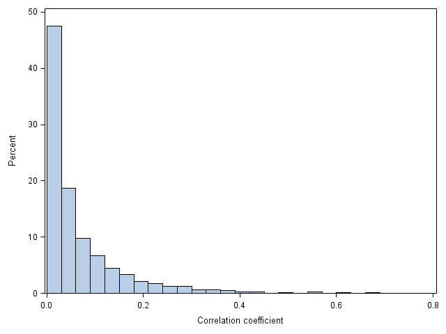
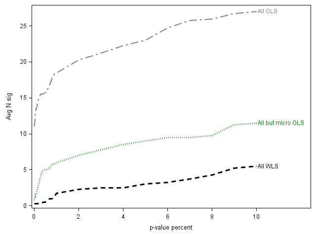
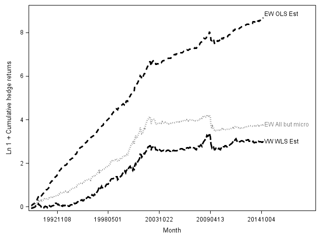

# 提供关于美国股票月度平均收益独立信息的公司特征

**Jeremiah Green**
宾州州立大学 — jrg28@psu.edu

**John R. M. Hand\***
北卡罗来纳大学教堂山分校 — hand@unc.edu

**X. Frank Zhang**
耶鲁大学 — frank.zhang@yale.edu

*本版本日期：2016 年 10 月 14 日*

\* 通讯作者：John R. M. Hand，Kenan-Flagler Business School，UNC Chapel Hill，Chapel Hill, NC 27599，电话 919-962-3173。本文得益于 Andrew Karolyi、两位匿名审稿人、Jeff Abarbanell、Sanjeev Bhojraj、Matt Bloomfield、John Cochrane、Oleg Grudin、Bruce Jacobs、Bryan Kelly、Juhani Linnainmaa、Ed Maydew、Scott Richardson、Jacob Sagi、Eric Yeung，以及芝加哥大学、康奈尔大学、UNC–Chapel Hill、2013 年秋季量化分析师学会（SQA）会议、2013 年秋季芝加哥量化联盟（CQA）会议和 2014 年 Jacobs Levy 量化金融研究会议与会者的宝贵意见。本文的 SAS 程序可在 https://sites.google.com/site/jeremiahrgreenacctg/home 获取。

---

## 亮点

- **Alpha 思想：** 在数以百计异象特征的"庞大动物园"中，只有一小部分对美国股票月度平均收益具有*独立*信息——而且这一子集随时间急剧萎缩。本文识别出在 94 个特征同时纳入回归后仍然存活的那部分特征。
- **数据来源：** CRSP（收益率、价格、成交量）、Compustat（年度与季度财务数据）和 I/B/E/S（分析师预测）。
- **股票池：** 在 NYSE、AMEX 和 NASDAQ 上市的全部普通股，并明确区分**非微型股**（市值高于 NYSE 第 20 百分位）与**微型股**（市值低于该百分位）。
- **样本区间：** 1980 年 1 月 – 2014 年 12 月（共 35 年）；样本外对冲组合检验区间为 1990 年 1 月 – 2014 年 12 月。
- **核心发现：** 在 1980–2014 年间，94 个特征中仅有 **12 个**是非微型股收益可靠的*独立*决定因素。在 2003 年出现急剧结构性断点之后，非微型股中仅剩 **2 个**特征仍为独立决定因素，而利用特征预测性所获得的对冲收益在统计上已与零无显著差异。
- **信号构建：** Fama-MacBeth 横截面回归，同时纳入全部 94 个标准化特征；汇总两种估计量——对全部股票采用市值加权最小二乘法（VWLS），对非微型股采用普通最小二乘法（OLS）——并以**依赖性调整的假发现率（DFDR）** p 值（Benjamini-Yekutieli）和 |t| ≥ 3.0（Harvey-Liu-Zhu）作为显著性判据。
- **关键数字：** 非微型股的月度原始对冲收益均值从 2003 年前的 **2.8%（t = 5.7）** 跌至 2003 年后的 **0.1%（t = 0.2）**；非微型股独立特征的数量从 **12 个**降至 **2 个**。

---

## 摘要

我们承接 Cochrane（2011）提出的挑战，通过在 Fama-MacBeth 回归中同时纳入 94 个特征（这些回归避免了对微型股的过度加权并对数据窥探偏差进行了调整），来识别哪些公司特征能够提供关于美国股票月度平均收益的独立信息。我们发现：在 1980–2014 年整个区间内，非微型股中有 12 个特征是可靠的独立决定因素；然而收益可预测性在 2003 年急剧下降，自此之后仅有两个特征仍是独立决定因素。在微型股之外，利用基于特征的可预测性所获得的对冲收益自 2003 年以来也与零无显著差异。

---

## 1. 引言

Cochrane 在其 2011 年美国金融学会主席致辞中（Cochrane, 2011, p.1060）向研究者提出挑战：识别哪些公司特征能够提供关于美国股票平均收益的独立信息。Cochrane 之所以发出这一挑战，是因为自 1970 年以来，异象文献中已有数以百计的特征被呈现为收益横截面的统计显著预测因子（Green, Hand and Zhang, 2013; Hou, Xue and Zhang, 2016），形成了所谓"庞大的动物园"。本研究的目的是开始回应 Cochrane 的号召：使用来自 CRSP、Compustat 和 I/B/E/S 的 94 个特征、1980–2014 年间的美国股票一个月提前期收益，并采用避免过度加权微型股（Fama and French, 2008; Hou, Xue and Zhang, 2016）以及调整数据窥探偏差（Benjamini and Yekateuli, 2001; Harvey, Liu and Zhu, 2016）的实证方法。

我们的总体方法沿袭 Fama and French（1992）等研究，即估计一系列 Fama-MacBeth 回归。然而，我们在四个方面有别于既有异象文献。首先也是最重要的，我们聚焦于同时将所研究的全部 94 个公司特征作为解释变量纳入。这使我们能够识别出那些提供独立的、非冗余信息的特征。我们之所以能够同时评估全部 94 个特征，是因为特征之间的平均绝对相关性很小（0.07），并且我们通过将缺失的特征值设为该月非缺失值的标准化均值，从而保留了全部"公司-月"观测。

其次，由于微型股——市值低于 NYSE 第 20 百分位的股票——仅占美国股票市场总价值的 3%，我们以避免过度加权微型股的方式来考察股票横截面（Hou, Xue and Zhang, 2015）。我们基于样本与方法的两类组合来估计回归：对全部股票采用市值加权最小二乘法（VWLS），以及对非微型股（剔除微型股后的全部股票）采用 OLS。前者赋予大盘股更大权重，后者则更强调小型但非微型股的股票。我们将这两种方法的结果合并，以得出关于非微型股广泛横截面的推断。为展示微型股的影响并与既往研究对比，我们亦报告对全部股票采用 OLS 的结果。

第三，鉴于在估计含有大量回归量的回归以及使用已被既往研究识别的特征时所产生的数据窥探顾虑，我们采用经假发现率调整的双尾 p 值（该调整考虑了各假设检验之间的依赖性，在我们的情境下即回归系数的 p 值）来评估某一特征是否统计显著（Benjamini and Yekateuli, 2001）。若采用 Harvey, Liu and Zhu（2016）的建议——即 Fama-MacBeth t 统计量的绝对值须达到 3.0 及以上才算显著——我们的推断也基本一致。

最后，鉴于自我们数据窗口起点 1980 年以来，美国资本市场在技术、信息、交易量以及多空投资工具的类型与容量方面均发生了重大变化，我们评估收益生成过程在日历时间上的稳定性。我们发现基于特征的可预测性在 2003 年发生了显著转变：2003 年之后非微型股的对冲组合收益降至零，独立特征的数量也降至仅两个。对微型股而言，独立特征的数量同样下降，但微型股的对冲组合收益在 2003 年之后仍保持可靠地为正。

我们首先建立一个常规基准，以便与本文方法的结果相比较。该基准包括：在全样本 1980–2014 区间上，估计每个特征单独作为自变量的回归，以及将给定单特征加上 Carhart（1997）、Fama and French（2015）和 Hou, Xue and Zhang（2015）等著名基准因子模型的特征等价物作为解释变量的回归。

我们发现：当 Fama-MacBeth 回归中仅含单一特征并采用 VWLS 对全部股票估计时，94 个特征中仅有一个显著（长期净经营性资产增长）；而采用 OLS 对非微型股估计时，有 12 个特征显著（资产增长、行业调整销售增长、流通股本变化百分比、存货增长、盈余公告收益、账面权益增长、CAPEX 增长、长期净经营性资产增长、PP&E 加存货增长、连续盈余同比增长的季数、销售增长减存货增长、以及标准化未预期季度盈余）。将两种方法合并，非微型股横截面共有 12 个单变量显著特征，而以微型股为主的横截面则有 30 个单变量显著特征。这表明，绝大多数被提出作为异象的特征在 1980–2014 这 35 年的全样本区间内并不稳健地以单变量形式存在，对非微型股尤其如此。

接下来，我们在控制著名基准因子模型所对应的 3–4 个特征后逐一评估各特征，从而拓展单变量视角。采用 VWLS 对全部股票估计时，在 Carhart、五因子和 q-因子模型上分别检验的 90–91 个特征中，分别有 6、4 和 1 个显著；采用 OLS 对非微型股估计时则分别有 17、4 和 4 个显著。这表明，在以著名因子模型为基准的低维模型中，Hou, Xue and Zhang 的 q-理论模型最能捕捉平均收益的独立决定因素，因为它在 q-因子模型本身所设定的特征之外，产生最少的增量显著公司特征。

作为本文的核心，我们随后放弃一次只评估一个非基准模型特征的做法，转而在 Fama-MacBeth 回归中同时纳入全部 94 个特征。基于 OLS 的假设以及特征之间较低的平均绝对横截面相关性，这使我们能够识别收益的独立决定因素。我们估计：采用 VWLS 对全部股票估计时有 6 个特征是独立决定因素，采用 OLS 对非微型股估计时有 9 个特征是独立决定因素。将两种方法合并，非微型股中共有 12 个独立特征：账面市值比、现金、分析师数量变化、盈余公告收益、1 个月动量、6 个月动量变化、连续盈余同比增长的季数、年度研发支出与市值之比、收益波动率、换手率、换手率的波动率、以及零交易日天数。相比之下，以微型股为主的"全部股票 OLS"横截面有 23 个独立特征。

综合来看，关于 1980–2014 全样本期间美国股票月度平均收益决定因素的单变量与多变量发现，可得出三个主要启示。其一，多变量识别出的少量独立特征与单变量显著特征的数量相同（均为 12 个），这使我们得出结论：并非少数独立特征能够吸收大量单变量显著特征所含的信息；而是在调整微型股影响和数据窥探顾虑之后，本质上就只有少数特征能够独立预测非微型股的平均收益。

其二，独立特征的身份与性质不同于单变量显著特征。基于 McLean and Pontiff（2016）提出的基本面（Fundamental）与市场（Market）异象分类，12 个单变量显著特征中有 10 个属于基本面类（资产增长、行业调整销售增长、存货增长、账面权益增长、CAPEX 增长、长期净经营性资产增长、PP&E 加存货增长、连续盈余同比增长的季数、销售增长减存货增长、以及标准化未预期季度盈余），两个属于市场类（流通股本变化百分比、盈余公告收益）。相反，12 个多变量识别的独立特征中仅有一个是基本面类（连续盈余同比增长的季数），而有七个是市场类（6 个月动量变化、盈余公告收益、1 个月动量、收益波动率、换手率、换手率的波动率、零交易日天数）。这些差异表明，需要在研究中控制平均收益决定因素的研究，最好使用我们所识别的独立特征，而非单变量显著特征。

其四，在非微型股收益中作为独立决定因素的特征，通常也是微型股收益中的独立决定因素，但反之不然。非微型股的 12 个独立特征中，有 10 个也是微型股（全部股票 OLS）中的独立特征；而微型股（全部股票 OLS）的 23 个独立特征中，有 13 个并非非微型股中的独立特征。此外，非微型股的 12 个独立特征中有 11 个不同于 Carhart、五因子和 q-因子基准模型所对应的特征，账面市值比是唯一例外。这提示未来研究可从允许跨公司规模差异、并纳入比现有基准模型更广特征的平均收益模型中获益。

本文最后一组结果进一步表明：独立特征的数量和经济重要性在日历时间上存在显著差异，且这种差异随公司规模而变。具体而言，我们记录到 2003 年基于特征的可预测性所获得的对冲组合收益规模出现急剧向下的拐点，对非微型股尤其明显。利用全部 94 个特征获取可预测性的月度原始对冲收益均值，在市值加权的全部股票对冲组合中从 2003 年前的 1.9%（t 统计量 = 4.4）降至 2003 年后的 0.5%（t 统计量 = 1.1）；在等权非微型股对冲组合中从 2003 年前的 2.8%（t 统计量 = 5.7）降至 2003 年后的 0.1%（t 统计量 = 0.2）。对微型股而言，尽管 2003 年前后月度原始对冲收益均显著为正，但 2003 年后其规模缩小了近三分之二。将用于构造对冲收益的特征限定为前述 12 个子集，结论类似；控制 Carhart、五因子和 q-因子基准模型的因子收益后亦然。

与对冲收益的急剧下降相一致，我们还发现 2003 年后非微型股收益中仅有两个特征是独立决定因素，而 2003 年前为 12 个。对微型股而言，独立决定因素的数量也下降，从 25 个降至 8 个，降幅达三分之二。因此，除数据窥探和发表后衰减之外，尽管特征间的平均横截面相关性很低（0.07），但自 2003 年以来，非微型股收益横截面中几乎不存在任何基于特征的异象，微型股横截面中也仅存不到十个。这表明，2003 年特征对美国股票月度平均收益的经济与统计显著性的转变，对既往与未来研究都构成了有意义的挑战。

总体而言，我们的发现——1980–2014 年间 94 个特征中仅 12 个对非微型股提供独立信息，且 2003 年后仅 2 个特征仍有意义——为 Harvey, Liu and Zhou（2016）的数据窥探批评和 McLean and Pontiff（2016）的发表后衰减发现所已引发的、对既往研究结论的质疑，进一步增添了疑虑。尽管我们的结果与"既往研究所记录的收益可预测性存在严重数据窥探问题"（Harvey, Liu, and Zhu, 2016; Linnainmaa and Roberts, 2016）这一观点一致，但我们所记录的可预测性在 2003 年前后以及不同公司规模间的显著差异表明，数据窥探并非完整的解释。

尽管我们未能识别 2003 年基于特征的可预测性骤降的确切原因，但一种解释是：基于特征的可预测性反映了错误定价，而随着套利成本下降，错误定价也随之消减。与"基于特征的可预测性反映错误定价"一致，Engelberg, McLean and Pontiff（2016）基于 97 个特征得出结论：异象收益源于投资者预期的偏差，因为它们在盈余公告日高出七倍、在公司新闻日高出两倍，并能可靠地预测分析师预测误差。与"套利错误定价的成本随时间下降"一致，我们注意到 2002 年 7 月至 2003 年 6 月间，信息与交易环境发生了一系列变化，包括《萨班斯-奥克斯利法案》（Sarbanes-Oxley Act）的通过、SEC 对 10-Q 和 10-K 报送要求的加速、以及 NYSE 自动报价（autoquoting）的引入。尽管这些变化在时间上的并存使我们难以将其中的某一个或多个与我们所观察到的月度收益生成过程转变进行因果识别，但我们认为，这些变化总体上使快速实施量化多空交易策略变得更廉价、在技术上更可行。因此，与 Shleifer and Vishny（1997）、Lesmond, Schill and Zhou（2004）、Chordia, Roll and Subrahmanyam（2008）、Li and Zhang（2010）以及 Lam and Wei（2011）的昂贵套利限制论一致，我们推测，信息与交易环境的此类变化增加了套利活动、提升了股票市场效率，并在 2003 年前特征显著定价反映了高昂套利限制的程度上，削弱了特征对 2003 年后平均收益的决定作用。

---

## 2. 关于公司特征与股票收益横截面的既有文献

本研究与三个主要研究领域相关。第一类是将平均收益建模为公司特征或对定价因子暴露的函数的研究。这类研究的结论是：基于少数特征的因子模型，基本能够解释按大量特征逐一对公司排序所形成的投资组合收益（Hou, Xue and Zhang, 2015; Fama and French, 2015, 2016）。例如，受 q-理论启发，Hou, Xue and Zhang（2015）发现，由市场超额收益、小减大（SMB）规模因子、高减低投资因子、以及高减低净资产收益率因子所构成的因子模型，其表现与包含规模、账面市值比和 12 个月动量的模型相当，同时还能捕捉到三因子模型无法解释的许多模式。Hou, Xue and Zhang 因此提出，其四因子模型是其他因子模型的有力替代，任何新异象变量都应以 q-因子模型为基准进行检验，以判断该异象是否真正提供增量信息。在相关方法中，Fama and French（2015, 2016）发展出五因子模型，在 Fama and French（1993）三因子模型基础上增加了盈利和投资因子（Li, Livdan and Zhang, 2009; Novy-Marx, 2013）。Light, Maslov and Rytchkov（2016）则采用完全不同的方法，将预期收益视为潜变量，发展出一种将基于特定特征的 13 个因子蒸馏为两个新因子的程序，并认为其中一个因子概括了全部异象的信息。

本研究还涉及考察收益可预测性的研究。既往研究发现，收益可预测性在套利摩擦最高的股票中最强，并随着套利摩擦下降和套利活动增加而随时间衰减。Lesmond, Schill and Zhou（2004）、Hou and Moskowitz（2005）、Chordia, Roll and Subrahmanyam（2008）、Li and Zhang（2010）以及 Lam and Wei（2011）均报告：公司特征主要在高交易成本或高套利摩擦的股票中预测收益。与之一致，Schwert（2003）、Green, Hand and Soliman（2011）、Hendershott, Jones and Menkveld（2011）、Chordia, Subrahmanyam and Tong（2014）以及 McLean and Pontiff（2016）发现，各类基于特征的异象收益随着套利活动增加或异象被公开而衰减。最近，Novy-Marx and Velikov（2016）观察到，虽然低换手率策略的收益对交易成本调整具有稳健性，但许多高换手率策略则不然。

本研究涉及的第三类是试图衡量收益维度的研究，主要使用公司特征，方式或是间接地——编目那些在无控制或低维控制方法下被发现显著的特征；或是直接地——将中等规模的特征集放入多维模型。在编目方法方面，Subrahmanyam（2010）识别了 50 个显著特征；Green, Hand and Zhang（2013）列出了异象文献中的 330 个特征；Harvey, Liu and Zhu（2016）列举了 315 个此类特征和/或因子；Hou, Xu and Zhang（2016）进一步将基于异象的公司特征集扩展至 430 个以上。在多维视角方面，Jacobs and Levy（1988）分析了 25 个特征，发现 10 个显著；Haugen and Baker（1996）报告其所研究的 40 个相互关联特征中有 11 个显著。[^1] 在基于已发表研究选取的特征集中，Fama and French（2008）和 Lewellen（2015）分别发现 7 个中有 7 个、15 个中有 10 个特征显著。[^2] 与本研究同期，DeMiguel 等（2016）采用将公司特征纳入投资者组合优化过程（将组合权重建模为公司特征的函数）的方法，发现其研究的 50 个特征中有 6 个是联合显著的预测因子。从因子定价视角看待异象，Stambaugh and Yuan（2016）发现 1967–2013 年间，一个包含两个错误定价因子外加市场和规模的四因子模型能够容纳大量异象。

尽管有上述既往研究，Cochrane（2011）所提的挑战依然存在：异象文献中 430 多个特征里，仅有一小部分以"识别哪些公司特征能够提供关于平均收益的独立信息"的方式被研究过。本文通过同时评估比既往工作大得多的特征集来回应 Cochrane 的挑战，并在这一更大特征集中，不仅估计独立决定因素的数量、身份和经济显著性，还新近揭示了在全样本 1980–2014 期间所得结果随时间（尤其是 2003 年前后）变化的程度。

[^1]: Haugen and Baker（1996）所用的 40 个特征中，许多是少数几个构念的高度相关变体，其结果是 Haugen and Baker 的分析很可能基于少于 40 个独立特征。
[^2]: Fama and French（2008）围绕特征的显著性是否在公司规模间稳健来展开分析。Lewellen（2015）则聚焦于其从所研究的 15 个特征中提取的股票收益预测的横截面离散度和样本外预测能力。

---

## 3. 数据集构建与公司特征间的相关性

### 3.1 按日历时间对齐的数据集

由于本文的首要目标是通过将一个月提前期收益同时对大量特征回归来实证识别平均收益的独立决定因素，我们面临若干设计抉择：纳入哪些特征、纳入多少；如何跨公司、跨时段和跨数据库合并特征；以及如何处理缺失数据。为最大程度便于他人复现和/或扩展本研究，我们力求透明地详述在筛选、对齐和编码公司特征时所做的选择。在此过程中我们承认，我们所做的某些选择使我们在确切的研究设计、特征定义和样本区间上，偏离了特征最初被识别的原始论文。

我们最初从 Green, Hand and Zhang（2013）所列 330 个特征中选取了 102 个，要求每个特征都能完全从 CRSP、Compustat 和/或 I/B/E/S 数据计算得到。[^3] 我们的数据覆盖 1980 年 1 月至 2014 年 12 月这 35 年。我们从 1980 年开始，是因为大多数特征只有在 1980 年才开始稳健可得。所选 102 个特征列于表 1。每个特征的细节（包括如何计算的描述，以及其底层学术研究的作者、期刊、发表或工作论文年份）见附录。这些特征既涵盖高被引论文也涵盖低被引论文，既包括已发表论文也包括工作论文，发表日期介于 1977 至 2016 年之间。有时一篇论文会贡献多个特征。

我们从在 NYSE、AMEX 或 NASDAQ 上市、在 CRSP 有月末市值且年度财务报表中普通股权益非缺失的全部公司普通股开始构建数据。随后我们跨 Compustat、I/B/E/S 和 CRSP 整合数据，并按日历时间计算和对齐特征。由于 Green, Hand, and Zhang（2013）报告其列出的 330 个特征中有 57% 被原作者通过月度收益视角评估，我们每月重新计量和重新对齐特征。对于第 t 月的收益，我们按第 t-1 月末的状态计算特征，并假设：若公司财年至少在第 t-1 月末之前六个月结束，则年度会计数据在第 t-1 月末可得；若公司财政季度至少在第 t-1 月末之前四个月结束，则季度会计数据在第 t-1 月末可得。I/B/E/S 与 CRSP 数据分别使用 I/B/E/S 统计期日期和 CRSP 月度或日度结束日期按日历时间对齐。

[^3]: 我们还将公司特征限定为主效应信号。我们不包含与其他特征交互的特征。

虽然月度更新与许多量化机构投资者使用的组合再平衡方法一致，但我们认识到一些从业者更新数据的频率高达每分钟，或低至每 12 个月。我们选择月度更新，是因为我们将其视为较低频率下更低交易与换手成本、与更高时效性收益之间的合理折中（Novy-Marx and Velikov, 2016）。这一选择意味着：我们数据集中来自短于月度频率研究的特征将不如原始研究中及时，而来自长频率研究的特征则更及时。这种错位可能降低我们检测单个特征增量显著性的能力，但同时也降低了我们会识别出无法经受高换手策略交易成本效应的收益可预测性的可能性（Novy-Marx and Velikov, 2016）。

我们从 CRSP 取月度股票收益，并按 Shumway and Warther（1999）纳入退市收益。我们删除了 20 条月度收益低于 −100% 的观测，并将分析师跟踪数量 `nanalyst` 的空值设为零。I/B/E/S 是我们数据库中对公司覆盖度和时间可得性最受限的，因此我们仅从 1989 年 1 月起使用基于 I/B/E/S 的特征，因为 I/B/E/S 更广泛的覆盖始于该时点。[^4] 沿用 Hou, Xue and Zhang（2015）和 Fama and French（2015）等既往研究，我们基于公司月度的 NYSE 百分位来划分规模组别。我们将第 t-1 月末市值大于 NYSE 中位数的股票标记为大盘股，将低于中位数且高于第 20 百分位的标记为小盘股，将低于或等于第 20 百分位的标记为微型股，将剔除微型股后的股票称为非微型股。

[^4]: 使用 I/B/E/S 数据的公司特征为 `chnanalyst`、`chfeps`、`disp`、`fgr5yr`、`nanalyst`、`sfe` 和 `sue`。

由于在我们的关键分析中，我们通过对所有特征同时回归一个月提前期收益来识别平均收益的独立决定因素，因此在这些回归中我们避免仅仅因为某特征在一个或多个"公司-月"中缺失就将其舍弃。在 1980 年 1 月至 2014 年 12 月间，仅 4% 的特征具有完整无缺失数据。我们尽可能保留特征信息的做法是：先将所有特征按其月度分布的第 1 和第 99 百分位进行缩尾（winsorize），并标准化为零均值和单位标准差；然后将缺失特征值设为该特征标准化后的月度均值零。[^5] 在表 2 中，我们对每个公司特征报告：在 1980 年 1 月至 2014 年 12 月期间，我们 1,933,898 个"公司-月"观测中非缺失数据的数量，以及重置为零前缺失的百分比。我们注意到，缺失比例最大的特征通常是那些使用 I/B/E/S 分析师信息（`chnanalyst`、`chfeps`、`disp`、`fgr5yr`、`nanalyst`、`sfe` 和 `sue`）或使用稀疏 Compustat 数据（`rd_mve`、`rd_sale`、`realestate`）的特征。

[^5]: 将缺失自变量替换为其样本均值的方法被称为零阶回归法（zero-order regression method, Wilks, 1933）。在因变量与自变量服从多元正态的条件下，零阶方法通常被认为能产生无偏的斜率系数估计（Afifi and Elashoff, 1966）。

### 3.2 公司特征间的相关性

我们通过衡量初始 102 个公司特征之间的横截面相关性，来评估 Fama-MacBeth 回归中多重共线性的潜在影响。多重共线性虽不会导致斜率系数估计产生偏差，但会增大其标准误。因此，如果我们能够因为某些特征与其他特征存在机械或经济上的高度相关——例如贝塔与贝塔平方——而将其排除，那么在我们估计同时包含大量特征的回归时（尤其是高度共线特征数量较少时），我们预期能更有力地识别平均收益的独立决定因素。

因此，我们计算每个特征的方差膨胀因子（VIF），因为 VIF 概括了某特征被所有其他特征的线性组合所解释的程度（Greene, 2011）。表 3 的 A 栏描述了 VIF 的分布。VIF 的中位数 1.8 并不大，但 VIF 是右偏的——有 10% 的特征 VIF ≥ 9.8。因此，我们通过剔除与其他特征关系最强的 8 个特征（每个 VIF > 7）来缓解同时纳入全部特征的关键回归中多重共线性的影响，它们是 `betasq`、`dolvol`、`lgr`、`maxret`、`mom6m`、`pchquick`、`quick` 和 `stdacc`。随后我们在全部分析中使用剩余的 94 个特征。[^6]

在表 3 的 B 栏中，我们报告了剔除 VIF 大于 7 的 8 个特征前后，特征间绝对横截面相关性的关键百分位。在两种情形下，平均和中位绝对相关性都很低，分别为 0.07 和 0.03。[^7] 不出意料，剔除 VIF > 7 的特征后，最大横截面相关性也下降。C 栏展示了 94 个非高相关特征间绝对横截面相关性的分布，清楚表明 90% 的绝对横截面相关性低于 0.2。

[^6]: 在未列表的分析中，我们将剔除特征的 VIF 门槛在 5 至 10 之间变动，发现与使用默认 VIF 门槛 7 的结果非常相似。即便完全不基于 VIF 门槛剔除任何特征，结果也类似。
[^7]: 若在将缺失特征值重置为各特征月度均值后再计算横截面相关性，特征间的平均绝对相关性同样很小。（B 栏和 C 栏使用可能含缺失值的特征，而用于计算 VIF 的混合回归使用已将缺失值设为月度均值的特征。）

---

## 4. 实证方法与结果

我们在 1980–2014 年间估计标准的 Fama and MacBeth（1973）回归，以确定 94 个公司特征中有多少、以及哪些是一个月提前期收益的统计显著决定因素，尤其是在它们全部同时纳入回归时。在评估某特征是否与平均收益可靠相关时，我们警惕两类推断偏差：一是对仅占 NYSE-Amex-NASDAQ 全集市值约 3% 的微型股过度加权（Fama and French, 2008; Hou, Xue and Zhang, 2016），二是数据窥探。

我们通过将大多数分析聚焦于非微型股横截面来避免第一类偏差，具体有两种实现：对全部股票应用市值加权最小二乘法（VWLS），以及对非微型股使用 OLS。VWLS 方法赋予大盘股更大权重，而 OLS 方法更强调较小（但非微型）的股票。该方法类似于构建旨在最小化微型股影响的组合时所用方法（Hou, Xue, and Zhang, 2016）。在得出关于非微型股的推断时，我们合并两种方法的结果；而为参考起见，我们使用对全部股票的 OLS 来得出倾向于微型股的推断。

我们通过以下方式避免数据窥探偏差：使用经假发现率调整（考虑了一组给定回归估计中各 p 值之间依赖性）的双尾 p 值来评估某特征估计系数的统计显著性（Benjamini and Yekateuli, 2001）。[^8] 我们将此类 p 值称为 DFDR p 值，并要求 DFDR p 值 ≤ 0.05 才视相应参数估计为统计显著。沿用 Harvey, Liu and Zhu（2016）的方法，我们还报告绝对值 ≥ 3.0 的 t 统计量个数，其中 t 统计量由月度系数均值的时间序列计算，并采用 Newey-West 12 期滞后调整。

[^8]: 在我们的情境中，鉴于我们的目标是评估单个特征系数的显著性，而非将全部特征作为一组进行联合显著性检验，因此我们面临因偶然性而对某些特征错误拒绝零假设的风险。这种多重检验顾虑在其他研究文献中很常见，近期也由 Harvey, Liu, and Zhu（2016）在收益预测情境下提出。Harvey 等（2016）所关注的，是新收益预测因子可能因检验使用相同数据集而被错误地判定为统计显著；而我们关注的是，由于在同一回归中同时纳入大量特征和/或因使用相同数据集估计多个回归，我们可能错误地得出某收益预测因子显著的结论。为调整显著性检验以考虑这些问题，其他文献发展出了包括族错误率（FWER）调整和假发现率（FDR）在内的工具。由于 FWER 调整非常保守，我们选择在从回归中对统计显著性作推断时使用 FDR 调整 p 值。FDR 调整假设被拒绝的零假设中有一定比例是错误的——在我们的检验中这一点很可能成立。然而，我们采用 Benjamini and Yekateuli（2001）的方法，该方法将 Benjamini and Hochberg（1995）的基本 FDR 方法扩展为还能调整因我们的检验在不同样本和/或方法下使用相同的因变量和自变量集而产生的 p 值依赖性。

### 4.1 平均收益的基准模型

我们首先建立一个常规基准，以便与"在 Fama-MacBeth 回归中同时纳入全部 94 个特征"这一主要方法的结果相比较。该基准包括：估计每个 94 特征单独作为自变量的回归，随后估计在 Carhart（1997）、Fama and French（2015）和 Hou, Xue and Zhang（2015）著名基准因子模型的特征等价物之上，逐一加入一个不在基准模型中的特征的回归，使用 1980–2014 全样本数据。

在表 4 的 A 列中，我们详述将每个特征单独放入其自身 Fama-MacBeth 回归的结果，B–D 列则是将每个特征逐一加到某基准模型所要求特征之上的结果。基准特征为：Carhart 模型的规模、账面市值比和 12 个月动量；五因子模型的规模、账面市值比、投资和经营盈利能力；q-因子模型的规模、投资和季度净资产收益率。每列中我们报告全部股票 WLS、非微型股 OLS、以及全部股票 OLS 的结果。为便于读者在大量特征中识别哪些系数显著，DFDR p 值 ≤ 0.05 的系数估计以加粗 t 统计量显示。DFDR p 值 ≤ 0.05 的系数估计个数和绝对 t 统计量 ≥ 3.0 的个数显示在表 4 的第一、二行。

以 DFDR p 值 ≤ 0.05 的系数估计来衡量，在 A 列我们发现：以 VWLS 对全部股票估计的非微型股单变量回归中，94 个特征仅 1 个显著（长期净经营性资产增长）；而以 OLS 对非微型股估计时有 12 个显著（资产增长、行业调整销售增长、流通股本变化、存货变化、盈余公告收益、账面权益增长、CAPEX 增长、长期净经营性资产增长、PP&E 加存货增长、连续盈余同比增长季数、销售增长减存货增长、以及标准化未预期季度盈余）。将两种非微型股横截面度量合并，共得 12 个单变量显著特征，其身份与 OLS 对非微型股所得完全相同。值得注意的是，越小股票被加权越多，可靠的单变量显著特征就越多——当微型股与较大股票获得相同回归权重时（全部股票 OLS），有 30 个显著特征。[^9] 因此，A 列结果表明，既往异象文献中作为异象提出的绝大多数特征，在 1980–2014 全样本期间并不稳健地以单变量形式存在，且即便存在也集中于微型股。

[^9]: 我们还注意到，基于 DFDR p 值 ≤ 0.05 的显著特征个数与绝对 t 统计量 ≥ 3.0 的相比，前者所得的显著特征更少，这反映了 DFDR 考虑多个系数 p 值间依赖性的目标。

我们注意到，关于显著系数数量与身份的判断，依赖于我们判断哪些系数可能由样本内数据过拟合所驱动的能力。我们推断大量系数不显著，与既往研究不同，原因在于我们淡化微型股，并使用 DFDR p 值来对统计显著性进行多重检验调整。在图 1 中，我们直观展示表 4 中以 DFDR p 值判定的显著系数个数，如何随高于或低于我们 5% 临界值的 DFDR p 值而变化。图 1 显示，统计显著系数的个数在非常低的显著性水平（p 值 < 0.01）附近变化最为剧烈。在我们使用的 5% 临界值附近，图 1 中的曲线相对平坦，表明在表 4 的任一列内，显著系数估计的个数对 p 值临界值取 1%、5% 还是 10% 相对不敏感。更为醒目的是，在我们强调（全部股票 OLS）或淡化微型股（全部股票 VWLS 和非微型股 OLS）的方法之间，显著特征数量的差异。总体而言，图 1 显示了在推断平均月度收益中基于特征的可预测性程度时，考虑多重检验的价值以及微型股的不成比例影响。

表 4 的 B–D 列进一步表明：在逐一加入 Carhart、五因子和 q-因子模型时，以 VWLS 对全部股票估计分别有 6、4 和 1 个特征增量显著；以 OLS 对非微型股估计分别有 17、4 和 4 个特征增量显著。由于 B–D 列还显示 q-因子模型在基准模型本身特征之外产生最少的显著特征，我们推断：在三个刻意设为低维的基准模型中，q-因子模型最能捕捉平均收益的横截面变化。我们的结论与 Hou, Xue and Zhang（2015, 2016）的相呼应，他们进行了类似检验但使用 Carhart、五因子和 q-因子模型的因子版本。表 4 还提供了 q-因子模型和五因子模型相对 Carhart 模型表现更佳的一个原因：这些模型包含了一个在逐一考察特征对收益预测性时十分重要的增长度量。

### 4.2 通过在 Fama-MacBeth 回归中同时纳入全部 94 个特征来识别美国月度平均收益横截面的独立决定因素

表 5 呈现了放松表 4 中逐一评估非基准模型特征的单变量方法、转而在 Fama-MacBeth 回归中同时纳入全部 94 个特征的结果，使用 1980–2014 全样本。基于 OLS 的假设，我们认为该方法能使我们最有力地识别平均收益的独立决定因素，因为我们预期只有那些真正是收益独立决定因素的特征，才会在控制所有其他特征影响后仍具显著估计系数。

以 DFDR p 值为据，表 5 的 A 列显示：1980–2014 年间，以 VWLS 对全部股票估计时共有 6 个特征是可靠的独立决定因素（账面市值比、现金、1 个月动量、6 个月动量变化、收益波动率、零交易日天数）。以 OLS 对非微型股估计时增至 9 个（现金、分析师数量变化、盈余公告收益、1 个月动量、连续盈余同比增长季数、年度研发与市值之比、收益波动率、换手率、换手率的波动率）。将两种方法合并，得到 12 个多变量识别的独立特征：账面市值比、现金、分析师数量变化、盈余公告收益、1 个月动量、6 个月动量变化、连续盈余同比增长季数、年度研发与市值之比、收益波动率、换手率、换手率的波动率、以及零交易日天数。如表 4 所示，微型股的不成比例影响可见于表 5 的 C 列——对全部股票应用 OLS 得到 23 个独立特征。

在图 2 中，我们直观展示表 5 中显著系数个数随不同于 5% 临界值的 DFDR p 值变化的函数，并如图 1 所指出曲线相对平坦，对非微型股尤其如此。

综合表 4 和表 5 的结果，关于 1980–2014 年间月度平均股票收益独立决定因素的数量与身份，可得出若干启示。其一，在我们 94 个被既往研究呈现为平均收益预测因子的样本中，仅 12 个对非微型股提供稳健的独立信息，其余 82 个则不能。这一对比描绘了既往研究所作推断可靠性的不利图景。

其二，多变量识别的独立特征数量与单变量显著特征数量相同（均为 12），这表明并非少数独立特征能够有力吸收大量单变量显著特征所含的信息；而是本质上就只有少数特征能独立预测非微型股的平均收益。

其三，独立特征的身份与性质，与单变量显著特征的身份与性质差异巨大。采用 McLean and Pontiff（2016）的基本面与市场异象分类法，我们将 12 个单变量显著特征中的 10 个归为基本面类（资产增长、行业调整销售增长、存货增长、账面权益增长、CAPEX 增长、长期净经营性资产增长、PP&E 加存货增长、连续盈余同比增长季数、销售增长减存货增长、以及标准化未预期季度盈余），两个归为市场类（流通股本变化百分比、盈余公告收益）。相反，12 个多变量识别的独立特征中仅一个是基本面类（连续盈余同比增长季数），而有七个是市场类（6 个月动量变化、盈余公告收益、1 个月动量、收益波动率、换手率、换手率的波动率、零交易日天数）。[^10] 这些差异表明，需要在研究设计中控制平均收益决定因素的研究，若使用我们所识别的独立特征，将能最有力的加以控制。

[^10]: 单变量显著基本面特征之间的平均绝对横截面相关性为 0.19，这表明基本面独立特征的缺乏并非因为它们高度相关、以致在控制所有其他特征后仅有一个显著。

其四，非微型股中的独立特征往往是微型股中的独立特征，但反之不然。非微型股的 12 个独立特征中，有 10 个也是对全部股票 OLS 回归中的独立特征；而微型股（全部股票 OLS）的 23 个独立特征中，有 13 个并非非微型股中的独立特征。此外，12 个独立特征中有 11 个不同于 Carhart、五因子和 q-因子基准模型中的特征，账面市值比是显著例外。这提示：既往使用 Carhart、五因子和 q-因子模型的特征版本来控制其研究焦点自变量之外的平均收益横截面变化的研究，可能并未达到预期的控制程度，尤其是当所研究公司集合为大盘股时。

在表 6 中，我们检验"1980–2014 年间非微型股存在 12 个平均收益独立决定因素"这一结论（来自表 5）的稳健性。具体而言，表 6 报告当作为自变量的特征限定为表 5 中多变量识别为独立决定因素的 12 个时，重新估计表 5 回归的结果。A、B 两列显示：与表 5 中以 DFDR p 值识别的 6 个和 9 个独立决定因素相比，表 6 中可见相近的 5 个和 7 个；同样，表 6 中 A、B 两列合计共 9 个特征，而表 5 为 12 个。我们注意到，比较表 5 与表 6 时，表 5 中唯一代表 Carhart、五因子和 q-因子模型等价特征的账面市值比，在表 6 中不再显著。

### 4.3 利用特征预测收益横截面所得的对冲组合收益

由于统计显著性并不必然转化为经济重要性，本节我们报告对冲组合检验结果，旨在衡量利用全部特征预测一个月提前期收益横截面时所获经济收益的规模。具体而言，沿用 Lewellen（2015）的方法，我们在表 7 的 A 栏报告三个平均一个月持有期的样本外对冲组合原始收益的规模与显著性，计算方式如下。

在 A 栏中，对于自 1990 年 1 月起的每个 t-1 月，我们使用从 t-120 至 t-1 月的数据，估计与表 5 的 A、B、C 列相同的三个回归。如表 4–6，我们假设若公司财年（季度）至少在第 t-1 月末之前六（四）个月结束，则年度（季度）会计数据在第 t-1 月末可得。分别对每列所定义的股票集合，在公司层面将所得的均值系数估计应用于第 t-1 月末相应的 94 个特征值。这为每个公司在第 t 月产生三个预测收益，分别对应 A、B、C 三列。然后，我们使用两种识别预测收益最高和最低十分位的断点类型，以及两种对每个十分位内单个已实现收益进行加权的方法，计算第 t 月三个对冲组合各自的已实现收益。

对于表 7 A 栏中记为组合 A 的列 A 组合，十分位断点仅基于 NYSE 公司（因此每个十分位中 NYSE 股票数量相等，但 NYSE、AMEX 和 NASDAQ 合计未必相等），最高/做多与最低/做空十分位的已实现收益按公司第 t-1 月末市值加权。对于记为组合 B 的列 B 组合，十分位断点基于非微型股，最高/做多与最低/做空十分位的已实现收益等权加权。最后，记为组合 C 的列 C 组合，十分位断点基于 NYSE 股票，最高/做多与最低/做空十分位的已实现收益等权加权。由于每个公司在每个月末都有预测收益，我们的方法在理论上可仅使用历史可得数据实时实施。[^11] 总体而言，应用该方法对三个对冲组合 A、B、C 各自产生 1990 年 1 月至 2014 年 12 月共 274 个已实现原始月度对冲收益的时间序列。

[^11]: 我们确认，我们的方法仅是准样本外的，因为我们使用了在 t-1 月之后才首次在学术文献中报告的特征。然而，可能部分抵消此类数据窥探所造成的可实现对冲收益向上偏差的是，我们从不舍弃任何特征，即使估计系数表明该特征不再增量显著，或显著但符号与异象文献预期相反。

A 栏报告已实现原始月度对冲组合收益的描述性统计。检视可见，三类对冲组合的平均原始收益均统计且经济上显著，并在最小（最大）市值公司中最大（最小）。对于以组合 A（NYSE 十分位断点的全部股票 VW 做多最高/做空最低十分位对冲组合）度量的股票横截面，1990–2014 年间的平均原始月度收益为 1.2%（t 统计量 = 3.8）；而以组合 B（非微型股十分位断点的非微型股 EW 对冲组合）度量的横截面，平均原始月度收益为 1.4%（t 统计量 = 4.5）。这些结果表明，利用全部 94 个公司特征的可预测性能带来可观的经济收益。同时我们注意到，再次凸显微型股不成比例影响的是，组合 C（NYSE 十分位断点的全部股票 EW 对冲组合）的平均原始月度收益为 3.1%（t 统计量 = 11.3）。[^12]

[^12]: 由于异象文献中的原始对冲组合收益常对关键因子收益正交化，在我们的网络附录中，我们报告将 A 栏所述原始对冲组合收益对各 Carhart、五因子和 q-因子模型相关因子收益回归所得的 alpha 截距估计及相应 t 统计量。我们发现，估计 alpha 的大小和显著性与表 7 A 栏的原始对冲收益均值相似。此外，q-因子模型的 alpha 始终最小（消除更多的原始对冲收益均值），强有力地支持了从表 4 所得推断：在基准模型中，Hou, Xue and Zhang 的 q-因子模型最能捕捉由平均收益真正独立决定因素所引起的收益横截面变化。

B 栏报告与 A 栏相同的统计量，但用于构造最高/做多与最低/做空十分位的预测收益，是基于将公司特征限定为表 6 所示 12 个子集，并剔除分析师数量变化（因分析师数据在样本早期不可得）。C 栏列出 A 栏与 B 栏中所报告对冲收益均值的差异。可以看出，将旨在利用基于特征可预测性的对冲组合构造限定为表 5 的 A、B 列所识别的 12 个特征，确实以实质且统计显著的方式降低了平均对冲收益，对大盘股尤其如此。组合 A 的平均对冲收益下降三分之二，从 1.2% 降至 0.4%（差异 t 统计量 = 3.0），而组合 B 仅下降三分之一，从 1.4% 降至 1.0%（差异 t 统计量 = 2.2）。顺便指出，尽管表 5 在微型股中识别了 23 个不同的独立特征（C 列），但将对冲收益组合的构造限定为表 5 的 A、B 列所识别的 12 个特征，仅使微型股组合的平均对冲收益下降四分之一，从 3.1% 降至 2.4%（差异 t 统计量 = 4.0）。

### 4.4 2003 年的可预测性转变，以及美国月度平均股票收益独立决定因素在数量与经济重要性上的 2003 年前后差异

与异象和资产定价文献中几乎所有研究一致，表 4–7 所述结果将 1980–2014 年视为收益生成过程在日历时间上保持不变的统一区间。鉴于 1980–2014 年间股票交易的量、性质和成本发生了重大变化——包括 Reg. FD、报价十进制化、萨班斯-奥克斯利法案、SEC 报送要求加速、自动报价以及计算机化多空量化投资（Chordia, Roll and Subrahmanyam, 2001; Jones, 2002; Schwert, 2003; French, 2008; Green, Hand and Soliman, 2011; Hendershott, Jones and Menkveld, 2011）——我们现在放松这一假设。

我们评估收益生成过程在日历时间上是否恒定的第一种方法见图 3：我们绘制 1 加上累计平均原始对冲组合收益的自然对数，其计算方式等价于表 7 的 A 栏，但剔除了需要 I/B/E/S 数据的七个特征，因为 I/B/E/S 数据仅自 1990 年起稳健可得。目视图 3 可见，所展示三个组合的平均对冲收益在 2002 年末/2003 年初急剧且持续地下降。事实上，对非微型股横截面而言，下降如此剧烈，以至于自 2003 年初以来一个月提前期美国收益的基于特征的可预测性平均为零，仅微型股中残存经济上有意义的可预测性，且程度也大幅降低。

我们在表 8 中提供与这些目视判断一致的统计证据：报告三个对冲组合在 2003 年前、2003 年后、以及"后减前"的平均原始对冲收益及其相应 t 统计量。我们将 2003 年前定义为截至 2002 年 12 月 31 日，2003 年后定义为自 2004 年 1 月 1 日起。表 8 显示，NYSE 十分位断点的全部股票 VW 对冲组合的平均原始月度对冲收益从 2003 年前的 1.9%（t 统计量 = 4.4）降至 2003 年后的 0.5%（t 统计量 = 1.1），每月下降 −1.4% 可靠地为负（t 统计量 = −2.3）。类似地，非微型股十分位断点的非微型股 EW 对冲组合的平均原始月度对冲收益从 2003 年前的 2.8%（t 统计量 = 5.7）降至 2003 年后的 0.1%（t 统计量 = 0.2），2003 年后相对前的下降 −2.7% 可靠地为负（t 统计量 = −4.4）。相比之下，尽管 NYSE 十分位断点的全部股票 EW 对冲组合的平均原始月度收益在 2003 年后相对前也显著下降 −2.8%（t 统计量 = −5.2），但它在 2003 年后期间仍可靠地为正，均值为每月 1.7%（t 统计量 = 4.4）。总而言之，表 8 记录了我们所研究 94 个特征的可预测性程度的经济对冲收益度量在所有规模公司中骤降，且对非微型股而言降幅如此之大，以至于自 2003 年以来利用基于特征可预测性的对冲收益均值与零已无显著差异。基于特征的可预测性仅在微型股中存活，而即便如此，其 2003 年后的可预测性经济规模也比 2003 年前小三分之二。

表 9 通过分别对 1980–2002 和 2004–2014 两个子期间估计与表 5 相同的 Fama-MacBeth 回归，印证了表 8 中对冲收益均值的推断。我们先关注每个子期间报告两种非微型股定义结果的 A、B 列，并如对表 5 的分析那样，以 A、B 两列合并后具有 DFDR p 值 ≤ 0.05 的不同特征个数来衡量平均收益独立决定因素的数量。A、B 两列显示：1980–2002 年间非微型股平均收益有 12 个独立决定因素，而 2004–2014 年间仅有 2 个。我们注意到，后者中有一个既是 2003 年前也是 2003 年后的独立决定因素（连续盈余同比增长季数），而有一个则不是（行业调整的员工数量变化）。我们另从两个 C 列注意到，对全部股票 OLS 的独立决定因素数量从 2003 年前的 25 个降至 2003 年后的 8 个。

我们将 2002 年末/2003 年初月度收益生成过程独立决定因素的数量与经济重要性的急剧转变，尤其是跨公司规模的转变，解释为与 Shleifer and Vishny（1997）、Lesmond, Schill and Zhou（2004）、Chordia, Roll and Subrahmanyam（2008）、Li and Zhang（2010）以及 Lam and Wei（2011）的昂贵套利限制论一致。我们注意到，在 2002 年 7 月至 2003 年 6 月期间，信息与交易环境发生了一系列变化，使快速实施量化多空交易策略变得更廉价、在技术上更可行。

在 2000 年 10 月采纳 Reg. FD 和 2001 年 1 月报价十进制化（二者均降低了有效价差、价格冲击和交易成本，Bessembinder, 2003; Eleswarapu, Thompson and Venkataraman, 2004）之后，信息环境在两方面发生变化。2002 年 7 月《萨班斯-奥克斯利法案》通过，提高了审计质量要求，并对公司财务报表内部控制质量施加了管理层责任，自 2002 财年（于 2003 年初开始报告）起执行。随后，年度和季度报告在财年或季度结束后的 SEC 报送截止期限自 2002 年 11 月起被加速，以使 10-Q 和 10-K 报送更及时。

从技术角度看重要的是，2003 年 1 月至 5 月间 NYSE 引入了自动报价软件——Hendershott, Jones and Menkveld（2011）认为这一变化导致了交易摩擦与成本的急剧下降，以及多空股票对冲基金用于实施多空量化交易策略的算法交易同样急剧增加。尽管这些变化在时间上的并存使我们难以将其中某一个或多个因果地识别为月度收益生成过程转变的解释因素，但我们认为，这些变化总体上使快速实施高成交量量化多空交易策略变得更廉价、在技术上更可行，从而增加了套利活动、提升了股票市场效率，并在 2003 年前特征的统计与经济显著定价反映了高昂套利限制的程度上，削弱了特征对 2003 年后平均收益的决定作用。[^13]

[^13]: 我们不将 2002 年末/2003 年初的转变归因于 MacLean and Pontiff（2015）所记录的单变量对冲收益均值的发表后下降。这是因为我们在 2002 年末/2003 年初并未观察到被发现或发表的异象数量激增（见 Green, Hand and Zhang, 2013, 图 1；Harvey, Liu and Zhang, 2016, 图 1）。我们也将本研究与 Chordia, Subrahmanyam and Tong（2014, CST）区分开来：尽管 CST 记录了异象收益随日历时间的衰减，但他们仅分析了六个异象，且仅检验异象对冲收益的线性或指数衰减。

### 4.5 稳健性检验

本节我们概述在网络附录中详述的、评估主要发现稳健性的补充分析。其一，由于我们识别平均收益独立决定因素的多变量方法之所以可行，依赖于我们将缺失特征值替换为该特征当月标准化均值（零）的做法，因此我们在不替换缺失特征值的情况下重新估计表 4。[^14] 我们发现 Fama-MacBeth 平均斜率系数显著的数量或身份几乎没有差异，这提供了安慰：至少在单变量层面，以及对任一给定特征在仅控制著名基准因子模型特征版的层面，将缺失值替换为标准化均值并不会实质性地影响或驱动我们的结果。

[^14]: 网络附录，表 IA-1。

其二，鉴于我们在表 8 和表 9 中记录了 2003 年基于特征的收益可预测性急剧下降，我们分别对 2003 年前和 2003 年后重新估计表 4 的 A 列单变量分析。[^15] 由此我们确认，2003 年基于特征收益可预测性的下降在单变量和多变量层面均发生。我们还确认，我们基于 1980–2014 全样本的发现——即起作用的特征在单变量层面以基本面为主，在多变量层面以市场类为主——并非单纯因为全样本合并了两个迥异的 2003 年前后子期间。我们观察到，与 1980–2014 全样本相似，2003 年前 12 个单变量显著特征中有 10 个是基本面类，而 12 个独立特征中只有 2 个是基本面类。2003 年后这一对比不再有意义，因为已无单变量显著特征，仅有两个独立特征。

[^15]: 网络附录，表 IA-2。

其三，由于我们使用对冲收益来评估基于特征收益可预测性的经济重要性，我们确认表 7 和表 8 所报告对冲收益的规模与显著性，并非由未能控制公共因子暴露所驱动。我们通过将利用全部 94 个特征的对冲组合收益对 Carhart、Fama-French 五因子和 Hou-Xue-Zhang q-因子模型的月度因子收益回归来做到这一点。[^16] 在未报告的检验中，我们还对 1990–2002 和 2004–2014 期间重复这些检验，结果与表 8 所报告非常相似。

[^16]: 网络附录，表 IA-3。

其四，我们分别对大盘、小盘和微型股重新估计许多回归，采用 VWLS 和 OLS 两种方法。[^17] 这些互斥的基于规模的分析所得发现和推断，与正文主要结果相似。最后，我们提供哪些特征在各替代回归设定下显著与不显著的重叠情形的可视化描绘。[^18] 虽然这些信息可见于我们的主表，但我们的网络附录以可视化方式概括了这些重叠。

[^17]: 网络附录，表 IA-4。
[^18]: 网络附录，图 IA-1 和图 IA-2。

### 4.6 局限性

我们认识到本研究的若干告诫与局限。尽管我们是首个评估大量单个公司特征同时预测力的研究，但我们仅研究了异象文献迄今所报告 430 多个特征中的四分之一。因此，我们很可能并未识别出月度平均收益的所有真正独立决定因素。我们的发现可能也不宜外推到全部 430 多个特征的总体，因为我们的方法是聚焦于可从 CRSP、Compustat 或 I/B/E/S 数据计算的特征，这意味着我们并未从特征总体中随机抽样。我们处理缺失数据的方式以及按日历月（而非原始研究所用的日度或周度）对齐特征，也可能引入了测量误差。我们还注意到，尽管在准样本外检验中我们力求避免使用实时不可得的数据，但实施我们对冲组合所要求的头寸将使投资者面临潜在的交易成本（尤其是在微型股中），以至于扣减交易成本后的对冲收益可能不为正（Novy-Marx and Velikov, 2016）。

---

## 5. 结论与启示

本文旨在回应 Cochrane（2011, p.1060）所提的挑战：研究者应开始识别既往研究中被报告为平均股票收益横截面统计显著预测因子的数百个公司特征"庞大动物园"中，哪些特征提供独立信息。我们采用与 Fama and French 1992 年开创性论文相同的方法，但使用大得多的 94 个公司特征集，并将全部 94 个特征同时作为解释变量纳入避免过度加权微型股、并对数据窥探偏差进行调整的 Fama-MacBeth 回归。

我们的方法使我们估计出：在 1980–2014 全样本期间，12 个特征对非微型股的美国月度平均收益提供显著的独立信息，其余 84 个特征则不提供独立信息。我们表明，少数特征之所以提供独立信息，是因为收益的独立决定因素本质上就少，而非少数特征能够吸收许多单变量重要特征所含的信息。

我们还记录到独立特征的数量及其产生正对冲收益的能力在 2003 年急剧下降，对非微型股尤其如此。我们估计：自 2003 年以来，非微型股收益中仅两个特征仍是独立决定因素，而 2003 年前为 12 个；且非微型股的平均对冲收益自 2003 年以来与零无显著差异。基于特征的可预测性目前仅存在于微型股中。我们将公司特征的数量与经济重要性随日历时间和跨公司规模的下降，解释为最符合 Shleifer and Vishny（1997）等人的昂贵套利限制市场效率论。

总之，通过识别月度平均收益的独立决定因素，并放松"独立决定因素跨公司规模和跨时间相同"的约束，我们除 Harvey, Liu and Zhou（2016）和 McLean and Pontiff（2016）之外，进一步提供了为何对数百项收益异象研究所作推断应保持高度怀疑的理由。与此同时，我们也揭示了有待消化新事实与谜题，其中最突出的是 2003 年基于特征的收益可预测性出现强烈、突然且看似永久的下降（对非微型股尤其如此）。我们的结果提示，未来的平均收益实证模型或许宜对 2003 年后数据赋予比 2003 年前更强的权重、将收益生成过程以公司规模为条件、并出于控制目的使用我们所识别（2003 年前后）的独立特征。

---

## 参考文献

Abarbanell, J.S., B.J. Bushee. (1998). Abnormal returns to a fundamental analysis strategy. *The Accounting Review* 73(1), 19–45.

Acharya, V.V., L.H. Pedersen. (2005). Asset pricing with liquidity risk. *Journal of Financial Economics* 77, 375–410.

Afifi, A.A., R.M. Elashoff. (1966). Missing observations in multivariate statistics: I. Review of the literature. *Journal of the American Statistical Association* 61(315), 595-604.

Ali, A., L-S. Hwang, M.A. Trombley. (2003). Arbitrage risk and the book-to-market anomaly. *Journal of Financial Economics* 69, 355–373.

Amihud, Y., H. Mendelson. (1989). The effects of beta, bid-ask spread, residual risk and size on stock returns. *Journal of Finance* 44, 479–486.

Anderson, C.W., L. Garcia-Feijoo. (2006). Empirical evidence on capital investment, growth options, and security returns. *Journal of Finance* 61(1), 171–194.

Ang, A., R.J. Hodrick, Y. Xing, X. Zhang. (2006). The cross-section of volatility and expected returns. *Journal of Finance* 61(1), 259–299.

Asness, C.S., R.B. Porter, R.L. Stevens. (1994). Predicting stock returns using industry-relative firm characteristics. Working paper, AQR Capital Management.

Balakrishnan, K., E. Bartov, L. Faurel. (2010). Post loss/profit announcement drift. *Journal of Accounting & Economics* 50, 20–41.

Bali, T., N. Cakici, R. Whitelaw. (2011). Maxing out: Stocks as lotteries and the cross-section of expected returns. *Journal of Financial Economics* 99(2), 427–446.

Bandyopadhyay, S.P., A.G. Huang, T.S. Wirjanto. (2010). The accrual volatility anomaly. Working paper, University of Waterloo.

Banz, R.W. (1981). The relationship between return and market value of common stocks. *Journal of Financial Economics* 9(1), 3–18.

Barbee, W.C., S. Mukherji, G.A. Raines. (1996). Do the sales-price and debt-equity ratios explain stock returns better than the book-to-market value of equity ratio and firm size? *Financial Analysts Journal* 52, 56–60.

Barth, M., J. Elliott, M. Finn. (1999). Market rewards associated with patterns of increasing earnings. *Journal of Accounting Research* 37, 387–413.

Basu, S. (1977). Investment performance of common stocks in relation to their price-earnings ratios: A test of market efficiency. *Journal of Finance* 32, 663–682.

Bauman, W.S., R. Dowen. (1988). Growth projections and common stock returns. *Financial Analysts Journal* 44(4), 79–80.

Bazdresch, S., F. Belo, X. Lin. (2014). Labor hiring, investment, and stock return predictability in the cross-section. *Journal of Political Economy* 122(1), 129–177.

Bessembinder, H. (2003). Trade execution costs and market quality after decimalization. *Journal of Financial and Quantitative Analysis* 38, 747-777.

Benjamini, Y., D. Yekutieli. (2001). The control of the false discovery rate in multiple testing under dependency. *Annals of Statistics* 29(4), 1165-1188.

Benjamini, Y., D. Yekutieli. (2005). False discovery rate controlling confidence intervals for selected parameters. *Journal of the American Statistical Association* 100(469), 71-80.

Bhandari, L. (1988). Debt/equity ratio and expected stock returns: empirical evidence. *Journal of Finance* 43, 507–528.

Bonferroni, C.E. (1935). Il calcolo delle assicurazioni su gruppi di teste. *Studi in Onore del Professore Salvatore Ortu Carboni* 13-60.

Brennan, M.J., T. Chordia, A. Subrahmanyam. (1998). Alternative factor specifications, security characteristics, and the cross-section of expected stock returns. *Journal of Financial Economics* 49(3), 345–373.

Brown, S.J. (1989). The number of factors in security returns. *Journal of Finance* 44(5), 1247–1262.

Browne, D.P., B. Rowe. (2007). The productivity premium in equity returns. Working paper, University of Wisconsin.

Carhart, M.M. (1997). On persistence in mutual fund performance. *Journal of Finance* 59, 3–32.

Chan, L.K.C., J. Karceski, J. Lakonishok. (2000). New paradigm or same old hype in equity investing? *Financial Analysts Journal* July/August, 23–36.

Chandrashekar, S., R.K.S. Rao. (2009). The productivity of corporate cash holdings and the cross-section of expected stock returns. Working paper, University of Texas at Austin.

Chen, L., L. Zhang. (2010). A better three-factor model that explains more anomalies. *Journal of Finance* 65(2), 563–595.

Chordia, T., A. Goyal, J.A. Shanken. (2015). Cross-sectional asset pricing with individual stocks: Betas versus characteristics. Working paper, Emory University.

Chordia, T., R. Roll, A. Subrahmanyam. (2008). Liquidity and market efficiency. *Journal of Financial Economics* 87(2), 249–268.

Chordia, T., R. Roll, A. Subrahmanyam. (2011). Recent trends in trading activity and market quality. *Journal of Financial Economics* 101(2), 243-263.

Chordia, T., A. Subrahmanyam, R. Anshuman. (2001). Trading activity and expected stock returns. *Journal of Financial Economics* 59, 3–32.

Chordia, T., A. Subrahmanyam, Q. Tong. (2014). Have capital market anomalies attenuated in the recent era of high liquidity and trading activity? *Journal of Accounting & Economics* 58(1), 41-58.

Cochrane, J.H. (2011). Presidential address: Discount rates. *Journal of Finance* 66(4), 1047–1108.

Connor, G., R.A. Korajczyk. (1993). A test for the number of factors in an approximate factor model. *Journal of Finance* 48(4), 1263–1291.

Cooper, M.J., H. Gulen, M.J. Schill. (2008). Asset growth and the cross-section of asset returns. *Journal of Finance* 63(4), 1609–1651.

Daniel, K., S. Titman. (1997). Evidence on the characteristics of cross-sectional variation in stock returns. *Journal of Finance* 52(1), 1–33.

Datar, V.T., N.Y. Naik, R. Radcliffe. (1998). Liquidity and stock returns: An alternative test. *Journal of Financial Markets* 1(2), 203–219.

De Bondt, W.F.M., R. Thaler. (1985). Does the stock market overreact? *Journal of Finance* 40(3), 793–805.

DeMiguel, V., A. Martín-Utrera, F.J. Nogales, R. Uppal. (2016). Firm characteristics and stock returns: An investment perspective. Working paper, London Business School.

Desai, H., S. Rajgopal, M. Venkatachalam. (2004). Value-glamour and accruals mispricing: One anomaly or two? *The Accounting Review* 79(2), 355–385.

Diether, K., C. Malloy, A. Scherbina. (2003). Differences of opinion and the cross-section of stock returns. *Journal of Finance* 57, 2113–2141.

Eberhart, A.C., W.F. Maxwell, A.R. Siddique. (2004). An examination of long-term abnormal stock returns and operating performance following R&D increases. *Journal of Finance* 59(2), 623–650.

Efron, B., T. Hastie, I. Johnstone, R. Tibshirani. (2004). Least angle regression. *Annals of Statistics* 32(2), 407–499.

Eisfeldt, A.L., D. Papanikolaou. (2013). Organization capital and the cross-section of expected returns. *Journal of Finance* 68(4), 1365–1406.

Eleswarapu, V., R. Thompson, K. Venkataraman. (2004). The impact of regulation fair disclosure: Trading costs and information asymmetry. *Journal of Financial and Quantitative Analysis* 39, 209-225.

Elgers, P.T., M.H. Lo, R.J. Pfeiffer, Jr. (2001). Delayed security price adjustments to financial analysts' forecasts of annual earnings. *The Accounting Review* 76(4), 613–632.

Engelberg, J., R.D. McLean, and J. Pontiff (2016). Anomalies and News. Working paper.

Everitt, B.S., S. Landau, M. Leese, D. Stahl. (2011). *Cluster Analysis*, 5th ed. Chichester, West Sussex, UK: John Wiley & Sons.

Fama, E. (1976). *Foundations of Finance*. New York: Basic Books.

Fama, E., J. MacBeth. (1973). Risk, return, and equilibrium: Empirical tests. *Journal of Political Economy* 81(3), 607–636.

Fama, E., K. French. (1992). The cross-section of expected stock returns. *Journal of Finance* 47(2), 427–465.

Fama, E., K. French. (1996). Multifactor explanations of asset pricing anomalies. *Journal of Finance* 51(1), 55–84.

Fama, E., K. French. (2008). Dissecting anomalies. *Journal of Finance* 63(4), 1653–1678.

Fama, E., K. French. (2014). Incremental variables and the investment opportunity set. *Journal of Financial Economics* 117(3), 470–488.

Fama, E., K. French. (2015). A five-factor asset pricing model. *Journal of Financial Economics* 116(1), 1–22.

Fama, E., K. French. (2016). Dissecting anomalies with a five factor model. *Review of Financial Studies* 29(1), 69–103.

Francis, J., R. LaFond, P.M. Olsson, K. Schipper. (2004). Costs of equity and earnings attributes. *The Accounting Review* 79(4), 967–1010.

Fairfield, P.M., J.S. Whisenant, T.L. Yohn. (2003). Accrued earnings and growth: Implications for future earnings performance and market mispricing. *The Accounting Review* 78(1), 353–371.

French, K. (2008). The costs of active trading. *Journal of Finance* 63, 1537-1573.

Gettleman, E., J.M. Marks. (2006). Acceleration strategies. Working paper, University of Illinois at Urbana-Champaign.

Graham, B. (1959). *The Intelligent Investor, A Book of Practical Counsel*, 3rd ed. New York: Harper & Brothers Publishers.

Green, J., J. Hand, M. Soliman. (2011). Going, going, gone? The apparent demise of the accruals anomaly. *Management Science* 55(5), 797–816.

Green, J., J.R.M. Hand, X.F. Zhang. (2013). The supraview of return predictive signals. *Review of Accounting Studies* 18(3), 692–730.

Greene, W.H. (2011). *Econometric analysis*. 7th ed. Prentice Hall.

Guo, R., B. Lev, C. Shi. (2006). Explaining the short- and long-term IPO anomalies in the U.S. by R&D. *Journal of Business, Finance & Accounting*. April/May, 550–579.

Hafzalla, N., R. Lundholm, M. Van Winkle. (2007). Percent accruals. *The Accounting Review* 86(1), 209–236.

Hahn, J., H. Lee. (2009). Financial constraints, debt capacity, and the cross-section of expected returns. *Journal of Finance* 64(2), 891–921.

Hansen, L.P. (2013). Quoted in "The Nobel Prize is no crystal ball." by Jason Zweig, *Wall Street Journal*, Saturday/Sunday October 19–20, B2.

Harman, H.H. (1976). *Modern Factor Analysis*, 3rd ed. Chicago: University of Chicago Press.

Harris, C.W., H.F. Kaiser. (1964). Oblique factor analytic solutions by orthogonal transformations. *Psychometrika* 29, 347–362.

Harvey, C.R., Y. Liu, H. Zhu. (2016). …And the cross-section of expected returns. *Review of Financial Studies* 29(1), 5–68.

Haugen, R.A., N.L. Baker. (1996). Commonality in the determinants of expected stock returns. *Journal of Financial Economics* 41, 401–439.

Hawkins, E.H., S.C. Chamberlain, W.E. Daniel. (1984). Earnings expectations and security prices. *Financial Analysts Journal*. 40(5), 24–27, 30–38, 74.

Hendershott, T., C.M. Jones, A.J. Menkveld. (2011). Does algorithmic trading improve liquidity? *The Journal of Finance*, 66, 1–33.

Holthausen, R.W., D.F. Larcker. (1992). The prediction of stock returns using financial statement information. *Journal of Accounting & Economics* 15, 373–412.

Hong, M., H. Hong. (2009). The price of sin: The effects of social norms on markets. *Journal of Financial Economics* 93, 15–36.

Horowitz, J.L., T. Loughran, N.E. Savin. (2000). Three analyses of the firm size premium. *Journal of Empirical Finance* 7, 143–153.

Hou, K., T.J. Moskowitz. (2005). Market frictions, price delay, and the cross-section of expected returns. *Review of Financial Studies* 18(3), 981–1020.

Hou, K., D.T. Robinson. (2006). Industry concentration and average stock returns. *Journal of Finance* 61(4), 1927–1956.

Hou, K., C. Xue, L. Zhang. (2016). A comparison of new factor models. Working paper.

Hou, K., C. Xue, L. Zhang. (2015). Digesting anomalies: An investment approach. *Review of Financial Studies* 28(3), 650–705.

Huang, A.G. (2009). The cross section of cash flow volatility and expected stock returns. *Journal of Empirical Finance* 16(3), 409–429.

Jacobs, B.I., K.N. Levy. (1988). Disentangling equity return regularities: New insights and investment opportunities. *Financial Analysts Journal*, May–June, 18–43.

Jacobs, B.I., K.N. Levy. (2014). Investing in a multidimensional market. *Financial Analysts Journal*, November/December.

Jegadeesh, N. (1990). Evidence of predictable behavior of security returns. *Journal of Finance* 45, 881–898.

Jegadeesh, N., S. Titman. (1993). Returns to buying winners and selling losers: Implications for stock market efficiency. *Journal of Finance* 48, 65–91.

Jiang, G., C.M.C. Lee, G.Y. Zhang. (2005). Information uncertainty and expected returns. *Review of Accounting Studies* 10(2), 185–221.

Jolliffe, I. (2014). Principal Component Analysis. *Wiley StatsRef: Statistics Reference Online*.

Jones, C. (2002). A century of stock market liquidity and trading costs. Working paper, Columbia University.

Kama, I. (2009). On the market reaction to revenue and earnings surprises. *Journal of Business Finance & Accounting* 36(1–2), 31–50.

Kishore, R., M.W. Brandt, P. Santa-Clara, M. Venkatachalam. (2008). Earnings announcements are full of surprises. Working paper, Duke University.

Kraft, A., A.J. Leone, C. Wasley. (2006). An analysis of the theories and explanations offered for the mispricing of accruals and accrual components. *Journal of Accounting Research* 44(2), 297–339.

Lakonishok, J., A. Shleifer, R.W. Vishny. (1994). Contrarian investment, extrapolation, and risk. *Journal of Finance* 49(5), 1541–1578.

Lam, F.Y.E.C., K.C.J. Wei. (2011). Limits-to-arbitrage, investment frictions, and the asset growth anomaly. *Journal of Financial Economics* 102:1, 127-149.

Lerman, A., J. Livnat, R.R. Mendenhall. (2008). The high-volume return premium and post-earnings announcement drift. Working paper, New York University.

Lesmond, D.A., M.J. Schill, C. Zhou. (2004). The illusory nature of momentum profits. *Journal of Financial Economics* 71(2), 349–380.

Lev, B., D. Nissim. (2004). Taxable income, future earnings, and equity values. *The Accounting Review* 79(4), 1039–1074.

Lewellen, J. (2015). The cross-section of expected stock returns. *Critical Finance Review* 4(1), 1–44.

Li, D., L. Zhang. (2010). Does q-theory with investment frictions explain anomalies in the cross section of returns? *Journal of Financial Economics* 98, 297-314.

Light, N., D. Maslov, O. Rytchkov. (2016). Aggregation of information about the cross section of stock returns: A latent variable approach. Forthcoming, *Review of Financial Studies*.

Linnainmaa, J.T. and M. Roberts. (2016). The history of the cross section of stock returns. Working paper.

Litzenberger, R.H., K. Ramaswamy. (1982). The effects of dividends on common stock prices: Tax effects or information effects? *Journal of Finance* 37(2), 429–443.

Liu, W. (2006). A liquidity-augmented capital asset pricing model. *Journal of Financial Economics* 82, 631–671.

Loughran, T., J.R. Ritter. (1995). The new issues puzzle. *Journal of Finance* 50(1), 23–51.

McLean, R.D., J. Pontiff. (2016). Does academic research destroy stock return predictability? *The Journal of Finance* 71(1), 5–32.

Michaely, R., R.H. Thaler, K.L. Womack. (1995). Price reactions to dividend initiations and omissions: Overreaction or drift? *Journal of Finance* 50(2), 573–608.

Mohanram, P.S. (2005). Separating winners from losers among low book-to-market stocks using financial statement analysis. *Review of Accounting Studies* 10, 133–170.

Moskowitz, T.J., M. Grinblatt. (1999). Do industries explain momentum? *Journal of Finance* 54(4), 1249–1290.

Newey, W.K., W.K. West. (1994). Automatic lag selection in covariance matrix estimation. *Review of Economic Studies* 61(4), 631–654.

Novy-Marx, R. (2013). The other side of value: The gross profitability premium. *Journal of Financial Economics* 108(1), 1–28.

Novy-Marx, R., M. Velikov. (2016). A taxonomy of anomalies and their trading costs. *Review of Financial Studies* 29(1), 104–147.

Ou, J.A., S.H. Penman. (1989). Financial statement analysis and the prediction of stock returns. *Journal of Accounting & Economics* 11, 295–329.

Palazzo, B. (2012). Cash holdings, risk, and expected returns. *Journal of Financial Economics* 104(1), 162–185.

Piotroski, J.D. (2000). Value investing: The use of historical financial statement information to separate winners from losers. *Journal of Accounting Research* 38 (Supplement), 1–41.

Pontiff, J., A. Woodgate. (2008). Share issuance and cross-sectional returns. *Journal of Finance* 63(2), 921–945.

Rendleman, R.J., C.P. Jones, H.A. Latané. (1982). Empirical anomalies based on unexpected earnings and the importance of risk adjustments. *Journal of Financial Economics* 10(3), 269–287.

Richardson, S.A., R.G. Sloan, M.T. Soliman, I. Tuna. (2005). Accrual reliability, earnings persistence and stock prices. *Journal of Accounting & Economics* 39(3), 437–485.

Rosenberg, B., K. Reid, R. Lanstein. (1985). *Journal of Portfolio Management* 11, 9–16.

Scherbina, A. (2008). Suppressed negative information and future underperformance. *Review of Finance* 12(3), 533–565.

Schwert, G.W. (2003). Anomalies and market efficiency, in *Handbook of the Economics of Finance*, vol. 1 (part B). Elsevier, 939–974.

Shiller, R.J. (1984). Stock prices and social dynamics. *Carnegie Rochester Conference Series on Public Policy*, 457–510.

Shleifer, A., R.W. Vishny. (1997). The limits of arbitrage. *The Journal of Finance*, 52, 35–55.

Shumway, T., V.A. Warther. (1999). The delisting bias in CRSP's NASDAQ data and its implications for the size effect. *Journal of Finance* 54(6), 2361–2379.

Sloan, R. (1996). Do stock prices fully reflect information in accruals and cash flows about future earnings? *The Accounting Review* 71(3), 289–315.

Soliman, M.T. (2008). The use of DuPont analysis by market participants. *The Accounting Review* 83(3), 823–853.

Stambaugh, R.F., Y. Yuan. (2016). Mispricing factors. Forthcoming, *Review of Financial Studies*.

Subrahmanyam, A. (2010). The cross-section of expected stock returns: What have we learned in the past twenty-five years of research? *European Financial Management* 16(1), 27–42.

The Royal Swedish Academy of Sciences. (2013). Scientific background on the Sveriges Riksbank Prize in Economic Sciences in Memory of Alfred Nobel 2013: Understanding asset prices.

Thomas, J., F.X. Zhang. (2011). Tax expense momentum. *Journal of Accounting Research* 49(3), 791–821.

Thomas, J., H. Zhang. (2002). Inventory changes and future returns. *Review of Accounting Studies* 7(2–3), 163–187.

Titman, S., K.C. Wei, F. Xie. (2004). Capital investments and stock returns. *Journal of Financial & Quantitative Analysis* 39(4), 677–700.

Tuzel, S. (2010). Corporate real estate holdings and the cross section of stock returns. *Review of Financial Studies* 23, 2268–2302.

Valta, P. (2016). Strategic default, debt structure, and stock returns. *Journal of Financial and Quantitative Analysis* (forthcoming).

Wilks, S.S. (1932). Moments and distributions of estimates of population parameters from fragmentary samples. *Annals of Mathematical Statistics* 3, 163-195.

---

## 附录. 公司特征目录

用于多变量 Fama-MacBeth 回归的 94 个公司特征（初始 102 个减去因高方差膨胀因子被剔除的 8 个：`betasq`、`dolvol`、`lgr`、`maxret`、`mom6m`、`pchquick`、`quick`、`stdacc`）。每个特征按月度在第 1/99 百分位缩尾并标准化为零均值和单位标准差；缺失值设为零（标准化后的月度均值）。被剔除的 8 个特征以*斜体*标示。

| 缩写 | 公司特征 | 定义 |
|---------|--------------------|------------|
| `absacc` | 绝对应计利润 | `acc` 的绝对值。 |
| `acc` | 营运资本应计 | 年度非经常项目前利润（ib）减经营性现金流（oancf）除以平均总资产（at）；若 oancf 缺失，则设为 act 变动 − che 变动 − lct 变动 + dlc 变动 + txp 变动 − dp。 |
| `aeavol` | 异常盈余公告成交量 | 盈余公告前后 3 天的日均成交量（vol）减去公告前两周结束的 1 个月日均成交量，再除以 1 个月日均成交量。盈余公告日取自 Compustat 季度（rdq）。 |
| `age` | 首次被 Compustat 覆盖以来的年数 | 自首次被 Compustat 覆盖以来的年数。 |
| `agr` | 资产增长 | 总资产（at）的年度百分比变化。 |
| `baspread` | 买卖价差 | 日均买卖价差的月度平均除以日均价差的平均。 |
| `beta` | 贝塔 | 以截至 t-1 月末前 3 年（至少 52 周）的周度收益对等权市场收益估计的市场贝塔。 |
| *`betasq`* | 贝塔平方 | 市场贝塔的平方。*（剔除，VIF > 7）* |
| `bm` | 账面市值比 | 权益账面价值（ceq）除以财年末市值。 |
| `bm_ia` | 行业调整账面市值比 | 行业调整的账面市值比。 |
| `cash` | 现金持有 | 现金及现金等价物除以平均总资产。 |
| `cashdebt` | 现金流与债务比 | 折旧与非常项目前利润（ib+dp）除以平均总负债（lt）。 |
| `cashpr` | 现金生产力 | 财年末市值加长期债务（dltt）减总资产（at），再除以现金及等价物（che）。 |
| `cfp` | 现金流价格比 | 经营性现金流除以财年末市值。 |
| `cfp_ia` | 行业调整现金流价格比 | 行业调整的 cfp。 |
| `chatoia` | 行业调整资产周转率变化 | 2 位 SIC − 财年销售（sale）变动的均值调整值除以平均总资产（at）。 |
| `chcsho` | 流通股本变化 | 流通股本（csho）的年度百分比变化。 |
| `chempia` | 行业调整员工数变化 | 行业调整的员工数量变化。 |
| `chfeps` | 预测 EPS 变化 | 财期结束日前一个月 I/B/E/S 摘要文件中的分析师一致预测均值，减去上一年度财期同一预测均值（使用年度盈余预测）。 |
| `chinv` | 存货变化 | 存货（inv）变动除以平均总资产（at）。 |
| `chmom` | 6 个月动量变化 | t-6 至 t-1 月累计收益减 t-12 至 t-7 月累计收益。 |
| `chnanalyst` | 分析师数量变化 | 从 t-3 月到 t 月 `nanalyst` 的变化。 |
| `chpmia` | 行业调整利润率变化 | 2 位 SIC − 财年非经常项目前利润（ib）变动的均值调整值除以销售（sale）。 |
| `chtx` | 税费变化 | 总税费（txtq）从 t-4 季到 t 季的百分比变化。 |
| `cinvest` | 公司投资 | 一季度内净 PP&E（ppentq）变动除以销售（saleq）减去前 3 个季度该变量的均值；若 saleq = 0，则以 0.01 标准化。 |
| `convind` | 可转债指标 | 若公司有可转债义务则为 1 的指标。 |
| `currat` | 流动比率 | 流动资产 / 流动负债。 |
| `depr` | 折旧 / PP&E | 折旧除以 PP&E。 |
| `disp` | 预测 EPS 离散度 | 财期结束日前一个月分析师预测的标准差除以预测均值的绝对值；若 meanest = 0，则标量设为 1。预测数据来自 I/B/E/S 摘要文件。 |
| `divi` | 分红 initiation | 若公司当年分红而上一年未分红则为 1 的指标。 |
| `divo` | 分红 omission | 若公司当年未分红而上一年分红则为 1 的指标。 |
| *`dolvol`* | 美元成交额 | t-2 月成交量乘以每股价格的自然对数。*（剔除，VIF > 7）* |
| `dy` | 股息收益率 | 总股息（dvt）除以财年末市值。 |
| `ear` | 盈余公告收益 | 盈余公告前后 3 天日收益之和。盈余公告取自 Compustat 季度文件（rdq）。 |
| `egr` | 普通股权益账面价值增长 | 权益账面价值（ceq）的年度百分比变化。 |
| `ep` | 盈余价格比 | 年度非经常项目前利润（ib）除以财年末市值。 |
| `fgr5yr` | 5 年 EPS 预测增长率 | 最近可得的分析师预测 5 年增长率。 |
| `gma` | 毛利率 | 收入（revt）减销货成本（cogs）除以滞后总资产（at）。 |
| `grcapx` | 资本支出增长 | 资本支出从 t-2 年到 t 年的百分比变化。 |
| `grltnoa` | 长期净经营性资产增长 | 长期净经营性资产的增长。 |
| `herf` | 行业销售集中度 | 2 位 SIC − 财年销售集中度（行业内各公司销售百分比的平方和）。 |
| `hire` | 员工增长率 | 员工数量（emp）的百分比变化。 |
| `idiovol` | 特质性收益波动率 | 月末前 3 年周度收益对等权市场周度收益回归残差的标准差。 |
| `ill` | 流动性不足度 | 日度（绝对收益 / 美元成交额）的均值。 |
| `indmom` | 行业动量 | 等权平均的行业 12 个月收益。 |
| `invest` | 资本支出与存货 | 年度固定资产（ppegt）变动 + 年度存货（invt）变动，均除以滞后总资产（at）。 |
| `ipo` | 新股发行 | 若为 CRSP 月度股票文件中首个可得年份则为 1 的指标。 |
| `lev` | 杠杆 | 总负债（lt）除以财年末市值。 |
| *`lgr`* | 长期债务增长 | 总负债（lt）的年度百分比变化。*（剔除，VIF > 7）* |
| *`maxret`* | 最大日收益 | t-1 月内日收益的最大值。*（剔除，VIF > 7）* |
| `mom12m` | 12 个月动量 | 月末前一个月结束的 11 个月累计收益。 |
| `mom1m` | 1 个月动量 | 1 个月累计收益。 |
| `mom36m` | 36 个月动量 | t-36 至 t-13 月累计收益。 |
| *`mom6m`* | 6 个月动量 | 月末前一个月结束的 5 个月累计收益。*（剔除，VIF > 7）* |
| `ms` | 财务报表得分 | 8 个基本面表现指标变量之和。 |
| `mve` | 规模 | t-1 月末市值的自然对数。 |
| `mve_ia` | 行业调整规模 | 2 位 SIC 行业调整的财年末市值。 |
| `nanalyst` | 跟踪分析师数量 | 组合形成月之前最近可得月份 I/B/E/S 摘要文件中的分析师预测数。若未被 I/B/E/S 覆盖，`nanalyst` 设为零。 |
| `nincr` | 盈余增长季数 | 连续盈余（ibq）同比增长的季度数（最多八个季度）。 |
| `operprof` | 经营盈利能力 | 收入减销货成本 − 销管费 − 利息费用，除以滞后普通股权益。 |
| `orgcap` | 组织资本 | 资本化的销管费。 |
| `pchcapx_ia` | 行业调整资本支出百分比变化 | 2 位 SIC − 财年资本支出（capx）百分比变化的均值调整值。 |
| `pchcurrat` | 流动比率百分比变化 | `currat` 的百分比变化。 |
| `pchdepr` | 折旧百分比变化 | `depr` 的百分比变化。 |
| `pchgm_pchsale` | 毛利率百分比变化减销售百分比变化 | 毛利率（sale−cogs）的百分比变化减销售（sale）的百分比变化。 |
| *`pchquick`* | 速动比率百分比变化 | `quick` 的百分比变化。*（剔除，VIF > 7）* |
| `pchsale_pchinvt` | 销售百分比变化减存货百分比变化 | 销售（sale）的年度百分比变化减存货（invt）的年度百分比变化。 |
| `pchsale_pchrect` | 销售百分比变化减应收百分比变化 | 销售（sale）的年度百分比变化减应收账款（rect）的年度百分比变化。 |
| `pchsale_pchxsga` | 销售百分比变化减销管费百分比变化 | 销售（sale）的年度百分比变化减销管费（xsga）的年度百分比变化。 |
| `pchsaleinv` | 销售存货比百分比变化 | `saleinv` 的百分比变化。 |
| `pctacc` | 百分比应计 | 同 `acc`，但分子除以 ib 的绝对值；若 ib = 0，则分母设为 0.01。 |
| `pricedelay` | 价格延迟 | t 月结束前 36 个月的周度收益中，由 4 期滞后的周度市场收益相对同期市场收益增量解释的变异比例。 |
| `ps` | 财务报表得分 | 9 个指标变量之和，构成基本面健康评分。 |
| *`quick`* | 速动比率 | （流动资产 − 存货）/ 流动负债。*（剔除，VIF > 7）* |
| `rd` | 研发增长 | 若研发支出占总资产的百分比增幅大于 5% 则为 1 的指标。 |
| `rd_mve` | 研发与市值比 | 研发支出除以财年末市值。 |
| `rd_sale` | 研发与销售比 | 研发支出除以销售（xrd/sale）。 |
| `realestate` | 不动产持有 | 建筑物与资本化租赁除以固定资产总额。 |
| `retvol` | 收益波动率 | t-1 月日收益的标准差。 |
| `roaq` | 总资产收益率 | 非经常项目前利润（ibq）除以滞后一季度的总资产（atq）。 |
| `roavol` | 盈余波动率 | 16 个季度非经常项目前利润（ibq）除以平均总资产（atq）的标准差。 |
| `roeq` | 净资产收益率 | 非经常项目前利润除以滞后普通股权益。 |
| `roic` | 投入资本回报率 | 年度息税前利润（ebit）减非经营性收入（nopi）除以非现金企业价值（ceq+lt−che）。 |
| `rsup` | 收入意外 | t 季销售减 t-4 季销售（saleq）除以财季末市值（cshoq × prccq）。 |
| `salecash` | 销售与现金比 | 年度销售除以现金及现金等价物。 |
| `saleinv` | 销售与存货比 | 年度销售除以总存货。 |
| `salerec` | 销售与应收比 | 年度销售除以应收账款。 |
| `secured` | 担保债务 | 总负债标准化的担保债务。 |
| `securedind` | 担保债务指标 | 若公司有担保债务义务则为 1 的指标。 |
| `sfe` | 标准化盈余预测 | 组合形成月之前最近可得月份 I/B/E/S 摘要文件中、最近 upcoming 财年分析师一致年度盈余预测，按财季末每股价格标准化。 |
| `sgr` | 销售增长 | 销售（sale）的年度百分比变化。 |
| `sin` | 罪恶股 | 若公司主营行业分类为烟草、啤酒/酒精或博彩则为 1 的指标。 |
| `sp` | 销售价格比 | 年度收入（sale）除以财年末市值。 |
| `std_dolvol` | 流动性波动率（美元成交额） | 日度美元成交额的月度标准差。 |
| `std_turn` | 流动性波动率（换手率） | 日度换手率的月度标准差。 |
| *`stdacc`* | 应计波动率 | 16 个季度应计（用 Compustat 季度计量的 acc）除以销售的标准差；若 saleq = 0，则以 0.01 标准化。*（剔除，VIF > 7）* |
| `stdcf` | 现金流波动率 | 16 个季度现金流除以销售（saleq）的标准差；若 saleq = 0，则以 0.01 标准化。现金流定义为 ibq 减季度应计。 |
| `sue` | 未预期季度盈余 | 未预期季度盈余除以财季末市值。未预期盈余为 I/B/E/S 实际盈余减中位数预测盈余（可得时），否则为 Compustat 季度文件中非经常项目前季度盈余的季节差分。 |
| `tang` | 债务能力 / 实物性 | 现金持有 + 0.715 × 应收 + 0.547 × 存货 + 0.535 × PP&E，全部除以总资产。 |
| `tb` | 税收收益与账面收益比 | 由当期税费除以最高联邦税率计算的税收收益，再除以非经常项目前利润。 |
| `turn` | 换手率 | 最近 3 个月平均月度成交量除以当月流通股本。 |
| `zerotrade` | 零交易日 | 最近 1 个月按换手率加权的零交易日天数。 |

---

## 表格

> **关于回归表的说明。** 原文表 4、5、6、9 是大型 Fama-MacBeth 系数矩阵（94 个特征 × 多个估计列，每格报告系数和 Newey-West（12 期滞后）t 统计量）。PDF 提取将这些渲染为无锚点的数字流，因此单个系数无法可靠地重新关联到其对应特征。这些表格的实质内容——每种设定下显著特征的*数量*以及显著特征的*身份*——可完全恢复，下文据正文予以复述。表 1、2、3、7、8 则予以完整复述。

### 表 1. 研究所用的公司特征列表

各特征的来源与确切定义见附录。多变量回归所用 94 个特征为这里列出的 102 个减去因 VIF > 7 被剔除的 8 个（`betasq`、`dolvol`、`lgr`、`maxret`、`mom6m`、`pchquick`、`quick`、`stdacc`）。

| 缩写 | 公司特征 | | 缩写 | 公司特征 |
|---|---|---|---|---|
| `absacc` | 绝对应计利润 | | `divo` | 分红 omission |
| `acc` | 营运资本应计 | | `dolvol` | 美元成交额 |
| `aeavol` | 异常盈余公告成交量 | | `dy` | 股息收益率 |
| `age` | 首次 Compustat 覆盖以来年数 | | `ear` | 盈余公告收益 |
| `agr` | 资产增长 | | `egr` | 普通股权益账面价值增长 |
| `baspread` | 买卖价差 | | `ep` | 盈余价格比 |
| `beta` | 贝塔 | | `fgr5yr` | 5 年 EPS 预测增长 |
| `betasq` | 贝塔平方 | | `gma` | 毛利率 |
| `bm` | 账面市值比 | | `grcapx` | 资本支出增长 |
| `bm_ia` | 行业调整账面市值比 | | `grltnoa` | 长期净经营性资产增长 |
| `cash` | 现金持有 | | `herf` | 行业销售集中度 |
| `cashdebt` | 现金流与债务比 | | `hire` | 员工增长率 |
| `cashpr` | 现金生产力 | | `idiovol` | 特质性收益波动率 |
| `cfp` | 现金流价格比 | | `ill` | 流动性不足度 |
| `cfp_ia` | 行业调整现金流价格比 | | `indmom` | 行业动量 |
| `chatoia` | 行业调整资产周转率变化 | | `invest` | 资本支出与存货 |
| `chcsho` | 流通股本变化 | | `ipo` | 新股发行 |
| `chempia` | 行业调整员工数变化 | | `lev` | 杠杆 |
| `chfeps` | 预测 EPS 变化 | | `lgr` | 长期债务增长 |
| `chinv` | 存货变化 | | `maxret` | 最大日收益 |
| `chmom` | 6 个月动量变化 | | `mom12m` | 12 个月动量 |
| `chnanalyst` | 分析师数量变化 | | `mom1m` | 1 个月动量 |
| `chpmia` | 行业调整利润率变化 | | `mom36m` | 36 个月动量 |
| `chtx` | 税费变化 | | `mom6m` | 6 个月动量 |
| `cinvest` | 公司投资 | | `ms` | 财务报表得分 |
| `convind` | 可转债指标 | | `mve` | 规模 |
| `currat` | 流动比率 | | `mve_ia` | 行业调整规模 |
| `depr` | 折旧 / PP&E | | `nanalyst` | 跟踪分析师数量 |
| `disp` | 预测 EPS 离散度 | | `nincr` | 盈余增长季数 |
| `divi` | 分红 initiation | | `operprof` | 经营盈利能力 |

*（续）*

| 缩写 | 公司特征 | | 缩写 | 公司特征 |
|---|---|---|---|---|
| `orgcap` | 组织资本 | | `roaq` | 总资产收益率 |
| `pchcapx_ia` | 行业调整资本支出百分比变化 | | `roavol` | 盈余波动率 |
| `pchcurrat` | 流动比率百分比变化 | | `roeq` | 净资产收益率 |
| `pchdepr` | 折旧百分比变化 | | `roic` | 投入资本回报率 |
| `pchgm_pchsale` | 毛利率%变化 − 销售%变化 | | `rsup` | 收入意外 |
| `pchquick` | 速动比率百分比变化 | | `salecash` | 销售与现金比 |
| `pchsale_pchinvt` | 销售%变化 − 存货%变化 | | `saleinv` | 销售与存货比 |
| `pchsale_pchrect` | 销售%变化 − 应收%变化 | | `salerec` | 销售与应收比 |
| `pchsale_pchxsga` | 销售%变化 − 销管费%变化 | | `secured` | 担保债务 |
| `pchsaleinv` | 销售存货比百分比变化 | | `securedind` | 担保债务指标 |
| `pctacc` | 百分比应计 | | `sfe` | 标准化盈余预测 |
| `pricedelay` | 价格延迟 | | `sgr` | 销售增长 |
| `ps` | 财务报表得分 | | `sin` | 罪恶股 |
| `quick` | 速动比率 | | `sp` | 销售价格比 |
| `rd` | 研发增长 | | `std_dolvol` | 流动性波动率（美元成交额） |
| `rd_mve` | 研发与市值比 | | `std_turn` | 流动性波动率（换手率） |
| `rd_sale` | 研发与销售比 | | `stdacc` | 应计波动率 |
| `realestate` | 不动产持有 | | `stdcf` | 现金流波动率 |
| `retvol` | 收益波动率 | | `sue` | 未预期季度盈余 |
| | | | `tang` | 债务能力 / 实物性 |
| | | | `tb` | 税收收益与账面收益比 |
| | | | `turn` | 换手率 |
| | | | `zerotrade` | 零交易日 |

### 表 2. 公司特征的可得数据与缺失观测

本表显示 1980 年 1 月 – 2014 年 12 月间，足以计算给定公司特征的"公司-月"观测数（# obs.），以及缺失观测占比（% miss）。样本为在 NYSE、AMEX 和 NASDAQ 上市、有可得年度和季度 Compustat 会计数据及 CRSP 股票收益数据的全部普通股。分析师数据来自 I/B/E/S。整个面板共有 **1,933,898 个"公司-月"观测**。"公司-月"观测由每个 t 月的月度股票收益（含退市收益）构造；t 月收益与 t-1 月末最近可得的会计数据匹配，并假设若公司财年（季度）至少在 t-1 月末之前六（四）个月结束，则年度（季度）会计数据在 t-1 月末可得。

**关键事实（来自正文与表格）：**

- 在 1980 年 1 月 – 2014 年 12 月间，94 个特征中仅 **4%** 具有完整无缺失数据。
- **缺失比例最大**的特征是使用 I/B/E/S 分析师信息的（`chnanalyst`、`chfeps`、`disp`、`fgr5yr`、`nanalyst`、`sfe`、`sue`）——例如 `disp` ≈ 49%、`sfe` ≈ 53%、`fgr5yr` ≈ 59% 缺失——或使用稀疏 Compustat 字段的（`rd_mve`、`rd_sale`、`realestate`）。
- 覆盖基本完整（≈ 0% 缺失，≈ 1,933,898 观测）的特征包括 `age`、`bm`、`mve`、`mom1m`、`currat`、`turn` 等。

### 表 3. 公司特征间横截面相关性程度的描述性统计

A 栏展示方差膨胀因子（VIF）分布的统计量，其中每个特征的 VIF 计算为 $1/(1-R^2)$，$R^2$ 为将该特征对所有其他特征回归所得（混合回归）。考察 VIF 后，我们剔除 8 个高 VIF 特征使剩余最大 VIF ≤ 7（剔除特征为 `betasq`、`dolvol`、`lgr`、`maxret`、`mom6m`、`pchquick`、`quick`、`stdacc`）。B 栏描述全部特征对之间 Pearson 相关性绝对值的分布（使用"公司-月"观测的混合样本）。C 栏图示剔除 8 个高 VIF 特征后绝对横截面相关性的分布。

**A 栏：方差膨胀因子（VIF）**

| | 特征数 | 最小 | 第 10 百分位 | 中位数 | 均值 | 第 90 百分位 | 最大 |
|---|---|---|---|---|---|---|---|
| 剔除 VIF > 7 前 | 102 | 1 | 1.6 | 1.8 | 3.8 | 9.8 | 22.1 |
| 剔除 VIF > 7 后 | 94 | 1 | 1.1 | 1.1 | 2.1 | 3.9 | 6.9 |

**B 栏：绝对横截面相关性**

| | 特征数 | 最小 | 第 10 百分位 | 中位数 | 均值 | 第 90 百分位 | 最大 |
|---|---|---|---|---|---|---|---|
| 剔除 VIF > 7 前 | 102 | 0 | 0.004 | 0.03 | 0.07 | 0.18 | 0.95 |
| 剔除 VIF > 7 后 | 94 | 0 | 0.004 | 0.03 | 0.07 | 0.18 | 0.77 |

**C 栏.** 剔除 VIF > 7 特征后 94 个特征间绝对横截面相关性的分布——**90% 的绝对横截面相关性低于 0.2**。

### 表 4. 单变量 Fama-MacBeth 回归（摘要）

月度股票收益对 94 个公司特征逐一回归的 Fama-MacBeth 回归，控制无其他特征（A 列）或控制著名基准因子模型的特征版（B–D 列）。双尾 DFDR p 值 ≤ 0.05 的系数以加粗 t 统计量显示。数据窗口为 1980 年 1 月 – 2014 年 12 月。每列报告三种估计量：全部股票 VWLS、非微型股 OLS、全部股票 OLS。FM 系数为月度估计系数均值 × 100；t 统计量采用 Newey-West 12 期滞后调整。

**显著特征数量（# DFDR ≤ 0.05 / # |t| ≥ 3.0）：**

| 设定 | 全部股票，VWLS | 非微型股，OLS | 全部股票，OLS |
|---|---|---|---|
| A 列：单特征，无基准控制 | 1 | 12 | 30 |
| B 列：+ Carhart 基准控制 | 6 | 17 | — |
| C 列：+ 五因子基准控制 | 4 | 4 | — |
| D 列：+ q-因子基准控制 | 1 | 4 | — |

- **A 列（单变量），全部股票 VWLS：** 仅 **1** 个特征显著——长期净经营性资产增长（`grltnoa`）。
- **A 列（单变量），非微型股 OLS：** **12** 个显著——资产增长（`agr`）、行业调整销售增长（`chatoia`）、流通股本变化（`chcsho`）、存货变化（`chinv`）、盈余公告收益（`ear`）、账面权益增长（`egr`）、CAPEX 增长（`grcapx`）、长期净经营性资产增长（`grltnoa`）、PP&E 加存货增长（`invest`）、连续盈余同比增长季数（`nincr`）、销售增长减存货增长（`pchsaleinv`）、以及标准化未预期盈余（`sue`）。
- 将 VWLS 与非微型股 OLS 合并得 **12** 个单变量显著非微型股特征；全部股票 OLS 得 **30** 个，表明异象显著性绝大部分集中于微型股。
- 在基准模型中，**q-因子模型留下最少的增量显著特征**（VWLS 中 1 个，非微型股 OLS 中 4 个），故它最能捕捉平均收益的独立决定因素。

### 表 5. 多变量 Fama-MacBeth 回归——同时纳入全部 94 个特征（摘要）

月度股票收益对全部 94 个公司特征同时回归的 Fama-MacBeth 回归结果。双尾 DFDR p 值 ≤ 0.05 的系数以加粗 t 统计量显示。数据窗口为 1980 年 1 月 – 2014 年 12 月。基准因子模型特征（规模 `mve`、账面市值比 `bm`、12 个月动量 `mom12m`、投资 `invest`、经营盈利能力 `operprof`、季度 ROE `roeq`）列于表顶。

**独立决定因素数量（# DFDR ≤ 0.05 / # |t| ≥ 3.0）：** A 列（全部股票，VWLS）= **6**；B 列（非微型股，OLS）= **9**；C 列（全部股票，OLS）= **23**。

**非微型股收益的 12 个合并独立决定因素（A ∪ B 列）：**

| # | 特征（缩写） | 类别 |
|---|---|---|
| 1 | 账面市值比（`bm`） | 基本面 |
| 2 | 现金持有（`cash`） | 基本面 |
| 3 | 分析师数量变化（`chnanalyst`） | 市场 |
| 4 | 盈余公告收益（`ear`） | 市场 |
| 5 | 1 个月动量（`mom1m`） | 市场 |
| 6 | 6 个月动量变化（`chmom`） | 市场 |
| 7 | 连续盈余同比增长季数（`nincr`） | 基本面 |
| 8 | 研发与市值比（`rd_mve`） | 基本面 |
| 9 | 收益波动率（`retvol`） | 市场 |
| 10 | 换手率（`turn`） | 市场 |
| 11 | 换手率波动率（`std_turn`） | 市场 |
| 12 | 零交易日（`zerotrade`） | 市场 |

其中仅 **1 个为基本面类**（`nincr`），**7 个为市场类**——与 12 个单变量显著特征（10 个基本面、2 个市场）的构成恰好相反。

### 表 6. 限定为 12 个多变量识别特征的 Fama-MacBeth 回归（摘要）

稳健性检验：仅使用表 5 中识别为独立的 12 个特征重新估计表 5。A、B 两列分别识别 **5** 个和 **7** 个独立决定因素（表 5 为 6 和 9），合并共 **9** 个（表 5 为 12）。基准模型代表 `bm`（账面市值比）在仅含这 12 个特征时**不再**显著，印证了基准特征结果的脆弱性。

### 表 7. 1990 年 1 月 – 2014 年 12 月原始月度对冲组合收益的统计量

做多最高分位 / 做空最低分位的对冲组合。预测收益基于滚动 120 个月 Fama-MacBeth 回归（t-119 月收益对 t-120 特征，直至 t-1 月收益对 t-2 特征）。VW 使用 t-1 月权益市值；每月十分位断点取自 NYSE 或非微型股。微型股为权益市值低于 NYSE 第 20 百分位的股票。

**A 栏：预测收益基于表 5 全部特征（剔除需要 I/B/E/S 的特征）**

| 组合 | 平均收益 | 标准差 | t 统计量 |
|---|---|---|---|
| A：NYSE 十分位断点的全部股票 VW 对冲组合 | 1.2% | 5.3% | 3.8 |
| B：非微型股断点的非微型股 EW 对冲组合 | 1.4% | 5.5% | 4.5 |
| C：NYSE 十分位断点的全部股票 EW 对冲组合 | 3.1% | 4.7% | 11.3 |

**B 栏：预测收益限定为表 6 的 12 个特征**（`bm`、`cash`、`chmom`、`chnanalyst`、`ear`、`mom1m`、`nincr`、`rd_mve`、`retvol`、`std_turn`、`turn`、`zerotrade`；剔除 `chnanalyst`，因其分析师数据在样本早期不可得）

| 组合 | 平均收益 | 标准差 | t 统计量 |
|---|---|---|---|
| A：NYSE 断点的全部股票 VW | 0.4% | 5.7% | 1.2 |
| B：非微型股断点的非微型股 EW | 1.0% | 5.2% | 3.4 |
| C：NYSE 断点的全部股票 EW | 2.4% | 4.2% | 9.6 |

**C 栏：平均对冲收益差异（A 栏 − B 栏）**

| 组合 | 平均收益差 | 差异标准差 | 差异 t 统计量 |
|---|---|---|---|
| A：NYSE 断点的全部股票 VW | 0.8% | 4.5% | 3.0 |
| B：非微型股断点的非微型股 EW | 0.4% | 3.1% | 2.2 |
| C：NYSE 断点的全部股票 EW | 0.7% | 3.1% | 4.0 |

### 表 8. 2003 年前后原始对冲组合收益的统计量

构造方式同表 7，对冲组合收益按 1990 年 1 月 – 2002 年 12 月（2003 年前）和 2004 年 1 月 – 2014 年 12 月（2003 年后）分别计算。

| 组合 | 2003 年前均值（t） | 2003 年后均值（t） | 后 − 前差异（t） |
|---|---|---|---|
| A：NYSE 断点的全部股票 VW | 1.9% (4.4) | 0.5% (1.1) | −1.4% (−2.3) |
| B：非微型股断点的非微型股 EW | 2.8% (5.7) | 0.1% (0.2) | −2.7% (−4.4) |
| C：NYSE 断点的全部股票 EW | 4.4% (12.5) | 1.7% (4.4) | −2.8% (−5.2) |

利用基于特征可预测性在**非微型股**（组合 A、B）中的对冲收益，**2003 年后与零无显著差异**；仅微型股权重较高的组合 C 仍可靠为正，但即便如此，其规模也比之前小约三分之二。

### 表 9. 多变量 Fama-MacBeth 回归，2003 年前 vs. 2003 年后（摘要）

月度股票收益对全部 94 个公司特征同时回归的 Fama-MacBeth 回归结果，分别对 1980 年 1 月 – 2002 年 12 月（2003 年前）和 2004 年 1 月 – 2014 年 12 月（2003 年后）估计。显著性以 DFDR p 值 ≤ 0.05 判定。

**独立决定因素数量（# DFDR ≤ 0.05）：**

| 子期间 | A 列：全部股票，VWLS | B 列：非微型股，OLS | C 列：全部股票，OLS |
|---|---|---|---|
| 2003 年前 | — | — | 25 |
| 2003 年后 | — | — | 8 |

- **非微型股合并（A ∪ B 列）：** 2003 年前 **12** 个独立决定因素，2003 年后 **2** 个。
- 在 2 个 2003 年后非微型股决定因素中，一个（`nincr`，连续盈余同比增长季数）2003 年前后均为独立决定因素，一个（行业调整员工数变化，`chempia`）仅 2003 年后为独立决定因素。
- **微型股（C 列，全部股票 OLS）：** 从 2003 年前的 **25** 个独立决定因素降至 2003 年后的 **8** 个。

*2003 年前，12 个单变量显著特征中有 10 个是基本面类，而 12 个独立特征中有 2 个是基本面类；2003 年后已无单变量显著特征，仅两个独立特征，故基本面与市场类的对比不再有意义。*
