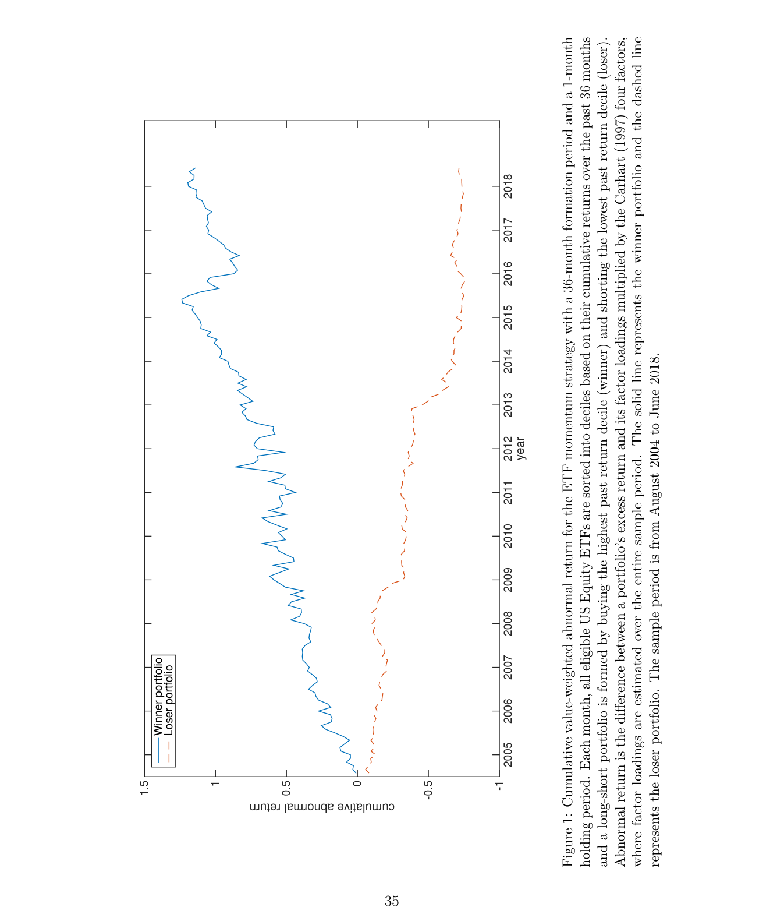
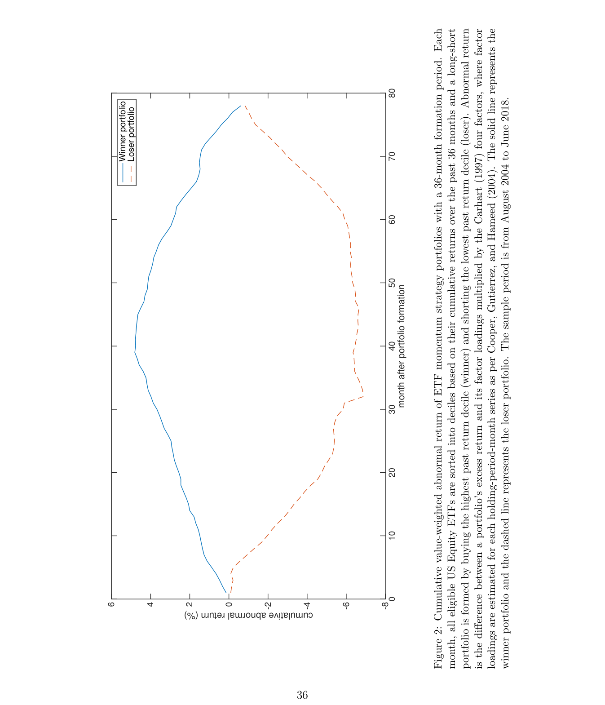
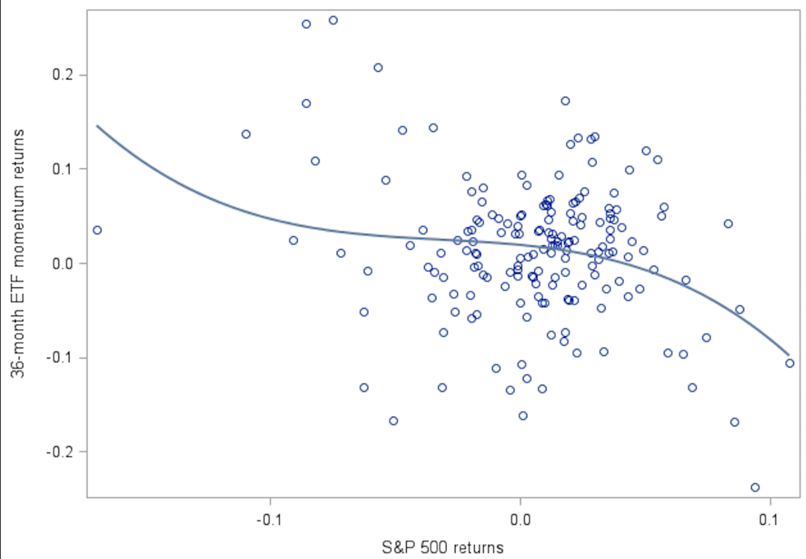
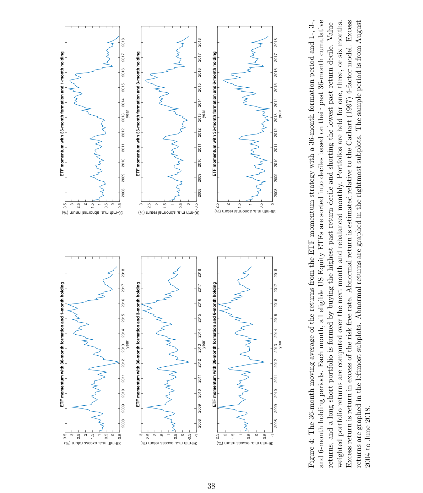

# ETF Momentum

**Weikai Li, Melvyn Teo, and Chloe Yang**\*

Li (corresponding author) is at the Lee Kong Chian School of Business, Singapore Management University. Address: 50 Stamford Road, Singapore 178899. E-mail: wkli@smu.edu.sg. Tel: +65-6828-9651. Fax: +65-6828-0427. Teo is at the Lee Kong Chian School of Business, Singapore Management University. E-mail: melvynteo@smu.edu.sg. Yang is at the Fanhai International School of Finance, Fudan University. E-mail: chloe_yang@fudan.edu.cn. We have benefitted from conversations with Alan Kwan, Thomas Maurer, Andrew Sinclair, Dragon Tang, Zigan Wang, Shang-Jin Wei, as well as seminar participants at Fudan University, Hong Kong University, Renmin University, and Singapore Management University.

---

## Highlight

- **Alpha idea:** Sorting ETFs on their returns over the past two to four years generates large, long-horizon cross-sectional momentum; a value-weighted long-short (winner-minus-loser) strategy earns a Carhart (1997) four-factor alpha of up to **1.20% per month**.
- **Data sources:** CRSP (ETF monthly returns, prices, volume, shares outstanding; share code 73; Lipper "EQ" asset code), Compustat (S&P credit ratings), Thomson Reuters Institutional Holdings / 13F (holdings and institutional ownership), NYSE Trades and Quotes (TAQ) database (quotes and trades for spreads), and I/B/E/S-type analyst forecast data.
- **Universe:** All eligible US equity ETFs traded in the US (market capitalization > US$20 million, share price > US$1), excluding foreign/global equity ETFs.
- **Sample period:** August 2004 to June 2018 (the sample starts when the cross-section first contains at least 50 US equity ETFs).
- **Key finding:** The baseline value-weighted ETFMOM(36,1) strategy delivers a four-factor alpha of **1.20%/month (t = 2.71)** and a five-factor alpha of 1.28%/month, with an annualized Sharpe ratio of about 0.53; the momentum profit is completely eliminated 78 months after formation, consistent with delayed overreaction.
- **Signal construction:** Each month, ETFs are sorted into deciles on past 24-/36-/48-month cumulative returns; the strategy buys the top decile (winner) and shorts the bottom decile (loser), with overlapping portfolios for holding periods of 1–12 months.
- **Robustness:** Profits survive adjustments for quoted, effective, and Corwin–Schultz spreads; controls for stock momentum, industry momentum, time-series momentum, "momentum everywhere," and Stambaugh–Yuan mispricing factors; NAV-based returns; alternative ETF samples; and a one-month formation–holding gap.
- **Why it works:** The post-holding-period return pattern (continuation then complete reversal) is most consistent with the Daniel, Hirshleifer, and Subrahmanyam (1998) delayed-overreaction (overconfidence) view, and momentum is stronger for ETFs exposed to low-analyst-coverage stocks.

---

## Abstract

We document economically large momentum profits when sorting ETFs on returns over the past two to four years. A value-weighted, long-short strategy based on ETF momentum delivers Carhart (1997) four-factor alphas of up to 1.20% per month. Neither cross-sectional stock momentum nor co-variation with macroeconomic and liquidity risks can explain ETF momentum. Instead, the post-holding period returns are most consonant with the behavioral story of delayed overreaction. While ETF momentum survives multiple adjustments for transaction costs, it may be difficult to arbitrage as the profits are volatile and concentrated in ETFs with high idiosyncratic volatility or that hold low-analyst-coverage stocks.

---

## 1. Introduction

Financial markets have witnessed a surge in the popularity of exchange-traded funds (ETFs) in the recent years. By our estimates, equity ETFs traded in the US collectively account for more than US$3.38 trillion of assets under management (AUM) in 2018. The popularity of ETFs can be explained by their intraday liquidity and low transaction costs; they allow investors to access the market continuously and at low cost (Ben-David, Franzoni, and Moussawi, 2017; 2018). The superior liquidity of ETFs and the dearth of short sales constraints imply that it will be relatively easy for investors to take advantage of any predictability in ETF returns.[^1] Yet, financial economists know little about what factors, if any, drive predictability in ETF returns. In this paper, we fill this gap by investigating cross-sectional return momentum in ETFs.

Cross-sectional momentum manifests in US stocks (Jegadeesh and Titman, 1993; 2001), US industries (Moskowitz and Grinblatt, 1999), US corporate bonds (Jostova et al., 2013), international stocks (Rouwenhorst, 1998; 1999; Chan, Hameed, and Tong, 2000), international currencies (Menkhoff et al., 2012), and commodities (Gorton, Hayashi, and Rouwenhorst, 2013).[^2] However, there is little consensus as to the underlying factors that drive cross-sectional momentum. Proposed explanations include (i) the behavioral models of under- and overreaction (Daniel, Hirshleifer, and Subrahmanyam, 1998; Barberis, Shleifer, and Vishny, 1998; Hong and Stein, 1999), (ii) risk models (Johnson, 2002; Pástor and Stambaugh, 2003; Sadka, 2006; Liu and Zhang, 2014), and (iii) firm characteristics such as analyst coverage (Hong, Lim, and Stein, 2000), credit ratings (Avramov et al., 2007), revenue growth volatility (Sagi and Seasholes, 2007), and probability of bankruptcy (Eisdorfer, 2008).

At the same time, since momentum profits are concentrated in small stocks (Hong, Lim, and Stein, 2000), noninvestment-grade corporate bonds (Jostova et al., 2013), and minor currencies with high transaction costs (Menkhoff et al., 2012), investors may face significant limits to arbitrage (Shleifer and Vishny, 1997) when harvesting those profits. However, limits to arbitrage such as transaction costs and short sales constraints are less relevant for ETFs. Therefore, this asset class presents a novel and interesting laboratory for exploring cross-sectional return momentum and its underlying drivers.

To study cross-sectional return momentum in ETFs, we follow Jegadeesh and Titman (1993; 2001) and sort ETFs into decile portfolios. We evaluate the strategy that buys the winner ETF portfolio with the highest past returns and shorts the loser ETF portfolio with the lowest past returns. Our sample covers all eligible US equity ETFs. To ensure that there are enough ETFs in the cross-section, our sample period starts in August 2004, when there are 50 US equity ETFs managing US$166 billion in AUM. As a testament to the tremendous growth in the assets managed by ETFs, by the end of the sample period in June 2018, there are 396 US equity ETFs responsible for US$1,674 billion in AUM.[^3]

The results are intriguing. We find economically meaningful and statistically significant risk-adjusted returns when sorting ETFs on past 24- to 48-month returns. The value-weighted ETF momentum strategy based on past 36-month returns and a one-month holding period delivers a Carhart (1997) four-factor alpha of 1.20% per month (t-statistic = 2.71).[^4] The aforementioned ETF momentum strategy generates virtually identical abnormal returns when evaluated relative to the Fama and French (2016) five-factor model. The standard risk models' inability to explain the ETF momentum profits can be traced to the fact that, while the strategy loads positively on the Carhart (1997) stock momentum factor (PR1YR), it also loads negatively on the Fama and French (2016) stock value and investment factors (HML and CMA).[^5]

We show that ETF momentum profits are robust. They are robust to extending the holding period from one month to three, six, nine, or twelve months, and to forming overlapping portfolios as in Jegadeesh and Titman (1993; 2001). ETF momentum profits are also robust to using net asset value (NAV)-based returns, thereby suggesting that the momentum profits are not driven by the potential divergence between ETF price and the NAV of the underlying assets (Petajisto, 2017). One concern is that, while we have controlled for exposure to PR1YR (the momentum factor in the Carhart (1997) model), cross-sectional stock momentum could still explain some of the abnormal returns from ETF momentum strategies. Therefore, we construct several benchmark stock momentum portfolios that are based on the formation and holding periods studied in Jegadeesh and Titman (1998). After controlling for covariation with the benchmark stock momentum portfolios, the ETF momentum strategy based on a 36-month formation and 1-month holding period still delivers an abnormal return of at least 1.15% per month.[^6] Moreover, the ETF momentum profits also survive adjustments for industry momentum (Moskowitz and Grinblatt, 1999), momentum everywhere (Asness, Moskowitz, and Pedersen, 2013), and stock mispricing (Stambaugh and Yuan, 2017).

To understand the drivers underlying ETF momentum, we examine the post-formation-period performance of the ETF momentum portfolios. In line with Jegadeesh and Titman (1998; 2001), we find evidence of return continuation and subsequent reversals over a period of several years. In addition, we show that the momentum profits are completely eliminated 78 months after portfolio formation. These results are inconsistent with the Conrad and Kaul (1998) view that momentum is driven by cross-sectional variation in the unconditional expected returns of individual securities. They also do not support the behavioral stories of Barberis, Shleifer, and Vishny (1998) and Hong and Stein (1999) that feature initial underreaction (and subsequent overreaction), since a key prediction of the underreaction explanations is that prices will not completely reverse—i.e., the momentum profits will not be completely eliminated—in the post-formation period. The post-formation-period returns are also incompatible with models based on disposition (Grinblatt and Han, 2005) and investor inattention (Da, Gurun, and Warachka, 2014) that feature underreaction to fundamental information. Instead, they are consonant with the behavioral model of delayed overreaction by Daniel, Hirshleifer, and Subrahmanyam (1998). Our findings echo those of Goetzmann and Huang (2018), who uncover evidence of delayed overreaction when studying cross-sectional stock momentum in Imperial Russia.

We carefully consider other alternative explanations for the ETF momentum profits. These include (i) other fundamental risk-based explanations such as macroeconomic and liquidity risks, and (ii) the characteristics of the underlying firms held by the ETFs. To account for macroeconomic and liquidity risk, we follow Menkhoff et al. (2012) and estimate time-series regressions of the ETF momentum winner-minus-loser spread portfolio returns on various macroeconomic and liquidity risk factors while controlling for co-variation with the Carhart (1997) four factors. We consider macroeconomic factors derived from industrial production (Chen, Roll, and Ross, 1986; Liu and Zhang, 2008), consumption, inflation (Chen, Roll, and Ross, 1986), and labor income growth (Jagannathan and Wang, 1996), as well as the changes in the term spread, the default spread, and the Chicago Board Options Exchange Volatility Index. We also evaluate liquidity factors such as the change in the Treasury EuroDollar spread, the Pástor and Stambaugh (2003) traded liquidity factor, the change in the aggregate Amihud (2002) illiquidity, and the He, Kelly, and Manela (2017) primary dealer capital ratio factor. Our analysis indicates that co-variation with these macroeconomic and liquidity risk factors cannot account for the profitability of ETF momentum strategies. Moreover, we find that ETF momentum profits tend to be high when equity market index returns are low—i.e., when the marginal utility of consumption is high—further casting doubt on the fundamental risk-based explanation.

To understand whether the characteristics of the underlying firms held by ETFs can explain ETF momentum, we create factor-mimicking stock portfolios for size, price, Amihud illiquidity, return volatility, cash flow volatility, residual analyst coverage, analyst forecast dispersion, and credit rating. Next, we sort ETFs independently based on past performance and on their loadings on the factor-mimicking portfolios. We find little evidence to suggest that the momentum profits are concentrated in ETFs that load on stocks that are harder to value—i.e., stocks with lower market capitalizations, lower price, greater illiquidity, higher return or cash flow volatility, greater analyst forecast dispersion, and lower credit ratings. However, we do find that momentum tends to be stronger for ETFs that are exposed to stocks with low residual analyst coverage (Hong, Lim, and Stein, 2000). This finding is nonetheless congruent with the overconfidence-induced delayed-overreaction story of Daniel, Hirshleifer, and Subrahmanyam (1998), since investors may be more overconfident when valuing low-analyst-coverage firms, for which there would be less public information.

Do transaction costs overwhelm the profits from ETF momentum? To adjust for transaction costs, we follow Lesmond, Schill, and Zhou (2004) and employ multiple trading-cost estimates to test whether cross-sectional ETF momentum profits are sensitive to the imputation of transaction costs. The trading-cost estimates that we consider include the quoted spread from the NYSE's Trades and Quotes database, the effective spread derived by comparing the quoted spreads to the contemporaneous execution prices, and the Corwin and Schultz (2012) spread from daily high and low prices. Unsurprisingly, given the superior liquidity of ETFs, we show that the alphas from the ETF momentum winner-minus-loser portfolios are still economically meaningful and statistically relevant after adjusting for transaction costs via these spread estimates.

We test whether other limits to arbitrage, such as the time-series variation in ETF momentum returns or ETF characteristics that proxy for valuation uncertainty, can hamper investors' ability to harvest the profits from ETF momentum. We find that, while momentum returns have been impressive during the sample period and exceed 2% per month over several years, they are also volatile. For instance, there are two periods—namely January 2012 to March 2012 and March 2018 to June 2018—when the 36-month moving average excess returns of the ETF momentum strategy with a 36-month formation period and a one-month holding period are negative. Consequently, market participants with short investment horizons may refrain from arbitraging ETF momentum. Moreover, we show that ETF momentum tends to be stronger for volatile ETFs, which may be harder to value. Investors who are wary of such ETFs may therefore be reluctant to arbitrage ETF momentum.

This paper sheds light on the anatomy of cross-sectional momentum in ETF returns. By doing so, we contribute to the large body of work on momentum. We find that ETF momentum differs from stock momentum in several ways. First, during our sample period, we find little evidence of stock momentum. Yet, we observe strong evidence of ETF momentum. Second, the formation periods for ETF momentum—i.e., between two to four years—are significantly longer than those established for stock momentum (Jegadeesh and Titman, 1998). Third, whereas stock momentum tends to be concentrated in small-capitalization stocks (Hong, Lim, and Stein, 2000; Jegadeesh and Titman, 2001), ETF momentum is stronger for large-capitalization ETFs and for ETFs exposed to large-capitalization stocks. Fourth, unlike stock momentum, we find that ETF momentum is not driven by exposure to firm credit risk (Avramov et al., 2007) or firm cash flow volatility (Sagi and Seasholes, 2007). However, like stock momentum, we find that ETF momentum may be traced to firms with low analyst coverage (Hong, Lim, and Stein, 2000). As per the post-formation-period returns of stock momentum in the US (Jegadeesh and Titman, 2001) and Imperial Russia (Goetzmann and Huang, 2018), the post-formation-period returns of ETF momentum are also consonant with delayed overreaction (Daniel, Hirshleifer, and Subrahmanyam, 1998).

Our work resonates with the growing literature on ETFs.[^7] Research has shown that ETFs can increase the volatility (Ben-David, Franzoni, and Moussawi, 2018), return comovement (Da and Shive, 2018), and commonality in the liquidity (Agarwal et al., 2020) of their underlying stocks.[^8] Furthermore, retail investors lose money when trading ETFs due to poor ETF timing and ETF selection (Bhattacharya et al., 2017). Also, prices of ETFs can deviate substantially from their NAVs (Petajisto, 2017) despite the presence of authorized participants who can arbitrage the difference between ETF price and NAV. According to Pan and Zeng (2020), balance-sheet constraints may prevent authorized participants from correcting such relative mispricings. Our findings indicate that ETF return momentum is orthogonal to the divergence between ETF price and NAV envisaged in Petajisto (2017) and Pan and Zeng (2020), and suggest that ETFs can engender predictability in underlying stock returns.

The remainder of this paper is organized as follows. Section 2 describes the institutional features of ETFs as well as the data. Section 3 reports the results from the empirical analysis, while Section 4 presents robustness tests. Section 5 concludes.

---

## 2. Data and methodology

### 2.1. ETF institutional details

ETFs are index-fund-like investment structures that seek to mimic the returns of baskets of securities.[^9] Unlike index funds, ETFs offer intraday liquidity and are traded on the stock market. ETFs are traded both on the primary market and the secondary market. On the secondary market, institutional investors and retail investors trade the ETFs. The price of an ETF is determined by demand and supply on the secondary market. As a result, the price of an ETF can diverge from the NAV of its underlying assets.

To minimize the divergence between the price of the ETF and its NAV, the ETF sponsor reports the NAV of the ETF's underlying assets every 15 seconds during the trading day. By doing so, the ETF sponsor helps facilitate arbitrage, which in turn reduces the tracking error of the ETF. Arbitrage activities can take place in the primary and secondary markets.

On the primary market, institutions known as authorized participants (APs) can exchange shares of the ETFs with the ETF sponsor for baskets of underlying assets, and vice versa.[^10] When the ETF trades at a premium relative to the price of the underlying basket of assets, APs buy the underlying assets, exchange them for "creation units" from the ETF sponsor, and sell those units on the secondary market, thereby harvesting the spread between the price of the ETF and that of the underlying. By exerting downward pressure on the price of the ETF and upward pressure on the price of the underlying, such arbitrage activity reduces the ETF price premium. Conversely, when the ETF trades at a discount relative to the price of the underlying basket of assets, APs buy the ETFs on the secondary market, redeem them through the ETF sponsor for baskets of underlying securities, and offload the underlying securities in the market, thereby earning the spread between the price of the underlying and that of the ETF. By exerting upward pressure on the price of the ETF and downward pressure on the price of the underlying, such arbitrage activity narrows the ETF price discount.[^11]

On the secondary market, arbitrageurs such as hedge funds and high-frequency traders can take advantage of the price differential between the ETF and the underlying basket of securities without accessing the primary market. When the price of the ETF exceeds that of the underlying assets, the arbitrageur can long the cheaper underlying basket of assets, short sell the more expensive ETF, and hold the position until convergence. Conversely, when the price of the ETF falls below that of the underlying basket of assets, the arbitrageur can long the cheaper ETF, short sell the more expensive basket of underlying assets, and hold the position until convergence. Of course, since convergence does not always have to take place, such activities may not be considered arbitrage in the strictest sense of the word. Moreover, short-sales constraints may prevent arbitrageurs from conducting such activities in the first place. Nonetheless, to the extent that such activities are feasible, they should help reduce the divergence between the ETF price and the value of the underlying basket of securities. According to an industry expert, statistical arbitrage accounts for more than 50 percent of the volume in SPY—i.e., the massive ETF that tracks the S&P 500.[^12]

### 2.2. ETF data

We cull ETF data on monthly returns, prices, trading volume, and shares outstanding from the Center for Research in Security Prices (CRSP) database by focusing on securities with the historical share code equal to 73, which exclusively defines ETFs. To mitigate the impact of illiquidity and possible non-synchronous prices due to infrequent trading, we limit our sample of ETFs to those with market capitalization larger than US$20 million and share prices greater than US$1.

In our analysis, we focus on ETFs where the underlying securities are US equities. To zero in on such funds, we first limit the sample to ETFs with Lipper Asset Code "EQ" in the CRSP mutual fund database.[^13] Next, we exclude foreign and global equity ETFs by dropping ETFs with a Lipper Classification Name containing the words "global," "world," "ex-US," "emerging market," or "international".[^14]

In order that we have enough ETFs in the cross-section to run the portfolio-sort analysis, we restrict the sample period to months where there are at least 50 US equity ETFs in the sample. This limits the starting date of the sample period to August 2004, since prior to that the sample had fewer than 50 ETFs in the cross-section. Our sample period therefore extends from August 2004 to June 2018.

Table 1 showcases summary statistics for our ETF sample. Columns (1) and (2) report the total number and market capitalization of US equity ETFs in our sample each year. Columns (3) and (4) report the analogous information for the other equity ETFs traded in the US. The numbers are a testament to the tremendous growth in ETF assets over the recent years. At the end of 2004, there are a total of 113 ETFs managing US$211 billion in AUM. By the end of the sample period in June 2018, there are a total of 1,051 ETFs managing US$3,388 billion in AUM, representing a roughly nine-fold increase in number and a 16-fold increase in AUM. The increase in number and assets managed by the US equity ETF sample mirrors that of the broader ETF sample. At the end of 2004, there are in total 74 US equity ETFs managing US$166 billion in AUM. By June 2018, there are a total of 396 US equity ETFs managing US$1,674 billion in AUM, amounting to a roughly five-fold increase in number and a ten-fold increase in AUM.

**Table 1: ETF sample**

This table presents the number of ETFs and the total market capitalization of ETFs traded in the US each year. Only ETFs with market capitalizations greater than US$20 million and prices higher than US$1 are included in the sample. The number and market capitalization of ETFs are measured at the end of each calendar year, except for 2018, when they are measured at the end of June. Market capitalization is reported in billions of US$. The sample period is from August 2004 to June 2018.

| Year | US Equity ETFs — Number | US Equity ETFs — Market Cap (US$bn) | International Equity ETFs — Number | International Equity ETFs — Market Cap (US$bn) |
| --- | --- | --- | --- | --- |
| 2004 | 74 | 166 | 39 | 45 |
| 2005 | 76 | 199 | 48 | 68 |
| 2006 | 81 | 260 | 50 | 107 |
| 2007 | 95 | 359 | 70 | 158 |
| 2008 | 122 | 312 | 76 | 129 |
| 2009 | 196 | 382 | 125 | 251 |
| 2010 | 253 | 501 | 228 | 410 |
| 2011 | 258 | 519 | 284 | 462 |
| 2012 | 271 | 638 | 338 | 616 |
| 2013 | 311 | 852 | 417 | 716 |
| 2014 | 334 | 1,016 | 488 | 883 |
| 2015 | 351 | 1,031 | 522 | 997 |
| 2016 | 378 | 1,253 | 566 | 1,209 |
| 2017 | 414 | 1,656 | 636 | 1,677 |
| 2018 | 396 | 1,674 | 655 | 1,714 |

---

## 3. Empirical results

### 3.1. Portfolio sorts

To begin, we test for differences in risk-adjusted performance of ETFs sorted by past returns. Every month, starting in August 2004, ten ETF portfolios are formed by sorting ETFs on their past 24-, 36-, and 48-month returns. For each sort, the post-formation returns on these ten portfolios over the next month are linked across months to form a single return series for each portfolio. As per Jegadeesh and Titman (1993; 2001), we label as the *winner portfolio* the ETF decile portfolio with the highest past returns, and label as the *loser portfolio* the ETF decile portfolio with the lowest past returns. We then evaluate the performance of these ten portfolios as well as the winner-minus-loser (WML) spread portfolio relative to the Carhart (1997) four-factor model and the Fama and French (2016) five-factor model. The advantage of the Carhart (1997) four-factor model is that it includes PR1YR, the factor-mimicking portfolio for stock momentum, which allows us to control for stock momentum.[^15] We present results for both equal-weighted and value-weighted portfolios.

The results reported in Table 2 reveal substantial differences in expected returns, on the value-weighted ETF portfolios sorted by past returns, that are unexplained by the Carhart (1997) four factors and by the Fama and French (2016) five factors. In particular, for the sort on past 36-month returns, the value-weighted winner ETF portfolio outperforms the value-weighted loser ETF portfolio by an economically and statistically significant 1.25% per month (t-statistic = 2.17), or 15% per annum. After adjusting for co-variation with the Carhart (1997) four factors, the outperformance is virtually unchanged at 1.20% per month (t-statistic = 2.71). Similarly, after adjusting for co-variation with the Fama and French (2016) five factors, the outperformance is also qualitatively unchanged at 1.28% per month (t-statistic = 2.71). As in the rest of the paper, we base statistical inferences on Newey and West (1987) heteroskedasticity- and autocorrelation-consistent standard errors with a three-month lag.

**Table 2: Returns to ETF momentum strategy**

This table reports the monthly average excess returns and alphas for decile ETF portfolios sorted on past returns. Each month, all eligible US equity ETFs are sorted into deciles based on their cumulative returns over the past 24 months (Panel A), 36 months (Panel B), and 48 months (Panel C), and a long-short portfolio is formed by buying the highest past-return decile and shorting the lowest past-return decile. Portfolio returns are computed over the next month and rebalanced monthly. Columns (1) and (2) report the excess return (raw return minus risk-free rate), Columns (3) and (4) report the Carhart (1997) 4-factor alpha, and Columns (5) and (6) report the Fama and French (2016) 5-factor alpha. "EW" denotes equal-weighted returns and "VW" denotes value-weighted returns. "Winner − Loser" denotes the return spread between the top and bottom past-return deciles. The t-statistics, in parentheses, are based on Newey and West (1987) standard errors with three monthly lags. Winner−loser spread returns and alphas that are statistically significant at the 10% level or below are in bold. The sample period is from August 2004 to June 2018.

**Panel A: ETFs sorted on past 24-month return and held for 1 month**

| ETF portfolio | Excess return (EW) | Excess return (VW) | 4-factor alpha (EW) | 4-factor alpha (VW) | 5-factor alpha (EW) | 5-factor alpha (VW) |
|---|---|---|---|---|---|---|
| 1 (Loser) | 0.42% | 0.04% | −0.32% | −0.61% | −0.45% | −0.67% |
| 2 | 0.51% | 0.64% | −0.23% | 0.00% | −0.30% | −0.15% |
| 3 | 0.71% | 0.58% | −0.03% | −0.11% | −0.10% | −0.17% |
| 4 | 0.74% | 0.77% | 0.01% | 0.06% | −0.05% | 0.04% |
| 5 | 0.78% | 0.79% | 0.03% | 0.08% | 0.01% | 0.02% |
| 6 | 0.78% | 0.75% | 0.01% | 0.02% | 0.01% | 0.00% |
| 7 | 0.69% | 0.63% | −0.10% | −0.17% | −0.10% | −0.17% |
| 8 | 0.80% | 0.66% | −0.01% | −0.16% | −0.02% | −0.13% |
| 9 | 0.83% | 1.01% | 0.00% | 0.27% | 0.06% | 0.29% |
| 10 (Winner) | 0.78% | 1.01% | −0.26% | 0.31% | −0.06% | 0.44% |
| Winner − Loser | 0.36% (0.82) | **0.96%** (1.70) | 0.07% (0.22) | **0.92%** (2.13) | 0.40% (1.02) | **1.11%** (2.31) |

**Panel B: ETFs sorted on past 36-month return and held for 1 month**

| ETF portfolio | Excess return (EW) | Excess return (VW) | 4-factor alpha (EW) | 4-factor alpha (VW) | 5-factor alpha (EW) | 5-factor alpha (VW) |
|---|---|---|---|---|---|---|
| 1 (Loser) | 0.27% | −0.01% | −0.50% | −0.66% | −0.50% | −0.68% |
| 2 | 0.52% | 0.41% | −0.23% | −0.22% | −0.28% | −0.31% |
| 3 | 0.71% | 0.59% | −0.03% | −0.11% | −0.07% | −0.14% |
| 4 | 0.72% | 0.75% | −0.03% | 0.02% | −0.06% | −0.01% |
| 5 | 0.81% | 0.72% | 0.07% | −0.01% | 0.05% | −0.04% |
| 6 | 0.71% | 0.70% | −0.09% | −0.05% | −0.11% | −0.09% |
| 7 | 0.78% | 0.78% | 0.02% | 0.01% | −0.01% | −0.01% |
| 8 | 0.68% | 0.70% | −0.11% | −0.10% | −0.12% | −0.11% |
| 9 | 0.81% | 0.66% | 0.01% | −0.12% | 0.05% | −0.10% |
| 10 (Winner) | 1.06% | 1.24% | 0.08% | 0.53% | 0.19% | 0.60% |
| Winner − Loser | **0.79%** (1.89) | **1.25%** (2.17) | **0.58%** (1.95) | **1.20%** (2.71) | **0.69%** (1.96) | **1.28%** (2.71) |

**Panel C: ETFs sorted on past 48-month return and held for 1 month**

| ETF portfolio | Excess return (EW) | Excess return (VW) | 4-factor alpha (EW) | 4-factor alpha (VW) | 5-factor alpha (EW) | 5-factor alpha (VW) |
|---|---|---|---|---|---|---|
| 1 (Loser) | 0.21% | 0.05% | −0.54% | −0.63% | −0.51% | −0.58% |
| 2 | 0.55% | 0.41% | −0.18% | −0.24% | −0.19% | −0.25% |
| 3 | 0.66% | 0.59% | −0.07% | −0.12% | −0.09% | −0.13% |
| 4 | 0.77% | 0.80% | 0.02% | 0.10% | −0.01% | 0.05% |
| 5 | 0.79% | 0.73% | 0.08% | 0.01% | 0.03% | −0.04% |
| 6 | 0.76% | 0.77% | 0.01% | 0.06% | −0.03% | −0.01% |
| 7 | 0.74% | 0.77% | −0.02% | 0.03% | −0.05% | 0.03% |
| 8 | 0.66% | 0.63% | −0.15% | −0.19% | −0.16% | −0.20% |
| 9 | 0.65% | 0.57% | −0.20% | −0.27% | −0.14% | −0.19% |
| 10 (Winner) | 1.09% | 1.07% | 0.14% | 0.31% | 0.23% | 0.37% |
| Winner − Loser | **0.88%** (2.31) | **1.02%** (1.97) | **0.68%** (2.52) | **0.94%** (2.19) | **0.75%** (2.29) | **0.95%** (2.18) |

---

**Table 3: Factor loadings of ETF momentum strategy with 36-month formation and 1-month holding period**

This table reports the factor loadings of a long-short ETF momentum strategy based on past 36-month returns with a one-month holding period. Each month, all eligible US equity ETFs are sorted into deciles based on their past 36-month cumulative returns, and a long-short portfolio is formed by buying the highest past-return decile and shorting the lowest past-return decile. Portfolio returns are computed over the next month and rebalanced monthly. We evaluate returns relative to three asset pricing models: the Fama and French (1993) three-factor model, the Carhart (1997) four-factor model, and the Fama and French (2016) five-factor model, for both equal-weighted (EW) and value-weighted (VW) ETF portfolios. RMRF is the market factor, SMB is the size factor, HML is the value factor, PR1YR is the Carhart (1997) momentum factor, RMW is the robust-minus-weak profitability factor, and CMA is the conservative-minus-aggressive investment factor. The t-statistics, in parentheses, are based on Newey and West (1987) standard errors with three monthly lags. The sample period is from August 2004 to June 2018.

| Asset pricing model | Portfolio | RMRF | SMB | HML | PR1YR | RMW | CMA | Adj. R² |
|---|---|---|---|---|---|---|---|---|
| Fama-French (1993) 3-factor | EW | −0.022 (−0.19) | −0.100 (−0.62) | −1.070 (−6.75) | | | | 0.257 |
| | VW | −0.215 (−1.40) | −0.105 (−0.47) | −1.350 (−6.04) | | | | 0.245 |
| Carhart (1997) 4-factor | EW | 0.127 (1.17) | −0.129 (−0.92) | −0.730 (−4.75) | 0.430 (6.67) | | | 0.389 |
| | VW | −0.086 (−0.57) | −0.125 (−0.61) | −1.060 (−3.90) | 0.360 (3.42) | | | 0.292 |
| Fama-French (2016) 5-factor | EW | −0.037 (−0.32) | −0.028 (−0.15) | −0.770 (−3.70) | | 0.365 (1.24) | −1.010 (−2.72) | 0.303 |
| | VW | −0.231 (−1.51) | −0.022 (−0.09) | −1.020 (−3.34) | | 0.387 (0.94) | −1.080 (−1.94) | 0.269 |

Overall, the Carhart (1997) four-factor-adjusted performance of the value-weighted WML spread portfolio is economically significant and statistically distinguishable from zero at the 5% level for all three formation periods considered. We obtain more modest results when we evaluate equal-weighted portfolios. The four-factor alphas are only economically meaningful and statistically significant at the 10% or 5% level when we sort ETFs based on past 36- and 48-month returns. Specifically, after adjusting for co-variation with the four factors, the equal-weighted WML spread portfolio from the 36-month sort delivers a return of 0.58% per month (t-statistic = 1.95), or less than half that of the value-weighted WML spread portfolio. This provides prima facie evidence that ETF momentum may be stronger for large-capitalization ETFs than for small-capitalization ETFs.

Why do the standard risk models have difficulty explaining the ETF momentum profits? Table 3 indicates that, for the value-weighted ETF momentum strategy with a 36-month formation period and one-month holding period, the loadings on the Carhart (1997) four factors—namely RMRF, SMB, HML, and PR1YR—are −0.086, −0.125, −1.060, and 0.360, respectively. Only the last two coefficient estimates are statistically significant at the 5% level. This implies that the ETF momentum strategy loads more on growth stocks than on value stocks, and unsurprisingly loads more on winner stocks than on loser stocks. Therefore, while stock momentum explains some of the returns from the ETF momentum strategy, since ETF momentum loads negatively on HML, these effects largely cancel out, and the four-factor model explains only 5 basis points of the 1.25%-per-month return of the ETF momentum spread. Moreover, the loadings on the Fama and French (2016) five factors—namely RMRF, SMB, HML, RMW, and CMA—are −0.231, −0.022, −1.020, 0.387, and −1.080, respectively. Only the coefficient estimates on HML and CMA are statistically reliable at the 5% or 10% level. Given the negative loadings on these two factors, it is not surprising that the five-factor alpha of the ETF momentum spread, at 1.28% per month, is even higher than its return.

**Figure 1.** Cumulative value-weighted abnormal return for the ETF momentum strategy with a 36-month formation period and a 1-month holding period. Each month, all eligible US equity ETFs are sorted into deciles based on their cumulative returns over the past 36 months, and a long-short portfolio is formed by buying the highest past-return decile (winner) and shorting the lowest past-return decile (loser). Abnormal return is the difference between a portfolio's excess return and its factor loadings multiplied by the Carhart (1997) four factors, where factor loadings are estimated over the entire sample period. The solid line represents the winner portfolio and the dashed line represents the loser portfolio. The sample period is from August 2004 to June 2018.

Fig. 1 complements the results from Table 2. It illustrates the monthly cumulative abnormal returns (henceforth CARs) from the portfolio of winner ETFs (Portfolio 10) and the portfolio of loser ETFs (Portfolio 1). CAR is the cumulative difference between a portfolio's excess return and its factor loadings (estimated over the entire sample period) multiplied by the Carhart (1997) risk factors. The CARs in Fig. 1 indicate that the winner ETF portfolio consistently outperforms the loser ETF portfolio over much of the sample period, and suggest that the outperformance of winner ETFs over loser ETFs is not peculiar to a particular year.

Following Jegadeesh and Titman (1993; 2001), we also consider sorts with longer holding periods of three, six, nine, and twelve months. As in Jegadeesh and Titman (1993; 2001), we construct overlapping sub-portfolios such that each successive sub-portfolio is formed one month after the other. We define ETFMOM(n,m) as the ETF momentum strategy with a formation period of *n* months and a holding period of *m* months. The results for the sort on past 36-month return with longer holding periods are reported in Table 4. They indicate that the Carhart (1997) four-factor alphas of the value-weighted WML spread portfolios remain statistically significant at the 5% level when we extend the holding period beyond one month. While the alpha of the spread decreases from 0.97% per month to 0.79% per month when we lengthen the holding period from three to twelve months, it remains economically meaningful. Similarly, the Fama and French (2016) five-factor alphas of the value-weighted WML spread portfolios, which range from 0.76% per month to 1.04% per month, are all economically relevant and statistically distinguishable from zero at the 5% level. As with the results from the sorts with a one-month holding period, the findings from these sorts are also weaker when we equal-weight the portfolios. While the four-factor alphas of the equal-weighted WML spread portfolios, which range from 0.47% per month to 0.54% per month, are all economically meaningful, they are only statistically reliable at the 5% level for the sort with a 12-month holding period.

**Table 4: ETF momentum strategies with 36-month formation period**

This table reports the monthly average excess returns and alphas for decile ETF portfolios sorted on past 36-month returns. Each month, all eligible US equity ETFs are sorted into deciles based on their past 36-month cumulative returns, and a long-short portfolio is formed by buying the highest past-return decile and shorting the lowest past-return decile. Portfolios are then held for three months in Panel A, six months in Panel B, nine months in Panel C, and twelve months in Panel D. We follow Jegadeesh and Titman (1993) to construct overlapping portfolios. Columns (1) and (2) report the excess return (raw return minus risk-free return), Columns (3) and (4) report the Carhart (1997) 4-factor alpha, and Columns (5) and (6) report the Fama and French (2016) 5-factor alpha. "EW" denotes equal-weighted returns and "VW" denotes value-weighted returns. "Winner − Loser" denotes the return spread between the top and bottom past-return deciles. The t-statistics, in parentheses, are based on Newey and West (1987) standard errors with three monthly lags. Winner−loser spread returns and alphas that are statistically significant at the 10% level or below are in bold. The sample period is from August 2004 to June 2018.

**Panel A: ETFs sorted on past 36-month return and held for three months**

| ETF portfolio | Excess return EW | Excess return VW | 4-factor alpha EW | 4-factor alpha VW | 5-factor alpha EW | 5-factor alpha VW |
|---|---|---|---|---|---|---|
| 1 (Loser) | 0.31% | 0.03% | −0.45% | −0.61% | −0.44% | −0.61% |
| 10 (Winner) | 1.05% | 1.07% | 0.07% | 0.36% | 0.19% | 0.43% |
| Winner − Loser | **0.74%** (1.85) | **1.03%** (1.86) | **0.51%** (1.76) | **0.97%** (2.30) | **0.62%** (1.84) | **1.04%** (2.39) |

**Panel B: ETFs sorted on past 36-month return and held for six months**

| ETF portfolio | Excess return EW | Excess return VW | 4-factor alpha EW | 4-factor alpha VW | 5-factor alpha EW | 5-factor alpha VW |
|---|---|---|---|---|---|---|
| 1 (Loser) | 0.33% | 0.07% | −0.41% | −0.57% | −0.39% | −0.55% |
| 10 (Winner) | 1.05% | 1.03% | 0.06% | 0.32% | 0.17% | 0.38% |
| Winner − Loser | **0.71%** (1.83) | **0.95%** (1.80) | 0.47% (1.64) | **0.89%** (2.29) | **0.56%** (1.73) | **0.93%** (2.35) |

**Panel C: ETFs sorted on past 36-month return and held for nine months**

| ETF portfolio | Excess return EW | Excess return VW | 4-factor alpha EW | 4-factor alpha VW | 5-factor alpha EW | 5-factor alpha VW |
|---|---|---|---|---|---|---|
| 1 (Loser) | 0.32% | 0.08% | −0.44% | −0.56% | −0.40% | −0.52% |
| 10 (Winner) | 1.06% | 0.97% | 0.08% | 0.27% | 0.17% | 0.32% |
| Winner − Loser | **0.74%** (1.98) | **0.89%** (1.70) | **0.52%** (1.88) | **0.83%** (2.15) | **0.58%** (1.90) | **0.84%** (2.15) |

**Panel D: ETFs sorted on past 36-month return and held for twelve months**

| ETF portfolio | Excess return EW | Excess return VW | 4-factor alpha EW | 4-factor alpha VW | 5-factor alpha EW | 5-factor alpha VW |
|---|---|---|---|---|---|---|
| 1 (Loser) | 0.33% | 0.10% | −0.44% | −0.56% | −0.39% | −0.49% |
| 10 (Winner) | 1.06% | 0.92% | 0.10% | 0.23% | 0.17% | 0.27% |
| Winner − Loser | **0.73%** (2.04) | **0.83%** (1.66) | **0.54%** (2.01) | **0.79%** (2.09) | **0.56%** (1.96) | **0.76%** (2.05) |

---

**Table 5: ETF momentum strategies with NAV-based returns**

This table reports the monthly average excess returns and alphas for decile ETF portfolios sorted on past 36-month returns. Returns are computed using ETF NAVs. Each month, all eligible US equity ETFs are sorted into deciles based on their past 36-month cumulative returns, and a long-short portfolio is formed by buying the highest past-return decile and shorting the lowest past-return decile. Portfolios are then held for one month in Panel A, three months in Panel B, six months in Panel C, nine months in Panel D, and twelve months in Panel E. We follow Jegadeesh and Titman (1993) to construct overlapping portfolios. Columns (1) and (2) report the excess return (raw return minus risk-free return), Columns (3) and (4) report the Carhart (1997) 4-factor alpha, and Columns (5) and (6) report the Fama and French (2016) 5-factor alpha. "EW" denotes equal-weighted returns and "VW" denotes value-weighted returns. "Winner − Loser" denotes the return spread between the top and bottom past-return deciles. The t-statistics, in parentheses, are based on Newey and West (1987) standard errors with three monthly lags. Winner−loser spread returns and alphas that are statistically significant at the 10% level or below are in bold. The sample period is from August 2004 to June 2018.

**Panel A: ETFs sorted on past 36-month return and held for one month**

| ETF portfolio | Excess return EW | Excess return VW | 4-factor alpha EW | 4-factor alpha VW | 5-factor alpha EW | 5-factor alpha VW |
|---|---|---|---|---|---|---|
| 1 (Loser) | 0.21% | −0.05% | −0.54% | −0.71% | −0.54% | −0.71% |
| 10 (Winner) | 1.05% | 1.25% | 0.06% | 0.55% | 0.19% | 0.63% |
| Winner − Loser | **0.83%** (2.02) | **1.29%** (2.27) | **0.61%** (2.20) | **1.26%** (2.96) | **0.73%** (2.06) | **1.34%** (2.86) |

**Panel B: ETFs sorted on past 36-month return and held for three months**

| ETF portfolio | Excess return EW | Excess return VW | 4-factor alpha EW | 4-factor alpha VW | 5-factor alpha EW | 5-factor alpha VW |
|---|---|---|---|---|---|---|
| 1 (Loser) | 0.26% | 0.00% | −0.49% | −0.65% | −0.48% | −0.65% |
| 10 (Winner) | 1.02% | 1.04% | 0.03% | 0.34% | 0.16% | 0.43% |
| Winner − Loser | **0.76%** (1.91) | **1.04%** (1.89) | **0.51%** (1.75) | **0.99%** (2.38) | **0.64%** (1.85) | **1.08%** (2.48) |

**Panel C: ETFs sorted on past 36-month return and held for six months**

| ETF portfolio | Excess return EW | Excess return VW | 4-factor alpha EW | 4-factor alpha VW | 5-factor alpha EW | 5-factor alpha VW |
|---|---|---|---|---|---|---|
| 1 (Loser) | 0.28% | 0.06% | −0.45% | −0.58% | −0.44% | −0.57% |
| 10 (Winner) | 1.02% | 1.02% | 0.02% | 0.32% | 0.14% | 0.39% |
| Winner − Loser | **0.74%** (1.93) | **0.96%** (1.82) | **0.47%** (1.67) | **0.90%** (2.34) | **0.58%** (1.76) | **0.96%** (2.41) |

**Panel D: ETFs sorted on past 36-month return and held for nine months**

| ETF portfolio | Excess return EW | Excess return VW | 4-factor alpha EW | 4-factor alpha VW | 5-factor alpha EW | 5-factor alpha VW |
|---|---|---|---|---|---|---|
| 1 (Loser) | 0.26% | 0.07% | −0.47% | −0.57% | −0.45% | −0.54% |
| 10 (Winner) | 1.04% | 0.97% | 0.05% | 0.27% | 0.15% | 0.34% |
| Winner − Loser | **0.78%** (2.11) | **0.91%** (1.78) | **0.53%** (1.92) | **0.85%** (2.22) | **0.60%** (1.94) | **0.88%** (2.26) |

**Panel E: ETFs sorted on past 36-month return and held for twelve months**

| ETF portfolio | Excess return EW | Excess return VW | 4-factor alpha EW | 4-factor alpha VW | 5-factor alpha EW | 5-factor alpha VW |
|---|---|---|---|---|---|---|
| 1 (Loser) | 0.27% | 0.08% | −0.48% | −0.58% | −0.44% | −0.51% |
| 10 (Winner) | 1.04% | 0.92% | 0.07% | 0.22% | 0.14% | 0.28% |
| Winner − Loser | **0.78%** (2.21) | **0.85%** (1.74) | **0.55%** (2.09) | **0.80%** (2.16) | **0.58%** (2.04) | **0.79%** (2.16) |

One concern is that the profitability of ETF momentum strategies may be driven by the divergence of an ETF's price from the value of its underlying basket of securities (Petajisto, 2017). The fact that ETF sponsors report the NAVs of the ETFs' underlying assets every 15 seconds during the trading day, as well as the presence of authorized participants and arbitrageurs, suggest that any divergence between ETF price and NAV is likely to be short-lived. Nonetheless, one possible alternative view is that ETFs whose prices diverge from NAV could diverge even further, thereby driving momentum in ETF prices, even though the underlying NAVs do not exhibit momentum. To test this, we derive ETF returns from the NAV of the underlying assets and redo the ETF momentum sorts with a 36-month formation period. The results reported in Table 5 indicate that we also find evidence of momentum in NAV-based ETF returns. Specifically, Panel A of Table 5 indicates that ETF momentum strategies derived from NAV-based returns with a 36-month formation period and a one-month holding period yield WML spread returns and alphas that are economically and statistically significant at the 5% level, regardless of whether we consider equal- or value-weighted portfolios, or whether we adjust for risk using the Carhart (1997) four-factor model or the Fama and French (2016) five-factor model. Moreover, Panels B to E of Table 5 reveal that the profits from ETF NAV-based momentum with a 36-month formation period largely survive extending the holding horizon from one to three, six, nine, or twelve months.

Yet another concern is that, while we have controlled for exposure to the momentum factor in the Carhart (1997) model (namely PR1YR), cross-sectional stock momentum could still explain some of the abnormal returns from ETF momentum strategies. To alleviate such concerns, we estimate time-series regressions of the excess returns from ETF momentum strategies with 36-month formation periods on the excess returns from four benchmark cross-sectional stock momentum strategies from Jegadeesh and Titman (1993; 2001): MOM(3,3), MOM(6,6), MOM(9,9), and MOM(12,12), where MOM(n,m) denotes the cross-sectional stock momentum strategy with an *n*-month formation period and an *m*-month holding period.

**Table 6: Regressions of ETF momentum returns on returns from cross-sectional stock momentum**

This table reports coefficient estimates from regressions of ETF momentum monthly excess returns (in percentage) on a constant and monthly excess returns from four benchmark cross-sectional stock momentum strategies. ETFMOM(n,m) is the ETF momentum strategy with a formation period of *n* months and a holding period of *m* months. MOM(n,m) is the cross-sectional stock momentum strategy with a formation period of *n* months and a holding period of *m* months. The t-statistics in parentheses are based on Newey and West (1987) standard errors with three monthly lags. Coefficient estimates that are statistically significant at the 10% level or below are in bold. The sample period is from August 2004 to June 2018.

**Panel A: Regressions of returns from ETF momentum with one-, three-, and six-month holding periods on cross-sectional stock momentum returns**

| Dependent variable | MOM(3,3) | MOM(6,6) | MOM(9,9) | MOM(12,12) | Constant | Adj. R² |
|---|---|---|---|---|---|---|
| ETFMOM(36,1) | **0.391** | **0.557** | **0.557** | **1.224** | **1.117** | 0.086 |
| *(t-statistic)* | (2.78) | (7.20) | (6.92) | (2.15) | (2.16) | |
| ETFMOM(36,3) | **0.390** | **0.537** | **0.542** | **1.093** | **1.115** | 0.091 |
| *(t-statistic)* | (2.90) | (7.17) | (6.98) | (1.98) | (2.17) | |
| ETFMOM(36,6) | **0.394** | **0.542** | **0.544** | **0.954** | **1.077** | 0.097 |
| *(t-statistic)* | (3.06) | (7.79) | (7.49) | (1.77) | (2.16) | |

**Panel B: Regressions of returns from ETF momentum with nine- and twelve-month holding periods on cross-sectional stock momentum returns**

| Dependent variable | MOM(3,3) | MOM(6,6) | MOM(9,9) | MOM(12,12) | Constant | Adj. R² |
|---|---|---|---|---|---|---|
| ETFMOM(36,9) | **0.363** | **0.512** | **0.518** | 0.561 | **0.917** | 0.088 |
| *(t-statistic)* | (2.92) | (7.76) | (7.51) | (1.55) | (1.76) | |
| ETFMOM(36,12) | **0.328** | **0.475** | **0.483** | 0.526 | **0.820** | 0.089 |
| *(t-statistic)* | (2.72) | (7.40) | (7.09) | (1.18) | (1.72) | |

---

**Table 7: Descriptive statistics for ETF momentum and stock momentum**

This table shows the annualized mean excess return, standard deviation, skewness, and kurtosis, as well as the Sharpe ratios, for five ETF momentum strategies and four benchmark cross-sectional stock momentum strategies (Jegadeesh and Titman, 1993; 2001). ETFMOM(n,m) is the ETF momentum strategy with a formation period of *n* months and a holding period of *m* months. MOM(n,m) is the cross-sectional stock momentum strategy with a formation period of *n* months and a holding period of *m* months. The t-statistics in parentheses are based on Newey and West (1987) heteroskedasticity- and autocorrelation-consistent standard errors with three lags. Mean returns that are statistically significant at the 10% level or below are in bold. The sample period is from August 2004 to June 2018.

| Strategy | Annualized excess return | t-statistic | Std deviation | Skewness | Kurtosis | Sharpe ratio |
|---|---|---|---|---|---|---|
| *ETF momentum strategy (formation, holding)* | | | | | | |
| ETFMOM(36,1) | **15.00%** | (2.17) | 25.93% | −0.01 | 4.41 | 0.53 |
| ETFMOM(36,3) | **12.40%** | (1.86) | 24.89% | 0.00 | 4.64 | 0.45 |
| ETFMOM(36,6) | **11.40%** | (1.80) | 24.28% | 0.02 | 4.49 | 0.42 |
| ETFMOM(36,9) | **10.60%** | (1.70) | 23.52% | 0.01 | 4.49 | 0.40 |
| ETFMOM(36,12) | **9.92%** | (1.66) | 22.73% | 0.01 | 4.50 | 0.38 |
| *Stock momentum strategy (formation, holding)* | | | | | | |
| MOM(3,3) | 4.15% | (0.76) | 20.26% | −1.85 | 9.22 | 0.20 |
| MOM(6,6) | 5.22% | (0.89) | 21.94% | −1.68 | 7.49 | 0.24 |
| MOM(9,9) | 5.27% | (0.88) | 22.26% | −1.30 | 6.21 | 0.24 |
| MOM(12,12) | 3.06% | (0.55) | 20.66% | −1.35 | 5.19 | 0.15 |

The results reported in Table 6 indicate that cross-sectional stock momentum does not explain the profits from the ETF momentum strategies. After controlling for covariation with various benchmark stock momentum portfolios, ETFMOM(36,1) still delivers an abnormal return of at least 1.115% per month. Moreover, the alpha of that strategy is statistically significant at the 5% level regardless of the benchmark stock momentum portfolio used. Table 6 further reveals that stock momentum does not explain the profits of the 36-month-formation-period ETF momentum strategy with longer holding horizons. After adjusting for co-variation with the benchmark stock momentum portfolios, the alphas from the ETF momentum strategies, save for ETFMOM(36,12), are all statistically significant at the 10% level. This is not surprising, as Table 7 reveals that cross-sectional stock momentum does not generate statistically significant returns during the sample period. In contrast, ETF momentum strategies with a formation period of 36 months deliver returns that are economically and statistically significant at the 10% level regardless of the holding period employed.

We also consider whether the ETF momentum profits can be explained by co-variation with the returns from longer-horizon cross-sectional stock momentum strategies, whose formation and holding periods mirror those of the ETF momentum strategies. The results in Table A1 of the Internet Appendix indicate that the performance of MOM(36,1), MOM(36,3), MOM(36,6), MOM(36,9), and MOM(36,12) cannot explain the performance of the ETF momentum strategies, while the findings in Table A2 of the Internet Appendix reveal that such long-horizon stock momentum strategies do not deliver economically meaningful profits during our sample period.

### 3.2. Post-holding-period returns

What drives the profitability of ETF momentum strategies? On one hand, Conrad and Kaul (1998) posit that momentum profits are driven by the cross-sectional variation in unconditional mean returns across ETFs. Winner ETFs outperform during the formation and holding period as their prices simply feature higher unconditional drifts than do those of loser ETFs. This also implies that the post-holding-period return of the ETF momentum spread should be consistently positive over time.

On the other hand, Daniel, Hirshleifer, and Subrahmanyam (1998) posit that momentum can be explained by delayed overreaction, while Barberis, Shleifer, and Vishny (1998) and Hong and Stein (1999) argue that momentum is driven by an initial underreaction to fundamental news that is followed by delayed overreaction. Specifically, Daniel, Hirshleifer, and Subrahmanyam (1998) contend that investors suffer from a self-attribution bias. Due to that cognitive bias, they mistakenly attribute ex-post winning positions to their abilities and ex-post losing positions to luck. Therefore, investors who buy winner ETFs become overconfident in their ability to predict the performance of winner ETFs. Conversely, investors who short sell loser ETFs become overconfident in their ability to forecast the performance of loser ETFs. This leads to short-term momentum and delayed overreaction in ETF prices.

Barberis, Shleifer, and Vishny (1998) posit that market participants are susceptible to both the conservatism bias and the representative heuristic. The conservatism bias leads investors to underweight new information and therefore drives the initial underreaction to fundamental news. The representative heuristic leads investors to mistakenly believe that ETFs with superior fundamental news will continue to deliver superior fundamental news in the future, leading to overreaction in prices. Hong and Stein (1999) postulate that there are two types of traders in the market: *newswatchers*, who focus on fundamental news, and *technical traders*, who extrapolate from past prices. Newswatchers drive the initial underreaction in ETF prices as they slowly incorporate fundamental news into stock prices. Technical traders extrapolate based on past prices and drive prices beyond fundamental value, thereby engendering delayed overreaction. A key prediction of these stories that feature underreaction is that prices do not completely reverse—or that momentum profits are not completely eliminated—in the post-formation period.

To distinguish between these explanations, we follow Jegadeesh and Titman (2001) and examine post-formation-period abnormal returns from the value-weighted ETF momentum strategy with a 36-month formation period. Abnormal return is the difference between a portfolio's excess return and its factor loadings multiplied by the Carhart (1997) four factors, where factor loadings are estimated for each holding-period-month series as per Cooper, Gutierrez, and Hameed (2004). Specifically, we form a time series of momentum profits corresponding to each event month of the holding period—i.e., we form *T* time series of profits corresponding respectively to month 1, month 2, …, month *T*. Fig. 2 indicates that the cumulative abnormal returns are still increasing up to 39 and 32 months after the formation period for the winner and loser ETF portfolios, respectively. Thereafter, they start to decrease all the way to 78 months post formation. Fig. 2 therefore alludes to a hump-shaped pattern in post-formation returns for the ETF momentum spread.

**Figure 2.** Cumulative value-weighted abnormal return of ETF momentum strategy portfolios with a 36-month formation period. Each month, all eligible US equity ETFs are sorted into deciles based on their cumulative returns over the past 36 months, and a long-short portfolio is formed by buying the highest past-return decile (winner) and shorting the lowest past-return decile (loser). Abnormal return is the difference between a portfolio's excess return and its factor loadings multiplied by the Carhart (1997) four factors, where factor loadings are estimated for each holding-period-month series as per Cooper, Gutierrez, and Hameed (2004). The solid line represents the winner portfolio and the dashed line represents the loser portfolio. The sample period is from August 2004 to June 2018.

This pattern is strongly inconsistent with the Conrad and Kaul (1998) view. It is also not supportive of the behavioral underreaction story advanced by Barberis, Shleifer, and Vishny (1998) and Hong and Stein (1999), since the momentum profits are completely eliminated 78 months after portfolio formation. The post-formation returns from ETF momentum are also incompatible with stories based on disposition (Grinblatt and Han, 2005) and investor inattention (Da, Gurun, and Warachka, 2014) that feature underreaction to fundamental information. Instead, they are supportive of the Daniel, Hirshleifer, and Subrahmanyam (1998) view that momentum is driven by delayed overreaction. These results echo those of Goetzmann and Huang (2018), who also uncover evidence of delayed overreaction when investigating cross-sectional stock momentum in Imperial Russia.

### 3.3. Macroeconomic and liquidity risk

In this section, we test whether macroeconomic and liquidity risk factors can explain the returns from ETF momentum strategies. Specifically, we estimate time-series regressions of the ETF momentum WML spread portfolio returns on various macroeconomic and liquidity risk factors while controlling for co-variation with the Carhart (1997) four factors. As per Menkhoff et al. (2012), we estimate regressions separately for each macroeconomic and liquidity risk factor to guard against multicollinearity.

We consider the following macroeconomic risk factors. **INDUSTRIAL PRODUCTION** denotes the industrial production growth rate, $\log(IP_t) - \log(IP_{t-1})$, as per Chen, Roll, and Ross (p. 386, 1986) and Liu and Zhang (2008). **CONSUMPTION** denotes the real per-capita growth in non-durables and services consumption expenditures. **INFLATION** denotes the inflation growth rate, where the inflation rate for month *t* is $\log(CPIA_t) - \log(CPIA_{t-1})$ and CPIA is the seasonally adjusted consumer price index for month *t* as per Chen, Roll, and Ross (p. 387, 1986). **TERM SPREAD** stands for the change in the term spread, where the term spread is the yield difference between the ten-year Treasury bond and the three-month T-bill. **DEFAULT SPREAD** stands for the change in the default spread, where the default spread is the yield difference between Moody's BAA corporate bond and the ten-year Treasury bond. **LABOR INCOME** is the labor income growth rate, $[L_{t-1} + L_{t-2}]/[L_{t-3} + L_{t-4}]$, where $L_{t-1}$ is the monthly per-capita real labor income for month $t-1$, as per Jagannathan and Wang (p. 21, 1996). **VIX** is the change in the level of the Chicago Board Options Exchange Volatility Index.

We also consider the following liquidity factors. **TED** is the change in the Treasury EuroDollar spread. **PS LIQUIDITY** is the Pástor and Stambaugh (2003) traded liquidity factor. **AMIHUD ILLIQUIDITY** is the change in the aggregate Amihud (2002) illiquidity. **HKM CAPRATIO** is the He, Kelly, and Manela (2017) primary dealer capital ratio factor that proxies for intermediary capital risk.

**Table 8: Macroeconomic and liquidity risk**

This table reports estimates from univariate time-series regressions of ETF momentum strategy Carhart (1997) 4-factor residuals on various macroeconomic and liquidity risk factors. Each month, all eligible US equity ETFs are sorted into deciles based on their past 36-month cumulative returns, and a long-short portfolio is formed by buying the highest past-return decile and shorting the lowest past-return decile. Portfolios are held for one, three, six, nine, and twelve months. We follow Jegadeesh and Titman (1993) when constructing overlapping portfolios. Next, we regress the time series of long-short momentum returns on the Carhart (1997) four factors. Then, we regress the residual returns from the four-factor model on each macroeconomic and liquidity risk factor separately. The macroeconomic factors include industrial production growth (INDUSTRIAL PRODUCTION), real consumption growth (CONSUMPTION), change in inflation rate (INFLATION), change in term spread (TERM SPREAD), change in default spread (DEFAULT SPREAD), labor income growth (LABOR INCOME), and change in VIX (VIX). The liquidity factors include change in the Treasury EuroDollar spread (TED), the Pástor and Stambaugh (2003) traded liquidity factor (PS LIQUIDITY), change in the aggregate Amihud (2002) illiquidity (AMIHUD ILLIQUIDITY), and the primary dealers' capital ratio factor of He, Kelly, and Manela (2017) (HKM CAPRATIO). ETFMOM(n,m) is the ETF momentum strategy with a formation period of *n* months and a holding period of *m* months. Statistical inferences are based on Newey and West (1987) standard errors with three monthly lags. Alpha and beta estimates that are statistically significant at the 10% level or below are in bold. The sample period is from August 2004 to June 2018.

| Factor | ETFMOM(36,1) α | ETFMOM(36,1) β | ETFMOM(36,1) R² | ETFMOM(36,3) α | ETFMOM(36,3) β | ETFMOM(36,3) R² | ETFMOM(36,6) α | ETFMOM(36,6) β | ETFMOM(36,6) R² | ETFMOM(36,9) α | ETFMOM(36,9) β | ETFMOM(36,9) R² | ETFMOM(36,12) α | ETFMOM(36,12) β | ETFMOM(36,12) R² |
|---|---|---|---|---|---|---|---|---|---|---|---|---|---|---|---|
| *Panel A: Macroeconomic factors* | | | | | | | | | | | | | | | |
| INDUSTRIAL PRODUCTION | **1.27%** | −1.00 | 0.01 | **1.03%** | −0.79 | 0.01 | **0.94%** | −0.70 | 0.01 | **0.88%** | −0.65 | 0.01 | **0.83%** | −0.56 | 0.01 |
| CONSUMPTION | **1.42%** | −2.22 | 0.01 | **1.19%** | −2.22 | 0.01 | **1.10%** | −2.08 | 0.01 | **1.01%** | −1.80 | 0.01 | **0.94%** | −1.53 | 0.00 |
| INFLATION | **1.19%** | **4.81** | 0.07 | **0.97%** | **4.50** | 0.06 | **0.89%** | **4.33** | 0.06 | **0.83%** | **3.91** | 0.05 | **0.79%** | **3.67** | 0.05 |
| TERM SPREAD | **1.19%** | −0.37 | 0.00 | **0.97%** | −0.54 | 0.00 | **0.88%** | −0.83 | 0.00 | **0.82%** | −0.76 | 0.00 | **0.78%** | −0.75 | 0.00 |
| DEFAULT SPREAD | **1.20%** | −1.00 | 0.00 | **0.97%** | −1.34 | 0.00 | **0.89%** | −1.74 | 0.00 | **0.83%** | −1.51 | 0.00 | **0.79%** | −1.48 | 0.00 |
| LABOR INCOME | **1.30%** | −0.19 | 0.00 | **1.08%** | −0.20 | 0.00 | **0.87%** | 0.05 | 0.00 | **0.77%** | 0.12 | 0.00 | **0.71%** | 0.15 | 0.00 |
| VIX | **1.20%** | 0.00 | 0.00 | **0.97%** | 0.00 | 0.00 | **0.89%** | 0.00 | 0.00 | **0.83%** | 0.00 | 0.00 | **0.79%** | 0.00 | 0.00 |
| *Panel B: Liquidity factors* | | | | | | | | | | | | | | | |
| TED | **1.30%** | **−0.06** | 0.04 | **1.04%** | **−0.06** | 0.04 | **0.96%** | **−0.06** | 0.05 | **0.89%** | **−0.05** | 0.04 | **0.85%** | **−0.05** | 0.04 |
| PS LIQUIDITY | **1.30%** | −0.01 | 0.00 | **1.05%** | 0.00 | 0.00 | **0.95%** | 0.03 | 0.00 | **0.89%** | 0.05 | 0.00 | **0.84%** | 0.09 | 0.00 |
| AMIHUD ILLIQUIDITY | **1.30%** | 0.38 | 0.00 | **1.04%** | −1.20 | 0.00 | **0.95%** | −2.45 | 0.00 | **0.89%** | −1.65 | 0.00 | **0.84%** | −1.76 | 0.00 |
| HKM CAPRATIO | **1.30%** | 0.03 | 0.00 | **1.04%** | 0.02 | 0.00 | **0.96%** | 0.01 | 0.00 | **0.89%** | 0.01 | 0.00 | **0.85%** | 0.01 | 0.00 |

Columns one to three of Table 8 report the betas on these macroeconomic and liquidity factors, as well as the alphas and R-squareds from the regressions on the returns from the ETF momentum strategy with a 36-month formation period and a one-month holding period. We caution that the alphas cannot always be strictly considered as risk-adjusted returns, since the regressions include non-return-based macro and liquidity factors. Nonetheless, since (i) the beta estimates on the macroeconomic and liquidity factors are usually statistically indistinguishable from zero at the 10% level, (ii) the alpha estimates are largely unchanged in magnitude relative to that from the Carhart (1997) four-factor model, and (iii) the alpha estimates are typically statistically significant at the 5% level, we conclude that co-variation with macroeconomic and liquidity risk factors does not account for the profitability of ETF momentum strategies. The other columns of Table 8 indicate that inferences remain unchanged when we analyze ETF momentum strategies with longer holding periods.

Another way to test whether fundamental risk explains the returns from ETF momentum is to simply evaluate the performance of ETF momentum strategies in both good and bad economic states. If risk explanations hold, then ETF momentum should deliver lower returns during bad economic states, when the marginal utility of consumption is high. For stock momentum, the evidence from the literature is mixed as to whether momentum underperforms during poor economic periods. On one hand, Chordia and Shivakumar (2002) find evidence in favor of the risk view using US data. On the other hand, Griffin, Ji, and Martin (2003) find, using international data covering 40 countries, that stock momentum profits are statistically significant in both good and bad economic states. Likewise, Goetzmann and Huang (2018) obtain similar results with data from Imperial Russia.

**Figure 3.** ETF momentum profits during good and bad economic times. The monthly returns of the ETF momentum strategy with a 36-month formation period and a one-month holding period are plotted against the returns of the S&P 500 index. The line represents the third-degree polynomial line of best fit through the scatter plot. The sample period is from August 2004 to June 2018.

To investigate whether ETF momentum profits are weaker in bad economic states, we plot the returns from the ETF momentum strategy with a 36-month formation period and a one-month holding period against the returns of the S&P 500. The third-degree polynomial line of best fit through the scatter plot in Fig. 3 reveals that ETF momentum delivers greater returns when equity market returns are low and the marginal utility of consumption is high. This finding casts further doubt on the view that ETF momentum profits are driven by fundamental risk.

### 3.4. Characteristics of underlying stocks

Several researchers have argued that cross-sectional stock momentum tends to be stronger in firms with low credit ratings (Avramov et al., 2007), high revenue growth volatility (Sagi and Seasholes, 2007), high probability of bankruptcy (Eisdorfer, 2008), and low analyst coverage (Hong, Lim, and Stein, 2000). In this section, we investigate whether the firm characteristics that drive stock momentum can also account for ETF momentum.

In that effort, we sort ETFs into 5 × 2 portfolios based on (i) their past 36-month cumulative returns and (ii) their loadings, estimated over the last 36 months, on factor-mimicking stock portfolios for size, price, Amihud illiquidity, idiosyncratic return volatility, cash flow volatility, residual analyst coverage, analyst forecast dispersion, and credit rating.[^16] Size is measured using firm market capitalization at the end of each month. Price is measured using month-end closing prices. Following Amihud (2002), we measure the illiquidity of a stock as the average daily ratio of absolute stock return to the dollar trading volume within each month. Idiosyncratic return volatility is the standard deviation of residuals from the regression of daily stock excess returns on the Fama and French (1993) three factors within each month, as per Ang et al. (2006). Cash flow volatility is the standard deviation of quarterly return-on-assets over a rolling window of 20 quarters. We require a minimum of eight quarters to compute this measure. Following Hong, Lim, and Stein (2000), residual analyst coverage is the residual from the regression of the natural logarithm of the number of analysts covering the stock in a month on the natural logarithm of market capitalization and a NASDAQ dummy. Analyst earnings forecast dispersion is the cross-sectional standard deviation of annual earnings-per-share forecasts scaled by the absolute value of the average outstanding forecast, as per Diether, Malloy, and Scherbina (2002). Credit rating is the S&P Domestic Long-Term Issuer Credit Rating from Compustat.

The factor-mimicking stock portfolio for size is constructed by going long stocks with market capitalization below the NYSE 30th percentile and shorting stocks with market capitalization above the NYSE 70th percentile. The factor-mimicking stock portfolio for turnover is constructed by going long stocks with turnover above the 70th percentile and shorting stocks with turnover below the 30th percentile. The factor-mimicking stock portfolios for the other firm characteristics are defined analogously. Value-weighted ETF portfolio returns are computed over the next month and rebalanced monthly. We evaluate the performance of the ETF portfolios relative to the Carhart (1997) four-factor model. For the firm characteristics to explain ETF momentum, the momentum profits should be concentrated in ETFs that load more on stocks with greater uncertainty and are harder to value—i.e., firms with lower market capitalizations, lower price, greater illiquidity, higher idiosyncratic return or cash flow volatility, lower residual analyst coverage, greater analyst forecast dispersion, and lower credit ratings.

**Table 9: Stock characteristics and ETF momentum profits**

Every month, ETFs are independently sorted into 5 × 2 portfolios based (i) on their past returns over the last 36 months and on (ii) their loadings, estimated over the last 36 months, on factor-mimicking stock portfolios for various stock characteristics. Value-weighted portfolio returns are computed over the next month and rebalanced monthly. "Winner − Loser" denotes the spread between the top and bottom past-return quintiles. The stock characteristics include size, price, Amihud illiquidity, idiosyncratic return volatility, cash flow volatility, residual analyst coverage, analyst forecast dispersion, and credit rating. Size is measured using firm market capitalization at the end of each month. Price is measured using closing price at the end of each month. Following Amihud (2002), illiquidity is the average daily ratio of absolute stock return to the dollar trading volume within each month. Idiosyncratic return volatility is the standard deviation of residuals from the regression of daily stock excess returns on the Fama and French (1993) three factors within each month, as per Ang et al. (2006). Cash flow volatility is the standard deviation of quarterly return-on-assets over a rolling window of 20 quarters. We require a minimum of eight quarters to compute this measure. Following Hong, Lim, and Stein (2000), residual analyst coverage is the residual from the regression of the natural logarithm of the number of analysts covering the stock in a month on the natural logarithm of market capitalization and a NASDAQ dummy. Analyst earnings forecast dispersion is the cross-sectional standard deviation of annual earnings-per-share forecasts scaled by the absolute value of the average outstanding forecast, as per Diether, Malloy, and Scherbina (2002). Credit rating is the S&P Domestic Long-Term Issuer Credit Rating from Compustat. The factor-mimicking stock portfolio for size is constructed by going long stocks with market capitalization below the NYSE 30th percentile and shorting stocks with market capitalization above the NYSE 70th percentile. The factor-mimicking stock portfolios for the other stock characteristics are defined analogously. We evaluate the performance of the ETF portfolios relative to the Carhart (1997) four-factor model and report the four-factor alphas. The t-statistics, in parentheses, are based on Newey and West (1987) standard errors with three monthly lags. Winner−loser spread alphas that are statistically significant at the 10% level or below are in bold. The sample period is from August 2004 to June 2018.

**Panel A: Size, Price, Amihud illiquidity, Idiosyncratic return volatility, Cash flow volatility**

| ETF portfolio | Size (Small) | Size (Big) | Price (High) | Price (Low) | Amihud (High) | Amihud (Low) | Idio. vol (High) | Idio. vol (Low) | CF vol (High) | CF vol (Low) |
|---|---|---|---|---|---|---|---|---|---|---|
| 1 (Loser) | −0.65% | −0.36% | −0.48% | −0.51% | −0.45% | −0.43% | −0.37% | −0.59% | −0.19% | −0.71% |
| 2 | −0.12% | −0.13% | −0.13% | −0.19% | −0.06% | −0.16% | −0.11% | −0.15% | −0.32% | −0.04% |
| 3 | −0.05% | −0.01% | 0.01% | −0.18% | −0.04% | −0.02% | −0.10% | −0.02% | −0.04% | 0.03% |
| 4 | −0.25% | −0.02% | −0.01% | −0.17% | −0.09% | −0.07% | −0.16% | 0.04% | −0.19% | 0.00% |
| 5 (Winner) | −0.17% | 0.49% | 0.36% | −0.27% | 0.01% | 0.52% | −0.17% | 0.45% | −0.08% | 0.59% |
| Winner − Loser | 0.49% | **0.85%** | **0.84%** | 0.24% | 0.46% | **0.95%** | 0.19% | **1.03%** | 0.12% | **1.29%** |
| *(t-statistic)* | (1.32) | (2.24) | (2.11) | (0.73) | (1.15) | (2.68) | (0.55) | (3.01) | (0.31) | (3.48) |

**Panel B: Residual analyst coverage, Forecast dispersion, Credit rating**

| ETF portfolio | Resid. coverage (High) | Resid. coverage (Low) | Forecast disp. (High) | Forecast disp. (Low) | Credit rating (High) | Credit rating (Low) |
|---|---|---|---|---|---|---|
| 1 (Loser) | −0.40% | −0.63% | −0.43% | −0.56% | −0.55% | −0.32% |
| 2 | −0.20% | −0.14% | −0.31% | −0.03% | −0.08% | −0.22% |
| 3 | −0.15% | −0.01% | −0.14% | −0.02% | −0.02% | −0.13% |
| 4 | −0.17% | −0.01% | −0.14% | 0.01% | 0.06% | −0.11% |
| 5 (Winner) | −0.30% | 0.53% | −0.25% | 0.50% | 0.49% | −0.22% |
| Winner − Loser | 0.10% | **1.16%** | 0.17% | **1.06%** | **1.04%** | 0.10% |
| *(t-statistic)* | (0.26) | (3.39) | (0.57) | (2.65) | (2.72) | (0.29) |

The Carhart (1997) four-factor alphas from the WML spread portfolios of the double sort reported in Table 9 indicate that ETF momentum profits are typically not greater for ETFs with stocks that are harder to value. For instance, the WML spread alpha is higher for ETFs that load more on large, high-priced, low-idiosyncratic-return-volatility, low-cash-flow-volatility, low-analyst-forecast-dispersion, and high-credit-rating stocks. The exception is residual analyst coverage. We find that the WML spread alpha is higher for ETFs that load more on stocks with low residual analyst coverage than for ETFs that load more on stocks with high residual analyst coverage. Nonetheless, this is still consonant with the overconfidence-induced delayed-overreaction story of Daniel, Hirshleifer, and Subrahmanyam (1998), since investors would tend to be more overconfident when valuing low-analyst-coverage firms, for which there would be less public information.

### 3.5. Limits to arbitrage: transaction costs

Do transaction costs swamp the profits from an ETF momentum strategy? In this section, we test whether the abnormal returns from value-weighted ETF momentum strategies with a 36-month formation period survive various adjustments for transaction costs. Our approach follows that of Lesmond, Schill, and Zhou (2004), who employ multiple trading-cost estimates to test whether cross-sectional stock momentum profits are sensitive to the imputation of transaction costs.

First, we compute quoted-spread estimates that are similar to those employed by Stoll and Whaley (1983) and Bhardwaj and Brooks (1992). Quoted-spread estimates are obtained from NYSE's Trades and Quotes (TAQ) database for the August 2004 to June 2018 period. For each ETF, we extract closing quotes for each trading day and then take the average for each calendar month so that we have twelve estimates per year. Quoted-spread estimates are derived from the twelve monthly estimates obtained prior to the performance-measurement period. The monthly quoted-spread measure is defined as

$$
\text{QUOTED SPREAD}_{it} \;=\; \frac{1}{12}\sum_{\tau=-13}^{-1} \frac{ASK_{i,t+\tau} - BID_{i,t+\tau}}{\tfrac{1}{2}\big(ASK_{i,t+\tau} + BID_{i,t+\tau}\big)} \qquad (1)
$$

Second, we derive the effective spread by comparing the quoted spreads to the contemporaneous execution prices. Following the standard approach, we define the effective spread as twice the absolute price deviation from the midpoint of the bid and ask. Trade direction is inferred using an algorithm that loosely follows that in Lee and Ready (1991). Specifically, if the trade price is higher than the midpoint of the quote, we classify the trade as a buy. If the trade price is lower than the midpoint of the quote, we classify the trade as a sell. If the trade occurs precisely at the midpoint of the quote, the effective spread is zero. Similar to the method used for quoted spreads, for each month, effective-spread estimates are obtained using twelve monthly estimates derived prior to the performance-measurement period. The monthly effective-spread measure is defined as

$$
\text{EFFECTIVE SPREAD}_{it} \;=\; \frac{1}{12}\sum_{\tau=-13}^{-1} \frac{\big|PRICE_{i,t+\tau} - \tfrac{1}{2}\big(ASK_{i,t+\tau} + BID_{i,t+\tau}\big)\big|}{PRICE_{i,t+\tau}} \qquad (2)
$$

Third, we generate the Corwin and Schultz (2012) spread from daily high and low prices. The Corwin and Schultz (2012) spread estimate is based on two reasonable assumptions. First, daily high prices are almost always buyer-initiated trades and daily low prices are almost always seller-initiated trades. The ratio of high and low prices for a day therefore reflects both the fundamental volatility of the asset and its bid-ask spread. Second, the component of the high-to-low price ratio that is due to volatility increases proportionately with the length of the trading interval, while the component due to bid-ask spreads does not. Corwin and Schultz (2012) show via simulations that, under realistic conditions, the correlation between their spread estimates and true spreads is about 0.9, and their estimates are substantially more precise than those from the Roll (1984) covariance spread estimator.[^17]

After generating the trading-cost measure for each ETF for each month, we then compute the portfolio-level trading cost for each decile portfolio following the same method used for calculating returns. The net-of-trading-cost portfolio return is simply the raw portfolio return minus the portfolio-level trading cost. Panels A to C of Table 10 report the Carhart (1997) four-factor alphas and Fama and French (2016) five-factor alphas from ETF momentum strategies with a 36-month formation period after adjusting for transaction costs. The alpha estimates of the WML spreads indicate that our results are robust to adjusting for the quoted spread, the effective spread, and the Corwin and Schultz (2012) spread. For example, after accounting for the effective spread, the ETF momentum strategy with a 36-month formation period and one-month holding period still delivers an abnormal return of 1.06% per month (t-statistic = 2.39), or 12.72% per annum, when performance is measured relative to the four factors.

**Table 10: Robustness tests**

This table reports alphas from ETF cross-sectional momentum strategies based on past 36-month returns. Each month, all eligible US equity ETFs are sorted into deciles based on their past 36-month cumulative returns, and a long-short portfolio is formed by buying the highest past-return decile and shorting the lowest past-return decile. Value-weighted portfolio returns are computed over the next month and rebalanced monthly. "4-factor" denotes the Carhart (1997) 4-factor alpha and "5-factor" denotes the Fama and French (2016) 5-factor alpha. ETFMOM(n,m) is the ETF momentum strategy with a formation period of *n* months and a holding period of *m* months. The t-statistics, in parentheses, are based on Newey and West (1987) standard errors with three monthly lags. Alpha estimates that are statistically significant at the 10% level or below are in bold. The sample period is from August 2004 to June 2018.

| Panel / Performance measure | ETFMOM(36,1) 4-factor | ETFMOM(36,1) 5-factor | ETFMOM(36,3) 4-factor | ETFMOM(36,3) 5-factor | ETFMOM(36,6) 4-factor | ETFMOM(36,6) 5-factor | ETFMOM(36,9) 4-factor | ETFMOM(36,9) 5-factor | ETFMOM(36,12) 4-factor | ETFMOM(36,12) 5-factor |
|---|---|---|---|---|---|---|---|---|---|---|
| **Panel A: Transaction costs — quoted spread** | | | | | | | | | | |
| Alpha | **1.09%** | **1.17%** | **0.87%** | **0.94%** | **0.79%** | **0.83%** | **0.72%** | **0.73%** | **0.68%** | **0.66%** |
| t-statistic | (2.46) | (2.48) | (2.05) | (2.15) | (2.02) | (2.08) | (1.87) | (1.87) | (1.81) | (1.76) |
| **Panel B: Transaction costs — effective spread** | | | | | | | | | | |
| Alpha | **1.06%** | **1.14%** | **0.84%** | **0.91%** | **0.75%** | **0.79%** | **0.69%** | **0.69%** | **0.64%** | **0.62%** |
| t-statistic | (2.39) | (2.42) | (1.98) | (2.08) | (1.94) | (1.99) | (1.78) | (1.78) | (1.71) | (1.66) |
| **Panel C: Transaction costs — Corwin and Schultz (2012) spread** | | | | | | | | | | |
| Alpha | **1.06%** | **1.15%** | **0.90%** | **0.99%** | 0.78% | **0.83%** | 0.74% | **0.77%** | 0.68% | 0.67% |
| t-statistic | (2.07) | (2.13) | (1.81) | (2.02) | (1.61) | (1.76) | (1.59) | (1.72) | (1.49) | (1.55) |
| **Panel D: Controlling for Moskowitz, Ooi, and Pedersen (2012) time-series momentum** | | | | | | | | | | |
| Alpha | **1.10%** | **1.02%** | **0.93%** | **0.84%** | **0.87%** | **0.76%** | **0.84%** | **0.70%** | **0.79%** | **0.64%** |
| t-statistic | (2.52) | (2.29) | (2.20) | (2.01) | (2.24) | (1.97) | (2.16) | (1.83) | (2.11) | (1.76) |
| **Panel E: Controlling for Asness, Moskowitz, and Pedersen (2013) momentum everywhere** | | | | | | | | | | |
| Alpha | **1.15%** | **1.08%** | **0.94%** | **0.87%** | **0.87%** | **0.77%** | **0.82%** | **0.69%** | **0.78%** | **0.65%** |
| t-statistic | (2.64) | (2.51) | (2.25) | (2.15) | (2.24) | (2.09) | (2.12) | (1.89) | (2.08) | (1.82) |
| **Panel F: Controlling for Moskowitz and Grinblatt (1999) industry momentum** | | | | | | | | | | |
| Alpha | **1.04%** | **0.96%** | **0.84%** | **0.76%** | **0.79%** | **0.68%** | **0.75%** | **0.62%** | **0.72%** | 0.58% |
| t-statistic | (2.39) | (2.22) | (2.01) | (1.88) | (2.03) | (1.83) | (1.93) | (1.67) | (1.90) | (1.61) |
| **Panel G: Controlling for Stambaugh and Yuan (2017) mispricing factors** | | | | | | | | | | |
| Alpha | **1.52%** | **1.27%** | **1.21%** | **0.97%** | **1.11%** | **0.86%** | **1.03%** | **0.78%** | **1.00%** | **0.76%** |
| t-statistic | (3.08) | (2.47) | (2.58) | (2.03) | (2.58) | (1.99) | (2.41) | (1.84) | (2.38) | (1.84) |
| **Panel H: Using the Ben-David, Franzoni, and Moussawi (2018) sample** | | | | | | | | | | |
| Alpha | **1.19%** | **1.27%** | **1.03%** | **1.10%** | **0.89%** | **0.93%** | **0.82%** | **0.83%** | **0.79%** | **0.78%** |
| t-statistic | (2.90) | (2.84) | (2.70) | (2.71) | (2.47) | (2.47) | (2.30) | (2.28) | (2.28) | (2.22) |
| **Panel I: Inserting a one-month gap between formation and holding period** | | | | | | | | | | |
| Alpha | **0.89%** | **0.96%** | **0.86%** | **0.93%** | **0.83%** | **0.86%** | **0.78%** | **0.76%** | **0.72%** | **0.69%** |
| t-statistic | (1.95) | (2.04) | (2.07) | (2.18) | (2.11) | (2.17) | (2.00) | (1.99) | (1.91) | (1.87) |
| **Panel J: All equity ETFs traded in the US** | | | | | | | | | | |
| Alpha | **1.02%** | **1.17%** | **0.78%** | **0.92%** | **0.68%** | **0.82%** | **0.66%** | **0.75%** | **0.69%** | **0.74%** |
| t-statistic | (2.75) | (3.03) | (2.30) | (2.67) | (2.12) | (2.55) | (2.09) | (2.46) | (2.16) | (2.47) |
| **Panel K: Excluding synthetic ETFs** | | | | | | | | | | |
| Alpha | **1.27%** | **1.35%** | **1.07%** | **1.14%** | **1.00%** | **1.04%** | **0.96%** | **0.96%** | **0.96%** | **0.93%** |
| t-statistic | (2.87) | (2.87) | (2.52) | (2.58) | (2.52) | (2.55) | (2.49) | (2.44) | (2.53) | (2.42) |

### 3.6. Limits to arbitrage: time variation in momentum profitability

We test whether ETF momentum strategy profits are stable over time. Instability in momentum profits could pose an obstacle for arbitrageurs who have short investment horizons. As noted by Stein (2005), a large majority of professionally managed investment vehicles (e.g., mutual funds and hedge funds) are open-ended, which creates serious constraints, as they are exposed to the risk of redemptions if they underperform in the short run.[^18]

**Figure 4.** The 36-month moving average of the returns from the ETF momentum strategy with a 36-month formation period and 1-, 3-, and 6-month holding periods. Each month, all eligible US equity ETFs are sorted into deciles based on their past 36-month cumulative returns, and a long-short portfolio is formed by buying the highest past-return decile and shorting the lowest past-return decile. Value-weighted portfolio returns are computed over the next month and rebalanced monthly. Portfolios are held for one, three, or six months. Excess return is return in excess of the risk-free rate. Abnormal return is estimated relative to the Carhart (1997) four-factor model. Excess returns are graphed in the leftmost subplots; abnormal returns are graphed in the rightmost subplots. The sample period is from August 2004 to June 2018.

To analyse the stability of ETF momentum strategies, we plot in Fig. 4 the 36-month moving averages of the excess returns and abnormal returns from the ETF momentum strategies with a 36-month formation period and one-, three-, and six-month holding periods. Abnormal returns are calculated relative to the Carhart (1997) four-factor model. The leftmost subplots showcase excess returns while the rightmost subplots showcase abnormal returns. Fig. 4 indicates that momentum returns have been impressive during the sample period and have exceeded 2 percent per month over several years. However, the figure also reveals that ETF momentum returns can be volatile over time. For example, the top-left subplot reveals that between January 2012 to March 2012, and between March 2018 to June 2018, the moving-average excess return of the ETF momentum strategy with a 36-month formation period and one-month holding period is negative. The other subplots also reveal significant time-series variation in ETF momentum excess return and abnormal returns when we extend the holding period beyond one month. The time-series variation in ETF momentum profits could prevent some myopic delegated portfolio managers from arbitraging away ETF momentum.

### 3.7. Limits to arbitrage: characteristics of ETFs

We explore whether the characteristics of ETFs can engender limits to arbitrage that prevent investors from harvesting ETF momentum profits. To that end, we sort ETFs independently into 5 × 2 portfolios based on (i) their past 36-month cumulative returns and (ii) their characteristics such as size, price, Amihud (2002) illiquidity, return volatility, and institutional ownership. Size is measured using ETF market capitalization at the end of each month. Price is measured using end-of-the-month closing prices. Amihud (2002) illiquidity is the average daily ratio of absolute ETF return to the dollar trading volume within each month. Idiosyncratic return volatility is the standard deviation of residuals from the regression of daily stock excess returns on the Fama and French (1993) three factors within each month, as per Ang et al. (2006). Institutional ownership is the sum of shares held by 13-F institutions divided by total shares outstanding in each quarter. Institutional ownership data are available from the Thomson Reuters Institutional Holdings database. Value-weighted ETF portfolio returns are computed over the next month and rebalanced monthly. We evaluate the performance of the ETF portfolios relative to the Carhart (1997) four-factor model. For ETF characteristics to lead to limits to arbitrage, we expect the ETF momentum profits to be concentrated in ETFs with greater uncertainty—i.e., ETFs that have lower market capitalizations, lower prices, higher illiquidity, higher return volatility, and lower institutional ownership.

**Table 11: ETF characteristics and ETF momentum profits**

This table reports the monthly alphas of the ETF momentum strategy, with a 36-month ranking period and a one-month holding period, conditional on various ETF characteristics. Each month, we sort all eligible US equity ETFs into two groups based on one of several ETF characteristics, including ETF market capitalization, price, Amihud (2002) illiquidity, idiosyncratic return volatility, and institutional ownership. Market capitalization is measured at the end of each month. Price is the closing price at the end of each month. Amihud (2002) illiquidity is the average daily ratio of absolute ETF return to the dollar trading volume within each month. Idiosyncratic return volatility is the standard deviation of residuals from the regression of daily ETF excess returns on the Fama and French (1993) three factors within each month, as per Ang et al. (2006). Institutional ownership is the sum of shares held by 13-F institutions divided by total shares outstanding in each quarter. Institutional ownership data are available from the Thomson Reuters Institutional Holdings database. We then independently sort ETFs into quintiles based on past 36-month cumulative returns and hold for one month. We report the value-weighted Carhart (1997) four-factor alphas of the quintile ETF portfolios. "Winner − Loser" denotes the spread between the top and bottom past-return quintiles. The t-statistics, in parentheses, are based on Newey and West (1987) standard errors with three monthly lags. Winner−loser spread alphas that are statistically significant at the 10% level or below are in bold. The sample period is from August 2004 to June 2018.

| ETF portfolio | 1 (Loser) | 2 | 3 | 4 | 5 (Winner) | Winner − Loser | t-statistic |
|:---|---:|---:|---:|---:|---:|---:|---:|
| *Market capitalization* | | | | | | | |
| Small | −0.57% | −0.17% | 0.16% | 0.23% | −0.26% | **0.31%** | (1.29) |
| Large | −0.51% | −0.08% | 0.01% | −0.11% | 0.24% | **0.76%** | (2.20) |
| *Price* | | | | | | | |
| Low | −0.73% | 0.09% | −0.04% | 0.07% | 0.05% | **0.78%** | (1.77) |
| High | −0.24% | −0.06% | 0.00% | −0.14% | 0.33% | 0.56% | (1.62) |
| *Amihud illiquidity* | | | | | | | |
| Low | −0.51% | −0.09% | 0.01% | −0.11% | 0.24% | **0.75%** | (2.17) |
| High | −0.29% | −0.05% | 0.10% | −0.04% | 0.19% | **0.48%** | (2.23) |
| *Idiosyncratic return volatility* | | | | | | | |
| Low | −0.29% | 0.02% | 0.05% | −0.07% | 0.21% | **0.51%** | (1.75) |
| High | −0.67% | −0.31% | −0.36% | −0.07% | 0.44% | **1.12%** | (2.62) |
| *Institutional ownership* | | | | | | | |
| Low | −0.46% | −0.19% | −0.13% | −0.07% | 0.11% | 0.57% | (1.33) |
| High | −0.48% | −0.03% | 0.04% | −0.15% | 0.35% | **0.83%** | (2.60) |

The results in Table 11 suggest that cross-sectional momentum tends to be stronger for ETFs with high market capitalizations, low prices, high return volatility, low illiquidity, and high institutional ownership. We note that the WML spread difference between low- and high-priced ETFs, at 22 basis points per month, is economically modest and statistically indistinguishable from zero at the 10% level (t-statistic = 0.65). Consequently, ETF price does not appear to exert a strong influence on the strength of ETF momentum profits. In contrast, the WML spread difference between high- and low-idiosyncratic-volatility ETFs, at 61 basis points per month, is economically meaningful and statistically significant at the 10% level (t-statistic = 1.74). Therefore, to the extent that investors are wary of high-volatility ETFs, this may prevent some investors from harvesting momentum profits.

---

## 4. Robustness tests

In this section, we conduct a battery of robustness tests to ascertain the strength of our empirical results.

### 4.1. Time-series momentum

Moskowitz, Ooi, and Pedersen (2012) uncover evidence of time-series momentum in 58 liquid instruments that span equity indices, currencies, commodities, and bond futures. Moreover, they argue that time-series momentum is a driver of cross-sectional momentum. Therefore, one concern is that the cross-sectional momentum in ETF returns that we uncover may stem from time-series momentum instead. To allay such concerns, we augment the Carhart (1997) four-factor and Fama and French (2016) five-factor models with the Moskowitz, Ooi, and Pedersen (2012) time-series momentum factor and re-estimate the spread alphas from the value-weighted ETF momentum strategies with a 36-month formation period and holding periods that range from one to twelve months. The results reported in Panel D of Table 10 indicate that our findings are robust to controlling for time-series momentum.

### 4.2. Momentum everywhere

Asness, Moskowitz, and Pedersen (2013) find consistent momentum (and value) return premia across eight diverse markets and asset classes, and a strong common factor structure among their returns. To alleviate the concern that ETF momentum returns may be driven by the Asness, Moskowitz, and Pedersen (2013) momentum-everywhere factor, we augment the four- and five-factor models with the Asness, Moskowitz, and Pedersen (2013) momentum factor and re-estimate the spread alphas from baseline ETF momentum strategies. The results reported in Panel E of Table 10 reveal that our findings are not driven by co-variation with the Asness, Moskowitz, and Pedersen (2013) momentum-everywhere factor.

### 4.3. Industry momentum

Moskowitz and Grinblatt (1999) argue that industry momentum can explain cross-sectional stock momentum. To address the concern that ETF momentum may be explained by industry momentum, we augment the four- and five-factor models with an industry momentum factor constructed using Fama and French's (1997) 48 industries. The industry momentum factor longs the top five industries and shorts the bottom five industries, based on past six-month industry returns, and holds the portfolio for six months.[^19] The results reported in Panel F of Table 10 indicate that our findings are robust to controlling for industry momentum.

### 4.4. Mispricing factors

Stambaugh and Yuan (2017) construct two mispricing factors that aggregate information across 11 prominent anomalies. To test whether ETF momentum can be subsumed by prominent anomalies, we augment the four- and five-factor models with the two mispricing factors and redo our baseline portfolio sorts. We run the analysis from August 2004 to December 2016, as the mispricing factors are available only till December 2016.[^20] The results reported in Panel G of Table 10 indicate that our findings are robust to controlling for co-variation with the Stambaugh and Yuan (2017) mispricing factors.

### 4.5. Alternative ETF sample

The sample of ETFs that Ben-David, Franzoni, and Moussawi (2018) study differs slightly from ours. While they also focus on ETFs holding US equities, they do so by restricting their sample to the following Lipper Objective Codes for broad-based US equity: CA, EI, G, GI, MC, MR, SG, and SP. They also include sector funds that invest in US firms with codes BM, CG, CS, FS, H, ID, NR, RE, TK, TL, S, and UT.[^21] To verify that our findings are not peculiar to the ETF sample that we analyze, we redo our baseline portfolio sorts on the Ben-David, Franzoni, and Moussawi (2018) ETF sample. The results reported in Panel H of Table 10 indicate that our findings are robust to using this alternative sample of ETFs.

### 4.6. Lead-lag effects in returns

To ascertain that our findings are not driven by the lead-lag effects envisaged in Lo and MacKinlay (1990), we redo our baseline portfolio sorts after including a one-month gap between the formation and holding periods. The results reported in Panel I of Table 10 confirm that our findings are not driven by intra-month lead-lag effects in ETF returns.

### 4.7. Equity ETFs

One concern is that momentum may only be confined to ETFs that hold US equities. We focus on US equity ETFs as it is easier to capture the risk exposures of such ETFs by leveraging the standard risk factors. Nonetheless, we redo our tests on ETFs that hold either US or international equities. The results reported in Panel J of Table 10 indicate that our findings apply to equity ETFs in general.

### 4.8. Synthetic ETFs

To check that our findings are not driven by synthetic ETFs—i.e., leveraged and inverse ETFs—we exclude them from the sample and redo our baseline portfolio sorts. There are 30 synthetic ETFs in our sample. The results reported in Panel K of Table 10 indicate that our findings are robust to excluding these ETFs from the sample.

---

## 5. Conclusion

This paper uncovers novel evidence of long-horizon, cross-sectional return momentum in ETFs, an asset class that has become increasingly popular in the recent years owing to its superior liquidity and lack of short-sales constraints. By so doing, we contribute to the literature in the following ways.

First, we show that cross-sectional momentum strategies with ETFs based on formation periods that span two to four years can generate economically and statistically significant risk-adjusted returns. Specifically, the value-weighted ETF momentum strategy based on a 36-month formation period and one-month holding period yields a Carhart (1997) four-factor alpha of 1.20 percent per month.

Second, we find that ETF momentum is orthogonal to cross-sectional stock momentum. The ETF momentum returns cannot be explained by co-variation with the various benchmark stock momentum strategies assessed in Jegadeesh and Titman (1993; 2001), with the Fama and French (2012) UMD momentum factor, with an industry momentum (Moskowitz and Grinblatt, 1999) factor, or with the Asness, Moskowitz, and Pedersen (2013) momentum-everywhere factor. During our sample period, we observe little evidence of stock momentum and yet find strong evidence of ETF momentum.

Third, we show that neither co-variation with macroeconomic risk nor co-variation with liquidity risk can explain ETF momentum. Explanations based on stock characteristics also have difficulties accounting for ETF momentum, since ETF momentum tends to be stronger for ETFs that hold large-capitalization stocks or easier-to-value stocks. The post-formation returns for ETF momentum are also incompatible with explanations that are based on fundamental risk (Conrad and Kaul, 1998) or that feature underreaction (Barberis, Shleifer, and Vishny, 1998; Hong and Stein, 1999). Rather, they are most congruent with the delayed-overreaction story of Daniel, Hirshleifer, and Subrahmanyam (1998).

Fourth, we show that limits to arbitrage can prevent some investors from harvesting ETF momentum profits. While the profits from ETF momentum survive various adjustments for transaction costs, they exhibit significant time-series volatility and manifest more in ETFs with high idiosyncratic volatility. To the extent that investors have short investment horizons or are wary of volatile ETFs, this may engender limits to arbitrage.

---

## Footnotes

[^1]: As a testament to the relative ease with which ETFs can be shorted, Li and Zhu (2020) show that arbitrageurs circumvent short-sales constraints at the stock level by short selling ETFs that hold those stocks instead.

[^2]: We draw a distinction between cross-sectional momentum strategies and the time-series momentum strategies that Okunev and White (2003), Moskowitz, Ooi, and Pedersen (2012), and others investigate. We show that ETF momentum strategy returns cannot be explained by the time-series momentum factor of Moskowitz, Ooi, and Pedersen (2012).

[^3]: At the same time, there are 655 ETFs traded in the US that hold non-US equities. They collectively manage US$1,714 billion in AUM. Our results are robust to including ETFs for which the underlying assets are international equities.

[^4]: The analogous equal-weighted ETF momentum strategy generates an abnormal return of 0.58% per month (t-statistic = 1.95), or 6.96% per annum, after adjusting for co-variation with the four factors.

[^5]: Our findings are virtually identical when we use the Fama and French (2012) momentum factor UMD instead of PR1YR.

[^6]: Our results are also robust to controlling for long-horizon stock momentum strategies whose formation and holding periods mirror those of the ETF momentum strategies that we study.

[^7]: Ben-David, Franzoni, and Moussawi (2017) provide an excellent review of this literature.

[^8]: These findings are consistent with the theoretical model of Bhattacharya and O'Hara (2020), which shows that ETFs have the potential to introduce fragility via herding.

[^9]: The exposition in this section follows Section IA of Ben-David, Franzoni, and Moussawi (2018).

[^10]: APs are dealers who have signed agreements with the ETF sponsor.

[^11]: Note that for some ETFs, such as those where the underlying are foreign or illiquid securities, the creation and redemption of ETF shares can be done in cash.

[^12]: See "Statistical arbitrage and the big retail ETF con-fusion." *Financial Times*, 30 July 2009.

[^13]: Only a small number of asset managers issue synthetic ETFs—i.e., leveraged and inverse ETFs—in the United States. Starting in 2010, the U.S. Securities and Exchange Commission has not allowed the launch of new synthetic ETFs, unless an asset manager was already sponsoring synthetic ETFs before 2010. We identify 30 synthetic ETFs in our sample. The baseline results are robust to excluding them from the sample.

[^14]: Our baseline results are qualitatively unchanged when we include ETFs that hold international equities in the sample.

[^15]: PR1YR is the equal-weighted average return of firms with the highest 30 percent past 2–12 month returns minus the equal-weighted average return of firms with the lowest 30 percent past 2–12 month returns. The portfolios include all NYSE, AMEX, and NASDAQ stocks and are re-formed monthly. Our results are robust to using Fama and French's (2012) UMD momentum factor in place of PR1YR to account for exposure to stock momentum. UMD differs from PR1YR in three ways. First, the construction of UMD involves generating 2 × 3 portfolios based on size and past 2–12 month returns, while PR1YR is simply based on a sort on past 2–12 month returns. Second, unlike PR1YR, UMD uses NYSE breakpoints. Third, the portfolios used in UMD are value-weighted, while those employed in PR1YR are equal-weighted.

[^16]: We use ETF factor loadings, as opposed to actual ETF holdings of stocks, to study the characteristics of ETF underlying holdings, as Zhu (2020) finds that the Thomson Reuters 13F database omits many new ETFs, especially those that have performed well in the past. This creates data selection biases when we analyze the actual ETF stock holdings from the Thomson Reuters 13F database, since we do not observe the stock holdings for a disproportionate number of winner ETFs.

[^17]: Our results are robust to using the Roll (1984) spread instead to adjust for transaction costs.

[^18]: Some hedge funds that invest in illiquid securities such as distressed debt do impose lock-ups that allow them to access secure capital. However, the vast majority of hedge funds that trade liquid securities such as ETFs—e.g., equity market neutral and global macro funds—tend to impose minimal share restrictions on their investors.

[^19]: Moskowitz and Grinblatt (1999) also study an industry momentum strategy based on a six-month formation period and six-month holding period. However, their strategy is based on a set of 20 industries, and longs the top three and shorts the bottom three industries.

[^20]: See http://finance.wharton.upenn.edu/~stambaug/

[^21]: We do not use the Ben-David, Franzoni, and Moussawi (2018) sample for our main analysis as it includes some international equity ETFs such as the iShares MSCI Global Energy Producers ETF and the WisdomTree International Energy Sector ETF. Their sample also includes ETFs such as the PowerShares KBW Premium Yield Equity REIT Portfolio ETF and the Schwab US REIT ETF that track REITs.

---

## References

Agarwal, V., Hanouna, P., Moussawi, R., Stahel, C.W., 2020. Do ETFs increase the commonality in liquidity of underlying stocks? Unpublished working paper, Georgia State University.

Ang, A., Hodrick, R.J., Xing, Y., Zhang, X., 2006. The cross-section of volatility and expected returns. *Journal of Finance* 61, 259–299.

Amihud, Y., 2002. Illiquidity and stock returns: cross-section and time series effects. *Journal of Financial Markets* 5, 31–56.

Asness, C., Moskowitz, T., Pedersen, L.H., 2013. Value and momentum everywhere. *Journal of Finance* 68, 929–985.

Avramov, D., Chordia, T., Jostova, G., Philipov, A., 2007. Momentum and credit rating. *Journal of Finance* 62, 2503–2520.

Barberis, N., Shleifer, A., Vishny, R., 1998. A model of investor sentiment. *Journal of Financial Economics* 49, 307–343.

Ben-David, I., Franzoni, F., Moussawi, R., 2017. Exchange-traded funds. *Annual Review of Financial Economics* 9, 169–189.

Ben-David, I., Franzoni, F., Moussawi, R., 2018. Do ETFs increase volatility? *Journal of Finance* 73, 2471–2535.

Berk, J.B., Green, R.C., Naik, V., 1999. Optimal investment, growth options, and security returns. *Journal of Finance* 54, 1553–1607.

Bhardwaj, R.K., Brooks, L.D., 1992. The January anomaly: effects of low share price, transaction costs, and bid-ask bias. *Journal of Finance* 47, 553–575.

Bhattacharya, U., Loos, B., Meyer, S., Hackethal, A., 2017. Abusing ETFs. *Review of Finance* 21, 1217–1250.

Bhattacharya, A., O'Hara, M., 2020. Can ETFs increase market fragility? Effect of information linkages in ETF markets. Unpublished working paper, Cornell University.

Carhart, M., 1997. On persistence in mutual fund performance. *Journal of Finance* 52, 57–82.

Chan, K., Hameed, A., Tong, W., 2000. Profitability of momentum strategies in the international equity markets. *Journal of Financial and Quantitative Analysis* 35, 153–172.

Chen, N., Roll, R., Ross, S., 1986. Economic forces and the stock market. *Journal of Business* 59, 383–403.

Chordia, T., Shivakumar, L., 2002. Momentum, business cycle, and time-varying expected returns. *Journal of Finance* 57, 985–1019.

Chui, A., Titman, S., Wei, K., 2010. Individualism and momentum around the world. *Journal of Finance* 65, 361–392.

Conrad, J., Kaul, G., 1998. An anatomy of trading strategies. *Review of Financial Studies* 11, 489–519.

Cooper, M.J., Gutierrez, R.C., Jr., Hameed, A., 2004. Market states and momentum. *Journal of Finance* 59, 1345–1365.

Corwin, S.A., Schultz, P., 2012. A simple way to estimate bid-ask spreads from daily high and low prices. *Journal of Finance* 67, 719–760.

Da, Z., Gurun, U.G., Warachka, M., 2014. Frog in the pan: continuous information and momentum. *Review of Financial Studies* 27, 2171–2218.

Da, Z., Shive, S., 2018. Exchange traded funds and asset return correlations. *European Financial Management* 24, 136–168.

Daniel, K., Hirshleifer, D., Subrahmanyam, A., 1998. A theory of overconfidence, self-attribution, and security market under- and over-reactions. *Journal of Finance* 53, 1839–1885.

Daniel, K., Moskowitz, T., 2016. Momentum crashes. *Journal of Financial Economics* 122, 221–247.

Diether, K.B., Malloy, C.J., Scherbina, A., 2002. Differences of opinion and the cross section of stock returns. *Journal of Finance* 57, 2113–2141.

Eisdorfer, A., 2008. Delisted firms and momentum profits. *Journal of Financial Markets* 11, 160–179.

Fama, E., French, K., 1993. Common risk factors in the returns on stocks and bonds. *Journal of Financial Economics* 33, 3–56.

Fama, E., French, K., 1997. Industry costs of equity. *Journal of Financial Economics* 43, 153–193.

Fama, E., French, K., 2012. Size, value, and momentum in international stock returns. *Journal of Financial Economics* 105, 457–472.

Fama, E., French, K., 2016. Dissecting anomalies with a five-factor model. *Review of Financial Studies* 29, 69–103.

Goetzmann, W.N., Huang, S., 2018. Momentum in Imperial Russia. *Journal of Financial Economics* 130, 579–591.

Gorton, G.B., Hayashi, F., Rouwenhorst, K.G., 2013. The fundamentals of commodity futures returns. *Review of Finance* 17, 35–105.

Griffin, J.M., Ji, X., Martin, J.S., 2003. Momentum investing and business cycle risk: evidence from pole to pole. *Journal of Finance* 58, 2515–2547.

Grinblatt, M., Han, B., 2005. Prospect theory, mental accounting, and momentum. *Journal of Financial Economics* 78, 311–339.

Grundy, B.D., Martin, J.S., 2001. Understanding the nature of the risks and the source of the rewards to momentum investing. *Review of Financial Studies* 14, 29–78.

He, Z., Kelly, B., Manela, A., 2017. Intermediary asset pricing: new evidence from many asset classes. *Journal of Financial Economics* 126, 1–35.

Hong, H., Stein, J., 1999. A unified theory of underreaction, momentum trading, and overreaction in asset markets. *Journal of Finance* 54, 2143–2184.

Hong, H., Lim, T., Stein, J., 2000. Bad news travels slowly: size, analyst coverage, and the profitability of momentum strategies. *Journal of Finance* 55, 265–295.

Jagannathan, R., Wang, Z., 1996. The conditional CAPM and the cross-section of expected returns. *Journal of Finance* 51, 3–53.

Jegadeesh, N., Titman, S., 1993. Returns to buying winners and selling losers: implications for stock market efficiency. *Journal of Finance* 48, 65–91.

Jegadeesh, N., Titman, S., 2001. Profitability of momentum strategies: an evaluation of alternative explanations. *Journal of Finance* 56, 699–720.

Johnson, T., 2002. Rational momentum effects. *Journal of Finance* 57, 585–608.

Jostova, G., Nikolova, S., Philipov, A., Stahel, C.W., 2013. Momentum in corporate bond returns. *Review of Financial Studies* 26, 1649–1693.

Lee, C., Ready, M., 1991. Inferring trade direction from intraday data. *Journal of Finance* 46, 733–747.

Lesmond, D., Schill, M., Zhou, C., 2004. The illusory nature of momentum profits. *Journal of Financial Economics* 71, 349–382.

Li, W., Zhu, Q., 2020. Short selling ETFs. Unpublished working paper, Singapore Management University.

Liu, L., Zhang, L., 2008. Momentum profits, factor pricing, and macroeconomic risk. *Review of Financial Studies* 21, 2417–2448.

Liu, L., Zhang, L., 2014. A model of momentum. *Journal of Monetary Economics* 67, 109–128.

Lo, A., MacKinlay, A.C., 1990. When are contrarian profits due to stock market overreaction. *Review of Financial Studies* 3, 175–205.

Menkhoff, L., Sarno, L., Schmeling, M., Schrimpf, A., 2012. Currency momentum strategies. *Journal of Financial Economics* 106, 660–684.

Moskowitz, T., Grinblatt, M., 1999. Do industries explain momentum? *Journal of Finance* 54, 1249–1290.

Moskowitz, T., Ooi, Y.H., Pedersen, L.H., 2012. Time series momentum. *Journal of Financial Economics* 104, 228–250.

Newey, W.K., West, K.D., 1987. A simple, positive, semi-definite, heteroskedasticity and autocorrelation consistent covariance matrix. *Econometrica* 55, 703–708.

Okunev, J., White, D., 2003. Do momentum-based strategies still work in foreign currency markets? *Journal of Financial and Quantitative Analysis* 38, 425–447.

Pan, K., Zeng, Y., 2020. ETF arbitrage under liquidity mismatch. Unpublished working paper, Harvard University.

Pástor, Ľ., Stambaugh, R., 2003. Liquidity risk and expected stock returns. *Journal of Political Economy* 111, 642–685.

Petajisto, A., 2017. Inefficiencies in the pricing of exchange-traded funds. *Financial Analysts Journal* 73, 24–54.

Roll, R., 1984. A simple implicit measure of the effective bid-ask spread in an efficient market. *Journal of Finance* 39, 1127–1140.

Rouwenhorst, K.G., 1998. International momentum strategies. *Journal of Finance* 53, 267–284.

Rouwenhorst, K.G., 1999. Local return factors and turnover in emerging stock markets. *Journal of Finance* 54, 1439–1464.

Sadka, R., 2006. Momentum and post-earnings announcement drift anomalies: the role of liquidity risk. *Journal of Financial Economics* 80, 309–349.

Sagi, J., Seasholes, M., 2007. Firm-specific attributes and the cross-section of momentum. *Journal of Financial Economics* 84, 389–434.

Shleifer, A., Vishny, R., 1997. The limits to arbitrage. *Journal of Finance* 52, 35–55.

Stambaugh, R.F., Yuan, Y., 2017. Mispricing factors. *Review of Financial Studies* 30, 1270–1315.

Stein, J., 2005. Why are most funds open-end? Competition and the limits to arbitrage. *Quarterly Journal of Economics* 120, 247–272.

Stoll, H.R., Whaley, R., 1983. Transactions costs and the small firm effect. *Journal of Financial Economics* 12, 52–79.

Zhu, Q., 2020. The missing new funds. *Management Science*, forthcoming.

---

## Internet Appendix: ETF Momentum

**Table A1: Regressions of ETF momentum returns on returns from long-horizon cross-sectional stock momentum**

This table reports coefficient estimates from regressions of ETF momentum monthly excess returns (in percentage) on a constant and monthly excess returns from five cross-sectional stock momentum strategies whose formation and holding periods mirror those of ETF momentum. Each reported coefficient is from a univariate regression of the ETF momentum dependent variable on the indicated stock-momentum factor (plus a constant). ETFMOM(n,m) is the ETF momentum strategy with a formation period of *n* months and a holding period of *m* months. MOM(n,m) is the cross-sectional stock momentum strategy with a formation period of *n* months and a holding period of *m* months. The t-statistics in parentheses are based on Newey and West (1987) standard errors with three monthly lags. Coefficient estimates that are statistically significant at the 10% level or below are in bold; all coefficients below are significant at the 10% level. The intercepts range from roughly 0.56 to 1.02 percent per month and the adjusted R² ranges from 0.289 to 0.350 across specifications. The sample period is from August 2004 to June 2018.

**Panel A: Regressions of returns from ETF momentum with one-, three-, and six-month holding periods on cross-sectional stock momentum returns**

| Dependent variable | MOM(36,1) | MOM(36,3) | MOM(36,6) | MOM(36,9) | MOM(36,12) |
|---|---|---|---|---|---|
| ETFMOM(36,1) | **0.493** (8.50) | **0.531** (7.96) | **0.578** (7.67) | **0.606** (7.10) | **0.642** (6.78) |
| ETFMOM(36,3) | **0.475** (8.64) | **0.520** (8.56) | **0.567** (8.15) | **0.598** (7.55) | **0.636** (7.23) |
| ETFMOM(36,6) | **0.471** (9.07) | **0.516** (9.11) | **0.567** (8.72) | **0.600** (8.15) | **0.640** (7.88) |

**Panel B: Regressions of returns from ETF momentum with nine- and twelve-month holding periods on cross-sectional stock momentum returns**

| Dependent variable | MOM(36,1) | MOM(36,3) | MOM(36,6) | MOM(36,9) | MOM(36,12) |
|---|---|---|---|---|---|
| ETFMOM(36,9) | **0.445** (8.46) | **0.491** (8.62) | **0.543** (8.33) | **0.577** (7.87) | **0.619** (7.69) |
| ETFMOM(36,12) | **0.413** (7.80) | **0.458** (8.09) | **0.510** (7.86) | **0.546** (7.48) | **0.588** (7.39) |

---

**Table A2: Descriptive statistics for long-horizon cross-sectional stock momentum**

This table shows the annualized mean excess return, standard deviation, skewness, and kurtosis, as well as the Sharpe ratios, for five cross-sectional stock momentum strategies (Jegadeesh and Titman, 1993; 2001) with formation and holding periods that mirror those of ETF momentum. MOM(n,m) is the cross-sectional stock momentum strategy with a formation period of *n* months and a holding period of *m* months. The t-statistics in parentheses are based on Newey and West (1987) standard errors with three monthly lags. Mean returns that are statistically significant at the 10% level or below are in bold. The sample period is from August 2004 to June 2018.

| Stock momentum strategy (formation, holding) | MOM(36,1) | MOM(36,3) | MOM(36,6) | MOM(36,9) | MOM(36,12) |
|---|---|---|---|---|---|
| Annualized return | 7.69% | 5.42% | 5.05% | 5.03% | 4.30% |
| *(t-statistic)* | (0.90) | (0.69) | (0.68) | (0.71) | (0.64) |
| Std deviation | 29.84% | 27.40% | 25.36% | 24.06% | 22.45% |
| Skewness | −1.27 | −1.28 | −1.12 | −1.00 | −0.89 |
| Kurtosis | 6.96 | 6.82 | 6.14 | 5.42 | 4.93 |
| Sharpe ratio | 0.22 | 0.15 | 0.15 | 0.16 | 0.14 |
