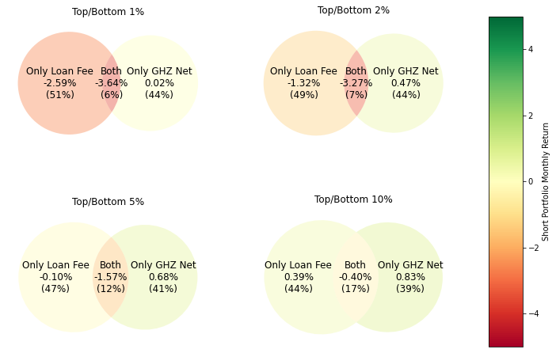

# 融券费率异象：做空者的最佳主意

**Joseph E. Engelberg、Richard B. Evans、Greg Leonard、Adam V. Reed、Matthew C. Ringgenberg**

2024 年 4 月 —— 即将发表于《Management Science》

---

## 亮点

- **Alpha 思想：** 股票融券费率（融券做空者为借入股票所支付的价格）是股票收益率最强的横截面预测变量 —— 做空者的"最佳主意"体现在他们*愿意支付多少*费用去做空一只股票。
- **数据来源：** CRSP（收益率）、Compustat（会计数据）、I/B/E/S（分析师预测）、**FIS Astec Analytics**（融券借贷/融券费率）、Kenneth French 数据库、ISS Securities Class Action Services（10b-5 证券诉讼），以及 **Green, Hand & Zhang (2017, GHZ)** 的 102 个异象。
- **股票池：** 所有美国普通股（CRSP 代码 10/11），市值高于 NYSE 第 5 百分位规模断点；稳健性检验中剔除低于第 20 百分位的全部股票。
- **样本区间：** 2013 年 7 月 – 2019 年 12 月（融券费率样本）；GHZ 异象变量构造区间为 2004 年 8 月 – 2019 年 12 月。
- **核心发现：** 多空融券费率异象在最高/最低 1% 分组上月收益率达 **4.01%**（夏普比率 **0.66**，**74.4%** 的月份为正），优于全部 102 个 GHZ 异象及全部六种机器学习组合方法；\$1 在样本期末增长至 **\$18.76**，而 GHZ Net 复合异象仅为 **\$1.47**。扣除借贷成本后仍为 **0.75%/月**。
- **信号构造：** 按融券费率对股票做横截面排序，在最高/最低 1%、2%、5%、10% 处构建多空组合。将融券费率分解（通过对 102 个异象做 OLS 投影，以及 PCA）为*拟合*成分（被现有异象所张成的信息）与*残差*成分（独特信息）。
- **分解结果：** 融券费率异象的收益率预测能力中有 **42%** 来源于现有异象所不包含的*独特*信息（58% 为拟合部分）；在 PCA 下独特部分占比升至 **68%**。残差成分对证券欺诈集体诉讼的预测能力也远强于拟合成分。

---

## 摘要

我们发现，长期被异象文献忽视的股票融券费率，是横截面收益率最好的预测变量。与 102 个其他异象以及其他做空度量指标相比，融券费率异象具有最高的月度多空收益率（4.01%）、最高的月度夏普比率（0.66），并且与其他异象不同，它在整个样本期内表现出极强的持续性。尽管此前的研究表明，现有异象主要集中在高融券费率的股票上，但我们发现融券费率超额收益中有 42% 来源于其他异象所不包含的独特信息。未来研究横截面收益率预测变量的论文，应当纳入这一最有效的预测变量：融券费率。

**关键词：** 资产定价异象、股票融券费率、卖空

**JEL 分类号：** G12, G14

---

*Engelberg 任职于加州大学圣地亚哥分校；Evans 任职于弗吉尼亚大学；Leonard 任职于弗吉尼亚理工大学；Reed 任职于北卡罗来纳大学；Ringgenberg 任职于犹他大学。我们感谢 Victoria Ivashina（主编）、一位匿名副主编、一位匿名审稿人，以及 David Chapman、Mike Cooper、Jesse Davis、Michael Gallmeyer、Andrei Gonçalves、Charles Jones、Juhani Linnainmaa、Elena Loutskina、Christian Lundblad、Pedro Matos、Paige Ouimet、Jeff Pontiff、Jacob Sagi、Michael Schill、Daniel Schmidt、Gill Segal、Andreas Statopoplous、Davide Tomio、Selim Topaloglu，2022 年美国金融学会年会、2022 年欧洲金融学会年会、2021 年 SFS Cavalcade、2021 年北方金融学会会议的参会者，以及弗吉尼亚大学和北卡罗来纳大学教堂山分校研讨会与会者。文责自负。©2020-24。*

---

## 一、引言

近期若干论文表明，股票融券费率与未来股票收益率相关。[^1] 对于卖空文献的研究者而言，融券费率的预测能力或许并不令人意外：做空者众所周知是知情交易者，而高融券费率股票代表做空者愿意为之支付最高代价的投资标的——即他们的最佳主意。然而，尽管存在卖空方面的证据，资产定价异象文献却在很大程度上忽视了融券费率在决定收益率横截面上的强大作用。在八篇知名的"元异象"论文中，仅有四篇考察了空头持仓，而考察融券费率的则为零。[^2] 我们证明，股票融券费率可以说是横截面收益率最强的单一预测变量。

当我们把融券费率异象与 Green et al. (2017)（以下简称 GHZ）的 102 个异象以及其他做空活动度量指标相比较时，我们发现在 2013 至 2019 年的样本期内，它拥有最高的月度多空平均收益率（4.01%）、最高的夏普比率（0.66）以及最高的月度正收益占比（74.4%）。组合价值方面也有类似结果：投入 \$1 于由 GHZ 异象组合而成的复合异象组合的最高百分位，到样本期末将增长至 \$1.47；而同样的 \$1 投入融券费率异象组合的最高百分位，则将增长至 \$18.76。[^3]

[^1]: 例如 L. Cohen, Diether, and Malloy (2007)、Blocher, Reed, and Wesep (2012)、Drechsler and Drechsler (2016)、Blocher and Ringgenberg (2018)、Engelberg, Reed, and Ringgenberg (2018) 等。
[^2]: 例如 McLean and Pontiff (2016)、Green, Hand, and Zhang (2017)、Harvey, Liu, and Zhu (2016)、Freyberger, Neuhierl, and Weber (2020)、Kozak, Nagel, and Santosh (2020)、Chen and Zimmermann (2022)、Gu, Kelly, and Xiu (2020)、Hou, Xue, and Zhang (2018)。
[^3]: 在计入交易成本后，融券费率异象同样优于 GHZ 复合异象组合（见表 XIV）。

此外，融券费率异象不仅在业绩上独树一帜，在持续性上也与众不同。多数异象会随时间衰减（McLean and Pontiff (2016)），而融券费率异象在整个样本期内始终强劲。当我们根据过去业绩对所有异象排序时，GHZ 中表现最佳的异象其未来业绩与最差者在统计上已无法区分。相反，融券费率异象则持续保持其卓越业绩，胜过现有文献中的最佳异象。

既然现有文献表明做空者是知情交易者，且异象往往集中在难以做空的股票上，那么自然会问：融券费率的预测能力是否仅仅是对现有异象的组合？[ ^4] 基于此，我们将融券费率对全部 102 个异象进行投影，将其分解为拟合成分与残差成分——拟合值度量被现有异象所张成的融券费率部分，而残差度量融券费率中区别于现有异象的独特信息。当我们基于拟合融券费率构建多空交易策略时，发现这一异象聚合每月可获得 2.15% 的收益，跻身 GHZ 异象的前 5%。当我们考察残差融券费率时，发现其每月收益为 1.64%，优于多数 GHZ 异象。换言之，做空者的最佳主意在某种程度上就是关于如何有选择地重新加权现有异象的主意。

[^4]: 前一结论例如 Boehmer, Jones, and Zhang (2008)；后一结论见 Stambaugh, Yu, and Yuan (2012) 与 Drechsler and Drechsler (2016)。

尽管这些结果表明融券费率信号中存在独特信息，但水平上的差异并不能告诉我们融券费率与收益率关系中各成分解释了多少。使用回归方法，我们发现拟合融券费率解释了一个月提前收益变动的 58%，而残差解释了 42%。类似地，使用主成分方法时，拟合融券费率解释了 32%，残差解释了 68%。这些结果表明，做空者最佳主意中相当大的一部分无法被现有异象所张成。换言之，现有异象遗漏了关于某些最被错误定价股票的信息，而做空者的最佳主意恰好包含这一宝贵信息。

作为残差融券费率可能包含的信息类型的一个例证，我们在证券欺诈集体诉讼的情境下重复了分析。现有文献发现做空者擅长揭露财务造假（Karpoff & Lou, 2010）。与此一致，我们发现融券费率能够预测与财务不当行为相关的诉讼发生。而且，我们还发现融券费率的残差成分比拟合成分更多地解释了做空者关于财务诉讼的最佳主意，再次表明他们的最佳主意无法被现有异象所张成。

鉴于融券费率同时聚合了现有信息与独特信息，我们进而考察融券费率异象是否优于其他用于组合信号的知名统计技术。结论是肯定的。当我们将融券费率与用 GHZ Net、普通最小二乘（OLS）、主成分回归（PCR）、偏最小二乘（PLS）、弹性网（ENET）以及带广义线性模型的组 Lasso（GLM）聚合得到的异象信号相比较时，发现它持续地优于全部六种方法。特别地，融券费率的聚合每月产生 4.01% 的收益，而次优的聚合方法 GLM 为 1.95%。

本研究的首要贡献在于指出：异象文献忽视了一个也许是数据中最好的收益率预测变量。对于研究预期收益率模型的人而言，这一遗漏是关键的。然而，融券费率本身是一项交易成本。对于实务从业者，一个自然的问题是：在计入融券费率成本之后，融券费率异象是否仍是一个有利可图的交易策略？我们发现答案是"是"。对于 102 个 GHZ 异象中的每一个，我们都从其异象组合空头端股票中减去借贷成本，对融券费率异象亦然。经过此调整后，融券费率异象相对于 102 个 GHZ 异象依然表现良好。具体而言，融券费率异象的多空收益为每月 0.75%，而 GHZ 异象平均为 −0.15%。

最后，我们考察一个关键问题：为什么融券费率如此具有信息含量？大量文献表明做空者平均而言是知情交易者。理想情况下，我们希望能观察到他们的预期收益率预测，但遗憾的是并不存在这样的数据库。我们论证，股票融券费率比空头持仓（short interest）是这些预测更好的代理变量。直觉很简单：融券费率代理做空者的支付意愿——一只股票的融券费率高，表明某些做空者对该股的预期收益率足够低，以至于即使在支付融券费率之后，做空仍可获利。然而，当做空者预期收益率较低时，空头持仓未必总是很高。空头持仓在横截面上可能因融券供给的变化而变化，而这种变化与做空者的预期收益率预测无关（例如 Cohen et al. (2007)）。当我们在融券费率与空头持仓的框架下考察融券供给时，发现确实如此（见表 XIII）。总之，每当融券费率高时，边际做空者很可能有一个较低的预期收益率预测，因为他们选择支付这一成本；但对空头持仓而言未必如此。[ ^5]

[^5]: 设想一个简单模型：做空需求或高或低，可借股票供给或高或低，共四种情形：(i) 低需求低供给、(ii) 低需求高供给、(iii) 高需求高供给、(iv) 高需求低供给。在情形 (i)、(ii) 中，需求低时空头持仓与融券费率都低。在情形 (iii) 中，需求高且供给高，做空者会尽可能多地借券，并持续借券直至融券费率达到进一步做空不再盈利的水平；此时空头持仓与融券费率都高。在情形 (iv) 中，需求高但供给低，做空者仍会持续借券直至不再盈利，但由于供给有限，这只会发生在较少的股数上；因此空头持仓低而融券费率高。

融券费率固然是做空者面临的成本，但做空者还面临其他套利限制，包括流动性。例如 Hou, Xue, and Zhang (2017) 指出异象往往存在于小盘、流动性差的股票中。我们的发现与之不同。在稳健性检验中，当我们以 Fama and MacBeth (1973) 回归对复合异象变量与规模、非流动性以及融券费率的交互项进行竞争性检验时，融券费率的交互项"挤出"了另外两个。换言之，我们关于做空者最佳主意的发现，有别于已知的"异象收益—规模—流动性"关联。

在其他稳健性检验中，我们还考察了结果在整个横截面以及对其他做空度量指标的稳健性。就横截面而言，我们按 Fama and French (2008) 将市值低于 NYSE 第 20 百分位断点的股票定义为微盘股，然后剔除微盘股重新检验。所有结论依然成立——融券费率异象仍是第一异象，优于全部 102 个 GHZ 异象。就其他做空度量指标而言，我们将融券费率异象与另外四个知名变量比较：空头持仓（Asquith, Pathak, and Ritter (2005)）、覆盖天数（days-to-cover，Hong, Li, Ni, Scheinkman, and Yan (2016)）、CME Beta（Drechsler and Drechsler (2016)）以及空头持仓比率乘以收益率波动率（Hanson and Sunderam (2014)）。我们发现融券费率不仅是更优的收益率预测变量，还"挤出"了这些替代指标的收益率预测能力。

本文对资产定价异象文献的若干分支均有贡献。该文献起初考察单个异象（如 Jegadeesh and Titman (1993)、Fama and French (1992)、Cooper, Gulen, and Schill (2008)），后来演变为考察大规模异象集合（如 McLean and Pontiff (2016)、Green et al. (2017)、Hou et al. (2017)、Chen and Velikov (2020)）。我们的第一项贡献是：在一个全面的异象集合中，识别融券费率可以说是最好的横截面预测变量。迄今为止，这一最好的横截面收益率预测变量——融券费率——一直被排除在该文献所考察的集合之外（如 McLean and Pontiff (2016)、Green et al. (2017)、Hou et al. (2017)、Chen and Velikov (2020)）。

我们的第二项贡献与日益增长的、试图用最先进的计量技术组合现有异象以最大化样本外收益率预测能力的文献相关（如 Gu et al. (2020)、Lewellen (2015)）。我们将融券费率与用 GHZ Net、OLS、PCR、PLS、ENET 以及 GLM 聚合得到的异象信号相比较，发现融券费率的聚合优于全部六种方法。融券费率对这些方法持续的优胜表明，融券费率内含的、具有清晰经济学解释的加权方式，优于其他纯粹的统计技术。

第三，我们表明融券费率包含了现有异象未能捕捉的宝贵信息。换言之，融券费率确实包含了诸多现有异象的信息，但做空者的最佳主意同时包含独特信息：融券费率能够捕捉难以量化、特质性的、现有异象所不包含的信息。

第四，本文的发现还与近期关于投资者"最佳主意"的文献相关。该文献大多聚焦于共同基金，表明在基金经理信念最强之处，这些"最佳主意"与收益率横截面强相关（R. Cohen, Polk, and Silli (2021)、Jiang, Verbeek, and Wang (2014)）。我们将此文献拓展至做空者领域。这样做我们有两个优势：第一，卖空数据覆盖范围广泛的投资者，而不仅仅是基金经理；第二，选择做空的投资者很可能是最知情的场内参与者。因此，他们的最佳主意理应被纳入任何关于"投资者最佳主意"的讨论。

本文余下部分安排如下：第二节描述样本并概述方法；第三节详细讨论现有文献；第四节展示主要结果；第五节作结。

---

## 二、数据、方法与描述性统计

为考察做空者的最佳主意，我们合并了来自 Compustat、I/B/E/S、CRSP（证券价格研究中心）的数据，以及来自 FIS Astec Analytics Short Lending Data 的融券借贷数据。

### A. 数据与样本构造

尽管考察大规模异象集合的论文越来越多，我们之所以使用 Green et al. (2017) 的 102 个异象，不仅因为其清单包含被引用最广的异象（如动量（Jegadeesh & Titman, 1993）、资产增长（Cooper et al., 2008）、账面市值比（Rosenberg, Reid, & Lanstein, 1985）等），还因为 Jeremiah Green 在其网站上公开了构造每个异象的代码。[ ^6] 102 个异象底层数据的公开可得性，既便于复现我们的结果，也便于对异象做进一步探索。

[^6]: https://sites.google.com/site/jeremiahrgreenacctg/home

从 Compustat，我们收集构造资产定价异象所需的若干会计数据项。从 CRSP，我们获取所有美国普通股（即 CRSP 代码为 10 或 11 的资产）的月度收益（含分红）、交易量、股价和流通股本数据。我们剔除极小盘股票——即市值低于 Kenneth French 网站提供的 NYSE 第 5 百分位规模断点的股票。[ ^7] 在第四节 G 小节讨论的稳健性检验中，我们表明若按 Fama and French (2008) 剔除低于 NYSE 第 20 百分位的全部股票，主要结论不变。

[^7]: https://mba.tuck.dartmouth.edu/pages/faculty/ken.french/data_library.html

最后，我们将 FIS Astec Analytics Short Lending Data 的融券借贷数据加入数据库。FIS Astec 从银行和主要融券借贷托管机构收集数据，并汇总至日度。我们采用 FIS Astec 的零售平均融券费率（即股票最终借入者每日支付的平均费率）作为融券费率的度量。[ ^8]

[^8]: 我们在分析中使用 FIS Astec 数据，因为它提供了每只股票每个日期的融券费率；但在未报告的分析中，我们使用一个时间更长但融券费率度量更粗糙的替代数据库，结论不变。

### B. 方法

尽管我们将在下文结果部分更详细地讨论方法，此处先介绍两个关键组成部分。第一，在所有分析中，我们将融券费率异象与：(i) 102 个异象的个体集合，以及 (ii) 我们称之为 'GHZ Net' 异象的聚合体（如 Engelberg, McLean, and Pontiff (2018)）进行比较。GHZ Net 异象变量按如下方式聚合 Green et al. (2017) 编纂的全部异象信号：对每个"股票-月份"观测，我们计算该公司所属的多头端（Long）和空头端（Short）异象组合数目，并求两者之差。例如，一只股票属于 17 个多头组合和 13 个空头组合，则其 Net = 17 − 13 = 4。一般而言，属于众多多头（空头）异象组合的股票，其 'Net' 异象值会很大且为正（负）。

第二，由于任何异象的业绩取决于多空两端的定义方式（如最高/最低百分位、十分位、二十分位等），我们在四种不同的异象组合定义下报告结果，具体采用：

1. 最高/最低 1%（百分位），
2. 最高/最低 2%（五十分位），
3. 最高/最低 5%（二十分位），
4. 最高/最低 10%（十分位）。

在把股票分入组合时，需处理任何排序变量的离散性问题。以 1% 为例，我们在每个日期识别融券费率高于第 99 百分位、以及低于第 1 百分位的股票集合。若不存在高于第 99 百分位的值（即第 99 百分位同时也是最小值），则纳入所有等于第 99 百分位的股票。我们对第 98、95、90 百分位采用类似方法。

由于我们关注的是做空者的最佳主意，因此最关心融券费率最极端的股票表现如何。极端融券费率最好由最高/最低 1% 样本来捕捉。然而，最高/最低 1% 样本天然依赖较少的股票来构成多空组合的每一端，与文献中常用的最高/最低 10% 不同。因此，我们也用最高/最低 10% 报告所有结果，并以最高/最低 2%、5% 作为结果对多空组合定义稳健性的进一步证据。结果对这些定义不敏感。

### C. 描述性统计

表 I 给出样本（覆盖 2013 年 7 月至 2019 年 12 月）的描述性统计。Panel A 给出关键做空变量的描述性统计，表明做空变量变异很大。融券费率中位数仅为年化 59 个基点，但均值达年化 132 个基点，第 99 百分位达年化 1,710 个基点。数据显示，做空者有时愿意支付高额费率来践行其观点。空头持仓占流通股本比例（SIR）与覆盖天数（DTC）呈类似模式：两者均值均显著高于中位数。Panel B 给出 GHZ Net 变量的描述性统计。GHZ 数据集中 102 个异象的描述性统计见附录表 A1。

---

## 三、详细的文献综述

通过表明融券费率异象比其他异象更强地预测收益，我们触及若干现有文献，包括资产定价异象文献与"做空者为知情交易者"的文献。

首先，在异象领域，我们加入了一个不断增长的研究体系。资产定价异象至少自 Ball and Brown (1968) 起就有记录。文献起初聚焦单个异象，后来越来越多地同时考察大规模异象集合，以得出关于资产定价更一般性的结论。Chen and Zimmermann (2022) 发现多数异象在样本内可复现，而异象文献中一个不断增长的分支则考察异象在样本外的稳健性及数据挖掘问题。McLean and Pontiff (2016) 发现异象在相关学术论文首次发表后盈利能力趋于下降，并认为这是由于发表后的知情交易。Harvey et al. (2016) 认为资产定价文献中报告的大多数异象是数据挖掘的产物。类似地，Hou et al. (2018) 发现一旦剔除微盘股并采用市值加权，多数异象消失。

我们的发现对该文献的一个启示是：融券费率的预测能力强劲、稳定且持续，这表明尽管基于系统性信息的异象可能衰减或受数据挖掘影响，但市场上始终存在源自特质性信息的一贯错误定价。另一启示是，部分异象可能只是融券费率与收益率关系的产物。若如此，它们发表后衰减或未通过多重检验显著性阈值，并不反映知情交易或数据挖掘，而是与融券费率的时变弱相关。

文献的另一分支试图识别对收益率横截面提供独立信息的特征。Green et al. (2017) 用线性回归发现 94 个特征中有 12 个是可靠的独立预测变量。Freyberger et al. (2020) 用非参数方法发现其研究的 62 个收益率预测变量中多数不提供额外信息。本文对该分支有两点启示：其一，一旦纳入融券费率，这些作者认为具有独立信息的某些特征可能不再具有独立信息；其二，鉴于融券费率的收益率预测能力有 71% 来自现有异象所不包含的信息，应将融券费率加入具有独立信息的异象清单。未来希望使用这些论文的合并异象集合的论文，应将融券费率加入其异象清单。

Gu et al. (2020) 使用允许信号间非线性交互的机器学习方法预测收益，发现动量、流动性与波动率的若干变体是最优预测信号。本文与该分支尤相关。我们发现融券费率是压倒性的最强收益率预测变量，尤其当我们聚焦每个信号的最高/最低 1% 股票时。融券费率作为最强预测变量也有直观吸引力：研究者固然可用复杂算法基于公司特征预测预期收益，但融券费率把市场信息汇总为单一价格信号，揭示市场认为哪些股票被高估。

在卖空文献中，若干论文表明包括股票融券费率在内的卖空活动度量与未来收益相关。特别是 Asquith et al. (2005)、L. Cohen et al. (2007)、Hong et al. (2016) 与 Jones and Lamont (2002) 表明，空头持仓高时未来收益较低。此外，若干论文给出做空者是知情投资者、善于处理信息的证据（Boehmer et al. (2008)、Karpoff and Lou (2010)、Engelberg, Reed, and Ringgenberg (2012)、Henderson, Jostova, and Philipov (2020)）。与本文尤其相关的是，近期若干论文发现股票融券费率包含未来收益的信息（L. Cohen et al. (2007)、Blocher et al. (2012)、Drechsler and Drechsler (2016)、Blocher and Ringgenberg (2018)、Engelberg, Reed, and Ringgenberg (2018)）。尽管对卖空文献研究者而言融券费率的预测能力并不意外，但资产定价异象文献却在很大程度上忽视了融券费率在决定收益率横截面上有多强大。例如，尽管有多篇"元异象"论文集体考察了数百个异象变量，据我们所知没有一篇元异象论文考察了融券费率。

若干论文把卖空与各种交易策略相联系。Dechow, Hutton, Meulbroek, and Sloan (2001) 表明基本面与市值之比（如盈利、账面价值）低的公司空头持仓更高。类似地，Geczy, Musto, and Reed (2002) 表明卖空可由已被接受的股价模式（包括规模、账面市值比、动量效应）驱动。Stambaugh et al. (2012) 认为异象盈利很大部分来自空头端，Drechsler and Drechsler (2016) 发现融券费率是异象策略内部盈利能力的指示。这些论文聚焦于现有异象如何受卖空约束影响，而我们使用更大的异象集合，发现融券费率的预测能力很大一部分位于现有异象之外。

---

## 四、结果

本节考察融券费率作为收益率的横截面预测变量。我们首先比较融券费率异象与 Green et al. (2017) 编纂分析的 102 个股票收益异象的业绩。

### A. 融券费率异象业绩

我们首先考察融券费率异象的时间序列业绩。为简单比较多空融券费率异象相对于 GHZ Net 异象的业绩，图 1 绘出投入 \$1 于两个组合的增长曲线。图的四个分屏对应四种多空组合定义。在 Panel A（最窄定义，即按融券费率最高/最低 1% 构建多空组合）中，样本期内投入融券费率异象的 \$1 增长至 \$18.76，而投入 GHZ Net 异象的 \$1 仅增至 \$1.47。其余三个分屏结果类似。随着用其他分箱方法（最高/最低 2%、5%、10%）重复分析，业绩差距缩小，但每种情形下融券费率异象都产生显著高于 GHZ Net 异象变量的利润。

在表 II 中，我们正式将融券费率异象与 GHZ 异象集合比较。表中展示平均 1 个月收益（Panel A）、1 个月正收益占比（Panel B）以及夏普比率（Panel C）。对融券费率，表中给出平均值（'Value'）及其在全部 102 个异象中的排名（'Rank'）。最后一列给出全部 102 个 GHZ 异象收益分布的统计量（均值、第 95 百分位、最大值）。

在全部四种分箱方法下，融券费率异象显然是顶级选手。在 Panel A 中，多空融券费率异象在最高/最低 1% 与 2% 组合的平均 1 个月收益、正收益占比、月度夏普比率均排第一。在四种百分位定义下，融券费率平均收益介于 4.01% 与 0.98% 之间，而 GHZ 异象集合均值介于 0.17% 与 0.06% 之间，其最大值介于 2.60% 与 1.15% 之间。我们还计算了融券费率异象相对于 GHZ 集合的偏度与峰度，见附录表 A2。

除了单独分析异象，还有一支不断增长的文献用先进统计技术探索异象的最优组合（如 Gu et al. (2020)）以最大化复合异象信号的实现收益。在某种意义上，融券费率是由套利者的显示偏好决定的、对市场信号的一种替代组合。据此，表 III 将融券费率与若干更先进的聚合方法比较。第一种最简单，是 GHZ Net，等权各异象构建组合。其余五种（OLS、PCR、PLS、ENET、GLM）遵循 Gu et al. (2020) 的估计方法。[ ^9]

[^9]: 我们在每年 6 月估计每个模型的参数，并将其固定用于下一年。在首次估计的 2004 年 6 月，我们使用此前 30 年数据，将样本分为 18 年训练集与 12 年验证集。各模型的超参数以训练集估计下、验证集 R² 最大化为准选取。此后每年，验证集向前滚动一年、训练集扩展一年。我们的异象变量集合是 Gu et al. (2020) 从 Green et al. (2017) 中使用的 94 个 GHZ 异象。我们不纳入 Gu et al. (2020) 添加的宏观预测变量与行业固定效应。与 Gu et al. (2020) 一致，估计时使用异象的分位数值。我们使用 Gu et al. (2020) 在 Dacheng Xiu 网站上提供的代码实现估计方法，但做了两处调整：第一，估计模型与评估验证集 R² 时使用月度去均值收益，以使流程最大化收益的横截面变异；第二，对弹性网，在某些年份验证集 R² 对所有惩罚参数取值均为负，意味着最优模型的惩罚参数高到对每个 GHZ 信号赋零权重，导致该年多空收益为 0%。为保守起见，我们重新估计并对优化施加约束，使搜索最优惩罚参数的范围足够宽，不会对未受此问题影响的任何年份构成约束，但也不更宽。约束优化的结果更强，表 III 报告的即是该结果。

在该比较中，我们展示多空组合收益、正收益占比、夏普比率，以及每种组合方法在七种方法（融券费率与六种组合方法）中的排名。我们发现融券费率几乎总在排名上压倒其他组合方法，融券费率异象的收益几乎总更大——往往大得多。例如，在最高/最低 1% 组合中，融券费率收益为 4.01%，而其他方法中最大的 GLM 为 1.95%。在组合方法排名中，融券费率几乎总是第一。这一广泛发现在表 III 全部三个分屏（收益、正收益占比、夏普比率）中一致。

融券费率的业绩引出一个有趣问题：其压倒性业绩在多大程度上来自对现有异象的更有效组合，而非来自现有异象之外的信息？我们将在下文 C 小节详细探讨，此处先更细致地考察融券费率与现有异象的关系。

在表 IV 中，我们报告四种百分位定义下按多空业绩排名的前 20 个异象，不仅给出平均多空业绩，还分别给出多头端与空头端业绩及空头端排名。分离两端业绩表明，融券费率异象的优胜由空头端驱动。空头端业绩在四种定义下均排前十，而多头端业绩在前二十中处于平均水平。考察四种定义下的其他异象名单，并不能识别出一组明确的"更优"异象。比较四种定义的前二十名单，共有 45 个不同异象出现，7 个异象在全部四种定义下均稳定位列前二十。[ ^10]

[^10]: 绝对应计项、预测 EPS 离散度、财务报表评分（MS）、特质收益率波动、研发占市值、销售收入变化率减应收账款变化率、行业调整账面市值比。

表 V 与图 2、图 3 考察融券费率异象随时间的业绩。表 V 报告多空融券费率组合相对于其余 GHZ 异象集合的 12 个月滚动平均业绩排名。融券费率异象始终位于前二十，并在多个多月区间保持第一。图 2 绘出多空融券费率与 GHZ Net 组合的 12 个月滚动平均业绩，图 3 分别绘出两组合的多空两端。图 2 证实了融券费率异象相对于通过 GHZ Net 组合聚合全部 GHZ 异象的整体优胜。在四种百分位定义下，融券费率在 74% 至 94% 的月份中胜出。

表 V 显示有一段时间融券费率异象业绩接近平均水平：2018 年末/2019 年初。该时期伴随大幅负的市场收益与相对较大的波动率上升。图 2 显示在全部三个时期，融券费率与 GHZ Net 组合业绩均下滑并产生接近零的收益。此外，图 3 与表 IV 表明这一优胜由策略的空头端产生。与同单个 GHZ 异象的比较相反，图 2 显示融券费率多空组合在 2018、2019 年于三种百分位定义下均胜过 GHZ Net 组合。

图 4 描绘融券费率异象相对于 GHZ 集合的持续性。为此，我们计算每个异象过去两年的平均收益，并据此形成十分位，然后评估每个十分位次年的业绩，同时单独展示融券费率异象。

把位于最高十分位的平均 GHZ 异象与最高十分位的融券费率异象相比，未来收益截然不同。平均最高十分位 GHZ 异象会均值回归，一年后与平均最低十分位异象在统计上无法区分；而融券费率异象则持续保持卓越业绩，在所有十分位上均优于平均 GHZ 异象。[ ^11] 换言之，今天表现优异的 GHZ 异象不太可能是次年仍表现优异的 GHZ 异象，但融券费率异象则持续是顶级选手。

[^11]: 我们对最高十分位与最低十分位的 1 个月收益均值差异做 t 检验，使用 Newey and West (1987) 标准误，发现均值差异在 10% 水平上统计不显著。

另一种看法见图 6：我们考察以过去两年位列最高业绩十分位为条件、当前异象的业绩。即取过去两年最高业绩十分位的异象，考察其在下一年留在最高十分位的可能性。左上图（最高/最低 1%）表明，在 GHZ 异象中，过去两年最高十分位的选手在下一年有 11% 的概率仍是最高十分位、17% 的概率落入最低十分位。纵观四个图的所有十分位箱，分布相当平坦，表明在 GHZ 异象中，以相对强劲的过去业绩为条件对未来业绩几乎没有预测力。而当我们看融券费率异象在未来业绩十分位的分布时，差异惊人：融券费率异象有 81% 的概率留在最高十分位。此外，落入较低十分位的概率急剧下降，落入下半部分十分位的概率为 0%。总体而言，这与顶级 GHZ 异象形成强烈对比，表明融券费率异象的业绩持续性显著高于平均顶级 GHZ 异象。

### B. 其他卖空预测变量

"最佳主意"概念始于共同基金文献，提出基于组合与集中度来捕捉基金经理最佳主意的度量。卖空文献中有若干可能的对应物。一个自然选择是空头持仓，度量一只股票流通股本中被做空的百分比。空头持仓高时，很可能许多做空者持有押注该股的大额头寸。

这两种方法都是基于数量的最佳主意度量，隐含假设是经理对她喜欢的股票持有更多。另一种是基于价格的度量，即经理为持有头寸支付越多，越喜欢。卖空一侧自然的基于价格的度量就是融券费率。

在表 VI 中，我们考察基于价格与基于数量的度量的预测力。具体地，我们对融券费率（第 (1) 列）和空头持仓（第 (2) 列）做一月提前收益的 OLS 面板回归。所有模型含时间固定效应，系数下方给出 Driscoll-Kraay 标准误计算的 t 统计量。[ ^12]

[^12]: 我们在附录表 A3 中将变量在第 1 与第 99 百分位处缩尾后重复该分析，结论不变。

两个重要事实浮现。第一，比较第 (1)、(2) 列可知融券费率比空头持仓更强地预测未来收益：融券费率一个标准差的上升对应未来收益下降 0.36%（空头持仓对应下降 0.22%）。第二，在多元竞争性回归（第 (3) 列）中，融券费率削弱了空头持仓的重要性（变得不显著），而融券费率仍高度统计显著。由此可见，比较价格与数量度量时，基于价格的度量（融券费率）是更强的未来收益预测变量。换言之，融券费率更成功地捕捉做空者的最佳主意。

当然，文献还考察了若干可代理做空者最佳主意其他度量，包括覆盖天数（Hong et al. (2016)）、SIR×RetVol（一种套利风险度量，仿 Hanson and Sunderam (2014)）以及 CME Beta（Drechsler and Drechsler (2016)）。[ ^13] 在第 (4)、(5)、(6) 列，我们不仅单独考察这些度量，还在与融券费率的竞争性回归中考察。单独看，每个度量都预测未来收益：覆盖天数、SIR×RetVol、CME Beta 的对应估计分别为 −0.13%、−0.03%、0.16%。然而，考虑这些其他卖空变量并不改变我们的结论：融券费率仍是最好的未来收益预测变量，并挤出替代指标的预测力。[ ^14] 总体而言，融券费率捕捉了做空者的最佳主意。

[^13]: Drechsler and Drechsler (2016) 的 CME Beta 是一种协方差（估计为股票与一个多空融券费率组合的协方差），而本文的融券费率是一种特征——正如 Daniel and Titman (1997) 所指出，这是一个重要区别。
[^14]: 覆盖天数为空头持仓除以过去一个月平均日成交量。SIR×RetVol 为空头持仓除以市值再乘以过去一个月的日收益波动率。CME Beta 为对 Drechsler and Drechsler (2016) cheap-minus-expensive 因子的估计 beta。cheap-minus-expensive 组合通过做多融券费率异象"最低 10%"组合、做空"最高 10%"组合构造。我们以股票与组合构造前 36 个月内 CME 组合中股票的 beta 来代理其对 CME 因子的暴露。具体地，为估计股票 i 在 t 月的 beta，我们 (1) 识别 t 月 CME 组合每端的股票，(2) 固定 CME 组合股票集合并计算其过去 36 个月的多空收益，(3) 将股票 i 的收益对三因子 Fama-French 模型加 (2) 的 CME 因子做回归。

在表 VII 中，我们重复表 II 的分析，将融券费率异象的多空收益与四个卖空相关变量（覆盖天数、空头持仓比率、SIR×RetVol、CME Beta）比较。四个卖空相关变量都表现良好。在最高/最低 10% 组合中，每个卖空相关变量的多空收益在 GHZ 异象中排名不低于第十六。然而融券费率异象表现更好，在最高/最低 10% 多空收益上至少超出四个变量各自 0.24%。无论用最高/最低 1%、2%、5% 还是 10% 构建多空组合，融券费率异象的月度夏普比率也都高于四个卖空相关变量。

### C. 融券费率异象与独特信息

尽管前两节结果表明融券费率是横截面收益的强预测变量，但其他论文也提出过类似观点（如 Stambaugh et al. (2012)、Drechsler and Drechsler (2016)）。这些论文聚焦于融券费率与其他卖空约束是否解释了此前发现的异象。与它们不同，我们问的是：融券费率异象在多大程度上捕捉了现有异象已包含的信息，又在多大程度上捕捉了这些异象之外的信息。作为第一步，我们在四种截断（最低 1%、2%、5%、10%）下识别每期融券费率与 GHZ Net 异象的空头组合，然后计算每个异象单独识别的股票（即"仅融券费率"与"仅 GHZ Net"）以及重叠组合（"两者皆是"）的平均业绩。结果绘于图 5。

先看 1% 空头组合，融券费率与 GHZ Net 异象识别的股票仅有 6% 重叠。随着截断提高，重叠单调增长，在十分位截断处达到 17%。看业绩，同时被融券费率与 GHZ Net 异象空头组合包含的股票表现最差。比较两个异象各自单独识别的股票，"仅融券费率"空头组合每月跑输"仅 GHZ Net"空头组合 2.61% 至 0.44%（取决于截断）。

这一集合分析暗示融券费率包含做空者独有的信息。为更好理解融券费率包含的信息（一部分代表对现有异象的有选择再加权）与可能独特的融券费率异象信息，我们先将融券费率对每个异象变量单独回归，在表 VIII 中展示最强与最弱的系数。

表中，我们按异象与融券费率相关性所示方向计算每个异象的多空收益。例如，特质收益率波动与融券费率正相关。由于融券费率异象做多低融券费率股、做空高融券费率股，故在特质波动正相关下，我们同样做多低特质波动股、做空高特质波动股。我们称之为"融券费率所示方向"。又如，资产收益率（ROA）与融券费率负相关，故按"融券费率所示方向"计算 ROA 多空收益时，我们做空低 ROA 股、做多高 ROA 股。[ ^15]

[^15]: 换言之，对与融券费率正相关的异象，我们总做多异象变量低值股、做空高值股；对负相关异象，我们总做多高值、做空低值。

表 VIII 表明，与融券费率相关性最强的异象优于相关性最弱的异象。例如，聚焦 Panel A 最后一列，相关性最强异象在"融券费率所示方向"的平均多空收益为 0.4%，而 Panel B 中相关性最弱异象平均为 0.1%，Panel C 总体平均亦为 0.1%。换言之，与融券费率高度相关的异象变量，其多空组合表现优于与之几乎不相关的异象变量。这表明融券费率异象代表对最佳表现异象的有选择暴露。

为量化这种有选择暴露对融券费率异象的贡献，我们进而考虑多元设定。表 VIII 考察融券费率异象与 GHZ 集合的单变量关系，表 IX 则把融券费率同时对全部 102 个 GHZ 异象投影，以构造拟合融券费率与残差融券费率。具体地，我们估计一个含时间固定效应的 OLS 面板回归（全样本），以融券费率为因变量、标准化后的异象集合为自变量。拟合值代表被现有异象张成的融券费率成分，残差度量独特的融券费率成分。该分解用两种方式计算：(1) 将融券费率对全部 102 个 GHZ 异象投影；(2) 用主成分（PCA）取前 10 个成分定义拟合成分。[ ^16]

[^16]: PCA 中取 10 个成分的截断依据附录图 A1 的碎石图。我们也用 1 个与 6 个成分重复，结果类似，见附录表 A4。

表 IX 表明，基于拟合值或残差构成的多空组合相对于 GHZ 集合都表现良好。聚焦最高/最低 1% 组合，投影法（PCA 法）构造的拟合融券费率多空收益为 2.15%（1.52%），在 GHZ 集合中排第三（第六），印证了融券费率有选择地与高表现异象相关。投影（PCA 分解）残差的多空收益为 1.64%（2.97%），当我们以残差替代拟合值参与与 GHZ 集合的排名比较时，其排第六（第一）。换言之，融券费率异象的独特成分在投影残差情形下仅逊于 6 个 GHZ 异象，在 PCA 残差情形下优于全部 GHZ 异象。这表明做空者拥有现有异象集合所不包含的宝贵信息。

为把握独特成分对融券费率异象的相对贡献，我们转向回归设定。在表 X 中，我们将一个月提前月度收益对预测融券费率（第 2、5 列）、残差融券费率（第 3、6 列）以及两者同时（第 4、7 列）回归。看投影分解下这些回归的 R²，拟合成分解释了总收益预测能力的 58%，独特成分解释了 42%。用 PCA 分解，独特成分解释 68%，拟合成分仅解释 32%。[ ^17] 这些结果证实，做空者最佳主意中相当一部分来自现有异象集合所不包含的宝贵信息。

[^17]: 我们也用不同 PCA 分解截断重复分析，见附录表 A5。

上述结果表明，融券费率中存在传统异象变量未能捕捉的大量信息。事实上，多数收益预测能力位于残差融券费率而非拟合融券费率。一个自然的问题随之而来：这是哪类信息？

当然，要识别残差融券费率中的全部信息是困难的，因为它涵盖大量可能的特质性信息来源。但我们可以通过考察一个做空者高度知情的情境，来看这类特质性信息可能的样子。现有文献表明做空者擅长侦测财务不当行为（如 Karpoff and Lou (2010)、Fang, Huang, and Karpoff (2016)），只要这类信息与预测信息正交，它就可作为此类特质性信息来源的一个例证。[ ^18]

[^18]: 尽管这类信息的特质性是合理的，但此前研究也表明此前记录的异象可能也有助于预测集体诉讼。例如 DuCharme, Malatesta, and Sefci (2004) 发现异常应计项与股东集体诉讼发生率正相关。

为考察财务不当行为，我们使用来自 ISS Securities Class Action Services 的证券欺诈（即 10b-5）股东集体诉讼数据库。该数据库覆盖我们融券费率样本期的所有年份，包括针对 737 家公司的 940 起诉讼。我们可观察到集体诉讼期开始日、结束日、诉讼提起日与和解日。

表 XI 表明，做空者最佳主意中有相当一部分与集体诉讼相关。[ ^19] 表 XI 第一行报告一般担保品（general collateral, GC）股票处于集体诉讼某阶段的百分比（定义为集体期开始至案件和解）。最高 10% 融券费率股处于集体诉讼某阶段的可能性是一般担保品股的两倍。当我们更聚焦于做空者的最佳主意时，结果更强：最高融券费率股中有 23.5% 处于集体诉讼某阶段，而一般担保品股仅 6.2%。

[^19]: 附录表 A6 在回归框架下表明结果类似。

我们还发现残差融券费率与这些集体诉讼的关联多于拟合融券费率。表 XI 两行非加粗行回答：在处于集体诉讼某阶段且融券费率高的股票中，有多大比例具有高拟合融券费率、又有多大比例具有高残差融券费率？当考察处于诉讼某阶段且融券费率在前 10% 的股票时，其具有前 10% 拟合融券费率或残差融券费率的倾向差异不大。然而，当我们收窄到处于诉讼某阶段且融券费率在前 1% 的股票时，17.1% 具有前 1% 的拟合融券费率，87.4% 具有前 1% 的残差融券费率。换言之，在做空者的最佳主意中，融券费率所含独特信息成分对诉讼的预测远好于与现有异象重叠的信息。

表 XI 第二、三行对集体诉讼内两个时期重复分析。第一是"集体期"，始于股东指控公司首次做出虚假或误导性陈述、止于公司更正这些陈述。第二是"诉讼进行期"，始于诉讼提起、止于诉讼和解。在两个时期内，两个结论均成立：(1) 特殊股比一般担保品股更可能处于集体诉讼这两个阶段；(2) 融券费率的残差成分比拟合融券费率更好地捕捉做空者关于财务不当行为的最佳主意。

集体诉讼是此前文献已表明做空者具有信息优势的一个情境。我们发现做空者最佳主意中有相当一部分源于这一信息优势。而且，该优势来自与现有异象正交的融券费率成分，表明其信息是独特的。

### D. 现有异象对融券费率的依赖

前述结果证明融券费率的多数收益预测能力不依赖于现有异象。在表 XII 中，我们反过来问（仿 Drechsler and Drechsler (2016)）：现有异象在多大程度上依赖于高融券费率股票？我们在表 XII 考察一组双重排序。Panel A 中，我们将股票独立地分为一般担保品（GC）与特殊组合，并按 GHZ Net 分数十分位排序。Panel B 做条件排序：先将股票分为 GC 与特殊组合，再在两组内按 GHZ Net 分数十分位排序。两种双重排序得出同样结论：在 GC 股中，最高与最低 GHZ 十分位间业绩无差异；而在高融券费率股中，最高与最低 GHZ Net 十分位间差异为 0.42% 或 0.97%（视双重排序方法而定）。这表明聚合 GHZ Net 异象信号的有效成分主要存在于特殊股中。换言之，异象存在于高融券费率股票中。

### E. 融券费率与空头持仓中的信息

归根结底，我们关心做空者对每只股票的预期收益预测。遗憾的是，据我们所知并不存在包含这一度量的数据库。但我们论证，融券费率是做空者预期收益预测的最佳代理。直觉很简单：融券费率代理做空者的支付意愿。换言之，一只股票融券费率高，表明某些做空者对该股预期收益足够低，以至于支付融券费率后做空仍可盈利。举例：若做空者以年化 15% 的融券费率借入 ABC 股票，意味着他们对该股的预期收益低于年化 −15%，从而支付融券费率后交易仍有正期望利润。

注意，对空头持仓不能这样说。考虑一只空头持仓高但融券费率小的股票，如年化 0.1%。有可能所有做空的做空者预期收益均为 −0.2%。此时做空者建仓是理性的，于是许多人这样做，空头持仓变得很高，但这并不会预测大幅下跌。总之，融券费率高时，边际做空者很可能预期收益极低；空头持仓高时，并无此必要条件。

我们在表 XIII 中探索这一想法，该表给出按空头持仓与融券费率双重排序的收益数据，并报告中位融券供给（可借股份供给中尚未借出的中位百分比）。[ ^20] 在 Panel A、B 中，行代表空头持仓十分位，融券费率变量用于把样本分为一般担保品与特殊两组。先看一般担保品股，按空头持仓十分位排序产生每月 0.42% 的收益差，而特殊股中同样排序产生 1.19% 的收益差。两者都表明按空头持仓排序对未来收益有预测力。然而，比较一般担保品与特殊股之间的收益差，可见融券费率在空头持仓十分位内部具有预测力。收益差在空头持仓十分位间变化，但平均为 0.50%。

[^20]: 在我们的数据中，融券供给在股票间及同一股票跨期变化很大。例如，中位股票平均融券供给为流通股本的 51%，四分位距为 30% 至 105%。这表明空头持仓低可能源于不同原因：可能因为做空者不愿做空，也可能因为他们想做空但融券供给低使其困难。

看每个十分位及一般担保品与特殊股的中位空头持仓与融券供给，可得到与上述讨论一致的洞见。一般担保品与特殊股的中位空头持仓相同或相近，但特殊股的中位融券供给低得多，表明尽管这些股票的做空需求相似，供给却差异很大。Panel B 用条件双重排序给出经济上类似的结果。

### F. 净融券费率后的业绩

我们的融券费率异象分析发现了巨大的毛利润，这是高融券费率股被高估的证据。本节考察融券费率异象在扣费后是否仍盈利。正如 Novy-Marx and Velikov (2016) 所言："……异象的存在表明某些个人交易者的次优行为，但并不意味着更广泛的市场参与者不理性。可被有利交易的异象的存在因此构成对市场效率的更强检验。"

Chen and Velikov (2020) 发现大多数异象策略在计入交易成本后异常收益接近零。同时，我们的 GHZ 异象结果也是融券费率前的毛值，故事前并不清楚纳入这些成本会如何影响策略的业绩排序。为此，我们在扣除借贷成本后重复表 II 的业绩比较，结果见表 XIV。扣除交易成本后收益量级变小，但该调整几乎同样地影响所有异象。结果，融券费率异象在所有方法与指标下仍属顶级选手。例如，在四种组合构造截断（最低 1%、2%、5%、10%）下，融券费率异象的夏普比率分别排第 14、9、12、11。类似地，看 1 个月收益均值，融券费率异象排名不低于第 15。综上，在调整融券费率这一做空者须支付的成本后，融券费率异象仍优于 GHZ Net 异象。

### G. 稳健性

在第一组稳健性检验中，我们考察融券费率异象结果是否只是对众所周知的"异象—规模/非流动性"关系（Hou et al. (2017)，该关系也存在于我们的数据）的重新包装。事实上，在表 XV 中，我们用融券费率、规模、非流动性、GHZ Net 及其交互项做 Fama and MacBeth (1973) 回归。当把 GHZ Net 与规模交互（第 6 列）、与一个非流动性度量（买卖价差，第 7 列）交互时，我们得到文献中的预期关系：异象在小盘、流动性差股中表现更好。然而，在第 10 列加入 GHZ Net 与特殊性的交互后，该交互项挤出前两者。换言之，在计入与融券费率的关系后，我们检测不到收益与规模/非流动性同聚合异象变量交互项之间在统计上显著的关系。

在第二组稳健性检验中，我们还考察结果在整个横截面的稳健性。具体地，我们重复表 II 分析，但先把市值 NYSE 断点从第 5 提高到第 20 百分位。附录表 A7 报告结果。虽然最高/最低 1% 下融券费率异象多空组合平均收益从 4.01% 降至 2.78%，但以 1 个月收益均值或月度夏普比率衡量，它仍是表现最好的异象，且正收益月份占比最高。该榜首地位部分得以保持，是因为提高市值断点也影响了 GHZ 异象集合的业绩。例如，GHZ Net 异象的 1 个月收益均值从 0.70% 降至 −0.16%，GHZ 异象集合均值从 0.17% 降至 0.05%。总体而言，剔除市值最低 20% 的股票并不实质性改变业绩结果。

---

## 五、结论

全面的融券费率数据是较新的金融学术研究素材，始于 D'Avolio (2002)。与动量或规模等知名异象不同，我们没有长达一个世纪的数据可供分析。然而，融券费率数据的时间序列正在增长，而在现代数据中，我们发现融券费率是横截面收益的单一最佳预测变量。

鉴于做空者是知情的、且融券费率代表这些知情交易者为持仓愿意支付多少，我们把这一可预测性视为做空者最佳主意的证据。当做空者愿意支付最多来押注某只股票下跌时，这些股票可预测地具有最大的负未来收益。

我们还发现这些最佳主意是独特的。融券费率异象中仅 58% 可由做空者对现有异象的有选择暴露所解释，其余 42% 是这些知情交易者持有的独特信息。该结果在证券欺诈集体诉讼情境中也得到印证：残差成分同样是比拟合成分更好的预测变量。

鉴于融券费率兼具"信念"与"成本"双重独特性，我们预期融券费率异象不会像其他异象那样消失（McLean and Pontiff (2016)、Calluzzo, Moneta, and Topaloglu (2019)）。当我们比较融券费率异象与其他高表现异象的持续性时，发现那些高表现异象有更多均值回归证据，而融券费率异象的证据更少。

有趣的是，在关于横截面预测变量在计入数据挖掘后跨时稳健性的争论中，最有效的单一预测变量一直被排除在讨论之外。鉴于这些数据的新颖性，这可以理解。我们希望本文能鼓励未来研究对此加以考察。

---

## 参考文献

Asquith, P., Pathak, P. A., & Ritter, J. R. (2005). Short interest, institutional ownership, and stock returns. *Journal of Financial Economics*, 78, 243-276.

Ball, R., & Brown, P. (1968). An empirical evaluation of accounting income numbers. *Journal of Accounting Research*, 6, 159–178.

Blocher, J., Reed, A. V., & Wesep, E. V. (2012). Connecting two markets: An equilibrium framework for shorts, longs and stock loans. *Journal of Finance*, 108, 302-322.

Blocher, J., & Ringgenberg, M. C. (2018). Converting short sale constraints. *Working Paper*.

Boehmer, E., Jones, C. M., & Zhang, X. (2008). Which shorts are informed? *Journal of Finance*, 63, 491-527.

Calluzzo, P., Moneta, F., & Topaloglu, S. (2019). When anomalies are publicized broadly, do institutions trade accordingly? *Management Science*, 65, 4451–4949.

Chen, A. Y., & Velikov, M. (2020). Zeroing in on the expected returns of anomalies. *Working Paper*.

Chen, A. Y., & Zimmermann, T. (2022). Open source cross-sectional asset pricing. *Critical Finance Review*, 27(2), 207–264.

Cohen, L., Diether, K., & Malloy, C. (2007). Supply and demand shifts in the shorting market. *Journal of Finance*, 62, 2061-2096.

Cohen, R., Polk, C., & Silli, B. (2021). Best ideas. *Working Paper*.

Cooper, M., Gulen, H., & Schill, M. J. (2008). Asset growth and the cross-section of stock returns. *The Journal of Finance*, 63(4), 1609–1651.

Daniel, K., & Titman, S. (1997). Evidence on the characteristics of cross-sectional variation in stock returns. *Journal of Finance*, 52, 1–33.

D'Avolio, G. (2002). The market for borrowing stock. *Journal of Financial Economics*, 66, 271-306.

Dechow, P. M., Hutton, A. P., Meulbroek, L. K., & Sloan, R. G. (2001). Short sellers, fundamental analysis and stock returns. *Journal of Financial Economics*, 61, 77–106.

Drechsler, I., & Drechsler, Q. F. S. (2016). The shorting premium and asset pricing anomalies. *Working Paper*.

DuCharme, L. L., Malatesta, P. H., & Sefci, S. E. (2004). Earnings management, stock issues, and shareholder lawsuits. *Journal of Financial Economics*, 71, 27-49.

Engelberg, J., McLean, R. D., & Pontiff, J. (2018). Anomalies and news. *Journal of Finance*, 73, 1971-278.

Engelberg, J., Reed, A. V., & Ringgenberg, M. C. (2012). How are shorts informed? Short sellers, news, and information processing. *Journal of Financial Economics*, 105, 260-278.

Engelberg, J., Reed, A. V., & Ringgenberg, M. C. (2018). Short selling risk. *Journal of Finance*, 73, 755–786.

Fama, E., & French, K. (1992). The cross-section of expected stock returns. *The Journal of Finance*, 47(2), 427–465.

Fama, E., & French, K. (2008). Dissecting anomalies. *Journal of Finance*, 63, 1653–1678.

Fama, E., & MacBeth, J. D. (1973). Risk, return, and equilibrium: Empirical tests. *Journal of Political Economy*, 81, 607-636.

Fang, V. W., Huang, A. H., & Karpoff, J. M. (2016). Short selling and earnings management: A controlled experiment. *Journal of Finance*, 71, 1251–1294.

Freyberger, J., Neuhierl, A., & Weber, M. (2020). Dissecting Characteristics Nonparametrically. *The Review of Financial Studies*, 33(5), 2326-2377.

Geczy, C. C., Musto, D. K., & Reed, A. V. (2002). Stocks are special too: an analysis of the equity lending market. *Journal of Financial Economics*, 66, 241-269.

Green, J., Hand, J. R., & Zhang, X. F. (2017). The characteristics that provide independent information about average U.S. monthly stock returns. *Review of Financial Studies*, 30(12), 4389–4436.

Gu, S., Kelly, B., & Xiu, D. (2020). Empirical Asset Pricing via Machine Learning. *The Review of Financial Studies*, 33(5), 2223-2273.

Hanson, S. G., & Sunderam, A. (2014). The growth and limits of arbitrage: Evidence from short interest. *Review of Financial Studies*, 27, 1238–1286.

Harvey, C. R., Liu, Y., & Zhu, H. (2016). ...and the cross-section of expected returns. *The Review of Financial Studies*, 29(1), 5–68.

Henderson, B. J., Jostova, G., & Philipov, A. (2020). Stock loan fees, private information, and smart lending. *Working Paper*.

Hong, H., Li, W., Ni, S. X., Scheinkman, J., & Yan, P. (2016). Days to cover and stock returns. *Working Paper*.

Hou, K., Xue, C., & Zhang, L. (2017). Replicating anomalies. *Working Paper*.

Hou, K., Xue, C., & Zhang, L. (2018). Replicating Anomalies. *The Review of Financial Studies*, 33(5), 2019-2133.

Jegadeesh, N., & Titman, S. (1993). Returns to buying winners and selling losers: Implications for stock market efficiency. *Journal of Finance*, 48, 65–91.

Jiang, H., Verbeek, M., & Wang, Y. (2014). Information content when mutual funds deviate from benchmarks. *Management Science*, 60, 1861–2109.

Jones, C. M., & Lamont, O. A. (2002). Short-sale constraints and stock returns. *Journal of Financial Economics*, 66, 207–239.

Karpoff, J. M., & Lou, X. (2010). Short sellers and financial misconduct. *The Journal of Finance*, 65(5), 1879–1913.

Kozak, S., Nagel, S., & Santosh, S. (2020). Shrinking the cross-section. *Journal of Financial Economics*, 135(2), 271-292.

Lewellen, J. (2015). The cross-section of expected stock returns. *Critical Finance Review*, 4, 1–44.

McLean, R. D., & Pontiff, J. (2016). Does academic publication destroy stock return predictability? *Journal of Finance*, 71, 5–32.

Newey, W. K., & West, K. D. (1987). A simple, positive semi-definite, heteroskedasticity and autocorrelation consistent covariance matrix. *Econometrica*, 55, 703-708.

Novy-Marx, R., & Velikov, M. (2016). A taxonomy of anomalies and their trading costs. *The Review of Financial Studies*, 29, 104–147.

Rosenberg, B., Reid, K., & Lanstein, R. (1985). Persuasive evidence of market inefficiency. *Journal of Portfolio Management*, 11, 9–16.

Stambaugh, R. F., Yu, J., & Yuan, Y. (2012). The short of it: Investor sentiment and anomalies. *Journal of Financial Economics*, 104, 288–302.

---

## 图

**图 1. 投入异象组合 \$1 的增长。** 绘出投入融券费率异象组合（黑线）与 GHZ Net 异象组合（橙线）各 \$1 的增长。Panel A–D 分别为按最高/最低 1%、2%、5%、10% 构建组合的结果。样本期内，融券费率异象使 \$1 增长至 \$18.76（Panel A，最高/最低 1%），GHZ Net 为 \$1.47。

**图 2. 异象收益的 12 个月滚动平均。** 融券费率异象组合与 GHZ Net 异象组合随时间的 12 个月滚动平均业绩（Panel A–D 对应四种截断）。在四种定义下，融券费率在 74% 至 94% 的月份中胜出。

**图 3. 异象多空两端收益的 12 个月滚动平均。** 同图 2，但分别绘出两组合的多空两端。表明融券费率的优胜由空头端产生。

**图 4. 异象业绩持续性。** 融券费率异象相对于 GHZ 集合的持续性：按过去两年平均收益形成十分位，再绘次年业绩。平均最高十分位 GHZ 异象会均值回归；融券费率异象持续。

**图 5. 集合分析：融券费率与 GHZ Net 异象的业绩与重叠。** 各异象单独识别的股票（"仅融券费率"、"仅 GHZ Net"）及重叠（"两者皆是"）的业绩，对应最低 1%、2%、5%、10% 空头组合。

**图 6. GHZ 十分位组合转移概率。** 以过去两年位列最高十分位为条件，下一年留在各业绩十分位的可能性。融券费率异象有 81% 概率留在最高十分位（平均 GHZ 异象为 11%），落入下半部分概率为 0%。*（见上文嵌入图片。）*

---

## 表

### 表 I —— 描述性统计

各异象排序变量的均值、标准差及第 1、50、99 百分位。样本：所有市值高于 NYSE 第 5 百分位规模断点的美国普通股，2013 年 7 月 – 2019 年 12 月。

| 变量 | 均值 | 标准差 | 第 1 百分位 | 中位数 | 第 99 百分位 |
|---|---|---|---|---|---|
| **Panel A：卖空相关异象** | | | | | |
| 融券费率（基点/年） | 132.0 | 586.0 | 2.0 | 59.0 | 1,710.0 |
| 覆盖天数 | 7.2 | 33.2 | 0.7 | 5.1 | 32.4 |
| 空头持仓 | 5.7 | 6.3 | 0.2 | 3.4 | 29.9 |
| **Panel B：GHZ 聚合** | | | | | |
| GHZ Net | −4.1 | 6.2 | −21.0 | −4.0 | 10.0 |

### 表 II —— 融券费率与 GHZ 异象多空组合业绩

融券费率异象相对于 102 个 GHZ 异象的业绩。三项指标：平均 1 个月收益（Panel A）、1 个月正收益占比（Panel B）、月度夏普比率（Panel C）。"Rank"为融券费率在全部 102 个异象中的排名；最后三列汇总 102 个 GHZ 异象的分布。

| 分箱 | 融券费率值 | 融券费率排名 | GHZ 均值 | GHZ 第 95 百分位 | GHZ 最大值 |
|---|---|---|---|---|---|
| **Panel A：1 个月收益均值** | | | | | |
| 最高/最低 1% | 4.01% | 1 | 0.17% | 1.46% | 2.60% |
| 最高/最低 2% | 2.75% | 1 | 0.10% | 1.14% | 1.82% |
| 最高/最低 5% | 1.56% | 2 | 0.06% | 0.89% | 1.77% |
| 最高/最低 10% | 0.98% | 4 | 0.06% | 0.77% | 1.15% |
| **Panel B：1 个月正收益占比** | | | | | |
| 最高/最低 1% | 74.4% | 1 | 50.6% | 59.0% | 65.4% |
| 最高/最低 2% | 69.2% | 1 | 50.0% | 60.3% | 65.4% |
| 最高/最低 5% | 62.8% | 1 | 50.3% | 60.3% | 61.5% |
| 最高/最低 10% | 62.8% | 4 | 49.8% | 60.3% | 67.9% |
| **Panel C：月度夏普比率** | | | | | |
| 最高/最低 1% | 0.66 | 1 | 0.02 | 0.22 | 0.32 |
| 最高/最低 2% | 0.58 | 1 | 0.02 | 0.20 | 0.29 |
| 最高/最低 5% | 0.40 | 1 | 0.01 | 0.22 | 0.32 |
| 最高/最低 10% | 0.30 | 3 | 0.02 | 0.22 | 0.32 |

### 表 III —— 融券费率与替代信号组合方法的业绩

融券费率相对于替代的 GHZ 异象组合方法（GHZ Net、OLS、PCR、PLS、ENET、GLM，遵循 Gu et al. (2020)）。Panel A 为平均 1 个月收益；排名在七种方法间进行。

| 分箱 | 融券费率 | 排名 | GHZ Net | 排名 | GLM | 排名 |
|---|---|---|---|---|---|---|
| **Panel A：1 个月收益均值** | | | | | | |
| 最高/最低 1% | 4.01% | 1 | 0.70% | 5 | 1.95% | 2 |
| 最高/最低 2% | 2.75% | 1 | 0.82% | 4 | 1.51% | 2 |
| 最高/最低 5% | 1.56% | 1 | 0.51% | 5 | 1.08% | 2 |
| 最高/最低 10% | 0.98% | 1 | 0.30% | 5 | 0.76% | 2 |

*（其余组合方法 OLS、PCR、PLS、ENET 在四种截断下排名均低于 GLM。）*

### 表 IV —— 按多空组合业绩排名的前 20 个异象

融券费率与前 19 个 GHZ 异象的多空组合及各端收益。Panel A 报告最高/最低 1% 结果。融券费率异象的空头端是优胜的关键驱动（Panel A 空头端排名 = 2）；多头端处于平均水平。

| 排名 | 异象 | 多头端 | 空头端 | 组合收益 | 空头排名 |
|---|---|---|---|---|---|
| 1 | 融券费率 | 1.3% | −2.7% | 4.0% | 2 |
| 2 | 销售现金流比 | 0.4% | −2.2% | 2.6% | 3 |
| 3 | 销售价格比 | 0.2% | −2.1% | 2.3% | 4 |
| 4 | 特质收益率波动 | 1.1% | −0.6% | 1.7% | 14 |
| 5 | 绝对应计项 | 0.8% | −0.9% | 1.7% | 9 |

*（Panel B–D，对应 2%/5%/10% 截断，呈类似模式：融券费率为第 1；四个 Panel 共出现 45 个不同异象，7 个在全部四个 Panel 中均位列前 20。）*

### 表 V —— 融券费率异象在 GHZ 集合中的 12 个月滚动排名

融券费率异象多空平均收益相对于 GHZ 异象的滚动排名（此前一年计算）。浅色 = 较好排名；红色 = 低排名月份。融券费率异象始终位于前二十，并常居第一；其最弱区间为 2018 年末/2019 年初（高波动、负市场时期）。

### 表 VI —— 一月提前收益对卖空变量的面板回归

一月提前月度收益对标准化卖空变量的 OLS 面板回归（含时间固定效应）；系数下方为 t 统计量（Driscoll-Kraay 标准误）。\*\*\*/\*\*/\* = 1%/5%/10% 显著。

| 解释变量 | (1) | (2) | (3) | (4) | (5) | (6) | (7) |
|---|---|---|---|---|---|---|---|
| 融券费率 | −0.36% | | −0.32% | −0.32% | −0.32% | −0.32% | −0.32% |
|  | (−4.52)\*\*\* | | (−5.09)\*\*\* | (−4.62)\*\*\* | (−4.62)\*\*\* | (−4.62)\*\*\* | (−4.62)\*\*\* |
| 空头持仓比率 | | −0.22% | −0.10% | | | | −0.11% |
|  | | (−2.04)\*\* | (−1.06) | | | | (−1.01) |
| 覆盖天数 | | | | −0.13% | | | 0.02% |
|  | | | | (−2.67)\*\*\* | | | (0.26) |
| SIR×RetVol | | | | | −0.03% | | 0.02% |
|  | | | | | (−0.57) | | (0.52) |
| CME Beta | | | | | | 0.16% | 0.07% |
|  | | | | | | (1.44) | (0.73) |
| 时间固定效应 | 是 | 是 | 是 | 是 | 是 | 是 | 是 |
| 观测数 | 191,416 | 191,416 | 191,416 | 191,416 | 191,416 | 191,416 | 191,416 |
| R 方 | 14.251% | 14.191% | 14.258% | 14.169% | 14.192% | 14.174% | 14.261% |

### 表 VII —— 卖空相关异象与 GHZ 集合的多空组合业绩

融券费率异象与四个卖空相关变量（覆盖天数、SIR、SIR×RetVol、CME Beta）及 GHZ 集合的比较。Panel A：平均 1 个月收益。在最高/最低 10% 下，融券费率至少超出四个变量各自 0.24%，并在每个截断下夏普最高。

| 分箱 | 融券费率（排名） | 覆盖天数（排名） | SIR（排名） | SIR×RetVol（排名） | CME Beta（排名） |
|---|---|---|---|---|---|
| **Panel A：1 个月收益均值** | | | | | |
| 最高/最低 1% | 4.01% (1) | 0.46% (41) | 1.27% (30) | 1.44% (19) | 0.43% (49) |
| 最高/最低 2% | 2.75% (1) | 0.74% (15) | 1.26% (5) | 1.33% (10) | 0.80% (37) |
| 最高/最低 5% | 1.56% (2) | 0.65% (8) | 0.79% (47.5) | 0.86% (12) | 0.52% (25.5) |
| 最高/最低 10% | 0.98% (4) | 0.46% (16) | 0.58% (37.5) | 0.74% (14) | 0.53% (22) |
| **GHZ 分布（10%）** | 均值 0.06% | 第 95 百分位 0.77% | 最大 1.15% | | |

### 表 VIII —— 融券费率对 GHZ 异象集合的单变量投影

融券费率对单个异象变量单变量回归的系数估计与 t 统计量。Panel A：与融券费率最强相关异象；Panel B：最弱相关；Panel C：全部 102 个 GHZ 异象。最右四列为 1%/2%/5%/10% 截断下"融券费率所示方向"的多空收益。

| Panel | 平均多空收益（10%） | 中位多空收益（10%） |
|---|---|---|
| **A：强相关**（特质波动、买卖价差、收益波动、ROA、盈利波动……） | 0.4% | 0.3% |
| **B：弱相关**（行业销售集中度、销售存货比、1 月动量……） | 0.0% | 0.0% |
| **C：全部 102 个 GHZ 异象** | 0.1% | 0.1% |

### 表 IX —— 融券费率异象中独特信息与共有信息的业绩

按融券费率、GHZ Net、全部 GHZ 异象、拟合融券费率、残差融券费率构成组合的月度多空收益（Panel A）与排名。拟合/残差由 (i) 对全部 102 个 GHZ 异象投影，(ii) 取前 10 个主成分（PCA）构造。

| 分箱 | 融券费率（排名） | 拟合费率—全 102（排名） | 残差费率—全 102（排名） | 拟合费率—PCA10（排名） | 残差费率—PCA10（排名） |
|---|---|---|---|---|---|
| **Panel A：1 个月收益均值** | | | | | |
| 最高/最低 1% | 4.01% (1) | 2.15% (3) | 1.64% (6) | 1.52% (6) | 2.97% (1) |
| 最高/最低 2% | 2.75% (1) | 2.18% (1) | 2.02% (1.5) | 1.08% (8) | 2.67% (1) |
| 最高/最低 5% | 1.56% (2) | 1.24% (3) | 0.77% (10) | 0.72% (7) | 1.17% (3) |
| 最高/最低 10% | 0.98% (4) | 0.97% (4) | 0.28% (30) | 0.58% (26) | 0.36% (25) |
| **GHZ 分布（1%）** | 均值 0.17% | 第 95 百分位 1.46% | 最大 2.60% | | |

### 表 X —— 融券费率 R² 分解

一月提前月度收益对融券费率（第 1 列）、预测/拟合融券费率（第 2、5 列）、残差融券费率（第 3、6 列）以及两者同时（第 4、7 列）的 OLS 面板回归。最后两行报告各模型组内 R² 占合并模型 R²（全 102 对应第 4 列，PCA10 对应第 7 列）的百分比。

| 变量 | (1) 融券费率 | (2) 拟合 | (3) 残差 | (4) 两者 | (5) 拟合 | (6) 残差 | (7) 两者 |
|---|---|---|---|---|---|---|---|
| **分解** | — | 全 102 | 全 102 | 全 102 | PCA(10) | PCA(10) | PCA(10) |
| 系数 | −0.36% | −0.58% | −0.29% | — | −0.52% | −0.33% | — |
| t 统计量 | −4.52 | −2.17 | −3.33 | — | −1.21 | −3.88 | — |
| R² | 0.0361% | 0.0768% | 0.1129% | — | 0.0717% | 0.0511% | — |
| **R² 占合并模型百分比** | — | **58%** | **42%** | 100% | **32%** | **68%** | 100% |

### 表 XI —— 融券费率与 10b-5 集体诉讼

加粗行：处于 10b-5 集体诉讼某阶段的股票平均百分比（任一阶段/集体期/诉讼进行期）。非加粗行：在该诉讼阶段且融券费率高的股票中，被高拟合融券费率与高残差融券费率所捕捉的百分比（同一百分位截断）。

| 组别 | 诉讼阶段 | 股票百分比 | 拟合费率捕捉比例 | 残差费率捕捉比例 |
|---|---|---|---|---|
| 一般担保品股（融券费率 < 第 90 百分位） | 任一阶段 | 6.2% | — | — |
| 特殊股（融券费率 > 第 90 百分位） | 任一阶段 | 12.5% | 61.2% | 61.2% |
| 特殊股（融券费率 > 第 95 百分位） | 任一阶段 | 20.5% | 26.9% | 97.0% |
| **特殊股（融券费率 > 第 99 百分位）** | **任一阶段** | **23.5%** | **17.1%** | **87.4%** |
| 特殊股（融券费率 > 第 99 百分位） | 集体期 | 10.4% | 17.6% | 87.7% |
| 特殊股（融券费率 > 第 99 百分位） | 诉讼进行期 | 14.3% | 16.9% | 87.8% |

### 表 XII —— 双重排序：融券费率与 GHZ Net 异象的 1 个月收益

按融券费率异象（一般担保品 vs. 特殊）与 GHZ Net 分数十分位双重排序的月度均值收益。L/S = 买入第 10 分位、做空第 1 分位的多空收益。

| Panel | 组别 | L/S 收益（D10 − D1） |
|---|---|---|
| A：独立双重排序 | 一般担保品（GC） | −0.04%（基本持平） |
| A：独立双重排序 | 特殊股 | 0.42% |
| B：条件双重排序 | 一般担保品（GC） | 0.00%（持平） |
| B：条件双重排序 | 特殊股 | 0.97% |

*结论：GHZ Net 异象只在特殊股内"起作用"。*

### 表 XIII —— 双重排序：空头持仓的 1 个月收益与中位融券供给

按空头持仓十分位与融券费率（一般担保品/特殊）双重排序的月度均值收益，并报告各分位中位空头持仓与中位融券供给。

| 排序 | 组别 | L/S 收益（D1 − D10） |
|---|---|---|
| A：独立 | 一般担保品 | 0.42% |
| A：独立 | 特殊 | 1.19% |
| B：条件 | 一般担保品 | 0.44% |
| B：条件 | 特殊 | 1.52% |

*在空头持仓各分位上，一般担保品与特殊股的收益差平均约 0.50%/月。一般担保品与特殊股的中位空头持仓相近，但特殊股的中位融券供给低得多——证实反映做空者信念的是融券费率而非空头持仓。*

### 表 XIV —— 扣除卖空成本后的多空组合业绩

融券费率异象与 GHZ 异象**扣除空头端实现卖空成本后**的业绩。融券费率异象仍是顶级选手。

| 分箱 | 融券费率值 | 融券费率排名 | GHZ Net 值 | GHZ Net 排名 | GHZ 均值 | GHZ 最大值 |
|---|---|---|---|---|---|---|
| **Panel A：1 个月收益均值（扣费后）** | | | | | | |
| 最高/最低 1% | 0.75% | 15 | 0.09% | 41 | −0.15% | 0.99% |
| 最高/最低 2% | 0.55% | 11 | 0.36% | 19 | −0.18% | 0.87% |
| 最高/最低 5% | 0.37% | 7 | 0.12% | 25 | −0.16% | 0.53% |
| 最高/最低 10% | 0.30% | 11 | 0.01% | 33 | −0.12% | 0.43% |
| **Panel C：月度夏普比率（扣费后）** | | | | | | |
| 最高/最低 1% | 0.12 | 14 | 0.01 | 42 | −0.04 | 0.24 |
| 最高/最低 2% | 0.11 | 9 | 0.06 | 25 | −0.04 | 0.26 |
| 最高/最低 5% | 0.09 | 12 | 0.02 | 26 | −0.05 | 0.31 |
| 最高/最低 10% | 0.09 | 11 | 0.00 | 34 | −0.05 | 0.25 |

### 表 XV —— 融券费率异象与 GHZ Net：Fama-MacBeth 回归（分位）

(Fama & MacBeth, 1973) 横截面回归，一月提前收益对所示自变量。"Special" = 若股票平均零售融券费率 > 年化 1% 则取 1，否则 0。GHZ Net、规模、买卖价差用分位（月份内计算，中位移零）。t 统计量（Newey-West）；\*/\*\*/\*\*\* = 10%/5%/1%。

| 变量 | (1) | (5) | (6) | (7) | (8) | (9) | (10) |
|---|---|---|---|---|---|---|---|
| Special | −0.64%\*\* | −0.50%\*\* | | | −0.42%\*\* | −0.32%\*\* | −0.32%\* |
| GHZ Net | | 0.25% | 0.14% | 0.45% | 0.28% | −0.03% | 0.17% |
| 规模 | | | 0.83 | | | | |
| 买卖价差 | | | | 0.87%\* | 0.82%\* | 0.72%\* | 0.66%\* |
| Special × GHZ Net | | | | | −0.17% | −0.54% | −0.29% |
| 规模 × GHZ Net | | | 1.18 | | | 0.72%\* | |
| 价差 × GHZ Net | | | | −0.70% | | | |

*结论：经典的"异象存在于小盘/流动性差股"结果（规模×GHZ Net 与价差×GHZ Net 交互项）在纳入 Special × GHZ Net（第 10 列）后被挤出。*

---

## 在线附录（概要）

本附录提供补充正文的额外实证证据：

1. **图 A1** —— 102 个 GHZ 异象 PCA 的碎石图（为取 10 个主成分的截断提供依据）。
2. **表 A1** —— 102 个 GHZ 异象各自的描述性统计。
3. **表 A2** —— 异象组合的偏度与峰度（重复表 II）。
4. **表 A3** —— 表 VI 在变量第 1/99 百分位缩尾后的重复。
5. **表 A4** —— 表 IX 用第 1 与前 6 个主成分的重复。
6. **表 A5** —— 表 X 用第 1 与前 6 个主成分的重复。
7. **表 A6** —— 表 XI 在回归框架下的再考察。
8. **表 A7** —— 表 II 在把市值 NYSE 断点从第 5 提至第 20 百分位后的重复（融券费率 1% 收益从 4.01% 降至 2.78%，但仍是第 1 异象）。
