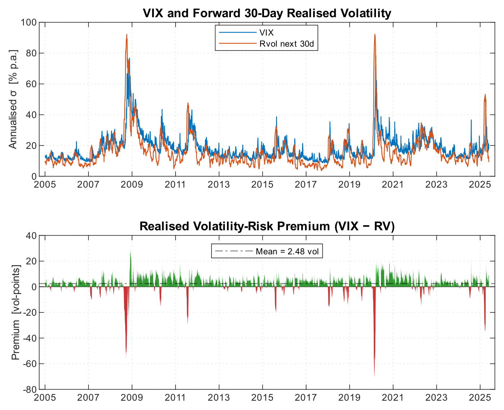
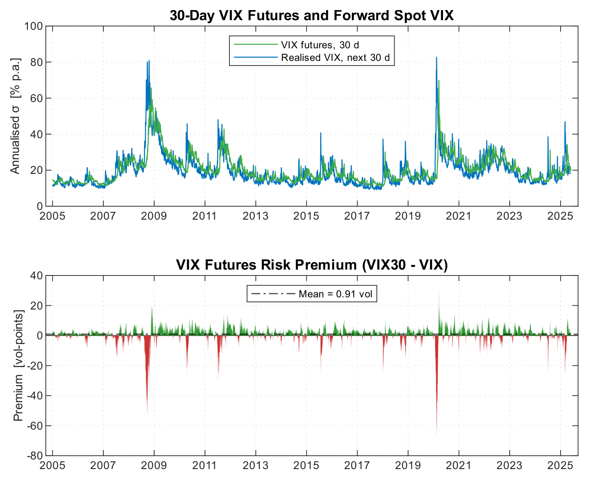
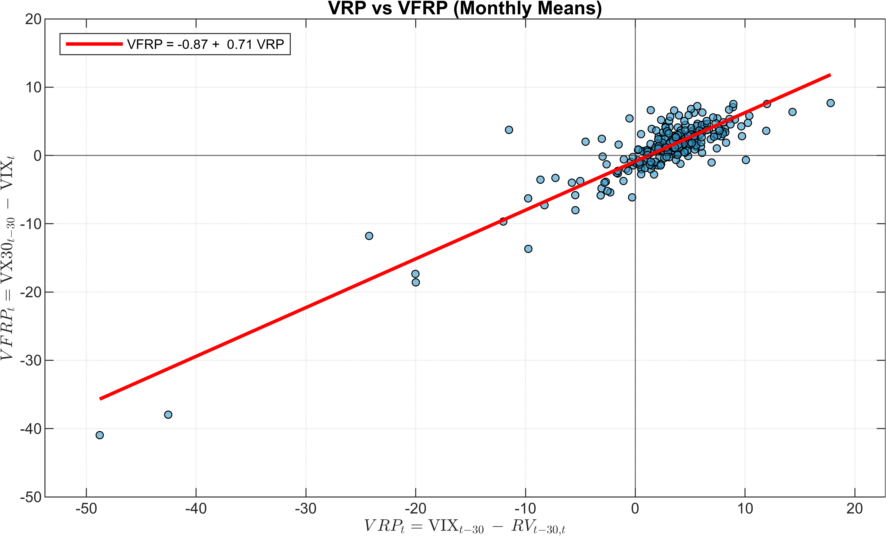
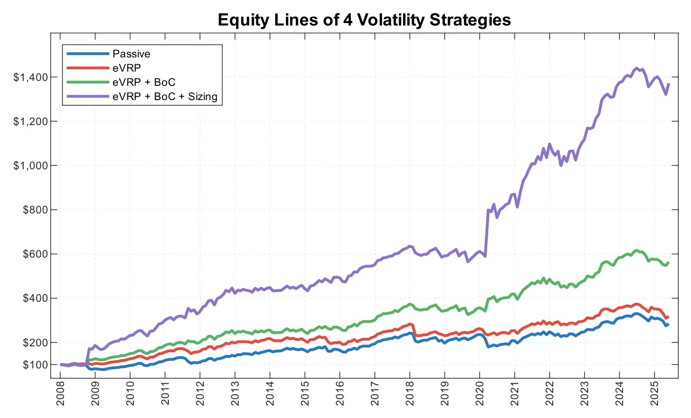
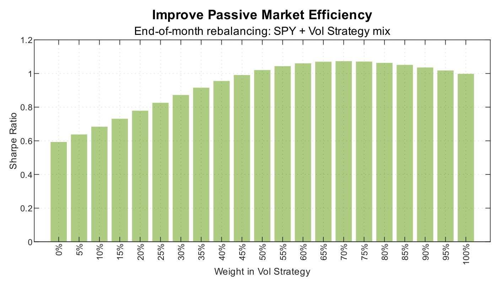
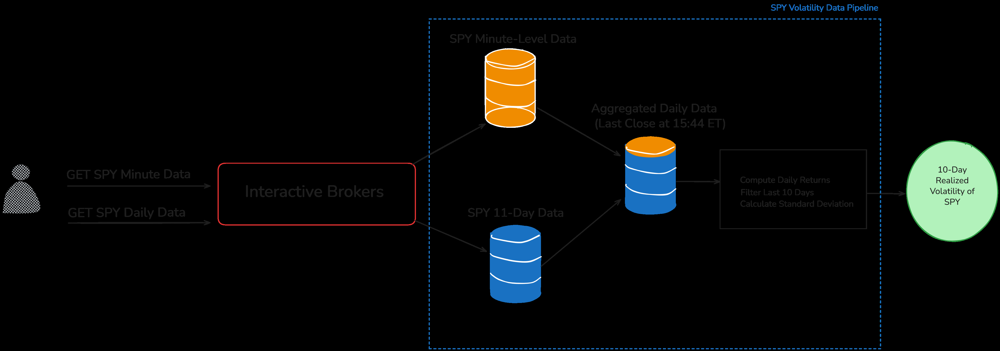
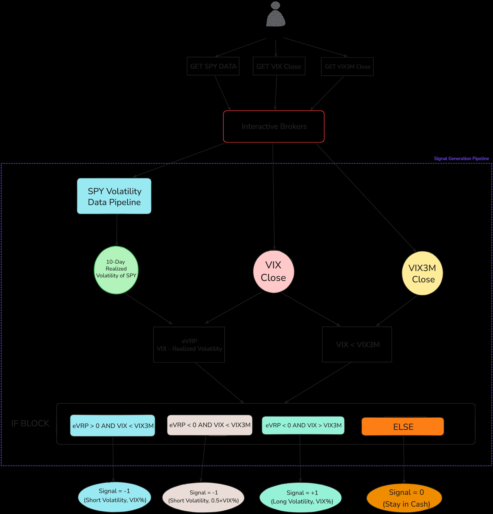
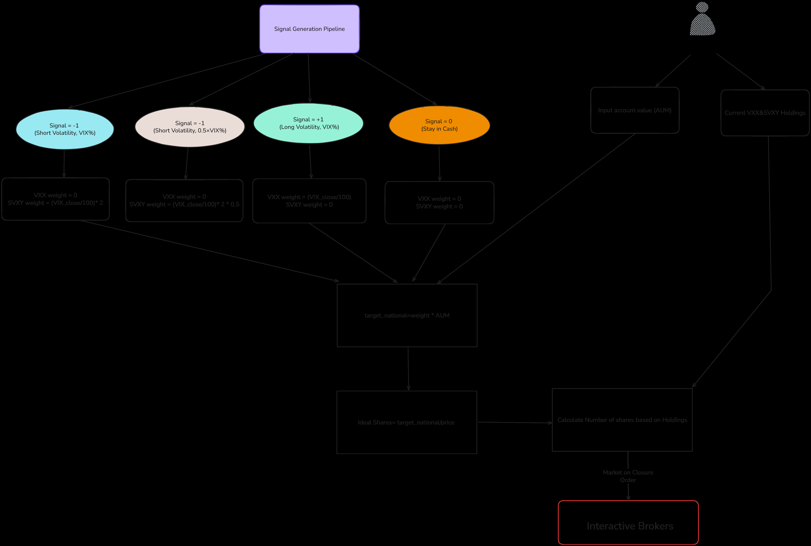

# The Volatility Edge

### A Dual Approach For VIX ETNs Trading

**Carlo Zarattini¹, Antonio Mele², Andrew Aziz³**

- ¹ Concretum Research, Viale Carlo Cattaneo 1, 6900 Lugano, Switzerland · ¹carlo@concretumgroup.com · @ConcretumR
- ² USI Lugano, Swiss Finance Institute and CEPR · ²antonio.mele@usi.ch
- ³ Peak Capital Trading, 744 West Hastings Street, Vancouver, BC, Canada V6C 1A5 · ³andrew@peakcapitaltrading.com · @BearBullTraders

*Affiliations: Concretum Research · Università della Svizzera italiana, Swiss Finance Institute, and CEPR · Peak Capital Trading*

**First Version:** June 23, 2025  ·  **This Version:** June 23, 2025

---

## Highlight

- **Alpha idea:** Harvest the volatility risk premium (VRP) with publicly listed VIX-linked ETNs by staying short volatility when implied vol exceeds expected realized vol and the term structure is in contango, flipping long when both signals invert, and scaling exposure to the VIX level so risk grows with the (mean-reverting) premium.
- **Data source(s):** Norgate Data (daily VIX futures, S&P 500, SPY — survivorship-bias-free back to 2005), Bloomberg (S&P 500 VIX Short-Term Futures Total Return Index and its inverse counterpart), and IQFeed (1-minute SPY, VIX, and VIX3M for close-of-day signals). ETN metadata from Bloomberg.
- **Universe:** VIX-linked ETNs/ETFs (e.g., VXX, XIV, SVIX, SVXY, VIXY, VIXM, UVXY, UVIX, VXZ, VYLD), backtested through two synthetic investable proxies — **VIXLONG** (long-vol, 50 bp fee) and **VIXSHORT** (short-vol inverse, 80 bp fee) — benchmarked against the S&P 500 / SPY.
- **Sample period:** January 2008 – May 2025 for the strategy backtests; January 2005 – May 2025 for the stylized-facts analysis (VFRP, VRP).
- **Key finding:** After realistic costs, the final **eVRP + BoC + Sizing** strategy compounds at **16.3% CAGR**, a **Sharpe of 1.00** (Sortino 1.67), **15% annualized alpha**, a market beta of **0.12**, and an equity correlation near **15%** (adjusted max drawdown ≈ 12%). Blending a 10–20% slice into passive SPY lifts the combined Sharpe by ~20%.
- **Signal construction:** Daily signal at 3:45 p.m. ET — expected VRP $= \text{VIX}_t - \text{eRV30}_t$, where $\text{eRV30}$ is the annualized 10-day SPY realized vol; a term-structure gate (VIX vs. VIX3M = contango/backwardation) sets direction; position size scales as $\text{VIX}/100$. Execution is market-on-close (MOC) with a ±2% rebalancing threshold and 5 bp transaction costs.
- **Implementation:** The authors release an open-source Python workflow that automates the strategy end-to-end through the Interactive Brokers (IBKR) API (realized-vol estimation → signal generation → position sizing → live execution).

---

## Abstract

Volatility isn't just a measure of market fluctuations; it is the underlying asset of a large number of tradable instruments. After a concise overview of the history of volatility trading, this paper shows how individual investors can construct portfolios that aim to capture the volatility risk premium using nothing more than VIX-linked exchange-traded notes (ETNs). We test four rule sets, beginning with a constant short-volatility allocation and ending with a dynamically sized strategy that responds to both the option-market premium and the slope of the VIX term structure. Over 2008–2025, and after realistic costs, the final version compounds at 16.3% per year, delivers a Sharpe ratio of 1, and keeps equity-market correlation near 15%. Blending even a modest slice of this strategy into a passive SPY portfolio can lift the combined Sharpe ratio by 20%. We also outline how the rules can be automated through a standard broker API. In conclusion, volatility trading is no longer the exclusive domain of institutional hedge funds. With the right tools and discipline, individual investors and systematic traders can now access and exploit volatility-based strategies. However, one must always be mindful: volatility itself is volatile—and should be handled with care.

**Keywords:** Trading Systems, Algo Trading, VIX, Volatility Trading, VXX, VIX ETNs, Automatic Trading

---

## 1 Introduction

Most investors place directional bets: they try to guess where prices will go—up if they buy, down if they short. Volatility traders care far less about direction; they bet on how *much* prices will move, no matter which way the market ultimately drifts. In practice, that means trying to buy volatility when it is considered cheap (usually when the crowd is calm and optimism dominates the narrative) or to sell volatility when market participants are willing to overpay for it (usually when fear dominates and investors want to hedge their portfolios). Directional trades need a correct view of the direction of the move; volatility trades need the market to move either more or less than what is already priced into options.

Over the last 50 years, volatility has evolved from a theoretical byproduct of option pricing models into a fully tradable asset class. Today, investors can take directional or relative views on volatility using a wide range of instruments, including exchange-traded products linked to the VIX futures curve. Yet while volatility trading is increasingly accessible, extracting consistent returns from it remains far from trivial.

This paper investigates how individual investors can create exposure to the famous volatility risk premium (VRP)—the tendency of implied volatility to exceed realized volatility—using only publicly listed VIX-linked ETNs. We focus on strategies that do not require options expertise, margin leverage, or institutional infrastructure, and evaluate their performance across nearly two decades of market history.

We construct four rule-based strategies that progressively increase in sophistication:

1. A passive short-volatility position,
2. A strategy that times exposure using the expected VRP,
3. A dual-signal approach that adds information from the VIX term structure, and
4. A dynamically sized version that adjusts risk based on VIX levels.

All strategies are tested on a realistic dataset from January 2008 through May 2025, using conservative assumptions for transaction costs and signal timing.

Our findings suggest that even simple filters can meaningfully improve the risk-adjusted returns of passive volatility exposure, and that a thoughtfully constructed volatility sleeve can offer both positive alpha and low correlation to equities.

The remainder of the paper is organized as follows:

- **Section 2** presents the background and stylized facts that motivate our approach, including a short history of volatility trading, the emergence of VIX-linked products, and key empirical features of the volatility risk premium.
- **Section 3** outlines the data sources and backtesting assumptions, including how we build investable proxies for VIX ETNs and structure realistic execution logic.
- **Section 4** details the construction of four increasingly sophisticated strategies, from a passive short-volatility position to a dual-signal model with dynamic sizing.
- **Section 5** presents the performance results, including risk-adjusted metrics, drawdowns, turnover, and how the strategy behaves across market regimes. We also explore the impact of combining the strategy with traditional equity portfolios.
- **Section 6** outlines how the strategy can be automated via broker APIs.
- **Section 7** concludes with key takeaways and suggestions for further research.
- In the **appendix (Appendix A)**, we provide a curated list of papers, books, and other useful resources for readers interested in exploring the topics discussed in greater depth.

We have deliberately chosen not to include a formal literature review in the main body of the paper, in order to keep the reading experience accessible to non-academic audiences.

> *Disclaimer: While this study presents a comprehensive analysis of volatility trading strategies using VIX-linked exchange-traded notes (ETNs), all results are derived from historical backtests. As such, they reflect past market dynamics and should not be interpreted as guarantees of future performance. The profitability and robustness of the proposed approach are inherently dependent on the persistence of the volatility risk premium and the structure of the VIX derivatives market—factors that may evolve over time. Readers and investors should remain mindful that future outcomes may differ substantially from those observed in this retrospective evaluation.*

---

## 2 Background and Stylized Facts

The path to modern volatility trading began with mathematician Edward O. Thorp,[^1] who spent the early 1960s studying stock warrants—effectively long-dated call options written on a particular firm. By building a formula that resembled what would later become the Black–Scholes framework, Thorp realised many warrants were overpriced; he shorted them and hedged with the underlying stock to extract the premium. His unpublished formula anticipated the celebrated 1973 papers by Fischer Black and Myron Scholes, and by Robert C. Merton, which generalized option pricing and demonstrated that, under specific market assumptions, an option's payoff can be replicated by continuously rebalancing a portfolio consisting of a risk-free bond and a dynamic position in the underlying stock (or index).

[^1]: Thorp is also well known for his groundbreaking book *Beat the Dealer* (1962), where he applied probability theory to the game of blackjack. His card-counting system was the first mathematically sound method proven to give players an edge over the house, making him a pioneer not only in quantitative finance but also in applied game theory.

In April 1973, the Chicago Board Options Exchange (CBOE) opened its doors, bringing options out of the opaque, illiquid over-the-counter market and into a regulated, transparent trading venue. This marked the beginning of modern volatility trading. Speculators quickly developed a range of methods to bet not just on the direction of prices, but on how much prices would move, i.e., volatility. A simple way to take a view on volatility is to buy or sell individual calls or puts. More sophisticated strategies involve constructing a portfolio of options and continuously hedging it with the underlying asset. For example, to go long volatility, one might buy a call option and dynamically short the underlying stock—not to bet on direction, but to isolate exposure to the difference between implied and realized volatility.

While elegant in theory, these delta-hedged option strategies come with practical challenges. Sudden price jumps, transaction costs, gaps in market liquidity, and path dependency can undermine profitability, making it difficult for traders to harvest the volatility risk premium (VRP).

To address these limitations, banks introduced **variance swaps** in the mid-1990s. These are over-the-counter contracts on the difference between the realized variance of an asset's returns over a fixed horizon and a pre-agreed strike. Unlike traditional option strategies, variance swaps offer pure exposure to volatility without the need to manage a complex hedge or rebalance positions. For the investor, the mechanics are simple: the bank delivers a single payoff at maturity based on realized variance.[^2] All the intricate replication—typically involving a strip of out-of-the-money options—is handled by the dealer. In other words, the investor trades volatility directly, without needing to worry about constructing the hedge themselves.

[^2]: Although the contract pays out only at maturity, it is re-valued each day via a mark-to-market mechanism. Each party's unrealized profit or loss is computed based on realized variance to date plus the implied variance of the remaining period, keeping the swap's net present value near zero. When exposure exceeds predefined thresholds, variation margin is exchanged daily to restore collateral balances. This ensures that gains and losses are settled incrementally rather than accumulated until maturity.

Much of the theoretical groundwork behind variance swaps was laid by academics and practitioner-quants. Notably, Peter Carr, Roger Lee, Emanuel Derman, and Bruno Dupire contributed key insights into how variance exposure can be replicated using vanilla options. Their work helped formalize the pricing models used by dealers and enabled broader adoption of variance-based products in institutional portfolios.

The most actively quoted variance swap is written on the S&P 500 and allows investors to exchange the index's realized variance over the next 30 days for a pre-agreed strike price. This strike is directly linked to the VIX Index. In fact, the square of the VIX Index represents the fair strike of the variance swap. This makes the VIX—or more precisely, the formula behind it—not just a fear gauge, but also a cornerstone of modern volatility trading instruments.

To make things concrete, consider a hypothetical example involving the S&P 500. Suppose it's the last business day of the month, and the VIX Index closes at 20. This implies that the fair strike of a 30-day variance swap is $20^2 = 400$. In other words, the market is pricing in an annualized realized volatility of 20% over the next 30 calendar days. Now imagine that over the next month, market conditions worsen and the realized volatility of the S&P 500 turns out to be 30% annualized. That corresponds to $30^2 = 900$ variance points. A trader who had bought variance—betting that actual volatility would exceed expectations—would receive the difference:

$$
\text{Payoff} = \text{Notional} \times (900 - 400) = \text{Notional} \times 500 \tag{1}
$$

This cash-settled payout is delivered by the bank without any need for the investor to manage option hedges or rebalance exposures. All that matters is how much the S&P 500 actually moved during the life of the swap. Conversely, an investor who had sold variance would face a loss of 500 times the notional. This simple structure gives traders a clean and scalable way to express views on future equity market volatility.

Because volatility tends to spike when equities fall,[^3] many portfolio managers use instruments such as variance swaps to obtain downside insurance. While the options market must clear in every trade, the pool of risk-averse investors seeking this protection persistently exceeds the pool of counterparties willing to warehouse volatility risk. In equilibrium, option writers therefore require a systematic premium, and option-implied volatility tends to stand above the volatility that is eventually realized. The resulting gap is referred to as the **volatility risk premium (VRP)**.

[^3]: This statistical fact is known as the **Leverage Effect**—a tendency for volatility to rise following negative returns. First documented by Black (1976) and Christie (1982), it is a well-established feature of equity markets and major stock indices. However, this behavior does not generalize across all asset classes: in many commodity markets (e.g., oil, gas, and agricultural products), an inverse leverage effect is often observed—volatility tends to increase after price rises.

**Figure 1** illustrates this persistent pattern. The blue line shows the VIX Index, the market's forecast of S&P 500 volatility over the next 30 days, while the red line tracks the realized volatility that unfolded over that same horizon. Between 2005 and 2025, the VIX overestimated realized volatility roughly 80% of the time, with an average premium of about 2.5 volatility points.[^4] However, during sharp market corrections—such as the Global Financial Crisis (2008), the European debt crisis (2011), the Volmageddon event (2018), the COVID-19 shock (2020), and the recent tariff war escalation (2025)—realized volatility surged past the VIX, leading to losses for investors who had sold volatility. The bottom panel of Figure 1 shows the realized volatility risk premium in volatility points (i.e., the difference between the VIX and the subsequent 30-day realized volatility), highlighting both the steady premium observed during calm periods and the sharp reversals that occur during volatility spikes.

[^4]: Consistent with prevailing dealer practice in the one-month S&P 500 variance-swap market, we apply a 5% haircut to the quoted VIX level before comparison. In pricing terms, the variance-swap strike $K$ is typically quoted such that $K \approx 0.95 \times \text{VIX}$, reflecting fees, discretisation effects, and a convexity adjustment.

*Figure 1: Implied vs. realized volatility for the S&P 500, 30-day horizon. The blue line represents the VIX Index (implied volatility), while the red line shows the annualized realized volatility over the subsequent 30 calendar days. From 2005 to 2025, implied volatility consistently exceeded realized volatility, illustrating the presence of a positive volatility risk premium (VRP). Data source: Norgate.*

While pure variance swaps remain primarily an institutional instrument, due to their over-the-counter (OTC) nature, large notional sizes, and counterparty credit requirements, volatility trading became more accessible when the Cboe Futures Exchange (CFE) introduced **VIX futures** on March 26, 2004.

A VIX future (ticker: **VX**) reflects the market's consensus forecast of where the VIX Index will settle at the contract's expiration. These are cash-settled contracts, with each VIX index point worth $1,000. This means that a one-point change in the futures price translates into a $1,000 gain or loss per contract.[^5] The main monthly VIX futures expire on the third Wednesday of each month.[^6] On expiration day, the VIX futures settle at the level of the VIX Index.[^7]

[^5]: In August 2020, the Cboe introduced Mini VIX Futures (ticker: VXM), which are one-tenth the size of the standard contract. Each index point is worth $100, making these instruments more accessible to retail traders and smaller institutions seeking exposure to volatility with lower capital requirements.
[^6]: More precisely, the contract settles on the Wednesday that is 30 calendar days before the third Friday of the following month. If that Wednesday or the relevant Friday is a Cboe holiday, settlement moves to the preceding business day.
[^7]: More precisely, the Cboe calculates a Special Opening Quotation (SOQ) for the VIX on expiration day. This value is based on a weighted average of opening prices of a wide strip of out-of-the-money S&P 500 (SPX) options that expire exactly 30 calendar days later. The SOQ serves as the final settlement price for expiring VIX futures and options contracts.

Holding a VIX future until expiry is thus a directional bet on where the VIX Index will print on that day. For example, suppose an investor buys one VIX future at 16 when VIX is quoting at 15, anticipating a rise in the price of volatility. At expiry, if the VIX Index settles at 18, the contract settles at 18, resulting in a profit of:

$$
(18 - 16) \times \$1{,}000 = \$2{,}000 \tag{2}
$$

Conversely, if the VIX finishes at 14, the investor incurs a $2,000 loss. The simplicity of the P&L calculation and the centralized clearing structure make VIX futures an efficient vehicle for trading short-term volatility expectations.

As discussed, the VIX futures price reflects the market's best estimate of where the VIX Index will settle at expiration. Consequently, the profit or loss on a short VIX futures position depends entirely on the actual VIX level observed at expiry.

This raises two important questions:

1. If the VIX Index itself tends to overstate future realized volatility, do VIX futures also systematically overestimate future VIX levels?
2. If so, is the traditional VRP ($\text{VRP}_t = \text{VIX}_{t-30} - \text{RV}_{t-30,t}$) related to what we'll refer to as the **VIX Futures Risk Premium** ($\text{VFRP}_t = \text{VX}_{t-30} - \text{VIX}_t$)?

These questions are highly relevant. If a persistent premium exists in VIX futures similar to that in variance swaps, then investors without access to OTC variance swap markets may still be able to capture the volatility risk premium by trading VIX futures or related instruments. In other words, VIX futures may serve as a practical proxy for variance exposure, offering an accessible alternative path to expressing views on volatility pricing inefficiencies.

To address these questions, we constructed a synthetic 30-day VIX futures contract (**VX30**), for every trading day from January 2005 through May 2025. For each day in the sample, we compared the VX30 value to the actual VIX Index level observed 30 calendar days later. The difference between these two figures is what we define here as the VIX Futures Risk Premium (VFRP).[^8]

[^8]: A simpler alternative would have been to analyze the historical P&L of actual VIX futures contracts with varying time-to-expiration (e.g., from 1 to 90+ days). However, that approach would yield only one 30-day observation per month, limiting the number of data points. By constructing a synthetic VX30 for every trading day, we greatly increase the statistical power of our analysis. Interested readers may request access to these alternative results by contacting the author at carlo@concretumgroup.com.

**Figure 2** provides visual evidence for the existence of a risk premium in VIX futures. In the top panel, the green line shows the level of the synthetic VX30 contract—our proxy for a 30-day VIX future—while the blue line shows the actual VIX Index value 30 calendar days later. The two lines tend to move closely together, but the green line (VX30) often sits slightly above the blue line, indicating a consistent premium. The bottom panel of Figure 2 plots the VIX Futures Risk Premium (VFRP)—calculated as the simple difference between the VX30 and the future VIX Index level—over time. A positive VFRP implies that VIX futures were overpriced relative to the subsequent VIX realization; a negative VFRP indicates the opposite.

*Figure 2: VIX Futures Risk Premium (VFRP) over time. The green line represents the synthetic 30-day VIX future (VX30), constructed daily from 2005 to 2025. The blue line shows the actual VIX Index level observed 30 days later. On average, VX30 exceeds future VIX levels, indicating a persistent premium in VIX futures. Data source: Norgate.*

Over the 2005–2025 period, the average VFRP was approximately **0.91 volatility points**, suggesting that VIX futures, on average, tend to overestimate the future level of the VIX. However, the premium is not constant. It tends to compress or even turn negative during episodes of elevated market stress, such as during the Global Financial Crisis (2008), the COVID-19 shock (2020), and other volatility spikes. This mirrors the pattern observed earlier with the Volatility Risk Premium (VRP), where the VIX overestimates realized volatility most of the time, but not during crises.

Are the VIX Futures Risk Premium (VFRP) and the Volatility Risk Premium (VRP) related? **Figure 3** tackles the question. The scatter plot compares monthly averages of the two series: the x-axis shows the spot VRP—the gap between the VIX and the subsequent 21-day realized volatility—while the y-axis shows the VFRP, defined as the difference between the synthetic 30-day VX30 price and the VIX level 30 days later. A simple linear regression (red line) reveals a strong positive relationship, with an estimated slope of $\approx 0.71$ and an intercept of $\approx -0.87$. In other words, when the realized VRP was large—meaning implied volatility significantly exceeded realized volatility—VIX futures also tended to embed a larger premium over the future VIX print.

*Figure 3: Monthly relationship between the Volatility Risk Premium (VRP) and the VIX Futures Risk Premium (VFRP), 2005–2025. The x-axis measures the spot VRP (VIX minus 30-day realized volatility), and the y-axis shows the VFRP (VX30 minus future VIX level). A linear regression (red line) suggests a strong positive correlation, with a slope of approximately 0.71 and an intercept of –0.87. Data source: Norgate.*

This indicates that VIX futures can act as a practical, though diluted, proxy for harvesting the volatility risk premium, especially for investors without access to OTC variance swaps. However, the expected excess return is typically smaller than that of variance swaps, reflecting the added layer of uncertainty involved in forecasting the VIX itself.

In summary, the answers to Questions 1 and 2 are both affirmative: the VIX Futures Risk Premium (VFRP) is, on average, positive and significantly correlated with the spot Volatility Risk Premium (VRP). While VIX futures offer an imperfect and diluted exposure compared to variance swaps, they remain a practical and accessible instrument for extracting—and potentially timing—the volatility risk premium, particularly for investors constrained by access or capital.

Another cornerstone of VIX futures trading is the concept of **basis**, often referred to as **carry**. In traditional futures markets, the basis represents the price difference between the futures contract and the spot price of the underlying asset. In the context of volatility, it refers specifically to the gap between the VIX futures price and the VIX Index (both observed at time $t$).

This difference gives rise to two important market states:

- **Contango:** when futures prices are above the spot VIX. This is the typical state of the VIX term structure.
- **Backwardation:** when futures prices fall below the spot VIX. This usually occurs during periods of market stress.

To illustrate the role of carry, we focus on a hypothetical constant-maturity 30-day VIX futures contract (VX30). When holding a short exposure in such a contract to settlement, the profit or loss over 30 calendar days decomposes into two components:

$$
\text{PnL}_{t,t+30} = \text{VFRP}_{t,t+30} = \text{VX30}_t - \text{VIX}_{t+30} = \underbrace{(\text{VX30}_t - \text{VIX}_t)}_{\text{basis}} - \underbrace{(\text{VIX}_{t+30} - \text{VIX}_t)}_{\Delta\text{VIX}} \tag{3}
$$

The first term represents the basis or carry—the return from the futures price if it was to converge to the initial level of the VIX Index. The second term captures the change in the VIX itself.

To gauge how much that first term drives outcomes, we regress the 30-day VIX Futures Risk Premium (VFRP) on the basis at trade inception:

$$
\text{VFRP}_{t,t+30} = \alpha + \beta \cdot (\text{VX30}_t - \text{VIX}_t) + \varepsilon_t \tag{4}
$$

The regression yields a slope of **0.70** with a p-value below 1%, indicating that for every additional volatility point of positive carry, the expected return increases by about 0.7 points. In plain English: the steeper the contango when entering the trade, the richer the expected payoff. This suggests that the basis may be a powerful timing signal to include in a dynamic volatility trading strategy.

Given the evidence so far, we conclude that any robust attempt to time the VIX futures premium should incorporate information from both the expected Volatility Risk Premium (eVRP) and the shape of the VIX futures term structure. These two components capture distinct but complementary sources of return. In the following sections, we build our volatility trading framework precisely around this dual-signal approach, combining insights from both concepts to generate more effective timing signals.

As you may have noticed, much of our analysis focuses on 30-day VIX futures. This is intentional, and it provides a fitting conclusion to our brief history of volatility trading and the evolution of related investment vehicles.

The final step that popularized volatility trading came in January 2009, when Barclays launched the first exchange-traded notes (ETNs) linked to VIX futures. For the first time, retail investors—with nothing more than a standard brokerage account—could gain direct exposure to volatility. The flagship product was **VXX**, which offered long exposure to VIX futures by tracking a rolling position in the two nearest-month VIX futures contracts. Each day, at market close, the index would sell a small portion of the front-month contract and buy more of the second-month contract, maintaining a constant average maturity of approximately 30 calendar days. The note is designed to track the performance of the S&P 500 VIX Short-Term Futures Index Total Return (ticker: SPVXSTR)—just as ETFs like SPY track the S&P 500 Index.

Soon after, other volatility-linked ETNs entered the market. Products like **XIV** and **TVIX** (from VelocityShares by Credit Suisse) introduced leverage, offering –1x inverse (short volatility) or +2x leveraged exposure to the same VIX futures index. These products reset their exposure daily, making them more suitable for short-term trading than long-term investment. Other vehicles, such as **VXZ**, were designed to provide exposure to longer-dated VIX futures, appealing to investors seeking less sensitivity to short-term volatility moves.

**Table 1:** VIX-linked ETNs and ETFs grouped by leverage. Products are sorted by leverage type and investment horizon. The table includes the ticker, issuer, management fee (in %), leverage exposure, investment horizon, benchmark index, and launch date. Data current as of 19th June 2025. Data sourced from Bloomberg.

| Ticker | Issuer | Fee (%) | Leverage | Horizon | Benchmark | Start Date |
|--------|--------|--------:|:--------:|:-------:|-----------|:----------:|
| SVIX | Volatility Shares | 3.93 | –1x | 30 days | SHORTVOL | 30/03/2022 |
| SVXY | ProShares | 1.15 | –0.5x | 30 days | SPVXSPID | 04/10/2011 |
| VXX | Barclays | 0.89 | 1x | 30 days | SPVXSTR | 17/01/2018 |
| VXZ | Barclays | 0.89 | 1x | 150 days | SPVXMR | 17/01/2018 |
| VYLD | JPMorgan | 0.85 | — | 30 days | SPVXSTIT | 20/03/2025 |
| VIXY | ProShares | 1.15 | 1x | 30 days | SPVXSTR | 04/01/2011 |
| VIXM | ProShares | 0.85 | 1x | 150 days | SPVXMPID | 04/01/2011 |
| UVXY | ProShares | 0.95 | 1.5x | 30 days | SPVXSPID | 04/10/2011 |
| UVIX | Volatility Shares | 2.78 | 2x | 30 days | LONGVOL | 30/03/2022 |

In Table 1, we list the main VIX ETNs currently available, including their inception dates, leverage types, issuers, fees, and underlying benchmarks. These same benchmarks will form the foundation for the trading strategies we'll explore in the remainder of this paper.

While the expansion of volatility trading into retail markets broadened participation, it also introduced new risks—particularly for investors lacking a deep understanding of how these products function. A dramatic example unfolded on February 5, 2018—a day now known as **Volmageddon**. At the time, many investors had piled into XIV, a popular inverse volatility ETN, following several years of strong performance. Drawn by the lure of historical returns, many retail participants failed to implement meaningful risk management and became overexposed to a product they didn't fully understand. When the VIX more than doubled in a single day, VIX futures surged as well, triggering a cascade of losses. XIV collapsed by 97% in a single session, and within two weeks, Credit Suisse announced its termination. This event served as a sharp reminder: products tied to volatility can themselves be highly volatile.

That said, these ETNs are not inherently flawed. When used with appropriate position sizing and robust timing rules, they can offer an effective and accessible way to harvest the volatility risk premium. Because they trade on exchanges with high liquidity, offer daily cash settlement, and require no ISDA agreements,[^9] they remain practical tools for building diversified and decorrelated return streams, even within retail portfolios.

[^9]: ISDA agreements are standardized legal contracts used in the over-the-counter (OTC) derivatives market. The term refers to documentation published by the International Swaps and Derivatives Association (ISDA), and they form the legal backbone of most OTC derivatives transactions between institutions.

---

## 3 Data and Backtesting Assumptions

Before presenting the trading strategies in Section 4, we first describe the data and assumptions that underpin all the tests in this paper. Constructing a comprehensive, high-quality database is a critical first step for any disciplined systematic trader engaged in backtesting or empirical research. Due to the variety of asset classes and sampling frequencies involved, we draw on three different data sources:

- **Daily price data** for VIX futures, the S&P 500 Index, and the SPY ETF comes from **Norgate Data**, providing a clean, survivorship-bias-free dataset extending back to 2005.
- **Index-level data** for the S&P 500 VIX Short-Term Futures Index Total Return (the benchmark tracked by VXX) and its inverse counterpart—the S&P 500 VIX Short-Term Futures Inverse Daily Index (once tracked by XIV)—is sourced from **Bloomberg**.
- Whenever **intraday resolution** is required (e.g., to compute signals near the close), we use one-minute bar data for the SPY, VIX Index, and three-month VIX (VIX3M) from **IQFeed**.

Our sample spans from January 2005 through May 2025.

Because most VIX ETNs launched well after our sample begins—and several were later terminated, delisted, or reissued under new tickers—we construct two investable proxies for a 30-day VIX futures exposure:

- The **long volatility proxy**, which we refer to as **VIXLONG**, starts from the S&P 500 VIX Short-Term Futures Index Total Return, then subtracts a 50 basis point annual fee to replicate the typical drag of a real ETN.
- The **short volatility proxy**, called **VIXSHORT**, is derived from the excess return of the inverse index and carries an 80 basis point fee, consistent with what XIV investors were charged.

Building these proxies allows us to work with longer time series (the VXX ETN became available only in 2009) and avoid periods when ETN prices became detached from their underlying benchmarks—most notably in March 2022, when Barclays halted the creation of new VXX shares, causing the ETN to trade at a persistent premium to its NAV. We have verified that, outside such dislocations, our VIXLONG and VIXSHORT proxies track the daily returns of their corresponding listed ETNs with high precision.

Across all backtests, we assume trades are executed using market-on-closure orders (MOC)[^10] while signals are calculated 15 minutes earlier. This setup closely mimics real-world implementation using market-on-close orders, improving realism and feasibility. We also assume:

[^10]: A market-on-close (MOC) order is an unpriced market order that is submitted before the official exchange cutoff (typically 3:45–3:55 p.m. ET) and executed as close as possible to the end-of-day closing auction. It guarantees execution at or near the closing price but does not allow price control.

- Transaction costs of **5 basis points** per trade,
- A **2% rebalancing threshold**, to avoid unnecessary turnover and limit trading costs.

Additional details on the rebalancing mechanism are provided in later sections.

---

## 4 Strategy Definitions

In this section, we introduce and analyze four increasingly sophisticated volatility trading strategies designed to capture the volatility risk premium. Each strategy builds on the previous one, offering a progressive framework that evolves from a naive passive approach into a more adaptive, data-driven model.

### 4.1 Passive Short Volatility ("Passive")

We begin with the simplest possible strategy: a constant long position in VIXSHORT, representing 20% of the portfolio. The remaining 80% is held in cash, and we assume no interest income is earned—making our results conservative by design.

To avoid excessive trading, the portfolio is only rebalanced when the VIXSHORT allocation deviates by more than ±2 percentage points from its 20% target. For example, if the VIXSHORT exposure drifts to 23%, we reduce the position by 3% to bring it back to 20%. The same adjustment applies if the allocation falls below 18%.

> **Strategy 1: Passive**
>
> Long VIXSHORT with size = 20%
>
> *Note: Rebalance Threshold = ±2%*

This passive setup serves as a baseline benchmark. It reflects the most straightforward way of gaining persistent exposure to the volatility risk premium—without any timing signals or predictive layers. While simple, it provides insight into the risk–reward profile of systematically shorting volatility, including its potential and limitations.

### 4.2 Short Volatility with Expected VRP ("eVRP")

The next step introduces a simple timing mechanism based on the expected Volatility Risk Premium (eVRP). The logic is straightforward: avoid shorting volatility when the VIX is underestimating future market volatility—that is, when realized volatility is likely to exceed what's implied by options prices.

But how do we estimate future realized volatility?

While there are numerous approaches—from basic historical volatility estimates to advanced high-frequency econometric models—we rely here on a simple, transparent method. In our trading experience, sophisticated models often provide more accurate and responsive forecasts, especially during high volatility environments where dynamics are nonlinear or jumpy, but for the purposes of this paper we stick to parsimonious methods that are easily reproducible. We encourage curious and disciplined traders to enhance this basic framework as a natural extension.

In practice, given the autocorrelation of realized volatility and the fact that volatility tends to cluster over time,[^11] even a simple N-day historical standard deviation of returns can be a useful forecast for the volatility of the next period.

[^11]: In practice, if recent volatility is high, future volatility is expected to remain high and vice versa.

To capture this, we use the standard deviation of the last 10 daily returns of SPY as a proxy for expected volatility. The signal is computed each day at 3:45 p.m., using intraday SPY data. The most recent return is calculated from the previous day's close to the current day's 3:45 p.m. level. We then annualize the result:

$$
\text{eRV30} = \text{std}_{10d} \times \sqrt{252} \times 100 \tag{5}
$$

For example, if the 10-day standard deviation is 0.0071, then our estimate for the future realized volatility (eRV30) is:

$$
\text{eRV30} = 0.0071 \times \sqrt{252} \times 100 \approx 11.27\% \tag{6}
$$

Once we have the estimate for future realized volatility (eRV30), we can compare it with the VIX Index at 3:45 p.m. and obtain the expected Volatility Risk Premium (eVRP):

$$
\text{eVRP}_t = \text{VIX}_t - \text{eRV30}_t
$$

The trading logic is straightforward:

> **Strategy 2: eVRP**
>
> If eVRP > 0:
> &nbsp;&nbsp;&nbsp;&nbsp;Long VIXSHORT with size = 20%
>
> Else:
> &nbsp;&nbsp;&nbsp;&nbsp;Stay in cash
>
> *Note: Rebalance Threshold = ±2%*

While this approach may improve on the static strategy, it has limitations. For example, if markets have been quiet ahead of a major macro event, recent volatility might look low, while the VIX is already pricing in future uncertainty. In such cases, the signal may be misleading, and shorting volatility could be risky.

### 4.3 Volatility Trading using Dual Signal ("eVRP + BoC")[^12]

[^12]: BoC stands for **B**ackwardation **o**r **C**ontango.

To address the limitations of relying solely on backward-looking volatility estimates, we incorporate forward-looking information from the VIX term structure. Specifically, we compare short-term implied volatility (VIX) with medium-term implied volatility (VIX3M). While the VIX reflects the market's expectation of 30-day forward volatility, VIX3M extends that horizon to 90 days.

When VIX < VIX3M, the market expects calmer conditions in the near term than in the medium term—suggesting no immediate stress. This is typically the case, as uncertainty naturally increases with time. Conversely, when VIX > VIX3M, it signals rising short-term concerns—often linked to upcoming macro events or market catalysts—implying that the market anticipates greater volatility in the near term than in longer horizons.

We incorporate this term structure signal alongside the previously defined expected Volatility Risk Premium (eVRP) to construct a more robust decision framework. The intuition behind the strategy is as follows:

> **Strategy 3: eVRP + BoC**
>
> If eVRP > 0 and VIX < VIX3M:
> &nbsp;&nbsp;&nbsp;&nbsp;Long VIXSHORT with size = 20%
>
> Elseif eVRP ≤ 0 and VIX < VIX3M:
> &nbsp;&nbsp;&nbsp;&nbsp;Long VIXSHORT with size = 10%
>
> Elseif eVRP ≤ 0 and VIX > VIX3M:
> &nbsp;&nbsp;&nbsp;&nbsp;Long VIXLONG with size = 20%
>
> Else:
> &nbsp;&nbsp;&nbsp;&nbsp;Stay in cash
>
> *Note: Rebalance Threshold = ±2%*

This dual-signal approach allows us to combine backward-looking information (realized volatility) with forward-looking market expectations (VIX term structure), producing a more nuanced view of risk. It improves decision-making by identifying not just when implied volatility appears rich or cheap, but also whether the term structure suggests rising or easing market tension. While maintaining a bias toward short volatility, the strategy is designed to quickly shift into a long volatility position whenever the expected VRP is negative and the term structure appears inverted (VIX > VIX3M).

### 4.4 Dual Signal with Dynamic Sizing ("eVRP + BoC + Sizing")

The final refinement removes the static position size (±20% or 10%) and introduces dynamic sizing based on market conditions. The intuition is simple: the risk of shorting volatility is not constant—it depends heavily on the current level of the VIX.

When the VIX is very low, even a modest market shock can cause a sharp volatility spike, leading to large losses for short-volatility positions—as vividly demonstrated during the Volmageddon event in February 2018. This situation is often described by the classic adage: *"collecting nickels in front of a steamroller."* It refers to the pattern of collecting small, consistent gains for an extended period, only to see them wiped out by a single, sudden shock.

Conversely, when the VIX is already high, the likelihood of it doubling again is significantly lower. High-volatility environments also tend to offer more attractive volatility risk premiums, as fear-driven investors often overpay for protection—even when the worst may already be behind.

To reflect this asymmetry, we scale the position size dynamically based on the level of the VIX. The rules behind the strategies are as follows:

> **Strategy 4: eVRP + BoC + Sizing**
>
> If eVRP > 0 and VIX < VIX3M:
> &nbsp;&nbsp;&nbsp;&nbsp;Long VIXSHORT with size = VIX%
>
> Elif eVRP < 0 and VIX < VIX3M:
> &nbsp;&nbsp;&nbsp;&nbsp;Long VIXSHORT with size = 0.5 × VIX%
>
> Elif eVRP < 0 and VIX > VIX3M:
> &nbsp;&nbsp;&nbsp;&nbsp;Long VIXLONG with size = VIX%
>
> Else:
> &nbsp;&nbsp;&nbsp;&nbsp;Stay in cash
>
> *Note: Rebalance Threshold = ±2%*

The signal logic remains unchanged from the previous strategy ("eVRP + BoC"): it still combines the expected VRP with the slope of the VIX term structure to determine the directional bias. What changes is the responsiveness of the position size, which now adapts to the prevailing level of market volatility. This dynamic sizing helps reduce exposure during fragile low-VIX environments while increasing participation when volatility—and hence the risk premium—is elevated and potentially more rewarding.

While more sophisticated position-sizing models can certainly be deployed, we deliberately opt for simplicity and intuition. The **VIX/100 rule** serves as an intuitive and adaptable heuristic that aligns exposure with market conditions without overfitting. Importantly, this sizing approach can be easily adjusted to reflect an investor's individual risk tolerance. For example, a more conservative investor could divide the VIX by 200 instead of 100, effectively halving the exposure across all signals. A more aggressive investor could use VIX/75 or VIX/50, increasing risk and potential returns proportionally.

A summary of the rules behind all four strategies is provided in **Table 2**.

**Table 2:** Summary of the volatility trading strategies.

| Strategy | Positioning Rule | Size | Rebal. | T Cost | Signal / Order |
|----------|------------------|------|:------:|:------:|:--------------:|
| **1. Passive** | VIXSHORT | 20% | ±2% | 5 bps | 3:45 p.m. MOC |
| **2. eVRP** | VIXSHORT if eVRP > 0; Cash otherwise | 20% | ±2% | 5 bps | 3:45 p.m. MOC |
| **3. eVRP + BoC** | VIXSHORT if eVRP > 0 & VIX < VIX3M; VIXSHORT if eVRP ≤ 0 & VIX < VIX3M; VIXLONG if eVRP ≤ 0 & VIX > VIX3M; Cash otherwise | 20% / 10% / 20% | ±2% | 5 bps | 3:45 p.m. MOC |
| **4. eVRP + BoC + Sizing** | VIXSHORT if eVRP > 0 & VIX < VIX3M; VIXSHORT if eVRP < 0 & VIX < VIX3M; VIXLONG if eVRP < 0 & VIX > VIX3M; Cash otherwise | VIX% / 0.5×VIX% / VIX% | ±2% | 5 bps | 3:45 p.m. MOC |

---

## 5 Performance Results[^13]

[^13]: Each backtest incorporates transaction costs of 5 basis points and applies a 2% rebalancing threshold.

### 5.1 Passive Short Volatility ("Passive")

We begin with the Passive Short Volatility strategy. A constant 20% allocation to VIXSHORT compounds at an annualized return of **6.2%**, with a **Sharpe ratio of 0.48** and a **maximum drawdown of –32%**. The strategy generates an annualized **alpha of just 0.8%** versus the S&P 500, and maintains a daily **correlation of 72%** with the market. These figures suggest that a static short-volatility exposure using VIX ETNs is not a particularly compelling source of alpha or diversification.

It's also worth noting that, despite being a passive approach, the strategy still rebalanced approximately 20 times per year on average to maintain the 20% target exposure.

### 5.2 Short Volatility with Expected VRP ("eVRP")

Adding the eVRP filter already changes the picture. By stepping aside when implied volatility trades below the estimate of future realized volatility, the portfolio avoids much of the 2008 collapse and part of the COVID-19 sell-off. By adopting this timing signal, the strategy moved to cash on 16% of the days. CAGR rises to **6.9%**, volatility decreases, maximum drawdown improves to **–24%**, and the correlation to the S&P 500 drops below 60%. Annualized alpha increases to just under **3%**—modest, but provides clear evidence that even a simple timing rule adds value.[^14]

[^14]: As mentioned in the previous section, more sophisticated methods for estimating future realized volatility can significantly improve the result of this strategy. Moreover, limiting the short only to days when the eVRP is sufficiently above 0 may improve even further the accuracy of the model.

### 5.3 Volatility Trading using Dual Signal (eVRP + BoC)

Combining the eVRP filter with a term-structure signal delivers the first significant performance improvement. The eVRP + BoC variant achieves a **CAGR of 10.5%** and a **Sharpe ratio of 0.87**, while reducing the maximum drawdown to **–15%**. The strategy's annualized alpha climbs to **8.1%**, and its correlation to the S&P 500 falls to **35%**. Importantly, this improvement is not the result of excessive trading: the strategy averages just 39 trades per year, meaning the performance gain is not bought at the cost of excessive turnover. The reduction in drawdown is particularly notable, improving from –24% in the eVRP-only version to –15% here.

Thanks to the new dual-signal framework, the strategy can now take long volatility positions—specifically when VIX > VIX3M and eVRP < 0, signaling a negative expected volatility risk premium reinforced by a negative short-term volatility outlook. Over the full backtest, the portfolio was short volatility on 90% of the days, in cash for 6%, and long volatility for the remaining 4%.

### 5.4 Dual Signal with Dynamic Sizing ("eVRP + BoC + Sizing")

The most striking improvement, however, comes from allowing position size to vary dynamically with the level of the VIX Index. When the VIX is low, the strategy reduces risk; when it is high—at levels where another doubling is increasingly unlikely—it increases exposure. This simple rescaling, grounded in the mean-reverting behavior of implied volatility, boosts performance significantly: the "eVRP + BoC + Sizing" strategy earns a **CAGR of 16.3%**, with a **Sharpe ratio of 1** and a **Sortino ratio of 1.67**. Annualized alpha reaches **15%**, while beta to the equity market falls to **0.12**, and correlation drops to just **15%**. The trade-off for this improvement is a higher level of trading activity: the strategy averages about 80 trades per year, with an annual turnover of 736%. The maximum drawdown increases to **–31%**, primarily due to a sharp give-back in 2020 following an exceptional performance during the COVID crash. However, if drawdown is calculated using a rolling median-adjusted NAV, which reduces the impact of temporary NAV spikes, the maximum drawdown improves to just **–12%**.[^15]

[^15]: The adjusted maximum drawdown (MDD_adj) is computed using a smoothed version of the portfolio's NAV. Specifically, we calculate a 20-day rolling median of the equity curve, denoted as $\text{MedianNAV}_t$, and then apply the standard drawdown formula to this smoothed series. The adjusted drawdown at time $t$ is defined as $\text{DD}_{\text{adj},t} = \frac{\text{NAV}_t - \max(\text{MedianNAV}_{1,\dots,t})}{\max(\text{MedianNAV}_{1,\dots,t})}$, and the adjusted maximum drawdown, $\text{MDD}_{\text{adj}}$, corresponds to the minimum of this series over the entire backtest period. This approach provides a more robust measure of sustained losses by reducing the influence of short-lived NAV outliers or single-day spikes, which can distort traditional drawdown calculations.

A detailed summary of key performance metrics is provided in **Table 3**, while **Figure 4** displays the cumulative equity curves for each strategy.

*Figure 4: Cumulative equity curves for the four volatility trading strategies compared to the S&P 500, over the January 2008 to May 2025 backtest period. All returns are net of transaction costs (5 bps per trade) and a 2% rebalancing threshold. Strategies include: Passive (blue), eVRP (red), eVRP + BoC (green), and eVRP + BoC + Sizing (purple). Data sources include Norgate (daily prices), Bloomberg (index benchmarks), and IQFeed (intraday data for SPY, VIX, and VIX3M).*

**Table 3:** Performance statistics for the four volatility trading strategies over the January 2008 to May 2025 backtest period. All returns are net of 5 bps transaction costs and a 2% rebalancing threshold.

| Metric | Passive | eVRP | eVRP + BoC | eVRP + BoC + Size |
|--------|--------:|-----:|-----------:|------------------:|
| TotRet (%) | 184.68 | 218.51 | 464.32 | 1271.79 |
| CAGR (%) | 6.21 | 6.90 | 10.47 | 16.27 |
| Vol (%) | 14.83 | 13.47 | 12.42 | 16.44 |
| Sharpe | 0.48 | 0.56 | 0.87 | 1.00 |
| Sortino | 0.66 | 0.76 | 1.28 | 1.67 |
| MDD (%) | –32.02 | –23.48 | –15.16 | –31.01 |
| Adj. MDD (%) | –31.52 | –22.90 | –14.52 | –12.44 |
| Alpha (%) | 0.76 | 2.85 | 8.10 | 14.96 |
| Beta | 0.53 | 0.39 | 0.22 | 0.12 |
| Corr. (%) | 71.62 | 58.67 | 35.44 | 14.82 |
| MAR | 0.19 | 0.29 | 0.69 | 0.52 |
| MinRet (252d, %) | –23.02 | –20.74 | –12.50 | –13.50 |
| Avg. Abs. Exp. (%) | 20.29 | 17.01 | 17.74 | 16.94 |
| PctLong (%) | 0.00 | 0.00 | 3.84 | 3.84 |
| PctShort (%) | 100.00 | 84.18 | 89.64 | 89.64 |
| Trades (total) | 342 | 522 | 683 | 1369 |
| Trades/yr | 19.69 | 30.05 | 39.32 | 78.81 |
| Avg. Turnover (%) | 51.43 | 383.82 | 480.13 | 736.41 |

In conclusion, each additional layer—first the eVRP filter, then forward-looking term-structure information, and finally volatility-scaled sizing—pushes the strategy toward a markedly better risk-reward profile without imposing onerous trading costs. What begins as a middling short-premium harvest ends as a high-alpha, low-beta sleeve that can stand comfortably alongside traditional equity exposures.

The reader can explore the evolution of these improvements more closely in **Appendix B**, which presents calendar-year returns for all four strategies alongside those of the S&P 500. Looking at the results year by year reveals how each added rule progressively reshapes the payoff profile. The basic eVRP filter helps cushion the blow from the 2008 crisis, while the term-structure enhancement navigates the volatility spikes of 2020 with much greater precision. Most notably, the introduction of dynamic position sizing generates a consistent series of strong returns—highlighting how even simple, intuitive adjustments can translate into significantly improved performance.

Introducing the volatility sleeve into a traditional passive S&P 500 allocation enhances both risk and return. We build blended portfolios by combining SPY (100% passive equity) with the eVRP + BoC + Sizing strategy at weights ranging from 0% to 100% in 5-percentage-point steps. Each month-end we rebalance the two legs back to their targets to neutralise intra-month compounding drift.

**Figure 5** displays the Sharpe ratios of these blends. Even a modest 10–20% allocation to the volatility sleeve boosts the portfolio Sharpe ratio by roughly 20%, while simultaneously reducing maximum drawdown and adding positive alpha.

*Figure 5: Sharpe ratio of blended portfolios consisting of SPY and the eVRP + BoC + Sizing strategy. Weights vary from 0% to 100% in 5% increments and are rebalanced monthly.*

---

## 6 Automating the Strategy via Interactive Brokers[^16]

[^16]: We thank Mohamed Gabriel for his valuable contribution to this section. Readers are encouraged to contact him at mohamed@concretumgroup.com for further questions or technical details. Other articles on coding and algo trading can be found on the Concretum Group website.

Over the past decade, trading has become significantly more accessible to retail investors thanks to two parallel developments. On one hand, a wide range of new investment vehicles (such as ETFs, ETNs, and many volatility-linked products) have been launched, offering exposure to strategies that were once reserved for institutional players. On the other hand, advances in trading technology—particularly the rise of broker APIs like those provided by Interactive Brokers (IBKR)—have lowered the barriers to implementing algorithmic strategies, even for non-specialists. What was once the domain of institutional desks with dedicated engineering teams can now be replicated with modest resources and widely available tools.

To complement this paper, we have made publicly available a complete Python workflow that automates the execution of the eVRP + BoC + Sizing strategy via Interactive Brokers. The notebook, source code, and setup instructions can be accessed from the Google Colab link accompanying the paper.

What follows is a high-level overview of the automation process. The implementation is broken into four main steps: computing recent volatility, signal generation, position sizing, and live execution.

### Step 1: Estimating Realized Volatility

To estimate short-term realized volatility, the system retrieves the last 11 daily closing prices of SPY and updates the final value using live intraday data. Specifically, the most recent "close" is replaced with the 15:44 ET price,[^17] ensuring signal alignment with market-on-close (MOC) execution. **Figure 6** illustrates this data flow from raw feed to computed volatility.

[^17]: This is the closing price of the candle that starts at 15:44:00 and terminates after 60 seconds.

*Figure 6: Volatility Calculation Pipeline — combines daily and intraday SPY data to compute realized volatility.*

### Step 2: Signal Generation

Using the estimated volatility and real-time data for VIX and VIX3M, the system evaluates which regime the market is in:

- **Short volatility (High Conviction)** when the expected VRP is positive and the VIX term structure is upward sloping (VIX < VIX3M)
- **Short volatility (Medium Conviction)** when only the VIX term structure is upward sloping (VIX < VIX3M)
- **Long volatility** when the expected VRP is negative and the term structure is inverted (VIX > VIX3M)
- **Cash** otherwise

This logic mirrors the decision rules described in Section 4.4 and is exhibited in **Figure 7**.

*Figure 7: Signal Generation Pipeline — combines volatility and VIX structure to make allocation decisions.*

### Step 3: Position Sizing and Rebalancing

Once a directional signal is active, position size is scaled based on the level of the VIX and the investor's available capital. The system checks existing positions and only submits new orders if the desired allocation deviates beyond a user-defined threshold—typically 2%. This minimizes trading frequency and limits transaction costs, as described in our backtests. See **Figure 8** for a breakdown of this logic.

*Figure 8: Position Sizing Engine — allocations adjust with volatility and only trigger when a threshold is crossed.*

### Step 4: Running the Strategy

The entire system is designed to run with minimal manual input. After launching IBKR's Trader Workstation (TWS) and the accompanying notebook, users simply enter:

- Market close time[^18]
- Account equity
- Current portfolio positions
- Rebalancing threshold

[^18]: On early-close days, such as U.S. holidays, the signal time should be shifted to 12:45 ET with execution at 13:00 ET.

Once configured, clicking *Execute Strategy* initiates the workflow. As long as TWS is running and API permissions are correctly set, the system will retrieve market data, generate trading signals, and place execution orders automatically.

> *Disclaimer: This implementation is intended as a practical illustration of strategy automation and should not be interpreted as a ready-to-deploy production system. We strongly recommend using the provided code only in a paper-trading or simulated environment. Traders without programming experience are welcome to contact our team for assistance at info@concretumgroup.com.*

---

## 7 Conclusion

In today's financial landscape, investors are presented with an unprecedented range of trading instruments—ETFs, ETNs, and volatility-linked products—that were not accessible to previous generations. While these tools offer new opportunities, they also expose investors to large risks. For this reason, education and the construction of a solid base of empirical and quantitative knowledge is essential for anyone engaging with these products.

In this paper, we explore the landscape of volatility trading. We begin by offering a brief history of how volatility became a tradable asset class, from early delta-hedging frameworks and variance swaps to the rise of listed volatility ETNs such as VXX and XIV. Along the way, we recall several events that marked the retail volatility trading experience—most notably the collapse of XIV during the 2018 "Volmageddon"—reminding us that even exchange-listed instruments can carry significant structural risks.

We then explain the concept of the Volatility Risk Premium (VRP)—the persistent gap between implied and realized volatility—and show how it relates to the VIX Futures Risk Premium (VFRP), defined as the excess of 30-day VIX futures over the future level of the VIX index. We discuss how contango in the VIX term structure plays a central role in shaping the profitability of VIX futures trades and how this structure can be used as a timing input.

The core of the paper introduces a systematic strategy that dynamically allocates exposure to VIX ETNs based on simple daily signals. The model combines an estimate of the expected VRP—calculated using a rolling 10-day realized volatility of SPY—with a term-structure signal based on the spread between VIX and VIX3M. The final strategy also includes dynamic position sizing proportional to the level of the VIX, reducing exposure when volatility is low and increasing it when volatility (and the expected VRP) is elevated. Despite relying only on basic statistical tools and transparent rules, this approach delivered compelling performance: a compound annual growth rate of **16.3%** from 2008 through 2025, a **Sharpe ratio of 1.00**, an **adjusted maximum drawdown of just 12%**, an **alpha of 15%**, and a **beta to the S&P 500 of only 0.12**.

The proposed framework is deliberately kept simple and interpretable. However, it offers multiple paths for enhancement. More sophisticated volatility forecasts could be constructed using high-frequency data or macroeconomic signals. The sizing mechanism, currently based on a heuristic function of the VIX, could be refined using more sophisticated methods. We leave these extensions to interested readers, confident that any improvements they implement will bring them closer to the performance levels achieved by many professional systematic volatility traders.

---

## Appendix A: Further Reading and Resources

Below we provide a list of research papers, books, and other resources where interested readers can find more nuance about volatility trading and potentially improve the results of the base strategy proposed in this paper. These references are grouped into relevant categories to help guide further exploration, from academic studies on VIX products and volatility forecasting to practical guides on delta-hedging and risk management.

### Academic Papers

**On Trading VIX ETNs and VIX Futures**

- Cooper, Tim. "Easy Volatility Investing." *SSRN*, 2013.
- Degiannakis, Stelios, Panagiotis Delis, Georgios Filis, and George Giannopoulos. "Trading VIX on Volatility Forecasts: Another Volatility Puzzle?" *Journal of Forecasting*, 2025.
- Donninger, Chrilly. "Improving the S&P Dynamic VIX Futures Index: The Mojito 3.0 Strategy." *SSRN*, 2013.
- Donninger, Chrilly. "Trading the Patience of Mrs. Yellen: A Short VIX-Futures Strategy for FOMC Announcement Days." *SSRN*, 2015.
- Donninger, Chrilly. "VIX Futures Basis Trading: The Calvados-Strategy 2.0." 2014.
- Dondoni, Andrea, Davide M. Montagna, and Matteo Maggi. "VIX Index Strategies: Shorting Volatility as a Portfolio Enhancing Strategy." *SSRN*, 2018.
- Farooqui, Adeel. "A Note on Trading the Term Structure of VIX Futures." *SSRN*, 2020.
- Fassas, Athanasios P., and Nikolaos Hourvouliades. "VIX Futures as a Market Timing Indicator." *Journal of Risk and Financial Management*, vol. 12, no. 3, 2019, p. 113.
- Fransson, Oskar, and Henrik Mark Almqvist. "Trading Volatility: Trading Strategies Based on the VIX Term Structure." 2020.
- Sadik, Sohaib. "A Tactical Strategy Using ETFs: Harvesting Volatility Risk Premia & Crisis Alpha." *SSRN*, 2023.
- Simon, David P., and Jim Campasano. "The VIX Futures Basis: Evidence and Trading Strategies." *SSRN*, 2014.
- Whaley, Robert E. "Trading Volatility: At What Cost?" *SSRN*, 2014.

**On Delta-Hedging, Option Pricing, and Volatility Trading**

- Black, Fischer, and Myron Scholes. "The Pricing of Options and Corporate Liabilities." *Journal of Political Economy*, vol. 81, no. 3, May–June 1973, pp. 637–654.
- Carr, Peter, and Dilip Madan. "Towards a Theory of Volatility Trading." *Volatility: New Estimation Techniques for Pricing Derivatives*, vol. 29, 1998, pp. 417–427.
- Derman, Emanuel, Michael Kamal, Iraj Kani, John McClure, Cyrus Pirasteh, and Jing Z. Zou. "Investing in Volatility." *Futures and Options World*, no. 147, 1998, pp. 1–10.
- Kolanovic, Marko, Daniele Silvestrini, and Boris Kaplan. "VIX Risk Premia and Volatility Trading Signals." *J.P. Morgan Research*, 2014.
- Merton, Robert C. "Theory of Rational Option Pricing." *Bell Journal of Economics and Management Science*, vol. 4, no. 1, Spring 1973, pp. 141–183.

**On Estimating Future Volatility**

- Aït-Sahalia, Yacine, Per A. Mykland, and Lan Zhang. "How Often to Sample a Continuous-Time Process in the Presence of Market Microstructure Noise." 2005.
- Andersen, Torben G., Tim Bollerslev, Francis X. Diebold, and Paul Labys. "Modeling and Forecasting Realized Volatility." 2003.
- Barndorff-Nielsen, Ole E., Peter R. Hansen, Asger Lunde, and Neil Shephard. "Designing Realized Kernels to Measure the Ex Post Variation of Equity Prices in the Presence of Noise." 2008.
- Barndorff-Nielsen, Ole E., and Neil Shephard. "Power and Bipower Variation with Stochastic Volatility and Jumps." 2004.
- Corsi, Fulvio. "A Simple Long Memory Model of Realized Volatility." *Journal of Financial Econometrics*, vol. 7, 2009, pp. 174–196.
- Corsi, Fulvio, and Roberto Reno. "HAR Volatility Modelling with Heterogeneous Leverage and Jumps." Working Paper, 2009.
- Ghysels, Eric, Pedro Santa-Clara, and Rossen Valkanov. "Predicting Volatility: Getting the Most out of Return Data Sampled at Different Frequencies." 2006.
- Goldstein, Daniel G., and Nassim N. Taleb. "We Don't Quite Know What We Are Talking About When We Talk About Volatility." *Journal of Portfolio Management*, vol. 33, no. 4, 2007.
- Zhang, Lan, Per A. Mykland, and Yacine Aït-Sahalia. "A Tale of Two Time Scales: Determining Integrated Volatility with Noisy High-Frequency Data." *Journal of the American Statistical Association*, vol. 100, no. 472, 2005, pp. 1394–1411.

### Books

- Bennett, Colin. *Trading Volatility: Correlation, Term Structure and Skew*. Ivy Press, 2014.
- Connors, Larry. *Buy the Fear, Sell the Greed: 7 Behavioral Quant Strategies for Traders*. Connors Research LLC, 2018.
- Gatheral, Jim. *The Volatility Surface: A Practitioner's Guide*. Wiley, 2006.
- Mandelbrot, Benoit. *The Misbehavior of Markets: A Fractal View of Financial Turbulence*. Basic Books, 2007.
- Natenberg, Sheldon. *Option Volatility & Pricing: Advanced Trading Strategies and Techniques*. McGraw-Hill, 1994.
- Osseiran, A., and F. Segonne. *Unperturbated by Volatility: A Practitioner's Guide to Risk*. 2019.
- Rebonato, Riccardo. *Volatility and Correlation: The Perfect Hedger*.
- Sinclair, Euan. *Option Trading: Pricing and Volatility Strategies and Techniques*. John Wiley & Sons, 2010.
- Sinclair, Euan. *Positional Option Trading: An Advanced Guide*. John Wiley & Sons, 2020.
- Sinclair, Euan. *Volatility Trading*. 2nd ed., Wiley, 2014.
- Taleb, Nassim Nicholas. *Dynamic Hedging: Managing Vanilla and Exotic Options*. Wiley, 1997.

### Other Resources

- AQR Team. "Words from the Wise: Ed Thorp." Interview with Edward Thorp. *AQR Research*, 2023. <https://www.aqr.com/Research-Archive/Research/Interviews/Words-from-the-Wise-Ed-Thorp>
- Mele, Antonio. "Notes on Market Volatility." Lecture materials, 2023. <https://www.antoniomele.org/market-volatility/>
- QuantSeeker. "Timing Volatility with the VIX Term Structure." *QuantSeeker Blog*, 2025. <https://www.quantseeker.com/>

---

## Appendix B: Other Tables

**Table 4:** Calendar-year returns (%) for the four volatility strategies and the S&P 500 benchmark. All returns are net of transaction costs (5 bps) and based on backtests from 2008 through 2025.

| Year | Passive | eVRP | eVRP + BoC | eVRP + BoC + Size | S&P 500 |
|:----:|--------:|-----:|-----------:|------------------:|--------:|
| 2008 | –18.6 | 5.3 | 26.6 | 86.9 | –36.8 |
| 2009 | 18.3 | 20.4 | 18.3 | 24.1 | 26.4 |
| 2010 | 23.7 | 23.4 | 24.6 | 29.7 | 15.1 |
| 2011 | –7.3 | 2.3 | 7.5 | 12.8 | 1.9 |
| 2012 | 25.2 | 23.2 | 19.6 | 24.3 | 16.0 |
| 2013 | 18.0 | 10.5 | 6.8 | 6.3 | 32.3 |
| 2014 | 0.7 | –4.5 | –3.3 | –1.2 | 13.5 |
| 2015 | 0.4 | –3.3 | 6.8 | 11.0 | 1.2 |
| 2016 | 17.2 | 12.4 | 13.8 | 12.1 | 12.0 |
| 2017 | 25.4 | 25.1 | 24.2 | 15.2 | 21.7 |
| 2018 | –19.0 | –18.6 | –8.1 | –7.0 | –4.6 |
| 2019 | 20.2 | 14.0 | 3.9 | 3.5 | 31.2 |
| 2020 | –12.0 | –3.5 | 17.2 | 42.3 | 18.3 |
| 2021 | 19.3 | 14.6 | 16.2 | 26.1 | 28.7 |
| 2022 | –0.1 | 2.7 | –1.5 | 1.8 | –18.2 |
| 2023 | 25.3 | 19.7 | 21.9 | 22.9 | 26.2 |
| 2024 | –1.2 | –1.6 | –1.5 | 1.4 | 24.9 |
| 2025 | –7.3 | –9.4 | –1.9 | –1.6 | 0.9 |

---

## Author Biographies

**Andrew Aziz** is a Canadian trader, investor, and official Forbes Council member. He has ranked as one of the top 100 best-selling authors in "Business and Finance" for 7 consecutive years from 2016 to 2023. Aziz's book on finance has been published in 13 different languages. Originally from Iran, Andrew moved to Canada in 2008 to pursue a PhD in chemical engineering, initiating a distinguished career in academia and industry. As a research scientist, Andrew made significant contributions to the field, authoring 13 papers and securing 3 US patents. Following a successful stint in research in chemical engineering and clean technology, he transitioned to the world of trading. Currently Andrew is a trader and proprietary fund manager at Peak Capital Trading in Vancouver, BC, Canada.

**Antonio Mele** is a Professor of Finance at USI and the Swiss Finance Institute, after a decade at the London School of Economics. He holds a PhD in economics from the University of Paris. His academic research focuses, among others, on financial market volatility and uncertainty, with applications adopted by institutions such as Cboe and S&P. He is the author of a 1,200-page textbook on Financial Economics published by MIT Press. From 2015 to 2017, he was a member of the Securities and Markets Stakeholder Group at ESMA, advising on regulatory policy in European financial markets.

**Carlo Zarattini** — Originally from Italy, Carlo Zarattini currently resides in Lugano, Switzerland. After completing his mathematics degree in Padova, he pursued a dual master's in quantitative finance at Imperial College London and USI Lugano. He formerly served as a quantitative analyst at BlackRock, where he developed volatility and trend-following trading strategies. Carlo later established Concretum Research, assisting institutional clients with both high- and medium-frequency quantitative strategies in stocks, futures, and options. Additionally, he founded R-Candles.com, the first backtester for discretionary technical traders. Carlo is ranked among the top 200 authors on SSRN, with over 125,000 downloads in less than two years. His publications on trend-following, intraday trading, and volatility trading have been recognized for their rigor and clarity, making complex quantitative finance topics accessible to a broad audience. Several of his papers have received awards, including recognition from Quantpedia (2024 and 2025) and the Diaman Award (2025).

---

*Swiss Finance Institute (SFI) is the national center for fundamental research, doctoral training, knowledge exchange, and continuing education in the fields of banking and finance. SFI's mission is to grow knowledge capital for the Swiss financial marketplace. Created in 2006 as a public–private partnership, SFI is a common initiative of the Swiss finance industry, leading Swiss universities, and the Swiss Confederation.*
